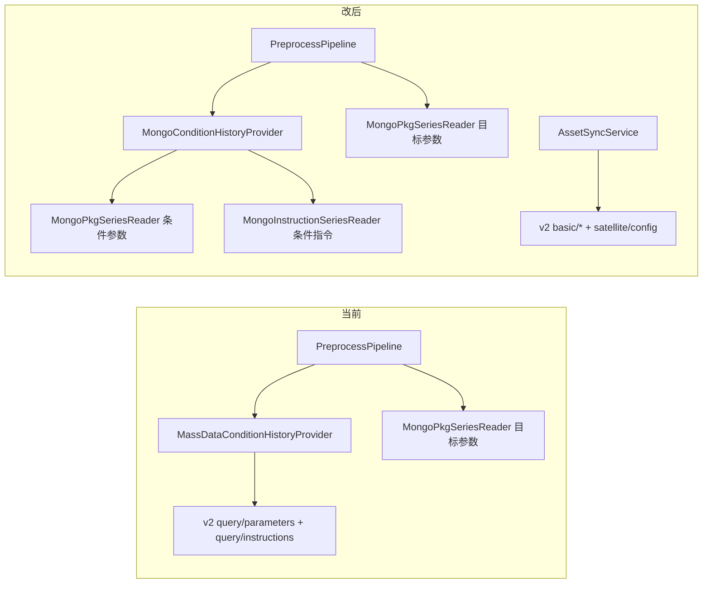

# 条件历史数据改回 MongoDB 读取

## 背景与目标

当前 [`PreprocessPipeline.EvaluateByConditionConfigAsync`](src/SatelliteData.Application/Pipeline/PreprocessPipeline.cs) 通过 [`MassDataConditionHistoryProvider`](src/SatelliteData.Infrastructure/HttpClients/MassDataConditionHistoryProvider.cs) 调用：

- `POST /api/v2/mass-data/query/parameters`
- `POST /api/v2/mass-data/query/instructions`

目标参数提取**已是 Mongo 直读**（[`ReadParamSeriesAsync`](src/SatelliteData.Application/Pipeline/PreprocessPipeline.cs) → [`MongoPkgSeriesReader`](src/SatelliteData.Infrastructure/Mongo/MongoPkgSeriesReader.cs)）。本次将**条件求值阶段**的参数/指令历史也改回 Mongo，以提升性能；[`MassDataApiClient`](src/SatelliteData.Infrastructure/HttpClients/MassDataApiClient.cs) 继续仅用 v2 **基础库**接口（`satellites`、`basic/parameters`、`basic/commands`、`satellite/config`），不改资产同步链路。



## Mongo 数据模型（对齐旧实现）

参考本仓库 [`example/AIRTPPlatform/Domain.Model/Impls/QueryContextImpl.cs`](example/AIRTPPlatform/Domain.Model/Impls/QueryContextImpl.cs) 与现有 [`MongoPkgSeriesReader`](src/SatelliteData.Infrastructure/Mongo/MongoPkgSeriesReader.cs)：

| 数据类型 | 集合名 | 时间字段 | 标识字段 | 值字段 |
|---------|--------|---------|---------|--------|
| 参数历史 | `pkg{prmSysId}` | `dt` | `id` (= paraId) | `pv` |
| 指令历史 | `IndicatorCollection` | `et` | `ci` (= cmdId) | — |

指令查询过滤逻辑对齐 AIRTP [`ConditionTimeUtil.StatisInstTime`](example/AIRTPPlatform/Modules/AnalysisModule/Services/Models/ConditionTimeUtil.cs)：`et` 落在 `[windowStart, windowEnd]`，且 `ci` 属于所需 `cmdId` 集合。`channelId`/`cmdSysId` 仅用于模板配置与 Mass API 兼容，Mongo 直读时以 `ci` 为准（与旧桌面端一致）。

连接信息：通过 [`MongoConnectionPool.GetConnectionInfoAsync(tasookNo, satelliteNo)`](src/SatelliteData.Application/Assets/MongoConnectionPool.cs) 从 `satellite_cache` 解析 `mongo_uri` / `db_name`；`EvaluateByConditionConfigAsync` 传入的 `referenceTasookNo` / `referenceSatelliteNo` 即参考星三元组，条件历史应读**参考星** Mongo（与 `param_cache` / `command_cache` 来源一致）。

## 实现步骤

### 1. 新增指令 Mongo 读取器

- 新建 [`IMongoInstructionSeriesReader`](src/SatelliteData.Application/Pipeline/IMongoInstructionSeriesReader.cs)（Application 层接口，与 `IMongoPkgSeriesReader` 并列）
- 新建 [`MongoInstructionSeriesReader`](src/SatelliteData.Infrastructure/Mongo/MongoInstructionSeriesReader.cs)：
  - 集合名默认 `IndicatorCollection`，可通过 [`PipelineOptions`](src/SatelliteData.Application/Pipeline/PipelineOptions.cs) 新增 `MongoInstructionCollection`（默认 `IndicatorCollection`）便于环境差异配置
  - Filter：`ci` `$in` cmdIds，`et` `Gte/Lte` window
  - 映射为 `InstructionHistoryPoint`（`CommandId`、`CmdId`、`ChannelId`、`ExecuteTime`）
  - 异常时返回空列表（与 `MongoPkgSeriesReader` 行为一致）
- 在 [`PipelineServiceCollectionExtensions`](src/SatelliteData.Infrastructure/Pipeline/PipelineServiceCollectionExtensions.cs) 注册 `AddSingleton<IMongoInstructionSeriesReader, MongoInstructionSeriesReader>()`

### 2. 实现 Mongo 版 `IConditionHistoryProvider`

- 新建 [`MongoConditionHistoryProvider`](src/SatelliteData.Infrastructure/Mongo/MongoConditionHistoryProvider.cs)：
  - 注入 `MongoConnectionPool`、`IMongoPkgSeriesReader`、`IMongoInstructionSeriesReader`、`IOptions<PipelineOptions>`
  - `QueryParameterSeriesAsync`：解析 Mongo 连接后，对每个 `ParameterHistoryLookup` 调用 `mongoPkgReader.ReadSeriesAsync(uri, db, prmSysId, paraId, ...)`
  - `QueryInstructionHistoryAsync`：解析 Mongo 连接后，批量调用 instruction reader（一次 `$in` 查询所有 cmdId）
  - `dbStage` 参数保留但不使用（接口兼容）
- **不修改** [`IConditionHistoryProvider`](src/SatelliteData.Application/Pipeline/IConditionHistoryProvider.cs) 签名，[`PreprocessPipeline`](src/SatelliteData.Application/Pipeline/PreprocessPipeline.cs) 调用点保持不变

### 3. 切换 DI 注册

修改 [`DependencyInjection.cs`](src/SatelliteData.Infrastructure/DependencyInjection.cs)：

```csharp
// 删除 HttpClient 注册
services.AddHttpClient<IConditionHistoryProvider, MassDataConditionHistoryProvider>(...)

// 改为
services.AddSingleton<IConditionHistoryProvider, MongoConditionHistoryProvider>();
```

- 删除或保留 [`MassDataConditionHistoryProvider.cs`](src/SatelliteData.Infrastructure/HttpClients/MassDataConditionHistoryProvider.cs)（建议删除未使用类，避免误用）
- [`MassDataApiClient`](src/SatelliteData.Infrastructure/HttpClients/MassDataApiClient.cs) **不动**，仍只走 v2 `basic/*` + `satellite/config`

### 4. 测试与验证

- 现有 [`ConditionConfigEvaluatorTests`](tests/SatelliteData.UnitTests/ConditionConfigEvaluatorTests.cs) 直接测 `ConditionRangeEvaluator`，无需改动
- 可选：为 `MongoInstructionSeriesReader` 增加轻量单元测试（mock/filter 逻辑），或至少 `dotnet test tests/SatelliteData.UnitTests` 全量回归
- 手动验证路径：有 `conditionConfig` 的筛选模板 → 创建预处理任务 → 确认不再发起 `query/parameters` / `query/instructions` HTTP 请求，且有效时间段与 Mongo 数据一致

### 5. 更新设计文档

更新 [`design/详细设计文档_卫星测试数据预处理与数据分析平台_V2.0.md`](design/详细设计文档_卫星测试数据预处理与数据分析平台_V2.0.md)：

- **6.4.1**：`IConditionHistoryProvider` 职责改为「运行期从参考星 Mongo 读取条件历史」；补充 `MongoInstructionSeriesReader`
- **6.4.2.3「条件历史数据来源」**：参数 → `pkg{prm_sys_id}`；指令 → `IndicatorCollection`（`ci`/`et`）
- **9.1**：明确 `query/parameters`、`query/instructions` **不参与**本平台运行期；仅文档化海量服务能力
- 修订记录新增 **V2.0.11**（Mongo 条件历史回退 + v2 基础库保持不变）

## 风险与注意点

- **参考星 Mongo 未同步**：`MongoConnectionPool` 会抛错，任务失败 `PRE_003`（与目标参数拉取一致）
- **集合名差异**：若个别环境指令集合非 `IndicatorCollection`，通过 `Pipeline:MongoInstructionCollection` 配置兜底
- **channelId**：Mongo 路径不按 channel 分表；与 Mass API `instIds: [[cmdId, channelId]]` 语义解耦，以 `ci` 匹配 `command_cache.cmdId`

## 不在本次范围

- 前端改动（无）
- 资产同步接口变更（保持 v2 basic）
- `MassDataConditionHistoryProvider` 保留为可切换后端（除非后续明确要求 feature flag）
