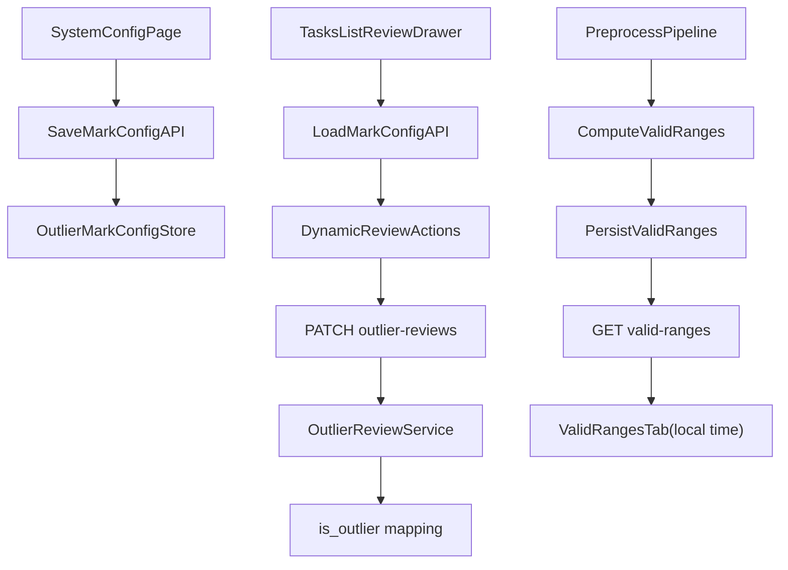

# 任务明细页改造实施计划

## 已确认口径

- 离群标记配置：**全系统共享一套**。
- 时间展示：数据明细相关视图统一为**仅本地时**（避免当前混用本地/UTC）。
- 有效时间段来源：**任务执行时落库**，页面直接查询。

## 现状基线（关键位置）

- 数据明细/离群点清单/离群时间段都在 [`frontend/src/pages/tasks/TasksListPage.tsx`](frontend/src/pages/tasks/TasksListPage.tsx) 的 Drawer 内切换。
- 左侧导航在 [`frontend/src/layouts/AppLayout.tsx`](frontend/src/layouts/AppLayout.tsx)，路由在 [`frontend/src/router.tsx`](frontend/src/router.tsx)。
- 离群复核状态目前硬编码为 `PENDING/CONFIRMED/JITTER`，核心逻辑在 [`src/SatelliteData.Application/Tasks/OutlierReviewService.cs`](src/SatelliteData.Application/Tasks/OutlierReviewService.cs)。
- 当前无“有效时间段”查询接口；有效时间段仅在流水线内计算（[`src/SatelliteData.Application/Pipeline/PreprocessPipeline.cs`](src/SatelliteData.Application/Pipeline/PreprocessPipeline.cs)）。

## 实施步骤

### 1) 统一数据明细页时间显示为本地时

- 在 [`frontend/src/pages/tasks/TasksListPage.tsx`](frontend/src/pages/tasks/TasksListPage.tsx) 为以下表格列统一加本地时 formatter：
  - 全部数据：`ts`
  - 离群点清单：`ts`
  - 离群时间段：`segment_start`、`segment_end`
  - 新增有效时间段标签页中的起止时间列
- 复用同一格式化函数（例如 `new Date(iso).toLocaleString()`），彻底消除同页内“有的本地、有的UTC原串”现象。

### 2) 新增“系统配置 > 离群标记配置”（全局）

前端：

- 新增页面 [`frontend/src/pages/settings/SystemConfigPage.tsx`](frontend/src/pages/settings/SystemConfigPage.tsx)（列表增删改保存）。
- 更新导航与路由：
  - [`frontend/src/layouts/AppLayout.tsx`](frontend/src/layouts/AppLayout.tsx)
  - [`frontend/src/router.tsx`](frontend/src/router.tsx)
- 新增 API/类型：
  - [`frontend/src/api/types.ts`](frontend/src/api/types.ts)
  - 新增或扩展 [`frontend/src/api/settings.ts`](frontend/src/api/settings.ts)

后端：

- 新增全局配置模型与持久化（建议 PG 新表，如 `outlier_mark_config`），字段至少包含：
  - `mark_code`（唯一）
  - `mark_label`
  - `is_outlier`（必须且仅有一个为 true）
  - `sort_order`、`enabled`
- 新增配置接口（查询/保存），例如在 [`src/SatelliteData.Api/Controllers`](src/SatelliteData.Api/Controllers) 下新增配置控制器。
- 新增应用层服务与仓储接口/实现：
  - `Application`：配置校验（确保存在且仅存在一个离群项）
  - `Infrastructure`：PG 仓储读写

### 3) 用“离群标记配置”驱动离群点清单操作列

前端：

- 修改 [`frontend/src/pages/tasks/TasksListPage.tsx`](frontend/src/pages/tasks/TasksListPage.tsx)：
  - 离群点清单操作列不再写死“确认离群/标为抖动”
  - 改为按系统配置动态渲染可选标记按钮/菜单
  - 点击哪个标记，PATCH 时提交对应 `status` 值

后端：

- 修改 [`src/SatelliteData.Application/Tasks/OutlierReviewService.cs`](src/SatelliteData.Application/Tasks/OutlierReviewService.cs)：
  - `NormalizePointStatus` 从硬编码改为按配置校验允许值
  - CH 回写规则由配置驱动：`is_outlier` 取所选标记 `is_outlier`
  - 完成复核后重算确认段时，按 `is_outlier=true` 的状态集合聚合
- 兼容历史状态：保留对旧 `CONFIRMED/JITTER` 数据读取与显示。

### 4) 新增“有效时间段”标签页（执行时落库）

后端：

- 在预处理执行路径中，将 `validRanges` 持久化（以 `run_id` 关联）：
  - 计算位置：[`src/SatelliteData.Application/Pipeline/PreprocessPipeline.cs`](src/SatelliteData.Application/Pipeline/PreprocessPipeline.cs)
- 新增仓储接口与实现（InMemory + PG）用于按 `runId` 查询有效时间段。
- 新增任务接口，例如：`GET /api/v1/tasks/{runId}/valid-ranges`，返回 ISO 时间字符串（UTC语义，前端转本地显示）。

前端：

- 在 [`frontend/src/pages/tasks/TasksListPage.tsx`](frontend/src/pages/tasks/TasksListPage.tsx) 数据明细 Drawer 增加新标签页（如 `valid-ranges`）。
- 表格展示有效时间段列表（起始/结束/时长），时间按第1步统一显示本地时。

## 数据流（核心改造）

## 验证与回归

- 前端：`npm run build`，并手测任务数据明细四个标签页时间均为本地时。
- 后端：`dotnet build` + `dotnet test`。
- 关键场景手测：
  - 修改离群标记配置后，离群点操作列立即按新配置展示。
  - 提交不同非离群标记后，状态落库正确、再次打开可回显。
  - 预处理成功任务可查看“有效时间段”标签页；时间展示与其他页一致。
