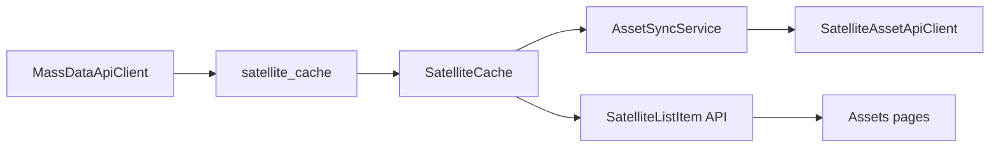

# 全量移除 dbStage（代码 + SQL + 前端）

## 目标与口径

- 目标：项目内不再保留 `dbStage` / `db_stage` 概念，统一以 `taskNo + satNo` 对齐海量 v2。
- 你已确认口径：**连对外请求体也不发送 `dbStage`**（包括卫星测试阶段服务调用）。
- 同步移除：后端领域模型、接口 DTO、仓储 SQL、初始化脚本、前端字段与文案、相关测试。

## 影响链路

移除后变更为：`cacheTbl` 不再含 `db_stage`，`domain/apiDto` 不再含 `DbStage`，`testplan` 请求体只发 `taskNo/satNo`。

## 后端改造

- 资产领域与契约
  - 删除 [`src/SatelliteData.Domain/Assets/AssetModels.cs`](src/SatelliteData.Domain/Assets/AssetModels.cs) 中 `SatelliteCache.DbStage`。
  - 删除 [`src/SatelliteData.Application/Assets/AssetContracts.cs`](src/SatelliteData.Application/Assets/AssetContracts.cs) 中 `SatelliteListItem.DbStage`。
  - 调整 [`src/SatelliteData.Application/Assets/SatelliteListItemMapper.cs`](src/SatelliteData.Application/Assets/SatelliteListItemMapper.cs) 映射参数。

- 同步与外部调用
  - 更新 [`src/SatelliteData.Application/Assets/AssetSyncService.cs`](src/SatelliteData.Application/Assets/AssetSyncService.cs)：不再从缓存读取 `dbStage`，Step 3 调用去掉该参数。
  - 更新 [`src/SatelliteData.Application/Assets/AssetContracts.cs`](src/SatelliteData.Application/Assets/AssetContracts.cs)：`ISatelliteAssetProvider.GetTestPhasesAsync` 去掉 `dbStage` 形参。
  - 更新 [`src/SatelliteData.Infrastructure/HttpClients/SatelliteAssetApiClient.cs`](src/SatelliteData.Infrastructure/HttpClients/SatelliteAssetApiClient.cs)：请求体移除 `dbStage` 字段。

- 海量客户端与配置
  - 更新 [`src/SatelliteData.Infrastructure/HttpClients/MassDataApiClient.cs`](src/SatelliteData.Infrastructure/HttpClients/MassDataApiClient.cs)：构造 `SatelliteCache` 时去掉 `DbStage` 写入；`sourceVersion` fallback 不再依赖 `dbStage`。
  - 更新 [`src/SatelliteData.Infrastructure/HttpClients/AssetProviderOptions.cs`](src/SatelliteData.Infrastructure/HttpClients/AssetProviderOptions.cs)：移除 `DefaultDbStage`。
  - 同步清理 [`src/SatelliteData.Api/appsettings.json`](src/SatelliteData.Api/appsettings.json) 与 [`src/SatelliteData.Workers/appsettings.json`](src/SatelliteData.Workers/appsettings.json) 的 `DefaultDbStage`。

## SQL 与仓储改造

- 表结构与仓储 SQL
  - 从 [`src/SatelliteData.Infrastructure/PostgreSql/PgAssetCacheRepository.cs`](src/SatelliteData.Infrastructure/PostgreSql/PgAssetCacheRepository.cs) 的 `SchemaSql`、`INSERT/UPSERT`、`SELECT`、reader 映射中删除 `db_stage`。
  - 同步更新手工 schema [`db/asset_cache_schema.sql`](db/asset_cache_schema.sql) 删除 `db_stage`。

- 数据迁移脚本
  - 新增一次性 SQL（建议放在 `db/` 下）执行：`ALTER TABLE satellite_cache DROP COLUMN IF EXISTS db_stage;`。
  - 说明：当前无索引/主键依赖该列，迁移风险主要是外部直连查询脚本需同步。

## 前端与文案同步

- 类型与页面
  - 删除 [`frontend/src/api/types.ts`](frontend/src/api/types.ts) 中卫星相关 `dbStage` 字段。
  - 移除 [`frontend/src/pages/assets/SatellitesPage.tsx`](frontend/src/pages/assets/SatellitesPage.tsx) 与 [`frontend/src/pages/assets/SatelliteGroupsPage.tsx`](frontend/src/pages/assets/SatelliteGroupsPage.tsx) 的“版本号/dbStage”列。
  - 更新 [`frontend/src/pages/assets/DataSourcesPage.tsx`](frontend/src/pages/assets/DataSourcesPage.tsx) 文案中的“三元组”描述为二元组。

## 测试与回归验证

- 更新受影响测试
  - [`tests/SatelliteData.UnitTests/MassDataApiClientTests.cs`](tests/SatelliteData.UnitTests/MassDataApiClientTests.cs)：去掉 `DbStage` 断言与相关构造。
  - [`tests/SatelliteData.IntegrationTests/PreprocessParamClaimIntegrationTests.cs`](tests/SatelliteData.IntegrationTests/PreprocessParamClaimIntegrationTests.cs)：更新 `SatelliteCache` 构造参数。

- 验证步骤
  - `dotnet build SatelliteData.Backend.sln`
  - `dotnet test tests/SatelliteData.UnitTests/SatelliteData.UnitTests.csproj`
  - 启动 API 后手动触发资产同步，确认 `satellite_cache` 读写正常、测试阶段同步请求体不再携带 `dbStage`、前端资产页不再展示该字段。

## 执行顺序（减少编译断裂）

- 先改接口与模型签名（Domain/Application）。
- 再改 Infrastructure 客户端与仓储 SQL。
- 再改前端类型与页面。
- 最后更新测试并执行 SQL 迁移脚本、全量回归。