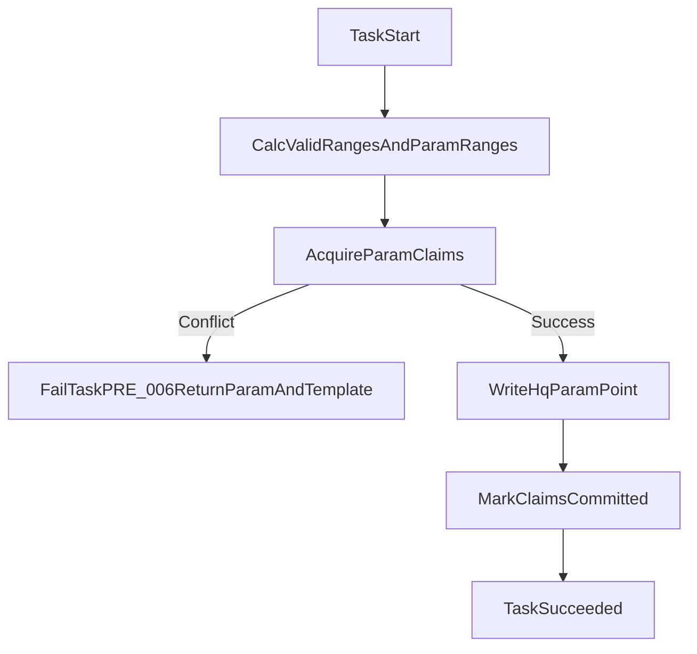

# ClickHouse 同参数同时间段唯一写入设计

## 目标
- 贯彻唯一性原则：在同一 `tasook_no + satellite_no + param_id + 时间段` 上，只允许一份有效结果进入 ClickHouse。
- 当不同模板任务发生重叠，后到任务失败并返回可操作信息（至少包含冲突 `param_id`，并带出冲突任务/模板标识）。
- 保持现有幂等键语义不变（仍用于“同任务请求去重”），新增“跨模板重叠写入仲裁”。

## 现状对齐
- 预处理执行链路在 [src/SatelliteData.Application/Pipeline/PreprocessPipeline.cs](src/SatelliteData.Application/Pipeline/PreprocessPipeline.cs) 中直接写入 `hq_param_point`，当前未做跨任务冲突判定。
- ClickHouse 表键为 `(tasook_no, satellite_no, test_batch_id, param_id, ts)`，定义在 [src/SatelliteData.Infrastructure/ClickHouse/ClickHouseHttpGateway.cs](src/SatelliteData.Infrastructure/ClickHouse/ClickHouseHttpGateway.cs)。该键无法表达“跨模板时间段互斥”业务规则。
- 任务创建仅按幂等键去重（见 [src/SatelliteData.Application/Tasks/TaskOrchestrator.cs](src/SatelliteData.Application/Tasks/TaskOrchestrator.cs)），不同模板会生成不同幂等键，无法拦截重叠执行。

## 方案设计

### 1) 新增参数时间段占用表（PG 强约束）
- 在任务存储层（[src/SatelliteData.Infrastructure/Pipeline/PgTaskStores.cs](src/SatelliteData.Infrastructure/Pipeline/PgTaskStores.cs)）新增 `preprocess_param_claim`：
  - 核心字段：`run_id`、`tasook_no`、`satellite_no`、`param_id`、`segment_start`、`segment_end`、`filter_template_id`、`filter_template_version`、`status`（`ACTIVE`/`COMMITTED`）。
  - 约束：同星同参数在重叠时间段上不可重复（采用区间重叠约束，阻断并发穿透）。
- 该表作为“执行期占位锁 + 成功后归档证据”，不替代 ClickHouse 事实数据。

### 2) 预处理执行期先占位再写 CH
- 在 [src/SatelliteData.Application/Pipeline/PreprocessPipeline.cs](src/SatelliteData.Application/Pipeline/PreprocessPipeline.cs) 中，完成 `validRanges + targetParams` 计算后，写 CH 前执行：
  - 按每个目标参数生成最终写入段（含 `boundaryBufferBeforeSec/AfterSec` 后的参数段）。
  - 尝试批量写入 `ACTIVE` claim；若命中重叠约束，立即 `FailAsync`。
- 失败码新增 `PRE_006`（冲突类），错误文案包含：
  - 冲突参数列表（如 `A100_VOLT_01`）；
  - 冲突任务 `run_id`；
  - 冲突模板 `filter_template_id/version`。
- 成功路径：CH 写入完成后将 claim 状态改为 `COMMITTED`；失败/取消路径清理本 run 的 `ACTIVE` claim。

### 3) 明确“用户响应”与交互语义
- 用户选择后到任务时，系统行为固定为“拒绝并提示修改模板”：
  - 任务状态：`Failed`
  - `error_code`: `PRE_006`
  - `error_msg`: `参数冲突: param_id=..., 冲突模板=..., 冲突任务=...，请调整模板条件后重试`
- API 无需新增同步阻断接口；沿用现有任务执行结果回传链路（任务详情/列表轮询）。

### 4) 兼容重执行与历史数据
- 同一 `run_id` 的“重复执行”保留允许：执行前先清理该 `run_id` 的旧 claim，再重新申请，避免自冲突。
- 跨 run（尤其跨模板）一律按唯一性规则阻断，符合“同参数同时间段仅一份记录”的总原则。

### 5) DI 与测试补齐
- 在 [src/SatelliteData.Infrastructure/Pipeline/PipelineServiceCollectionExtensions.cs](src/SatelliteData.Infrastructure/Pipeline/PipelineServiceCollectionExtensions.cs) 注入冲突守卫仓储/服务。
- 在 [tests/SatelliteData.IntegrationTests](tests/SatelliteData.IntegrationTests) 增加关键用例：
  - 不同模板、同参数、重叠窗口 -> 后到任务 `PRE_006`；
  - 错误消息包含冲突参数；
  - 并发启动两任务仅一方成功占位；
  - 同 run 重执行不误判冲突。

## 风险与收敛
- 区间约束会增加 PG 写压力：先按“参数+合并段”批量写，避免点级 claim。
- 失败清理遗漏会造成假冲突：通过 `ACTIVE` 状态与启动时按 `run_id` 幂等清理双保险。
- 提示信息可读性：优先返回“冲突参数 + 冲突模板版本”，确保用户能直接改模板。