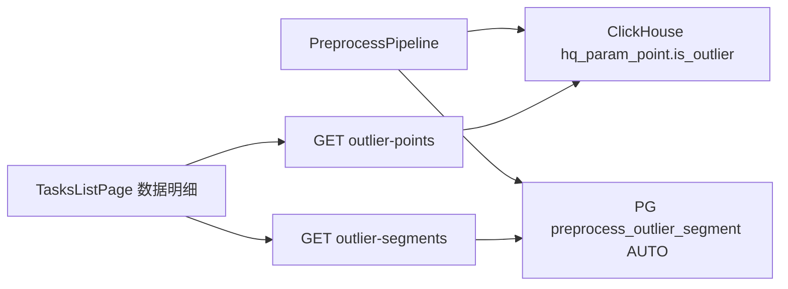
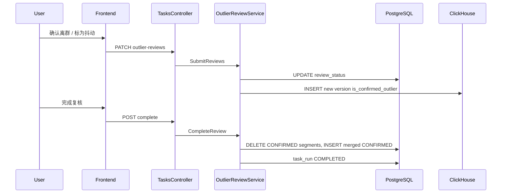

# 离群点人工复核方案

## 背景与目标

当前链路（已实现）：



- `is_outlier`：算法自动打标，**不表示最终离群结论**（设计文档 6.4.3）。
- 用户需求：每个自动离群点需人工判定为 **确认离群** 或 **抖动** 后，才计入「真正离群」；并更新数据库与展示。

**设计原则**

| 层级 | 含义 | 存储 |
|------|------|------|
| 自动候选 | 算法检出 | CH `is_outlier=1`（保留，便于审计） |
| 人工复核 | PENDING / CONFIRMED / JITTER | PG `preprocess_outlier_point_review` |
| 最终离群 | 仅 CONFIRMED | CH `is_confirmed_outlier=1`；PG 段 `segment_kind=CONFIRMED` |

**默认假设**（可在实现中写死，无需再确认）：

- 未完成复核时，「离群时间段」仍展示 **AUTO** 段并提示「待复核」；完成后展示 **CONFIRMED** 段。
- 矩阵/下游以 `is_confirmed_outlier` 为最终离群（复核前为 0）。
- 「完成复核」要求 **pending_count = 0**（不允许漏点）。
- `reviewed_by` 暂可空（项目 API 尚无统一用户上下文）；预留字段。

---

## 1. 数据库变更

### 1.1 PostgreSQL — 新表 [`db/task_pipeline_schema.sql`](db/task_pipeline_schema.sql)

```sql
CREATE TABLE preprocess_outlier_point_review (
  review_id uuid PRIMARY KEY,
  run_id uuid NOT NULL,
  tasook_no varchar(64) NOT NULL,
  satellite_no varchar(64) NOT NULL,
  param_id varchar(64) NOT NULL,
  ts timestamptz NOT NULL,
  auto_value float8,
  auto_outlier_method varchar(32),
  review_status varchar(32) NOT NULL DEFAULT 'PENDING',  -- PENDING | CONFIRMED | JITTER
  reviewed_at timestamptz,
  reviewed_by varchar(128),
  remark varchar(512),
  created_at timestamptz NOT NULL DEFAULT now(),
  UNIQUE (run_id, param_id, ts)
);
CREATE INDEX idx_outlier_review_run_status ON preprocess_outlier_point_review(run_id, review_status);
```

### 1.2 PostgreSQL — 扩展 `task_run`

```sql
outlier_review_status varchar(32),  -- NOT_REQUIRED | PENDING | COMPLETED
outlier_auto_count int NOT NULL DEFAULT 0,
outlier_pending_count int NOT NULL DEFAULT 0,
outlier_confirmed_count int NOT NULL DEFAULT 0,
outlier_jitter_count int NOT NULL DEFAULT 0
```

- 预处理成功且 `auto_count=0` → `NOT_REQUIRED`。
- 有离群点 → `PENDING`；首次提交复核 → 可保持 `PENDING`；全部处理且用户点「完成复核」→ `COMPLETED`。

### 1.3 PostgreSQL — 扩展 `preprocess_outlier_segment`

```sql
segment_kind varchar(16) NOT NULL DEFAULT 'AUTO'  -- AUTO | CONFIRMED
```

- 流水线写入段带 `AUTO`（现有 [`PreprocessPipeline.cs`](src/SatelliteData.Application/Pipeline/PreprocessPipeline.cs) + [`RuleTreeSegmentEvaluator.MergeOutlierSegments`](src/SatelliteData.Application/Pipeline/RuleTreeSegmentEvaluator.cs)）。
- 「完成复核」时：`DELETE` 该 `run_id` 下 `CONFIRMED` 段，按 **已确认点** 重算并 `INSERT`（复用 `MergeOutlierSegments`，flags 仅 CONFIRMED 点为 1）。

### 1.4 ClickHouse — 扩展 `hq_param_point`

在 [`ClickHouseHttpGateway.EnsureHqParamPointTableAsync`](src/SatelliteData.Infrastructure/ClickHouse/ClickHouseHttpGateway.cs) 增加列，并对已有库执行一次 `ALTER TABLE hq_param_point ADD COLUMN IF NOT EXISTS is_confirmed_outlier UInt8 DEFAULT 0`：

- 预处理写入：`is_outlier` 按算法；`is_confirmed_outlier=0`。
- 单点/批量复核后：对该 `(tasook_no, satellite_no, test_batch_id, param_id, ts)` **INSERT 新行**（`ReplacingMergeTree` + 递增 `version`），更新 `is_confirmed_outlier`（CONFIRMED→1，JITTER→0）；`is_outlier` 保持原自动值。

---

## 2. 后端实现

### 2.1 领域与仓储

- 新实体 `PreprocessOutlierPointReview`（[`SatelliteData.Domain`](src/SatelliteData.Domain)）。
- 新接口 `IPreprocessOutlierPointReviewRepository`：`InsertBatchAsync`、`ListPageAsync`、`UpdateStatusBatchAsync`、`CountByStatusAsync`、`DeleteByRunIdAsync`。
- PG 实现放 [`PgTaskStores.cs`](src/SatelliteData.Infrastructure/Pipeline/PgTaskStores.cs)；InMemory 实现放 [`InMemoryPipelineStores.cs`](src/SatelliteData.Infrastructure/Pipeline/InMemoryPipelineStores.cs)。
- 扩展 `IPreprocessOutlierSegmentRepository`：`DeleteByRunIdAndKindAsync`、`ListByRunIdAndKindAsync`（或 `List` 带 `segmentKind` 参数）。
- 扩展 `TaskRun` 实体与 `PgTaskRunRepository` 映射新列。

### 2.2 预处理流水线 — 种子数据

在 [`PreprocessPipeline.cs`](src/SatelliteData.Application/Pipeline/PreprocessPipeline.cs) 内层循环（`flags[i]==1`）收集 review 行，参数循环结束后 `InsertBatchAsync`。

任务成功收尾时更新 `task_run` 计数与 `outlier_review_status`。

**重复执行**：在 `ExecuteAsync` 进入参数写入前（或成功路径开始前）对同一 `run_id` 调用 `reviews.DeleteByRunId`、`outlierSegments.DeleteByRunId`（与 [`TaskRunLifecycleService`](src/SatelliteData.Application/Tasks/TaskRunLifecycleService.cs) 删除逻辑一致），避免 re-execute 脏数据。

### 2.3 新服务 `OutlierReviewService`

| 方法 | 说明 |
|------|------|
| `GetSummaryAsync(runId)` | 返回各 status 计数 + `outlier_review_status` |
| `ListReviewsAsync(runId, status, paramId, page, pageSize)` | 分页列表（主数据源 PG） |
| `SubmitReviewsAsync(runId, items[])` | 批量更新 status；递减 pending、递增 confirmed/jitter；触发 CH 版本写入 |
| `CompleteReviewAsync(runId)` | 校验 pending=0；重算 CONFIRMED 段；`task_run.outlier_review_status=COMPLETED` |

CH 写入可封装为 `IClickHouseGateway.ConfirmOutlierPointsAsync(...)`（按 keys 批量 INSERT JSONEachRow）。

### 2.4 API — [`TasksController.cs`](src/SatelliteData.Api/Controllers/TasksController.cs)

| 方法 | 路径 |
|------|------|
| GET | `/api/v1/tasks/{runId}/outlier-reviews/summary` |
| GET | `/api/v1/tasks/{runId}/outlier-reviews?status=&paramId=&page=&pageSize=` |
| PATCH | `/api/v1/tasks/{runId}/outlier-reviews` body `{ items: [{ paramId, ts, status: CONFIRMED\|JITTER, remark? }] }` |
| POST | `/api/v1/tasks/{runId}/outlier-reviews/complete` |

权限：与现有数据明细一致，[`TaskRunStateHelper.CanViewProcessedData`](src/SatelliteData.Application/Tasks/TaskRunStateHelper.cs)（预处理 Succeeded）。

### 2.5 改造现有查询

[`TaskRunProcessedDataService`](src/SatelliteData.Application/Tasks/TaskRunProcessedDataService.cs)：

- **`GetOutlierPointsAsync`**：以 PG review 为主（含 `review_id`、`review_status`）；`status` 查询参数过滤。
- **`GetOutlierSegmentsAsync`**：`run.outlier_review_status == COMPLETED` 时只返回 `CONFIRMED` 段，否则 `AUTO`；DTO 增加 `segment_kind` 或 `is_confirmed` 标志供前端展示提示。
- **`GetProcessedDataAsync`** / CH 查询：矩阵 cell 增加 `is_confirmed_outlier`（或三态：`normal` / `auto_pending` / `confirmed`），前端配色区分。

[`TaskRunLifecycleService.DeleteRunAsync`](src/SatelliteData.Application/Tasks/TaskRunLifecycleService.cs)：删除 run 时一并 `reviews.DeleteByRunId`。

### 2.6 设计文档

更新 [`design/详细设计文档_卫星测试数据预处理与数据分析平台_V2.0.md`](design/详细设计文档_卫星测试数据预处理与数据分析平台_V2.0.md)（V2.0.8）：复核状态机、表结构、API、与算法打标边界。

---

## 3. 前端 UX 设计

在 [`TasksListPage.tsx`](frontend/src/pages/tasks/TasksListPage.tsx) 数据明细 Drawer 中，将「离群点清单」升级为 **离群复核** 工作区（可保留 tab 名或改为「离群复核」）。

```mermaid
flowchart TB
  drawer[数据明细 Drawer]
  drawer --> tabs[Segmented: 全部数据 | 离群复核 | 离群时间段]
  tabs --> reviewTab[离群复核 Tab]
  reviewTab --> progress[进度条: 已复核/总数 + 待复核/已确认/抖动]
  reviewTab --> filter[状态筛选: 待复核/已确认/抖动/全部]
  reviewTab --> table[表格 + 行内操作]
  reviewTab --> batch[多选 + 批量确认/批量抖动]
  reviewTab --> complete[完成复核 主按钮 disabled 当 pending>0]
```

**表格列**：时间 | 参数 | 离群值 | 判定方法 | 复核状态（Tag）| 操作

**行内操作**（仅 `PENDING` 可点）：

- 「确认离群」→ `CONFIRMED`（绿色 Tag）
- 「标为抖动」→ `JITTER`（默认 Tag）

**批量**：Table `rowSelection` + 底部「批量确认」「批量抖动」。

**完成复核**：`Modal.confirm` 后调用 `POST .../complete`；成功后刷新 summary、时间段 tab。

**离群时间段 tab**：顶部 `Alert` — 待复核时「当前为算法自动段，完成复核后显示已确认段」。

**全部数据 tab**：野值展示规则

- `is_outlier && review_status=PENDING` → 橙色 + title「待复核」
- `is_confirmed_outlier` → 红色「已确认离群」
- `JITTER` → 普通文本（可选灰色提示「已标为抖动」）

**任务列表**：`can_view_data` 且 `outlier_pending_count > 0` 时，「数据明细」按钮旁显示 `Badge`「待复核 N」。

**API 层**：[`frontend/src/api/tasks.ts`](frontend/src/api/tasks.ts) + [`types.ts`](frontend/src/api/types.ts) 增加 review 类型与方法；修复现有 bug：`dataTotal` 中 `dataViewMode === 'outliers'` 应为 `'outlier-points'`。

---

## 4. 数据流（复核后）



---

## 5. 测试要点

- **单元**：`OutlierReviewService` 计数更新；`CompleteReview` 在 pending>0 时拒绝；`MergeOutlierSegments` 仅 CONFIRMED 点成段。
- **集成**（可选）：预处理产出 N 个 PENDING → PATCH 2 条 → complete → segments 仅含 CONFIRMED 连续区间。
- **前端**：手动验证筛选、批量、完成按钮禁用逻辑。

---

## 6. 实现顺序建议

1. DB schema + Domain + PG/InMemory repositories  
2. PreprocessPipeline 种子 + task_run 计数  
3. OutlierReviewService + Controller + CH column/insert  
4. 改造 ProcessedData / outlier-points / outlier-segments  
5. 前端 Drawer 复核 UI + API  
6. 设计文档 V2.0.8 + 修复 `outliers` typo  
