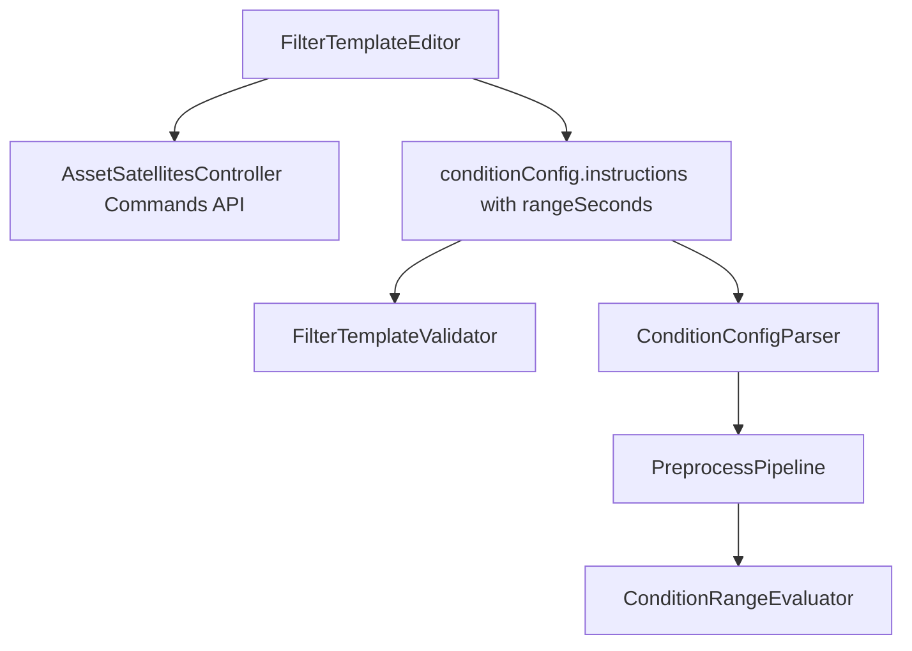

# 筛选模板指令条件三项改造计划

## 目标与约束
- 完成你提出的 3 项改动：
  - 页面不再提示“只加载到 500 条指令”，改为可加载并选择该参考星全部指令。
  - 起始/结束指令条件的“指令”列展示改为与参数列同类体验，显示“指令代号 指令名称(指令描述)”并支持本地搜索过滤。
  - 起始/结束指令关系后新增“时间范围(秒)”，运行时按该范围判定指令关系。
- 语义按你刚确认：`AND` 关系命中时，以**窗口内最后一条指令发出时刻**作为触发时刻。
- 不保留旧 `ruleTree` 兼容路径：筛选模板统一使用 `conditionConfig`。

## 影响文件（核心）
- 前端页面/类型/API
  - [frontend/src/pages/templates/FilterTemplateEditor.tsx](frontend/src/pages/templates/FilterTemplateEditor.tsx)
  - [frontend/src/api/assets.ts](frontend/src/api/assets.ts)
  - [frontend/src/api/types.ts](frontend/src/api/types.ts)
  - （新增）`CommandCacheSelect` 组件，参考 [frontend/src/components/ParamCacheSelect.tsx](frontend/src/components/ParamCacheSelect.tsx)
- 后端资产查询（支持指令全量）
  - [src/SatelliteData.Api/Controllers/AssetSatellitesController.cs](src/SatelliteData.Api/Controllers/AssetSatellitesController.cs)
  - [src/SatelliteData.Application/Assets/AssetQueryService.cs](src/SatelliteData.Application/Assets/AssetQueryService.cs)
- 后端配置解析/校验/求值
  - [src/SatelliteData.Application/Templates/ConditionConfigParser.cs](src/SatelliteData.Application/Templates/ConditionConfigParser.cs)
  - [src/SatelliteData.Application/Templates/FilterTemplateValidator.cs](src/SatelliteData.Application/Templates/FilterTemplateValidator.cs)
  - [src/SatelliteData.Application/Pipeline/ConditionRangeEvaluator.cs](src/SatelliteData.Application/Pipeline/ConditionRangeEvaluator.cs)
  - [src/SatelliteData.Application/Pipeline/PreprocessPipeline.cs](src/SatelliteData.Application/Pipeline/PreprocessPipeline.cs)
- 测试
  - [tests/SatelliteData.UnitTests/FilterTemplateValidatorTests.cs](tests/SatelliteData.UnitTests/FilterTemplateValidatorTests.cs)
  - [tests/SatelliteData.UnitTests/ConditionConfigEvaluatorTests.cs](tests/SatelliteData.UnitTests/ConditionConfigEvaluatorTests.cs)

## 实施步骤
1. 前端“全量指令加载”
- 在资产 API 增加 `listAllCommands`（与 `listAllParams` 对齐），请求 `unpaged=true`。
- 在筛选模板页将当前 `listCommands(pageSize=2000)` 改为 `listAllCommands`，移除“仅加载部分”的 warning。
- 为后端 `GET /asset/satellites/{tasookNo}/{satelliteNo}/commands` 增加 `unpaged` 参数支持（上限与参数接口一致设置硬上限，防止无界响应）。

2. 指令列展示与选择体验
- 新增 `CommandCacheSelect` 组件（复用参数选择器交互模式：`showSearch + 本地 filter + virtual list + 全宽`）。
- 统一指令展示文案生成函数：优先输出“代号 名称(描述)”；缺失字段时按降级策略显示（不阻塞选择）。
- 将起始/结束指令表中 `Select` 替换为 `CommandCacheSelect`，保证两块行为一致。

3. 指令关系新增“时间范围(秒)”
- 前端 `conditionConfig.instructions` 新增：
  - `startRangeSeconds`
  - `endRangeSeconds`
- 页面在 `startRelation/endRelation` 后增加 `InputNumber`（秒），保存到配置 JSON；编辑旧模板时默认回填 `0`。

4. 后端解析与校验
- 在 `ConditionConfigParser` 的 `FilterConditionConfig` 中增加上述两个字段，默认 `0`。
- 在 `FilterTemplateValidator` 增加校验：两个范围字段可选，存在时必须为 `>=0` 整数。
- 将模板配置校验切换为“必须包含 `conditionConfig`”，不再接受 `ruleTree` 作为主配置。

5. 后端指令求值逻辑接入时间范围
- 在 `ConditionRangeEvaluator.EvaluateInstructionRanges` 中传入并使用 `startRangeSeconds/endRangeSeconds`。
- 关系判定规则：
  - `AND`：在 `N` 秒窗口内要求所有命令都出现；触发时刻取该窗口内**最后一条**指令时间（按你的确认）。
  - `OR`：窗口内任一命令出现即成立，触发时刻取命中事件时刻。
- 起始/结束分别独立按各自关系与范围求触发时刻，再按现有“起始-结束配对”生成区间。
- 在 `PreprocessPipeline` 中移除 `ruleTree` 回退分支，统一走 `conditionConfig` 路径（无条件项时仍返回任务全窗）。

6. 回归与单测
- 新增/修改单测覆盖：
  - 解析/校验：范围字段默认值、非法值拦截。
  - 求值：`AND` + 时间范围 + “最后事件触发”语义；`OR` 语义；无条件项全窗。
- 执行前后端构建与单测，确认无回归。

## 数据流（改造后）

## 风险与处理策略
- 历史 `ruleTree` 模板将不再被执行：需要同步模板治理使用方，将存量模板迁移/重建为 `conditionConfig`。
- 新增字段 `startRangeSeconds/endRangeSeconds` 缺失时按 `0` 处理。
- 指令数量大时前端下拉性能：使用虚拟列表与本地过滤，避免渲染卡顿。
- `OR` 在大历史数据量下触发点过多：保留去重/排序，必要时后续可加最小间隔合并策略（本次不改变既有区间配对主逻辑）。