# 卫星测试数据预处理与一致性比对平台
## 详细设计文档（V1.4）

## 1. 文档说明

### 1.1 编写目的
本文档基于《概要设计文档_卫星测试数据预处理与一致性比对平台_V2.0.md》（当前内容版本 V2.7）编写，面向研发、测试、运维与集成实施人员，进一步细化系统模块、页面、接口、数据表、类结构、核心流程与异常处理规则。

本文档目标是：开发人员拿到本文档后，可以直接拆分后端 API、前端页面、任务 Worker、数据表与集成适配器的开发任务。

### 1.2 设计边界
本文档覆盖一期建设范围：
- 资产配置中心；
- 筛选模板、算法模板、报告模板三类模板的独立管理；
- 任务调度、预处理、算法执行、一致性比对、报告生成；
- 操作留痕、开放 API、Webhook 回调；
- ClickHouse / PostgreSQL / MinIO / MongoDB 动态连接的详细设计。

本文档不覆盖：
- 外部海量数据接口服务本身的实现；
- 外部卫星资产服务本身的实现；
- 外部 ML 平台的训练服务实现；
- 生产环境具体机器规格与采购清单。

### 1.3 关键术语
| 术语 | 说明 |
|---|---|
| `tasook_no` | 型号代号 |
| `satellite_no` | 卫星代号 |
| 数据来源 | `tasook_no + satellite_no`，唯一确定一颗卫星 |
| `test_batch_id` | 测试时间段或测试批次标识，不用于唯一确定卫星 |
| `run_id` | 平台任务运行实例唯一标识 |
| `job_id` | 对外异步任务标识，可与 `run_id` 一一映射 |
| 高品质明细 | 经筛选、质量标记后的参数时序点，存储在 ClickHouse |
| 操作留痕 | 对关键用户操作、系统操作、Webhook 投递等行为的完整记录 |

---

## 2. 总体详细架构

### 2.1 系统运行视图
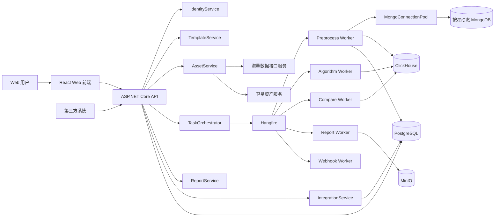

### 2.2 后端工程建议结构
```text
SatelliteData.Platform
├── src
│   ├── SatelliteData.Api
│   │   ├── Controllers
│   │   ├── Filters
│   │   ├── Middlewares
│   │   └── Program.cs
│   ├── SatelliteData.Application
│   │   ├── Assets
│   │   ├── Templates
│   │   ├── Tasks
│   │   ├── Preprocess
│   │   ├── Algorithms
│   │   ├── Compare
│   │   ├── Reports
│   │   ├── Identity
│   │   ├── TraceLogs
│   │   └── Integration
│   ├── SatelliteData.Domain
│   │   ├── Common
│   │   ├── Assets
│   │   ├── Templates
│   │   ├── Tasks
│   │   ├── Quality
│   │   ├── Algorithms
│   │   └── Compare
│   ├── SatelliteData.Infrastructure
│   │   ├── PostgreSql
│   │   ├── ClickHouse
│   │   ├── Mongo
│   │   ├── Minio
│   │   ├── Hangfire
│   │   ├── HttpClients
│   │   └── Security
│   └── SatelliteData.Workers
│       ├── PreprocessJobs
│       ├── AlgorithmJobs
│       ├── CompareJobs
│       ├── ReportJobs
│       └── WebhookJobs
└── tests
    ├── SatelliteData.UnitTests
    ├── SatelliteData.IntegrationTests
    └── SatelliteData.E2ETests
```

### 2.3 统一技术约定
| 类型 | 约定 |
|---|---|
| API 风格 | REST + JSON |
| 后端返回 | 统一 `ApiResponse<T>`，失败返回标准错误码 |
| 时间 | 后端统一 UTC 存储，前端按用户时区显示 |
| 主键 | 业务表使用 `uuid` 或雪花 ID，时序明细使用业务联合主键 |
| 配置 | 环境变量 + PostgreSQL 配置表，敏感值只存密钥引用 |
| 日志 | 结构化日志，包含 `trace_id`、`run_id`、`user_id` |
| 幂等 | 任务类 API 必须支持幂等键 |
| 大批量写入 | ClickHouse 必须批量写入，禁止单条循环 Insert |

---

## 3. 横切能力详细设计

### 3.1 统一响应模型
```csharp
public sealed class ApiResponse<T>
{
    public bool Success { get; init; }
    public string Code { get; init; } = "OK";
    public string Message { get; init; } = "";
    public T? Data { get; init; }
    public string TraceId { get; init; } = "";
}
```

### 3.2 错误码规范
| 错误码 | HTTP | 说明 |
|---|---:|---|
| `AUTH_001` | 401 | 未登录或 Token 无效 |
| `AUTH_002` | 403 | 无权限访问 |
| `TPL_001` | 400 | 模板配置不合法 |
| `TPL_002` | 409 | 已发布模板不可直接修改 |
| `ASSET_001` | 502 | 海量数据接口不可用 |
| `ASSET_002` | 502 | 卫星资产服务不可用 |
| `TASK_001` | 409 | 幂等任务已存在 |
| `TASK_002` | 408 | 任务超时 |
| `PRE_001` | 422 | 筛选后无有效数据 |
| `ALG_001` | 400 | 算法 DAG 校验失败 |
| `CMP_001` | 422 | 基线缺失 |
| `RPT_001` | 500 | 报告渲染失败 |

### 3.3 统一操作留痕
所有写操作通过 Action Filter 或 MediatR Pipeline 统一写入 `audit_log`。

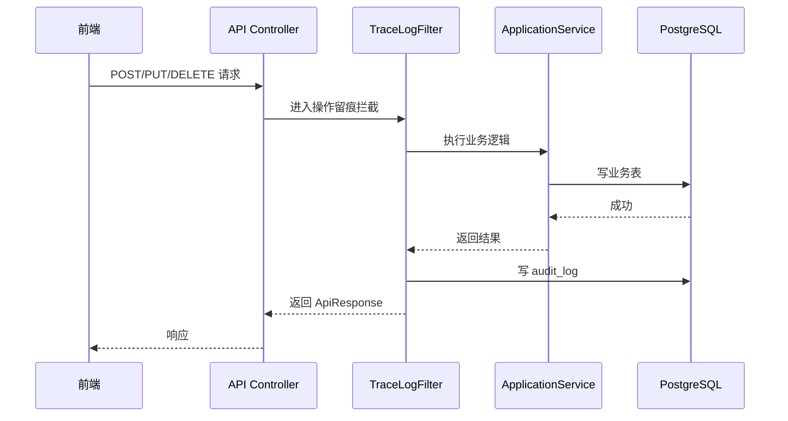

### 3.4 幂等键生成规则
任务幂等键由任务类型、模板版本、数据来源、测试时间段、时间窗共同决定。

```text
idempotency_key = SHA256(
  job_type + ":" +
  filter_template_id + ":" + filter_template_version + ":" +
  algorithm_template_id + ":" + algorithm_template_version + ":" +
  report_template_id + ":" + report_template_version + ":" +
  tasook_no + ":" + satellite_no + ":" +
  test_batch_id + ":" +
  window_start + ":" + window_end
)
```

---

## 4. 数据库详细设计

### 4.1 PostgreSQL 表设计

#### 4.1.1 外部与内部数据源配置表 `data_source_config`
```sql
create table data_source_config (
    source_id uuid primary key,                         -- 数据源配置唯一标识
    source_type varchar(32) not null,                   -- 数据源类型：海量接口、卫星资产接口、ClickHouse、MinIO、PG 元库等
    source_name varchar(128) not null,                  -- 数据源显示名称
    endpoint_url text not null,                         -- 服务地址或连接入口地址
    auth_type varchar(32) not null default 'NONE',      -- 鉴权方式：NONE、API_KEY、BASIC、OAUTH2 等
    auth_secret_ref varchar(256),                       -- 鉴权密钥引用，存密钥管理系统路径，不存明文
    timeout_ms int not null default 10000,              -- 调用超时时间，单位毫秒
    enabled boolean not null default true,              -- 是否启用该配置
    env varchar(32) not null default 'PROD',            -- 环境标识：DEV、SIT、UAT、PROD
    created_at timestamptz not null default now(),      -- 创建时间
    updated_at timestamptz not null default now(),      -- 最近更新时间
    constraint ck_source_type check (
        source_type in ('MASS_DATA_API', 'SATELLITE_ASSET_API', 'CLICKHOUSE', 'MINIO', 'PG_META')
    )
);
```

#### 4.1.2 卫星缓存表 `satellite_cache`
```sql
create table satellite_cache (
    tasook_no varchar(64) not null,                     -- 型号代号
    satellite_no varchar(64) not null,                  -- 卫星代号
    satellite_name varchar(256) not null,               -- 卫星名称
    satellite_type varchar(128),                        -- 卫星类型或型号描述
    mongo_uri text,                                     -- 该卫星对应的 MongoDB 连接地址
    mongo_db_name varchar(256),                         -- 该卫星对应的 MongoDB 数据库名
    mongo_auth_ref varchar(256),                        -- MongoDB 鉴权密钥引用
    source_version varchar(128),                        -- 外部来源版本号，用于判断缓存是否过期
    last_synced_at timestamptz not null,                -- 最近一次同步时间
    raw_json jsonb not null,                            -- 外部接口原始响应，便于排查与字段扩展
    primary key (tasook_no, satellite_no)
);
```

#### 4.1.3 参数缓存表 `param_cache`
```sql
create table param_cache (
    tasook_no varchar(64) not null,                     -- 型号代号
    satellite_no varchar(64) not null,                  -- 卫星代号
    param_id varchar(128) not null,                     -- 参数物理 ID
    param_name varchar(256) not null,                   -- 参数名称
    unit varchar(64),                                   -- 参数单位
    value_type varchar(32),                             -- 参数值类型，如 DOUBLE、INT、STRING
    value_min double precision,                         -- 参数理论或配置最小值
    value_max double precision,                         -- 参数理论或配置最大值
    source_version varchar(128),                        -- 外部来源版本号
    last_synced_at timestamptz not null,                -- 最近一次同步时间
    raw_json jsonb not null,                            -- 外部接口原始参数定义
    primary key (tasook_no, satellite_no, param_id)
);
```

#### 4.1.4 测试时间段缓存表 `test_batch_cache`
```sql
create table test_batch_cache (
    tasook_no varchar(64) not null,                     -- 型号代号
    satellite_no varchar(64) not null,                  -- 卫星代号
    test_batch_id varchar(128) not null,                -- 测试时间段或测试批次标识
    scenario varchar(256),                              -- 测试场景名称，如热真空试验
    start_ts timestamptz not null,                      -- 测试时间段开始时间
    end_ts timestamptz not null,                        -- 测试时间段结束时间
    source_version varchar(128),                        -- 外部来源版本号
    last_synced_at timestamptz not null,                -- 最近一次同步时间
    raw_json jsonb not null,                            -- 外部接口原始测试时间段配置
    primary key (tasook_no, satellite_no, test_batch_id)
);
```

#### 4.1.5 筛选模板表 `filter_template`
```sql
create table filter_template (
    template_id uuid not null,                          -- 筛选模板 ID，同一模板多版本共用
    version int not null,                               -- 模板版本号
    template_name varchar(256) not null,                -- 模板名称
    status varchar(32) not null,                        -- 模板状态：Draft、Published、Grayscale、Archived 等
    gray_scope jsonb,                                   -- 灰度发布范围配置
    config_json jsonb not null,                         -- 筛选规则配置 JSON
    description text,                                   -- 模板说明
    created_by uuid not null,                           -- 创建人用户 ID
    created_at timestamptz not null default now(),      -- 创建时间
    updated_by uuid,                                    -- 最近更新人用户 ID
    updated_at timestamptz not null default now(),      -- 最近更新时间
    published_at timestamptz,                           -- 发布时间
    primary key (template_id, version)
);
```

#### 4.1.6 算法模板表 `algorithm_template`
```sql
create table algorithm_template (
    template_id uuid not null,                          -- 算法模板 ID，同一模板多版本共用
    version int not null,                               -- 模板版本号
    template_name varchar(256) not null,                -- 模板名称
    status varchar(32) not null,                        -- 模板状态
    gray_scope jsonb,                                   -- 灰度发布范围配置
    react_flow_json jsonb not null,                     -- React Flow 画布节点与连线定义
    config_json jsonb not null,                         -- 算法执行全局配置
    node_count int not null default 0,                  -- DAG 节点数量，便于列表展示和校验
    description text,                                   -- 模板说明
    created_by uuid not null,                           -- 创建人用户 ID
    created_at timestamptz not null default now(),      -- 创建时间
    updated_by uuid,                                    -- 最近更新人用户 ID
    updated_at timestamptz not null default now(),      -- 最近更新时间
    published_at timestamptz,                           -- 发布时间
    primary key (template_id, version)
);
```

#### 4.1.7 报告模板表 `report_template`
```sql
create table report_template (
    template_id uuid not null,                          -- 报告模板 ID，同一模板多版本共用
    version int not null,                               -- 模板版本号
    template_name varchar(256) not null,                -- 模板名称
    status varchar(32) not null,                        -- 模板状态
    gray_scope jsonb,                                   -- 灰度发布范围配置
    object_id uuid not null,                            -- Word 模板文件在 object_index 中的 ID
    placeholder_schema jsonb not null,                  -- 占位符 Schema 定义
    config_json jsonb not null,                         -- 报告模板配置 JSON
    description text,                                   -- 模板说明
    created_by uuid not null,                           -- 创建人用户 ID
    created_at timestamptz not null default now(),      -- 创建时间
    updated_by uuid,                                    -- 最近更新人用户 ID
    updated_at timestamptz not null default now(),      -- 最近更新时间
    published_at timestamptz,                           -- 发布时间
    primary key (template_id, version)
);
```

#### 4.1.8 任务运行表 `task_run`
```sql
create table task_run (
    run_id uuid primary key,                            -- 平台内部任务运行实例 ID
    parent_run_id uuid,                                 -- 父任务 ID，用于全链路任务关联子任务
    job_id varchar(128) unique,                         -- 对外暴露的任务 ID
    job_type varchar(32) not null,                      -- 任务类型：PREPROCESS、ALGORITHM、COMPARE、REPORT、PIPELINE
    trigger_type varchar(32) not null,                  -- 触发方式：MANUAL、SCHEDULE、BACKFILL、OPENAPI
    status varchar(32) not null,                        -- 任务状态：Queued、Running、Succeeded、Failed、Timeout、Cancelled
    idempotency_key varchar(128) not null,              -- 幂等键，防止重复创建相同任务
    tasook_no varchar(64) not null,                     -- 型号代号
    satellite_no varchar(64) not null,                  -- 卫星代号
    test_batch_id varchar(128),                         -- 测试时间段或测试批次标识
    window_start timestamptz,                           -- 本次任务处理时间窗开始时间
    window_end timestamptz,                             -- 本次任务处理时间窗结束时间
    filter_template_id uuid,                            -- 命中的筛选模板 ID 快照
    filter_template_version int,                        -- 命中的筛选模板版本快照
    algorithm_template_id uuid,                         -- 命中的算法模板 ID 快照
    algorithm_template_version int,                     -- 命中的算法模板版本快照
    report_template_id uuid,                            -- 命中的报告模板 ID 快照
    report_template_version int,                        -- 命中的报告模板版本快照
    progress_percent numeric(5,2) not null default 0,   -- 任务进度百分比
    current_step varchar(128),                          -- 当前执行步骤
    start_time timestamptz,                             -- 任务开始时间
    end_time timestamptz,                               -- 任务结束时间
    timeout_flag boolean not null default false,        -- 是否因超时终止
    error_code varchar(64),                             -- 失败错误码
    error_msg text,                                     -- 失败错误描述
    created_by uuid,                                    -- 创建人用户 ID
    created_at timestamptz not null default now(),      -- 创建时间
    unique (idempotency_key)
);
```

#### 4.1.9 时间窗元数据表 `hq_param_metadata`
```sql
create table hq_param_metadata (
    metadata_id uuid primary key,                       -- 时间窗元数据 ID
    run_id uuid not null,                               -- 产生该元数据的任务运行实例 ID
    tasook_no varchar(64) not null,                     -- 型号代号
    satellite_no varchar(64) not null,                  -- 卫星代号
    test_batch_id varchar(128) not null,                -- 测试时间段或测试批次标识
    param_id varchar(128) not null,                     -- 参数物理 ID
    window_start timestamptz not null,                  -- 元数据适用时间窗开始时间
    window_end timestamptz not null,                    -- 元数据适用时间窗结束时间
    filter_template_id uuid not null,                   -- 使用的筛选模板 ID
    filter_template_version int not null,               -- 使用的筛选模板版本
    outlier_method varchar(64),                         -- 离群判定方法
    outlier_reason_pattern text,                        -- 离群原因描述或模板化原因
    created_at timestamptz not null default now()       -- 创建时间
);
```

#### 4.1.10 文件索引表 `object_index`
```sql
create table object_index (
    object_id uuid primary key,                         -- 对象文件索引 ID
    bucket varchar(128) not null,                       -- MinIO bucket 名称
    object_key text not null,                           -- 对象存储路径
    object_version varchar(128),                        -- 对象存储版本号
    checksum varchar(128),                              -- 文件校验值
    content_type varchar(128),                          -- MIME 类型
    file_size bigint,                                   -- 文件大小，单位字节
    ref_run_id uuid,                                    -- 关联任务运行实例 ID
    created_by uuid,                                    -- 上传或生成用户 ID
    created_at timestamptz not null default now()       -- 创建时间
);
```

#### 4.1.11 用户、角色、权限与鉴权相关表
平台采用 RBAC 权限模型，基础角色为 `Admin`、`Analyst`、`Readonly`。业务范围控制围绕 `tasook_no + satellite_no + test_batch_id` 展开，其中 `test_batch_id` 可为空，表示授权到整颗星。

```sql
create table sys_user (
    user_id uuid primary key,                           -- 用户 ID
    username varchar(128) not null unique,              -- 登录用户名
    display_name varchar(128) not null,                 -- 用户显示名称
    password_hash varchar(256) not null,                -- 密码哈希值
    password_salt varchar(128),                         -- 密码盐值
    email varchar(256),                                 -- 邮箱
    mobile varchar(64),                                 -- 手机号
    status varchar(32) not null default 'ENABLED',      -- 用户状态：ENABLED、DISABLED、LOCKED
    last_login_at timestamptz,                          -- 最近登录时间
    password_updated_at timestamptz,                    -- 最近修改密码时间
    created_at timestamptz not null default now(),      -- 创建时间
    updated_at timestamptz not null default now(),      -- 最近更新时间
    constraint ck_sys_user_status check (status in ('ENABLED', 'DISABLED', 'LOCKED'))
);

create table sys_role (
    role_id uuid primary key,                           -- 角色 ID
    role_code varchar(64) not null unique,              -- 角色编码，如 Admin、Analyst、Readonly
    role_name varchar(128) not null,                    -- 角色名称
    description text,                                   -- 角色说明
    built_in boolean not null default false,            -- 是否系统内置角色
    enabled boolean not null default true,              -- 是否启用
    created_at timestamptz not null default now(),      -- 创建时间
    updated_at timestamptz not null default now()       -- 最近更新时间
);

create table sys_permission (
    permission_id uuid primary key,                     -- 权限点 ID
    permission_code varchar(128) not null unique,       -- 权限编码，如 TASK_CREATE
    permission_name varchar(128) not null,              -- 权限名称
    module_code varchar(64) not null,                   -- 所属模块编码
    action_code varchar(64) not null,                   -- 操作编码，如 READ、WRITE、PUBLISH
    description text,                                   -- 权限说明
    enabled boolean not null default true,              -- 是否启用
    created_at timestamptz not null default now()       -- 创建时间
);

create table sys_user_role (
    user_id uuid not null references sys_user(user_id), -- 用户 ID
    role_id uuid not null references sys_role(role_id), -- 角色 ID
    created_at timestamptz not null default now(),      -- 授权时间
    created_by uuid,                                    -- 授权操作人用户 ID
    primary key (user_id, role_id)
);

create table sys_role_permission (
    role_id uuid not null references sys_role(role_id), -- 角色 ID
    permission_id uuid not null references sys_permission(permission_id), -- 权限点 ID
    created_at timestamptz not null default now(),      -- 授权时间
    created_by uuid,                                    -- 授权操作人用户 ID
    primary key (role_id, permission_id)
);

create table sys_user_scope (
    scope_id uuid primary key,                          -- 用户数据范围 ID
    user_id uuid not null references sys_user(user_id), -- 用户 ID
    tasook_no varchar(64) not null,                     -- 型号代号
    satellite_no varchar(64) not null,                  -- 卫星代号
    test_batch_id varchar(128),                         -- 测试时间段；为空表示授权到整颗星
    scope_level varchar(32) not null default 'SATELLITE', -- 范围级别：SATELLITE、TEST_BATCH
    enabled boolean not null default true,              -- 是否启用该数据范围
    created_at timestamptz not null default now(),      -- 创建时间
    created_by uuid,                                    -- 授权操作人用户 ID
    constraint ck_user_scope_level check (scope_level in ('SATELLITE', 'TEST_BATCH'))
);

create index idx_sys_user_scope_user on sys_user_scope(user_id);
create index idx_sys_user_scope_sat on sys_user_scope(tasook_no, satellite_no);

create table sys_login_log (
    login_id uuid primary key,                          -- 登录日志 ID
    user_id uuid,                                       -- 用户 ID；登录失败且用户不存在时可为空
    username varchar(128) not null,                     -- 登录用户名
    login_result varchar(32) not null,                  -- 登录结果：SUCCESS、FAILED
    failure_reason text,                                -- 登录失败原因
    ip_address varchar(64),                             -- 登录来源 IP
    user_agent text,                                    -- 浏览器或客户端 User-Agent
    trace_id varchar(128),                              -- 链路追踪 ID
    login_at timestamptz not null default now(),        -- 登录时间
    constraint ck_login_result check (login_result in ('SUCCESS', 'FAILED'))
);

create table sys_refresh_token (
    token_id uuid primary key,                          -- 刷新令牌 ID
    user_id uuid not null references sys_user(user_id), -- 用户 ID
    token_hash varchar(256) not null unique,            -- Refresh Token 哈希值
    issued_at timestamptz not null default now(),       -- 签发时间
    expires_at timestamptz not null,                    -- 过期时间
    revoked_at timestamptz,                             -- 吊销时间
    revoke_reason text,                                 -- 吊销原因
    client_ip varchar(64),                              -- 签发客户端 IP
    user_agent text                                     -- 签发客户端 User-Agent
);

create index idx_refresh_token_user on sys_refresh_token(user_id);
create index idx_refresh_token_expires on sys_refresh_token(expires_at);
```

权限点建议按模块 + 动作编码，例如：
- `ASSET_CONFIG_READ`、`ASSET_CONFIG_WRITE`；
- `FILTER_TEMPLATE_READ`、`FILTER_TEMPLATE_WRITE`、`FILTER_TEMPLATE_PUBLISH`；
- `ALGORITHM_TEMPLATE_READ`、`ALGORITHM_TEMPLATE_WRITE`、`ALGORITHM_TEMPLATE_PUBLISH`；
- `REPORT_TEMPLATE_READ`、`REPORT_TEMPLATE_WRITE`、`REPORT_TEMPLATE_PUBLISH`；
- `TASK_READ`、`TASK_CREATE`、`TASK_CANCEL`、`TASK_RERUN`；
- `REPORT_READ`、`REPORT_DOWNLOAD`；
- `TRACE_LOG_READ`；
- `INTEGRATION_CLIENT_MANAGE`。

#### 4.1.12 开放集成相关表
```sql
create table api_clients (
    client_id uuid primary key,                         -- 第三方客户端 ID
    client_name varchar(256) not null,                  -- 客户端名称
    app_id varchar(128) not null unique,                -- OAuth2 client_id / 应用 ID
    app_secret_hash varchar(256) not null,              -- client_secret 哈希值
    grant_types jsonb not null default '["client_credentials"]'::jsonb, -- 允许的授权类型
    token_ttl_seconds int not null default 7200,        -- Access Token 有效期，单位秒
    enabled boolean not null default true,              -- 是否启用客户端
    ip_allowlist jsonb,                                 -- IP 白名单配置
    created_at timestamptz not null default now(),      -- 创建时间
    updated_at timestamptz not null default now()       -- 最近更新时间
);

create table api_oauth_scope (
    scope_id uuid primary key,                          -- OAuth2 scope ID
    scope_code varchar(128) not null unique,            -- scope 编码，如 job:create
    scope_name varchar(128) not null,                   -- scope 名称
    description text,                                   -- scope 说明
    enabled boolean not null default true,              -- 是否启用
    created_at timestamptz not null default now()       -- 创建时间
);

create table api_client_oauth_scope (
    client_id uuid not null references api_clients(client_id), -- 第三方客户端 ID
    scope_id uuid not null references api_oauth_scope(scope_id), -- 授权的 OAuth2 scope ID
    created_at timestamptz not null default now(),      -- 授权时间
    created_by uuid,                                    -- 授权操作人用户 ID
    primary key (client_id, scope_id)
);

create table api_oauth_token_log (
    token_log_id uuid primary key,                      -- Token 申请日志 ID
    client_id uuid not null references api_clients(client_id), -- 第三方客户端 ID
    grant_type varchar(64) not null,                    -- 授权类型，固定为 client_credentials
    requested_scope text,                               -- 客户端请求的 scope 列表
    granted_scope text,                                 -- 实际授予的 scope 列表
    token_hash varchar(256),                            -- Access Token 哈希值，不保存明文 Token
    issued_at timestamptz not null default now(),       -- Token 签发时间
    expires_at timestamptz not null,                    -- Token 过期时间
    ip_address varchar(64),                             -- 申请来源 IP
    user_agent text,                                    -- 申请方 User-Agent
    result varchar(32) not null,                        -- 申请结果：SUCCESS、FAILED
    error_code varchar(64),                             -- 失败错误码
    error_description text,                             -- 失败错误描述
    constraint ck_oauth_token_result check (result in ('SUCCESS', 'FAILED'))
);

create index idx_api_oauth_token_client on api_oauth_token_log(client_id);
create index idx_api_oauth_token_issued on api_oauth_token_log(issued_at);

create table api_client_scope (
    scope_id uuid primary key,                          -- 客户端数据范围 ID
    client_id uuid not null references api_clients(client_id), -- 第三方客户端 ID
    tasook_no varchar(64) not null,                     -- 型号代号
    satellite_no varchar(64) not null,                  -- 卫星代号
    test_batch_id varchar(128),                         -- 测试时间段；为空表示授权到整颗星
    scope_level varchar(32) not null default 'SATELLITE', -- 范围级别：SATELLITE、TEST_BATCH
    enabled boolean not null default true,              -- 是否启用该范围
    created_at timestamptz not null default now(),      -- 创建时间
    created_by uuid,                                    -- 授权操作人用户 ID
    constraint ck_client_scope_level check (scope_level in ('SATELLITE', 'TEST_BATCH'))
);

create index idx_api_client_scope_client on api_client_scope(client_id);
create index idx_api_client_scope_sat on api_client_scope(tasook_no, satellite_no);

create table client_callbacks (
    callback_id uuid primary key,                       -- Webhook 回调配置 ID
    client_id uuid not null references api_clients(client_id), -- 第三方客户端 ID
    callback_url text not null,                         -- Webhook 回调地址
    secret_ref varchar(256) not null,                   -- 回调签名密钥引用
    enabled boolean not null default true,              -- 是否启用该回调地址
    created_at timestamptz not null default now()       -- 创建时间
);

create table callback_deliveries (
    delivery_id uuid primary key,                       -- Webhook 投递记录 ID
    event_id varchar(128) not null unique,              -- 事件幂等 ID
    callback_id uuid not null references client_callbacks(callback_id), -- 回调配置 ID
    run_id uuid,                                        -- 关联任务运行实例 ID
    event_type varchar(64) not null,                    -- 事件类型，如 job.succeeded
    payload_json jsonb not null,                        -- 投递请求体 JSON
    status varchar(32) not null,                        -- 投递状态：Pending、Succeeded、Failed
    retry_count int not null default 0,                 -- 已重试次数
    next_retry_at timestamptz,                          -- 下次重试时间
    response_status int,                                -- 第三方响应 HTTP 状态码
    response_body text,                                 -- 第三方响应内容摘要
    created_at timestamptz not null default now(),      -- 创建时间
    updated_at timestamptz not null default now()       -- 最近更新时间
);
```

### 4.2 ClickHouse 表设计

#### 4.2.1 高品质明细表 `hq_param_point`
```sql
create table hq_param_point
(
    tasook_no LowCardinality(String),                   -- 型号代号
    satellite_no LowCardinality(String),                -- 卫星代号
    test_batch_id LowCardinality(String),               -- 测试时间段或测试批次标识
    param_id LowCardinality(String),                    -- 参数物理 ID
    ts DateTime64(3, 'UTC'),                            -- 测点时间戳，UTC 毫秒精度
    raw_value Nullable(Float64),                        -- 原始测量值
    processed_value Nullable(Float64),                  -- 预处理后的高品质值
    is_outlier UInt8,                                   -- 是否离群：0 否，1 是
    version UInt64,                                     -- 替换版本号，用于 ReplacingMergeTree 保留最新结果
    ingested_at DateTime64(3, 'UTC') default now64(3)   -- 写入 ClickHouse 时间
)
engine = ReplacingMergeTree(version)
partition by (toYYYYMM(ts), tasook_no, satellite_no)
order by (tasook_no, satellite_no, test_batch_id, param_id, ts);
```

#### 4.2.2 算法结果表 `algo_result`
```sql
create table algo_result
(
    run_id UUID,                                        -- 算法任务运行实例 ID
    node_id String,                                     -- 算法编排 DAG 节点 ID
    algorithm_code LowCardinality(String),              -- 算法编码，如 FFT、DTW、DBSCAN
    tasook_no LowCardinality(String),                   -- 型号代号
    satellite_no LowCardinality(String),                -- 卫星代号
    test_batch_id LowCardinality(String),               -- 测试时间段或测试批次标识
    window_start DateTime64(3, 'UTC'),                  -- 计算时间窗开始时间
    window_end DateTime64(3, 'UTC'),                    -- 计算时间窗结束时间
    metric_name LowCardinality(String),                 -- 指标名称
    metric_value Float64,                               -- 指标值
    detail_json String,                                 -- 指标明细 JSON
    created_at DateTime64(3, 'UTC') default now64(3)    -- 创建时间
)
engine = MergeTree
partition by toYYYYMM(window_start)
order by (run_id, node_id, metric_name);
```

#### 4.2.3 聚类标签表 `algo_cluster_labels`
```sql
create table algo_cluster_labels
(
    run_id UUID,                                        -- 聚类算法任务运行实例 ID
    node_id String,                                     -- 算法编排 DAG 节点 ID
    tasook_no LowCardinality(String),                   -- 型号代号
    satellite_no LowCardinality(String),                -- 卫星代号
    test_batch_id LowCardinality(String),               -- 测试时间段或测试批次标识
    ts DateTime64(3, 'UTC'),                            -- 样本时间戳
    sample_id String,                                   -- 聚类样本 ID，可由时间窗和参数组合生成
    cluster_id Int32,                                   -- 聚类簇编号
    is_noise UInt8,                                     -- 是否噪声点：0 否，1 是
    distance_to_center Float64,                         -- 到簇中心距离或异常程度
    created_at DateTime64(3, 'UTC') default now64(3)    -- 创建时间
)
engine = MergeTree
partition by (toYYYYMM(ts), tasook_no, satellite_no)
order by (run_id, node_id, cluster_id, ts);
```

#### 4.2.4 比对结果表 `compare_result`
```sql
create table compare_result
(
    compare_run_id UUID,                                -- 一致性比对任务运行实例 ID
    source_run_id UUID,                                 -- 被比对的数据或算法任务运行实例 ID
    compare_type LowCardinality(String),                -- 比对类型，如 BASELINE、SATELLITE、BATCH
    baseline_ref String,                                -- 基线引用，如基线 ID 或版本
    tasook_no LowCardinality(String),                   -- 型号代号
    satellite_no LowCardinality(String),                -- 卫星代号
    test_batch_id LowCardinality(String),               -- 测试时间段或测试批次标识
    score Float64,                                      -- 一致性得分
    decision LowCardinality(String),                    -- 判定结果：PASS、WARN、FAIL
    detail_json String,                                 -- 比对明细 JSON
    created_at DateTime64(3, 'UTC') default now64(3)    -- 创建时间
)
engine = MergeTree
partition by toYYYYMM(created_at)
order by (compare_run_id, compare_type, decision);
```

---

## 5. 前端详细设计

### 5.1 前端路由
| 路由 | 页面 | 权限 |
|---|---|---|
| `/assets/sources` | 资产配置中心 | Admin |
| `/templates/filter` | 筛选模板列表 | Admin / Analyst |
| `/templates/filter/:id` | 筛选模板维护 | Admin / Analyst |
| `/templates/algorithm` | 算法模板列表 | Admin / Analyst |
| `/templates/algorithm/:id` | 算法模板维护 | Admin / Analyst |
| `/templates/report` | 报告模板列表 | Admin / Analyst |
| `/templates/report/:id` | 报告模板维护 | Admin / Analyst |
| `/tasks` | 任务列表与监控 | Admin / Analyst / Readonly |
| `/tasks/:runId` | 任务详情 | Admin / Analyst / Readonly |
| `/reports` | 报告中心 | Admin / Analyst / Readonly |
| `/trace-logs` | 操作留痕 | Admin |
| `/integrations/clients` | 开放 API 客户端 | Admin |

### 5.2 资产配置中心页面
#### 5.2.1 页面组成
- 外部服务配置卡片：
  - 海量数据接口服务地址；
  - 卫星资产服务地址；
  - 鉴权方式；
  - 超时时间；
  - 启用状态；
  - 连通性测试按钮。
- 内部存储配置卡片：
  - ClickHouse；
  - PostgreSQL；
  - MinIO；
  - Redis（可选）。
- 资产缓存区：
  - 卫星列表；
  - 参数列表；
  - 测试时间段列表；
  - 最后同步时间；
  - 手动刷新按钮。

#### 5.2.2 页面流程
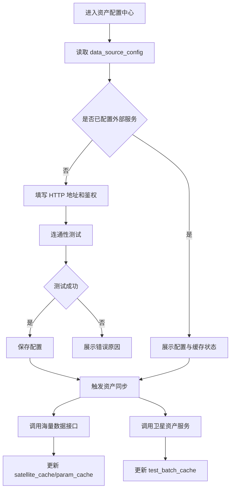

### 5.3 筛选模板页面
#### 5.3.1 列表页字段
| 字段 | 说明 |
|---|---|
| 模板名称 | 支持模糊搜索 |
| 当前版本 | 展示最新版本 |
| 状态 | 草稿、待审核、已发布、灰度中、全量、归档 |
| 适用范围 | 灰度范围摘要 |
| 最近更新人 | 用户名 |
| 最近更新时间 | 时间 |
| 操作 | 编辑、克隆、发布、归档、版本对比 |

#### 5.3.2 维护页组件
- 基本信息区；
- 参数选择区；
- 规则条件树；
- 持续时长配置；
- 边界缓冲配置；
- 质量标记与离群方法配置；
- JSON 预览；
- 保存草稿 / 发布 / 版本对比。

### 5.4 算法模板页面
算法模板维护页使用 React Flow。

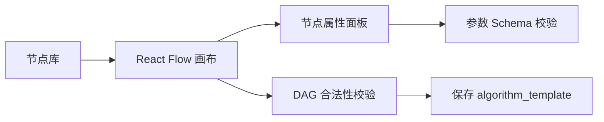

### 5.5 报告模板页面
- 模板上传：`.docx`；
- 占位符扫描；
- 占位符与数据源绑定；
- 章节配置；
- 样例预览；
- 发布版本。

---

## 6. 资产配置中心详细设计

### 6.1 子模块拆分
| 子模块 | 类/接口 | 职责 |
|---|---|---|
| 配置管理 | `DataSourceConfigService` | 管理外部服务与内部存储配置 |
| 外部接口适配 | `IAssetProvider` | 屏蔽海量接口与卫星资产服务调用差异 |
| 海量接口适配 | `MassDataApiClient` | 获取卫星、参数、Mongo 地址 |
| 卫星资产适配 | `SatelliteAssetApiClient` | 获取测试时间段 |
| 缓存同步 | `AssetSyncService` | 刷新本地缓存 |
| Mongo 连接池 | `MongoConnectionPool` | 按 `(tasook_no, satellite_no)` 管理 Mongo 客户端 |

### 6.2 类图
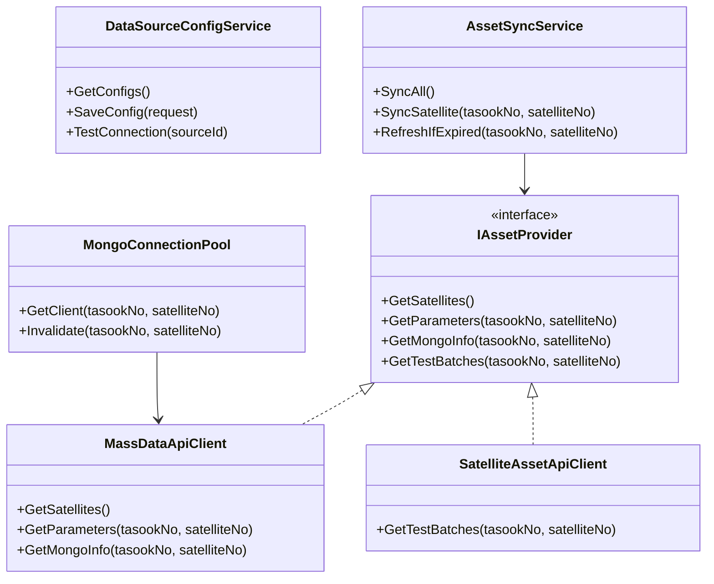

### 6.3 资产同步流程
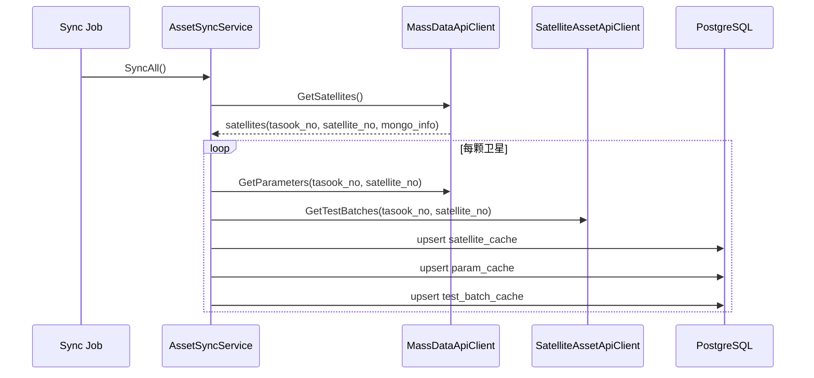

### 6.4 Mongo 动态连接流程
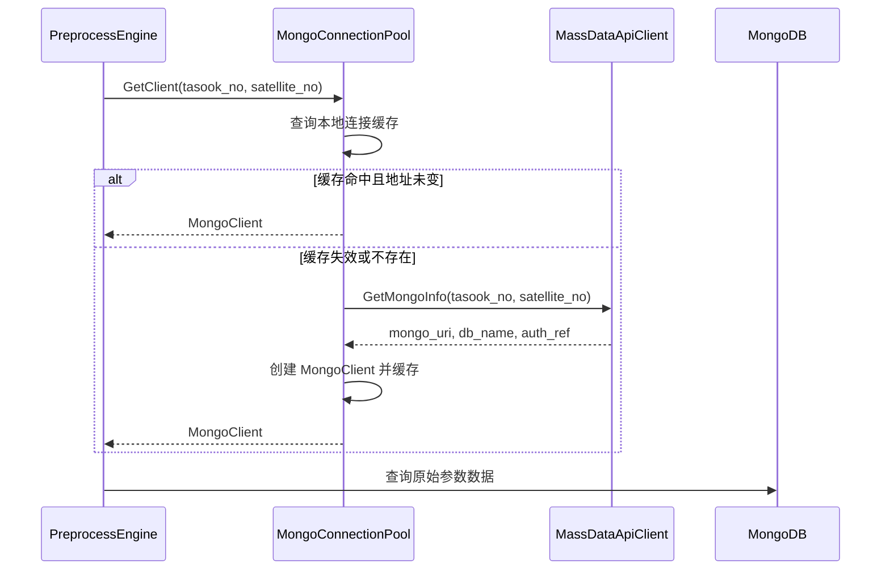

### 6.5 开发要点
- `data_source_config` 不允许配置 `MONGO` 类型；
- Mongo 地址不落入内部数据源管理页面；
- 缓存中允许保存 `mongo_uri`，但密码等敏感信息必须只保存 `auth_ref`；
- 外部接口失败时，若缓存未过期则可降级使用缓存；若缓存也不可用，任务失败并返回 `ASSET_001` 或 `ASSET_002`。

---

## 7. 模板治理详细设计

### 7.1 三类模板独立管理
三类模板没有直接关系：
- 筛选模板只负责数据范围与质量规则；
- 算法模板只负责算法 DAG；
- 报告模板只负责 Word 输出结构；
- 任务创建时可以选择三类模板组合，但模板表之间不建立外键关系。

### 7.2 模板状态机
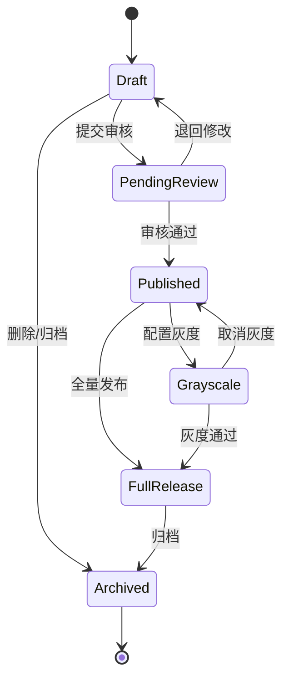

### 7.3 模板服务类图
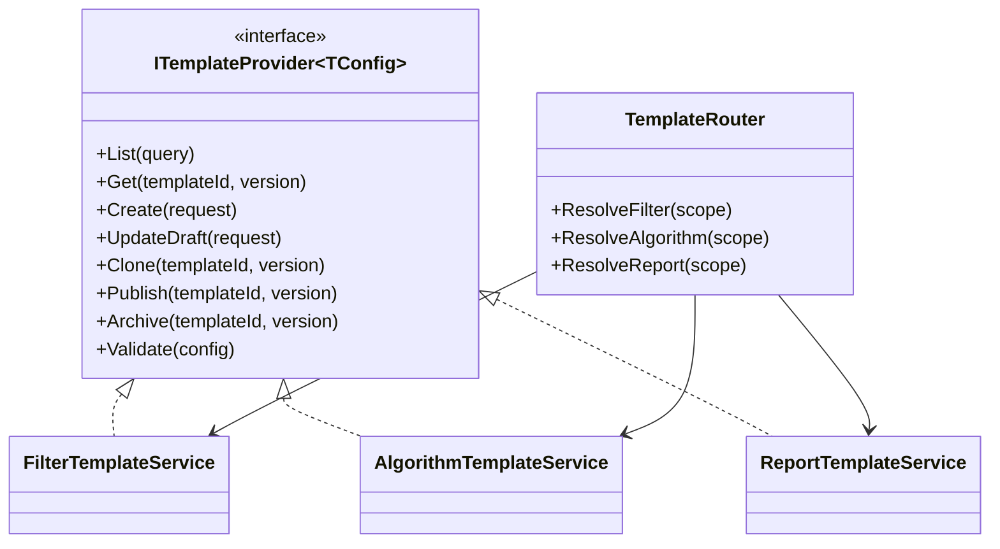

### 7.4 筛选模板配置结构
```json
{
  "targetParams": ["P001", "P002"],
  "timeWindow": {
    "mode": "TEST_BATCH",
    "bufferBeforeSeconds": 30,
    "bufferAfterSeconds": 30
  },
  "ruleTree": {
    "op": "AND",
    "children": [
      { "paramId": "P001", "operator": ">=", "value": 10 },
      { "paramId": "P002", "operator": "<", "value": 100 }
    ]
  },
  "durationSeconds": 5,
  "outlierRules": [
    { "method": "THRESHOLD", "paramId": "P001", "min": 0, "max": 100 },
    { "method": "SIGMA", "paramId": "P002", "sigma": 3 }
  ]
}
```

### 7.5 算法模板节点协议
```json
{
  "nodeId": "fft_1",
  "nodeType": "FFT",
  "inputs": [
    { "name": "series", "type": "TimeSeries" }
  ],
  "outputs": [
    { "name": "spectrum", "type": "Spectrum" }
  ],
  "params": {
    "sampleRate": 1000,
    "window": "hann"
  },
  "runtime": "BUILTIN"
}
```

### 7.6 报告模板占位符
| 占位符 | 数据来源 |
|---|---|
| `{{report_title}}` | 报告标题 |
| `{{tasook_no}}` | 型号代号 |
| `{{satellite_no}}` | 卫星代号 |
| `{{test_batch_id}}` | 测试时间段 |
| `{{compare_summary}}` | 比对结论摘要 |
| `{{compare_table}}` | 比对明细表 |
| `{{chart_cluster_drift}}` | 聚类漂移图 |

---

## 8. 灰度发布与模板路由详细设计

### 8.1 设计目标
灰度发布用于控制筛选模板、算法模板、报告模板在指定数据范围内逐步生效。三类模板彼此独立灰度，任务创建时由 `TemplateRouter` 分别解析命中的模板版本。

灰度发布解决以下问题：
- 新模板先在少量卫星或测试时间段验证；
- 发现异常可快速回退到稳定版本；
- 同一类模板可按不同卫星、测试时间段、时间窗口配置不同生效版本；
- 任务执行时有明确、可复现的模板版本快照。

### 8.2 灰度范围 JSON Schema
三类模板表中的 `gray_scope` 统一使用如下结构：

```json
{
  "enabled": true,
  "priority": 100,
  "effectiveStart": "2026-04-27T00:00:00Z",
  "effectiveEnd": "2026-05-27T00:00:00Z",
  "rules": [
    {
      "tasookNo": "T001",
      "satelliteNo": "S001",
      "testBatchIds": ["B20260427001"],
      "windowStart": "2026-04-27T00:00:00Z",
      "windowEnd": "2026-04-27T08:00:00Z"
    }
  ],
  "fallback": {
    "templateId": "uuid",
    "version": 2
  }
}
```

字段说明：
| 字段 | 说明 |
|---|---|
| `enabled` | 是否启用灰度 |
| `priority` | 命中多条灰度规则时按优先级降序选择 |
| `effectiveStart/effectiveEnd` | 灰度有效期 |
| `rules` | 灰度命中范围 |
| `fallback` | 取消灰度或异常回退时使用的稳定版本 |

### 8.3 模板路由命中规则
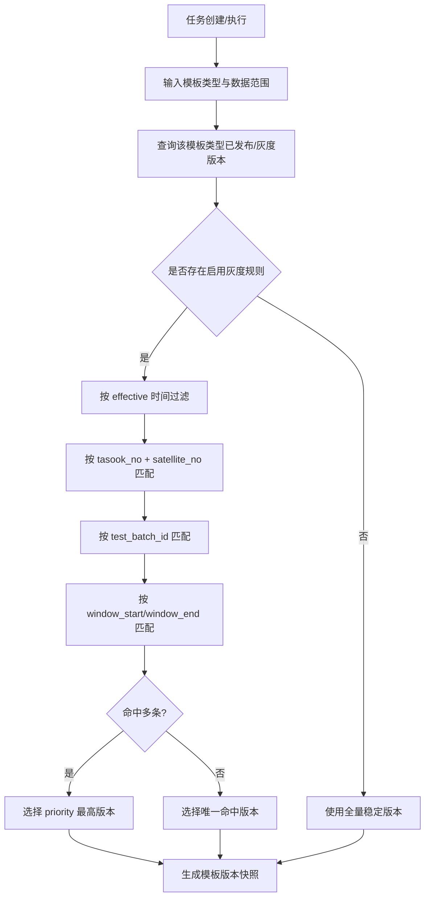

### 8.4 冲突处理
| 冲突场景 | 处理规则 |
|---|---|
| 同一模板类型多版本命中同一卫星与时间段 | 选择 `priority` 最高者 |
| 优先级相同 | 选择 `updated_at` 最新者，并写操作留痕告警 |
| 灰度版本失效 | 回退到 `fallback` 指定版本 |
| `fallback` 不存在或已归档 | 阻止任务创建，返回 `TPL_003` |
| 灰度范围为空但 enabled=true | 模板发布校验不通过 |

### 8.5 灰度发布接口
| 方法 | 路径 | 说明 |
|---|---|---|
| POST | `/templates/{type}/{templateId}/versions/{version}/gray-scope` | 保存灰度范围 |
| POST | `/templates/{type}/{templateId}/versions/{version}/gray-preview` | 预览灰度命中结果 |
| POST | `/templates/{type}/{templateId}/versions/{version}/gray-enable` | 启用灰度 |
| POST | `/templates/{type}/{templateId}/versions/{version}/gray-disable` | 停用灰度并回退 |

### 8.6 灰度预览请求
```json
{
  "templateType": "FILTER",
  "tasookNo": "T001",
  "satelliteNo": "S001",
  "testBatchId": "B20260427001",
  "windowStart": "2026-04-27T00:00:00Z",
  "windowEnd": "2026-04-27T08:00:00Z"
}
```

响应：
```json
{
  "matched": true,
  "templateId": "uuid",
  "version": 3,
  "matchReason": "tasook_no + satellite_no + test_batch_id + time_window",
  "fallbackVersion": 2
}
```

### 8.7 模板版本快照
任务创建时必须把三类模板的实际命中版本写入 `task_run`：
- `filter_template_id` / `filter_template_version`；
- `algorithm_template_id` / `algorithm_template_version`；
- `report_template_id` / `report_template_version`。

后续即使灰度规则变化，已创建任务仍按快照版本执行，保证可追溯与可复现。

---

## 9. 任务编排详细设计

### 9.1 任务类型
| 任务类型 | 说明 | 队列 |
|---|---|---|
| `PREPROCESS` | 数据预处理 | `preprocess` |
| `ALGORITHM` | 算法执行 | `algorithm` |
| `COMPARE` | 一致性比对 | `compare` |
| `REPORT` | 报告生成 | `report` |
| `PIPELINE` | 全链路任务 | 调度子任务 |
| `WEBHOOK` | 回调投递 | `webhook` |

### 9.2 任务状态机
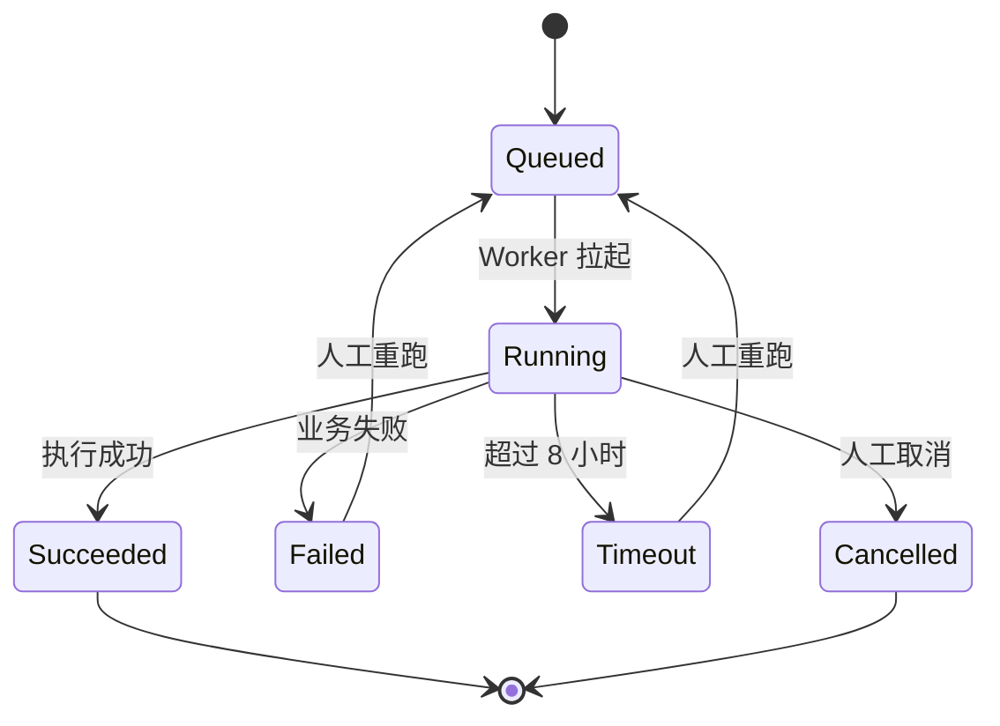

### 9.3 全链路任务序列图
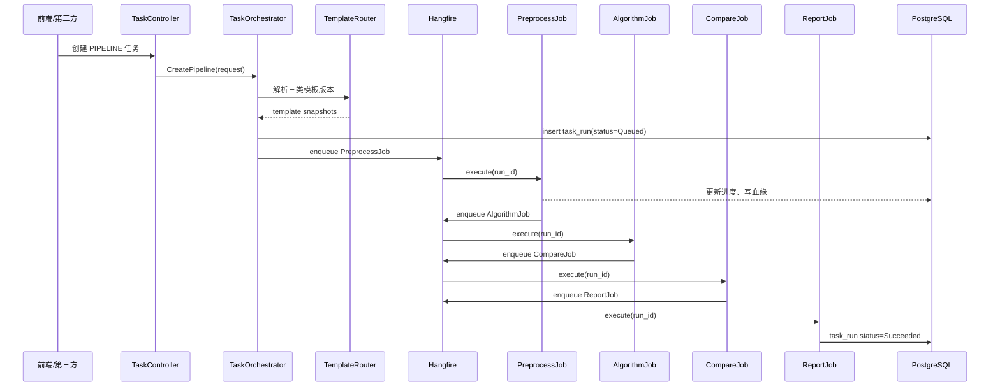

### 9.4 任务创建 API
```http
POST /api/v1/tasks/pipeline
Content-Type: application/json

{
  "tasookNo": "T001",
  "satelliteNo": "S001",
  "testBatchId": "B20260427001",
  "windowStart": "2026-04-27T00:00:00Z",
  "windowEnd": "2026-04-27T08:00:00Z",
  "filterTemplateId": "uuid",
  "filterTemplateVersion": 3,
  "algorithmTemplateId": "uuid",
  "algorithmTemplateVersion": 5,
  "reportTemplateId": "uuid",
  "reportTemplateVersion": 2,
  "force": false
}
```

### 9.5 任务进度规则
| 阶段 | 进度范围 |
|---|---:|
| 创建任务 | 0% - 5% |
| 资产解析 | 5% - 10% |
| 预处理 | 10% - 45% |
| 算法执行 | 45% - 70% |
| 一致性比对 | 70% - 85% |
| 报告生成 | 85% - 95% |
| 归档与回调 | 95% - 100% |

---

## 10. 预处理引擎详细设计

### 10.1 子模块拆分
| 子模块 | 职责 |
|---|---|
| `PreprocessJob` | Hangfire 任务入口 |
| `AssetResolver` | 获取卫星参数、Mongo 地址、测试时间段 |
| `MongoRawDataReader` | 从动态 MongoDB 读取原始数据 |
| `FilterRuleEvaluator` | 计算有效时间段 |
| `OutlierDetector` | 离群值检测 |
| `QualityPointBuilder` | 构造 ClickHouse 入库点 |
| `ClickHouseBatchWriter` | 批量写入高品质明细 |
| `MetadataWriter` | 写 PostgreSQL 时间窗元数据 |

### 10.2 类图
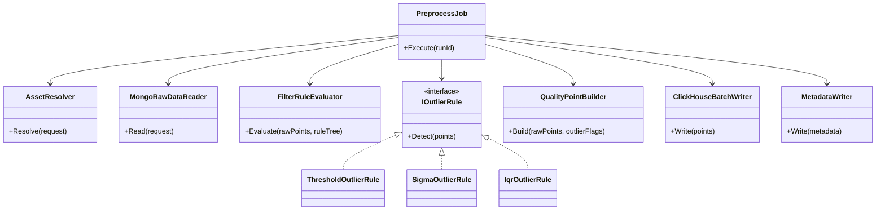

### 10.3 预处理流程图
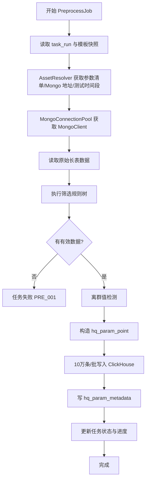

### 10.4 筛选规则执行
规则树使用递归求值。

```csharp
public interface IFilterNode
{
    bool Evaluate(RawPointContext context);
}

public sealed class LogicalNode : IFilterNode
{
    public string Op { get; init; } = "AND"; // AND/OR/NOT
    public List<IFilterNode> Children { get; init; } = [];
}

public sealed class ConditionNode : IFilterNode
{
    public string ParamId { get; init; } = "";
    public string Operator { get; init; } = "";
    public double Value { get; init; }
}
```

### 10.5 离群检测策略
| 方法 | 输入 | 输出 |
|---|---|---|
| 阈值法 | 参数序列、上下限 | 超界点 |
| 3σ | 参数序列 | 偏离均值超过 N 倍标准差的点 |
| IQR | 参数序列 | 落在四分位距外的点 |
| MAD | 参数序列 | 中位数绝对偏差异常点 |
| Hampel | 滑动窗口序列 | 局部异常点 |

### 10.6 ClickHouse 写入策略
- 批大小默认 100000；
- 失败后按批重试；
- 每批携带递增 `version`；
- 同一联合主键下由 `ReplacingMergeTree(version)` 保留最新版本。

---

## 11. 算法引擎详细设计

### 11.1 子模块拆分
| 子模块 | 职责 |
|---|---|
| `DagParser` | 解析 React Flow JSON |
| `DagValidator` | 校验节点、边、入参、出参 |
| `DagScheduler` | 拓扑排序与分层并行 |
| `AlgorithmRegistry` | 注册内置算法和用户算法 |
| `AlgorithmExecutor` | 调用具体算法 |
| `SandboxExecutor` | 执行用户上传脚本 |
| `AlgorithmResultWriter` | 写 `algo_result` 与 `algo_cluster_labels` |

### 11.2 DAG 校验规则
| 规则 | 说明 |
|---|---|
| 无环 | 不允许形成循环 |
| 单入口可选 | 可支持多个入口节点 |
| 类型匹配 | 上游输出类型必须匹配下游输入类型 |
| 必填参数 | 节点参数 Schema 必须通过 |
| 运行时可用 | 节点 runtime 必须可调度 |
| 资源限制 | 用户脚本节点必须配置 CPU/内存/超时 |

### 11.3 算法执行序列
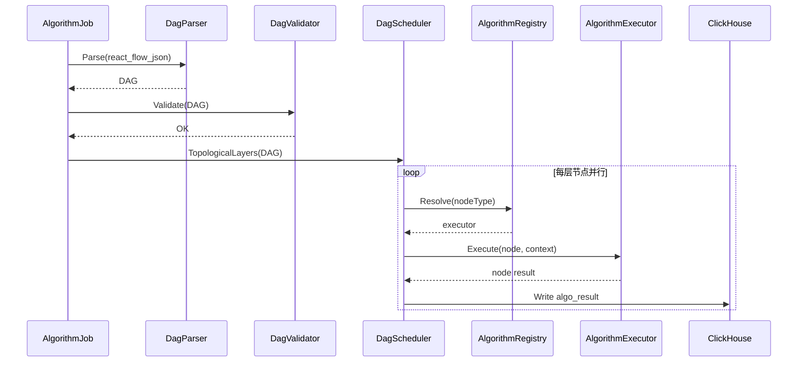

### 11.4 内置算法接口
```csharp
public interface IAlgorithmNodeExecutor
{
    string NodeType { get; }
    AlgorithmNodeSchema GetSchema();
    Task<AlgorithmNodeResult> ExecuteAsync(
        AlgorithmNode node,
        AlgorithmExecutionContext context,
        CancellationToken cancellationToken);
}
```

### 11.5 用户脚本沙箱
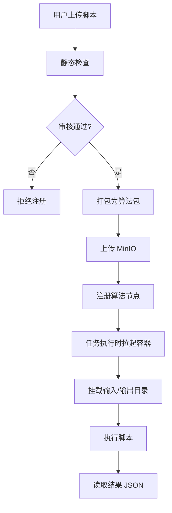

---

## 12. 一致性比对详细设计

### 12.1 比对类型
| 类型 | 输入 A | 输入 B | 输出 |
|---|---|---|---|
| 同星跨批次 | 当前批次结果 | 历史批次结果 | 差异得分 |
| 实测对基线 | 当前实测结果 | 基线版本 | 是否偏离 |
| 实测对阈值 | 当前指标 | 阈值模板 | 是否超界 |
| 聚类漂移 | 当前簇中心 | 基线簇中心 | 簇中心漂移 |
| 时序形态 | 当前序列 | 参考序列 | DTW 距离 |
| 频域指标 | 当前频域特征 | 参考频域特征 | 主频偏移 |

### 12.2 比对类图
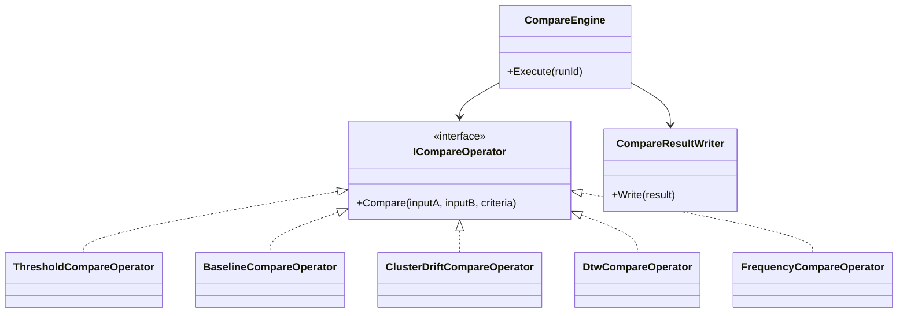

### 12.3 判定规则
| 判定 | 分数区间 | 说明 |
|---|---:|---|
| 正常 | `score >= 0.85` | 与基线一致性高 |
| 注意 | `0.60 <= score < 0.85` | 存在轻微偏移 |
| 异常 | `score < 0.60` | 显著偏离 |

具体算法可按模板配置覆盖默认阈值。

---

## 13. 报告引擎详细设计

### 13.1 子模块拆分
| 子模块 | 职责 |
|---|---|
| `ReportJob` | Hangfire 任务入口 |
| `ReportDataAssembler` | 汇总任务、比对、算法、血缘数据 |
| `DocxTemplateRenderer` | 渲染 Word 占位符 |
| `ChartRenderer` | 生成图表图片 |
| `ObjectStorageService` | 上传 MinIO |
| `ObjectIndexService` | 写 `object_index` |

### 13.2 报告生成序列
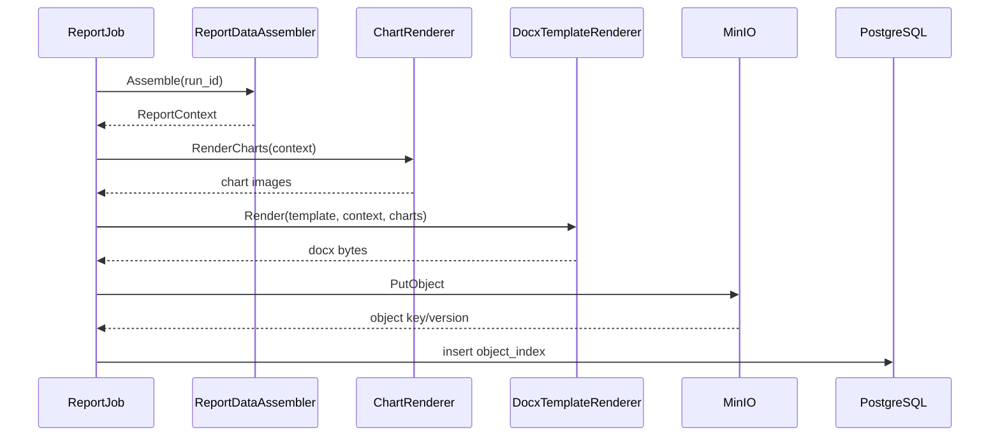

### 13.3 MinIO 路径规范
```text
reports/{yyyy}/{MM}/{dd}/{run_id}/consistency-report.docx
algorithm-packages/{algorithm_code}/{version}/package.zip
exports/{yyyy}/{MM}/{dd}/{run_id}/{file_name}
```

---

## 14. 用户、权限与操作留痕详细设计

### 14.1 角色权限
| 功能 | Admin | Analyst | Readonly |
|---|---:|---:|---:|
| 资产配置 | 写 | 读 | 无 |
| 模板创建/编辑 | 写 | 写 | 读 |
| 模板发布/归档 | 写 | 无 | 无 |
| 任务创建 | 写 | 写 | 无 |
| 任务查看 | 读 | 读 | 读 |
| 报告下载 | 读 | 读 | 读 |
| API 客户端管理 | 写 | 无 | 无 |
| 操作留痕查看 | 读 | 无 | 无 |

### 14.2 操作留痕表
```sql
create table audit_log (
    log_id uuid primary key,                            -- 操作留痕记录 ID
    trace_id varchar(128),                              -- 链路追踪 ID
    operator_id uuid,                                   -- 操作人用户 ID
    operator_name varchar(128),                         -- 操作人名称
    action varchar(128) not null,                       -- 操作动作编码
    target_type varchar(128),                           -- 操作对象类型
    target_id varchar(128),                             -- 操作对象 ID
    before_json jsonb,                                  -- 变更前数据快照
    after_json jsonb,                                   -- 变更后数据快照
    ip_address varchar(64),                             -- 操作来源 IP
    user_agent text,                                    -- 操作客户端 User-Agent
    action_time timestamptz not null default now()      -- 操作发生时间
);
```

---

## 15. 开放 API 与 Webhook 详细设计

### 15.1 开放 API
| 方法 | 路径 | 说明 |
|---|---|---|
| POST | `/oauth2/token` | 第三方获取访问令牌 |
| POST | `/api/v1/jobs/preprocess` | 创建预处理任务 |
| POST | `/api/v1/jobs/pipeline` | 创建全链路任务 |
| GET | `/api/v1/jobs/{jobId}` | 查询任务状态 |
| GET | `/api/v1/jobs/{jobId}/result` | 查询结果摘要 |
| GET | `/api/v1/reports/{objectId}/download` | 下载报告 |

### 15.2 OAuth2.0 第三方鉴权详细设计

第三方系统统一采用 **OAuth2.0 Client Credentials** 模式调用开放 API。平台不再建议使用裸 API Key 直接访问业务接口；`app_id` / `app_secret` 仅用于换取 `access_token`。

#### 15.2.1 授权流程
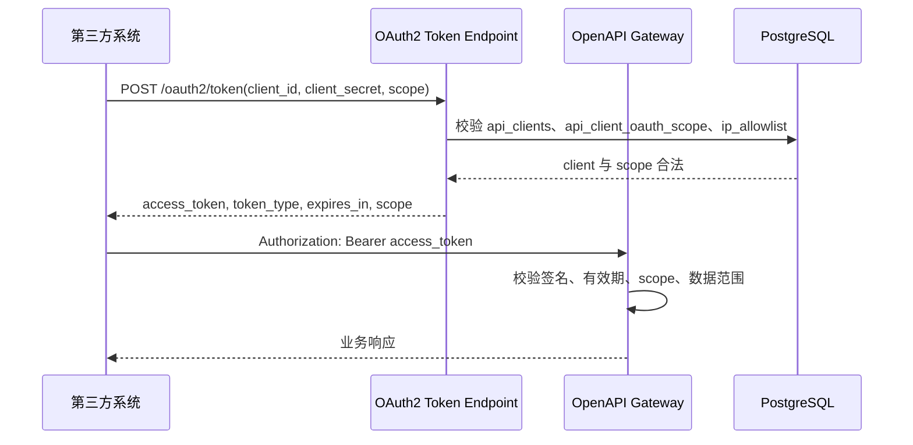

#### 15.2.2 Token 获取接口
```http
POST /oauth2/token
Content-Type: application/x-www-form-urlencoded
Authorization: Basic base64(client_id:client_secret)
```

请求参数：
| 参数 | 必填 | 说明 |
|---|---|---|
| `grant_type` | 是 | 固定为 `client_credentials` |
| `scope` | 否 | 空格分隔的权限范围，例如 `job:create job:read report:download` |

响应：
```json
{
  "access_token": "eyJhbGciOi...",
  "token_type": "Bearer",
  "expires_in": 7200,
  "scope": "job:create job:read report:download"
}
```

#### 15.2.3 Scope 定义
| Scope | 说明 | 允许访问 |
|---|---|---|
| `job:create` | 创建任务 | `POST /openapi/v1/jobs/preprocess`、`POST /openapi/v1/jobs/pipeline` |
| `job:read` | 查询任务 | `GET /openapi/v1/jobs/{jobId}`、`GET /openapi/v1/jobs/{jobId}/result` |
| `data:read` | 查询结果数据 | 高品质明细、算法结果、比对结果查询 |
| `report:download` | 下载报告 | `GET /openapi/v1/reports/{objectId}/download-url` |
| `webhook:manage` | 管理回调 | 回调地址登记、测试与启停 |

#### 15.2.4 Token 内容建议
Access Token 建议采用 JWT，字段如下：

```json
{
  "iss": "satellite-data-platform",
  "aud": "satellite-data-openapi",
  "sub": "client_id",
  "client_id": "uuid",
  "app_id": "third-party-app",
  "scope": "job:create job:read report:download",
  "iat": 1777284000,
  "exp": 1777291200,
  "jti": "uuid"
}
```

#### 15.2.5 数据范围校验
OAuth2.0 的 `scope` 解决“能调用哪些接口”，`api_client_scope` 解决“能访问哪些卫星/测试时间段数据”。

校验顺序：
1. 校验 Token 签名、`iss`、`aud`、过期时间；
2. 校验接口所需 scope 是否包含在 Token 中；
3. 校验 `api_clients.enabled = true`；
4. 校验调用方 IP 是否命中 `ip_allowlist`；
5. 根据请求中的 `tasook_no + satellite_no + test_batch_id` 校验 `api_client_scope`；
6. 全部通过后进入业务逻辑。

#### 15.2.6 OAuth2.0 错误响应
```json
{
  "error": "invalid_client",
  "error_description": "client authentication failed"
}
```

| 错误 | HTTP | 场景 |
|---|---:|---|
| `invalid_client` | 401 | `client_id` 不存在、密钥错误、客户端被禁用 |
| `invalid_grant` | 400 | `grant_type` 非 `client_credentials` |
| `invalid_scope` | 400 | 请求的 scope 未授权 |
| `access_denied` | 403 | IP 白名单或数据范围校验失败 |
| `temporarily_unavailable` | 503 | 鉴权服务临时不可用 |

#### 15.2.7 Token 留痕
每次 Token 申请均写入 `api_oauth_token_log`：
- 成功：记录 `client_id`、`granted_scope`、`token_hash`、`expires_at`；
- 失败：记录 `error_code` 与 `error_description`；
- 不保存明文 access token。

### 15.3 Webhook 事件
| 事件 | 触发时机 |
|---|---|
| `job.succeeded` | 任务成功 |
| `job.failed` | 任务失败 |
| `job.timeout` | 任务超时 |
| `report.generated` | 报告生成完成 |

### 15.4 Webhook 签名
```text
signature = HMAC_SHA256(secret, timestamp + "." + event_id + "." + body)
```

请求头：
```http
X-Event-Id: evt_xxx
X-Timestamp: 2026-04-27T10:00:00Z
X-Signature: sha256=...
```

### 15.5 投递重试
| 第几次 | 延迟 |
|---:|---|
| 1 | 1 分钟 |
| 2 | 5 分钟 |
| 3 | 15 分钟 |
| 4 | 1 小时 |
| 5 | 6 小时 |

---

## 16. 后端 HTTP 接口详细定义

### 16.1 接口通用约定

#### 16.1.1 基础路径与版本
所有前后端分离接口统一使用：

```text
/api/v1
```

其中：
- Web 管理端接口使用 JWT 鉴权；
- 第三方开放接口统一使用 OAuth2.0 Client Credentials；
- 文件下载接口支持短期签名 URL 或后端流式转发；
- 所有写接口必须写入操作留痕。

#### 16.1.2 通用请求头
| Header | 必填 | 说明 |
|---|---|---|
| `Authorization` | 是 | `Bearer {jwt}` 或第三方 Token |
| `X-Trace-Id` | 否 | 前端传入链路追踪 ID；未传则后端生成 |
| `X-Idempotency-Key` | 部分接口 | 创建任务、Webhook 重试等幂等接口使用 |
| `Content-Type` | 是 | `application/json`，文件上传为 `multipart/form-data` |

#### 16.1.3 通用分页请求参数
| 参数 | 类型 | 默认值 | 说明 |
|---|---|---:|---|
| `pageNo` | int | 1 | 页码，从 1 开始 |
| `pageSize` | int | 20 | 每页条数，最大 200 |
| `keyword` | string | 空 | 模糊搜索关键字 |
| `sortBy` | string | `updated_at` | 排序字段 |
| `sortOrder` | string | `desc` | `asc` / `desc` |

#### 16.1.4 通用分页响应
```json
{
  "success": true,
  "code": "OK",
  "message": "",
  "traceId": "trace-xxx",
  "data": {
    "pageNo": 1,
    "pageSize": 20,
    "total": 100,
    "items": []
  }
}
```

---

### 16.2 身份认证与权限模块接口

#### 16.2.1 接口清单
| 方法 | 路径 | 说明 | 权限 |
|---|---|---|---|
| POST | `/auth/login` | 用户登录 | 匿名 |
| POST | `/auth/logout` | 用户退出 | 登录用户 |
| GET | `/auth/me` | 获取当前用户信息 | 登录用户 |
| GET | `/users` | 用户列表 | Admin |
| POST | `/users` | 创建用户 | Admin |
| PUT | `/users/{userId}` | 更新用户 | Admin |
| PATCH | `/users/{userId}/status` | 启用/禁用用户 | Admin |
| GET | `/roles` | 角色列表 | Admin |
| POST | `/roles` | 创建角色 | Admin |
| PUT | `/roles/{roleId}` | 更新角色 | Admin |
| GET | `/permissions` | 权限点列表 | Admin |
| PUT | `/roles/{roleId}/permissions` | 分配角色权限 | Admin |
| PUT | `/users/{userId}/roles` | 分配角色 | Admin |
| GET | `/users/{userId}/scopes` | 查询用户业务范围 | Admin |
| PUT | `/users/{userId}/scopes` | 设置用户业务范围 | Admin |
| GET | `/login-logs` | 查询登录日志 | Admin |

#### 16.2.2 登录接口
```http
POST /api/v1/auth/login
Content-Type: application/json
```

请求：
```json
{
  "username": "admin",
  "password": "******"
}
```

响应：
```json
{
  "success": true,
  "code": "OK",
  "data": {
    "accessToken": "jwt-token",
    "expiresIn": 7200,
    "user": {
      "userId": "uuid",
      "username": "admin",
      "displayName": "系统管理员",
      "roles": ["Admin"]
    }
  }
}
```

---

### 16.3 资产配置中心接口

#### 16.3.1 接口清单
| 方法 | 路径 | 说明 | 权限 |
|---|---|---|---|
| GET | `/asset/sources` | 查询外部服务与内部数据源配置 | Admin |
| POST | `/asset/sources` | 新增配置 | Admin |
| PUT | `/asset/sources/{sourceId}` | 修改配置 | Admin |
| PATCH | `/asset/sources/{sourceId}/status` | 启用/停用配置 | Admin |
| POST | `/asset/sources/{sourceId}/test` | 连通性测试 | Admin |
| POST | `/asset/sync` | 手动同步所有资产 | Admin |
| POST | `/asset/satellites/{tasookNo}/{satelliteNo}/sync` | 同步单颗卫星资产 | Admin / Analyst |
| GET | `/asset/satellites` | 查询卫星列表缓存 | Admin / Analyst / Readonly |
| GET | `/asset/satellites/{tasookNo}/{satelliteNo}` | 查询单颗卫星详情 | Admin / Analyst / Readonly |
| GET | `/asset/satellites/{tasookNo}/{satelliteNo}/params` | 查询单颗卫星参数列表 | Admin / Analyst / Readonly |
| GET | `/asset/satellites/{tasookNo}/{satelliteNo}/test-batches` | 查询单颗卫星测试时间段 | Admin / Analyst / Readonly |
| GET | `/asset/satellites/{tasookNo}/{satelliteNo}/mongo-info` | 查询 Mongo 连接信息摘要 | Admin |
| DELETE | `/asset/cache` | 清理资产缓存 | Admin |

#### 16.3.2 新增/修改数据源配置
```http
POST /api/v1/asset/sources
Content-Type: application/json
```

请求：
```json
{
  "sourceType": "MASS_DATA_API",
  "sourceName": "海量数据接口服务-生产",
  "endpointUrl": "https://mass-data.example.com/api",
  "authType": "API_KEY",
  "authSecretRef": "secret/mass-data/prod",
  "timeoutMs": 10000,
  "enabled": true,
  "env": "PROD"
}
```

说明：
- `sourceType` 允许值：`MASS_DATA_API`、`SATELLITE_ASSET_API`、`CLICKHOUSE`、`MINIO`、`PG_META`；
- 不允许配置 `MONGO` 类型，MongoDB 地址由海量数据接口服务按星动态下发。

#### 16.3.3 查询卫星参数列表
```http
GET /api/v1/asset/satellites/{tasookNo}/{satelliteNo}/params?keyword=温度&pageNo=1&pageSize=50
```

响应：
```json
{
  "success": true,
  "data": {
    "pageNo": 1,
    "pageSize": 50,
    "total": 2,
    "items": [
      {
        "tasookNo": "T001",
        "satelliteNo": "S001",
        "paramId": "P_TEMP_001",
        "paramName": "舱内温度",
        "unit": "℃",
        "valueType": "DOUBLE",
        "valueMin": -40,
        "valueMax": 120,
        "lastSyncedAt": "2026-04-27T10:00:00Z"
      }
    ]
  }
}
```

---

### 16.4 筛选模板接口

#### 16.4.1 接口清单
| 方法 | 路径 | 说明 | 权限 |
|---|---|---|---|
| GET | `/templates/filters` | 筛选模板列表 | Admin / Analyst / Readonly |
| POST | `/templates/filters` | 创建筛选模板草稿 | Admin / Analyst |
| GET | `/templates/filters/{templateId}/versions/{version}` | 查询指定版本 | Admin / Analyst / Readonly |
| PUT | `/templates/filters/{templateId}/versions/{version}` | 修改草稿版本 | Admin / Analyst |
| POST | `/templates/filters/{templateId}/versions/{version}/clone` | 克隆为新草稿 | Admin / Analyst |
| POST | `/templates/filters/{templateId}/versions/{version}/validate` | 校验筛选模板配置 | Admin / Analyst |
| POST | `/templates/filters/{templateId}/versions/{version}/publish` | 发布版本 | Admin |
| POST | `/templates/filters/{templateId}/versions/{version}/gray-scope` | 配置灰度范围 | Admin |
| POST | `/templates/filters/{templateId}/versions/{version}/archive` | 归档版本 | Admin |
| GET | `/templates/filters/{templateId}/diff` | 版本差异对比 | Admin / Analyst / Readonly |

#### 16.4.2 创建筛选模板
```http
POST /api/v1/templates/filters
Content-Type: application/json
```

请求：
```json
{
  "templateName": "通信星稳态温度筛选模板",
  "description": "用于稳态试验温度参数筛选",
  "configJson": {
    "targetParams": ["P_TEMP_001", "P_TEMP_002"],
    "timeWindow": {
      "mode": "TEST_BATCH",
      "bufferBeforeSeconds": 30,
      "bufferAfterSeconds": 30
    },
    "ruleTree": {
      "op": "AND",
      "children": [
        { "paramId": "P_TEMP_001", "operator": ">=", "value": 10 },
        { "paramId": "P_TEMP_002", "operator": "<=", "value": 80 }
      ]
    },
    "durationSeconds": 5,
    "outlierRules": [
      { "method": "THRESHOLD", "paramId": "P_TEMP_001", "min": 0, "max": 100 }
    ]
  }
}
```

响应：
```json
{
  "success": true,
  "data": {
    "templateId": "uuid",
    "version": 1,
    "status": "Draft"
  }
}
```

---

### 16.5 算法模板接口

#### 16.5.1 接口清单
| 方法 | 路径 | 说明 | 权限 |
|---|---|---|---|
| GET | `/templates/algorithms` | 算法模板列表 | Admin / Analyst / Readonly |
| POST | `/templates/algorithms` | 创建算法模板草稿 | Admin / Analyst |
| GET | `/templates/algorithms/{templateId}/versions/{version}` | 查询算法模板版本 | Admin / Analyst / Readonly |
| PUT | `/templates/algorithms/{templateId}/versions/{version}` | 修改算法模板草稿 | Admin / Analyst |
| POST | `/templates/algorithms/{templateId}/versions/{version}/validate-dag` | 校验 React Flow DAG | Admin / Analyst |
| POST | `/templates/algorithms/{templateId}/versions/{version}/clone` | 克隆为新草稿 | Admin / Analyst |
| POST | `/templates/algorithms/{templateId}/versions/{version}/publish` | 发布版本 | Admin |
| POST | `/templates/algorithms/{templateId}/versions/{version}/gray-scope` | 配置灰度范围 | Admin |
| POST | `/templates/algorithms/{templateId}/versions/{version}/archive` | 归档版本 | Admin |
| GET | `/algorithms/nodes` | 查询算法节点库 | Admin / Analyst / Readonly |
| POST | `/algorithms/packages` | 上传用户算法包 | Admin / Analyst |
| GET | `/algorithms/packages` | 查询算法包列表 | Admin / Analyst / Readonly |
| POST | `/algorithms/packages/{packageId}/approve` | 审核算法包 | Admin |

#### 16.5.2 保存算法模板
```http
POST /api/v1/templates/algorithms
Content-Type: application/json
```

请求：
```json
{
  "templateName": "稳态统计 + 聚类分析模板",
  "description": "用于稳态参数统计和工况聚类",
  "reactFlowJson": {
    "nodes": [
      { "id": "input_1", "type": "Input", "data": { "params": ["P001", "P002"] } },
      { "id": "stat_1", "type": "Statistics", "data": { "metrics": ["mean", "rms"] } },
      { "id": "kmeans_1", "type": "KMeans", "data": { "k": 3 } }
    ],
    "edges": [
      { "source": "input_1", "target": "stat_1" },
      { "source": "stat_1", "target": "kmeans_1" }
    ]
  },
  "configJson": {
    "timeoutSeconds": 3600,
    "parallelism": 2
  }
}
```

#### 16.5.3 上传算法包
```http
POST /api/v1/algorithms/packages
Content-Type: multipart/form-data
```

表单字段：
| 字段 | 类型 | 说明 |
|---|---|---|
| `packageFile` | file | `.zip` 算法包 |
| `algorithmCode` | string | 算法编码 |
| `runtime` | string | `PYTHON` / `JAVASCRIPT` |
| `entrypoint` | string | 入口文件 |
| `schemaJson` | string | 输入输出参数 Schema |

---

### 16.6 报告模板接口

#### 16.6.1 接口清单
| 方法 | 路径 | 说明 | 权限 |
|---|---|---|---|
| GET | `/templates/reports` | 报告模板列表 | Admin / Analyst / Readonly |
| POST | `/templates/reports` | 创建报告模板草稿 | Admin / Analyst |
| GET | `/templates/reports/{templateId}/versions/{version}` | 查询报告模板版本 | Admin / Analyst / Readonly |
| PUT | `/templates/reports/{templateId}/versions/{version}` | 修改报告模板元数据 | Admin / Analyst |
| POST | `/templates/reports/{templateId}/versions/{version}/upload` | 上传 Word 模板文件 | Admin / Analyst |
| POST | `/templates/reports/{templateId}/versions/{version}/scan-placeholders` | 扫描占位符 | Admin / Analyst |
| POST | `/templates/reports/{templateId}/versions/{version}/preview` | 预览渲染样例 | Admin / Analyst |
| POST | `/templates/reports/{templateId}/versions/{version}/publish` | 发布版本 | Admin |
| POST | `/templates/reports/{templateId}/versions/{version}/archive` | 归档版本 | Admin |

#### 16.6.2 上传 Word 模板
```http
POST /api/v1/templates/reports/{templateId}/versions/{version}/upload
Content-Type: multipart/form-data
```

响应：
```json
{
  "success": true,
  "data": {
    "objectId": "uuid",
    "fileName": "一致性比对报告模板.docx",
    "placeholders": [
      "{{report_title}}",
      "{{tasook_no}}",
      "{{satellite_no}}",
      "{{compare_summary}}"
    ]
  }
}
```

---

### 16.7 任务中心与调度接口

#### 16.7.1 接口清单
| 方法 | 路径 | 说明 | 权限 |
|---|---|---|---|
| GET | `/tasks` | 任务列表 | Admin / Analyst / Readonly |
| POST | `/tasks/preprocess` | 创建预处理任务 | Admin / Analyst |
| POST | `/tasks/algorithm` | 创建算法任务 | Admin / Analyst |
| POST | `/tasks/compare` | 创建比对任务 | Admin / Analyst |
| POST | `/tasks/report` | 创建报告任务 | Admin / Analyst |
| POST | `/tasks/pipeline` | 创建全链路任务 | Admin / Analyst |
| GET | `/tasks/{runId}` | 查询任务详情 | Admin / Analyst / Readonly |
| GET | `/tasks/{runId}/progress` | 查询任务进度 | Admin / Analyst / Readonly |
| POST | `/tasks/{runId}/cancel` | 取消任务 | Admin / Analyst |
| POST | `/tasks/{runId}/rerun` | 重跑任务 | Admin / Analyst |
| POST | `/tasks/{runId}/backfill` | 按时间窗回补 | Admin / Analyst |
| GET | `/tasks/{runId}/logs` | 查询任务日志摘要 | Admin / Analyst / Readonly |

#### 16.7.2 创建全链路任务
```http
POST /api/v1/tasks/pipeline
X-Idempotency-Key: sha256-xxx
Content-Type: application/json
```

请求：
```json
{
  "tasookNo": "T001",
  "satelliteNo": "S001",
  "testBatchId": "B20260427001",
  "windowStart": "2026-04-27T00:00:00Z",
  "windowEnd": "2026-04-27T08:00:00Z",
  "filterTemplateId": "uuid",
  "filterTemplateVersion": 3,
  "algorithmTemplateId": "uuid",
  "algorithmTemplateVersion": 5,
  "reportTemplateId": "uuid",
  "reportTemplateVersion": 2,
  "force": false,
  "callbackUrl": "https://client.example.com/webhook"
}
```

响应：
```json
{
  "success": true,
  "data": {
    "runId": "uuid",
    "jobId": "JOB-20260427-000001",
    "status": "Queued",
    "idempotencyHit": false
  }
}
```

#### 16.7.3 查询任务详情
```http
GET /api/v1/tasks/{runId}
```

响应：
```json
{
  "success": true,
  "data": {
    "runId": "uuid",
    "jobType": "PIPELINE",
    "status": "Running",
    "progressPercent": 62.5,
    "currentStep": "AlgorithmExecution",
    "tasookNo": "T001",
    "satelliteNo": "S001",
    "testBatchId": "B20260427001",
    "windowStart": "2026-04-27T00:00:00Z",
    "windowEnd": "2026-04-27T08:00:00Z",
    "startTime": "2026-04-27T09:00:00Z",
    "endTime": null,
    "errorCode": null,
    "errorMsg": null,
    "children": [
      { "runId": "uuid", "jobType": "PREPROCESS", "status": "Succeeded" },
      { "runId": "uuid", "jobType": "ALGORITHM", "status": "Running" }
    ]
  }
}
```

---

### 16.8 数据处理结果查询接口

#### 16.8.1 高品质明细查询接口
| 方法 | 路径 | 说明 | 权限 |
|---|---|---|---|
| GET | `/data/hq-points` | 查询高品质明细 | Admin / Analyst / Readonly |
| GET | `/data/hq-points/export` | 导出高品质明细 | Admin / Analyst |
| GET | `/data/hq-metadata` | 查询时间窗元数据 | Admin / Analyst / Readonly |

查询参数：
| 参数 | 类型 | 必填 | 说明 |
|---|---|---|---|
| `tasookNo` | string | 是 | 型号代号 |
| `satelliteNo` | string | 是 | 卫星代号 |
| `testBatchId` | string | 否 | 测试时间段 |
| `paramIds` | string | 否 | 多个参数用逗号分隔 |
| `startTs` | datetime | 是 | 开始时间 |
| `endTs` | datetime | 是 | 结束时间 |
| `includeOutlier` | bool | 否 | 是否包含离群点 |

#### 16.8.2 算法结果接口
| 方法 | 路径 | 说明 | 权限 |
|---|---|---|---|
| GET | `/algorithm-results` | 查询算法指标结果 | Admin / Analyst / Readonly |
| GET | `/algorithm-results/{runId}` | 查询某次运行的算法结果 | Admin / Analyst / Readonly |
| GET | `/algorithm-results/{runId}/cluster-labels` | 查询聚类标签 | Admin / Analyst / Readonly |
| GET | `/algorithm-results/{runId}/features/export` | 导出特征结果 | Admin / Analyst |

#### 16.8.3 比对结果接口
| 方法 | 路径 | 说明 | 权限 |
|---|---|---|---|
| GET | `/compare-results` | 查询比对结果列表 | Admin / Analyst / Readonly |
| GET | `/compare-results/{compareRunId}` | 查询比对详情 | Admin / Analyst / Readonly |
| GET | `/compare-results/{compareRunId}/summary` | 查询比对摘要 | Admin / Analyst / Readonly |

---

### 16.9 报告中心接口

#### 16.9.1 接口清单
| 方法 | 路径 | 说明 | 权限 |
|---|---|---|---|
| GET | `/reports` | 报告列表 | Admin / Analyst / Readonly |
| POST | `/reports/generate` | 独立生成报告 | Admin / Analyst |
| GET | `/reports/{objectId}` | 查询报告详情 | Admin / Analyst / Readonly |
| GET | `/reports/{objectId}/download` | 下载报告 | Admin / Analyst / Readonly |
| POST | `/reports/{objectId}/preview-url` | 生成预览 URL | Admin / Analyst / Readonly |
| DELETE | `/reports/{objectId}` | 删除报告索引 | Admin |

#### 16.9.2 独立生成报告
```http
POST /api/v1/reports/generate
Content-Type: application/json
```

请求：
```json
{
  "sourceRunId": "uuid",
  "compareRunId": "uuid",
  "reportTemplateId": "uuid",
  "reportTemplateVersion": 2
}
```

响应：
```json
{
  "success": true,
  "data": {
    "runId": "uuid",
    "status": "Queued"
  }
}
```

---

### 16.10 操作留痕接口

#### 16.10.1 接口清单
| 方法 | 路径 | 说明 | 权限 |
|---|---|---|---|
| GET | `/trace-logs` | 操作留痕列表 | Admin |
| GET | `/trace-logs/{logId}` | 操作留痕详情 | Admin |
| GET | `/trace-logs/export` | 导出操作留痕 | Admin |

查询参数：
| 参数 | 类型 | 说明 |
|---|---|---|
| `operatorId` | uuid | 操作人 |
| `action` | string | 操作类型 |
| `targetType` | string | 目标类型 |
| `targetId` | string | 目标 ID |
| `startTime` | datetime | 开始时间 |
| `endTime` | datetime | 结束时间 |

---

### 16.11 开放集成管理接口

#### 16.11.1 API 客户端管理
| 方法 | 路径 | 说明 | 权限 |
|---|---|---|---|
| GET | `/integration/clients` | 查询 API 客户端 | Admin |
| POST | `/integration/clients` | 创建 API 客户端 | Admin |
| PUT | `/integration/clients/{clientId}` | 修改 API 客户端 | Admin |
| POST | `/integration/clients/{clientId}/rotate-secret` | 轮换密钥 | Admin |
| PATCH | `/integration/clients/{clientId}/status` | 启用/禁用客户端 | Admin |
| GET | `/integration/oauth-scopes` | 查询 OAuth2.0 Scope 字典 | Admin |
| PUT | `/integration/clients/{clientId}/oauth-scopes` | 设置客户端 OAuth2.0 Scope | Admin |
| GET | `/integration/clients/{clientId}/token-logs` | 查询客户端 Token 申请记录 | Admin |
| GET | `/integration/clients/{clientId}/scopes` | 查询客户端数据范围 | Admin |
| PUT | `/integration/clients/{clientId}/scopes` | 设置客户端数据范围 | Admin |
| GET | `/integration/clients/{clientId}/callbacks` | 查询回调地址 | Admin |
| POST | `/integration/clients/{clientId}/callbacks` | 新增回调地址 | Admin |
| PUT | `/integration/callbacks/{callbackId}` | 修改回调地址 | Admin |
| POST | `/integration/callbacks/{callbackId}/test` | 测试回调地址 | Admin |

#### 16.11.2 Webhook 投递管理
| 方法 | 路径 | 说明 | 权限 |
|---|---|---|---|
| GET | `/integration/webhook-deliveries` | 查询投递记录 | Admin |
| GET | `/integration/webhook-deliveries/{deliveryId}` | 查询投递详情 | Admin |
| POST | `/integration/webhook-deliveries/{deliveryId}/retry` | 手工重试投递 | Admin |

---

### 16.12 第三方开放接口

第三方接口与 Web 管理端任务接口共用任务模型，但鉴权方式不同。第三方必须先通过 `POST /oauth2/token` 获取 `access_token`，再携带 `Authorization: Bearer {access_token}` 调用开放接口。

| 方法 | 路径 | 说明 | 鉴权 |
|---|---|---|---|
| POST | `/oauth2/token` | 获取访问令牌 | Client Credentials |
| POST | `/openapi/v1/jobs/preprocess` | 创建预处理任务 | OAuth2.0 Bearer Token，需 `job:create` |
| POST | `/openapi/v1/jobs/pipeline` | 创建全链路任务 | OAuth2.0 Bearer Token，需 `job:create` |
| GET | `/openapi/v1/jobs/{jobId}` | 查询任务状态 | OAuth2.0 Bearer Token，需 `job:read` |
| GET | `/openapi/v1/jobs/{jobId}/result` | 查询结果摘要 | OAuth2.0 Bearer Token，需 `job:read data:read` |
| GET | `/openapi/v1/reports/{objectId}/download-url` | 获取报告下载 URL | OAuth2.0 Bearer Token，需 `report:download` |

#### 16.12.1 第三方创建全链路任务
```http
POST /openapi/v1/jobs/pipeline
Authorization: Bearer {access_token}
X-Idempotency-Key: client-generated-key
Content-Type: application/json
```

请求：
```json
{
  "externalRequestId": "REQ-20260427-001",
  "tasookNo": "T001",
  "satelliteNo": "S001",
  "testBatchId": "B20260427001",
  "windowStart": "2026-04-27T00:00:00Z",
  "windowEnd": "2026-04-27T08:00:00Z",
  "filterTemplate": {
    "templateId": "uuid",
    "version": 3
  },
  "algorithmTemplate": {
    "templateId": "uuid",
    "version": 5
  },
  "reportTemplate": {
    "templateId": "uuid",
    "version": 2
  },
  "callbackUrl": "https://client.example.com/webhook"
}
```

响应：
```json
{
  "success": true,
  "data": {
    "jobId": "JOB-20260427-000001",
    "runId": "uuid",
    "status": "Queued",
    "pollingUrl": "/openapi/v1/jobs/JOB-20260427-000001"
  }
}
```

---

### 16.13 接口与后端模块映射
| 后端模块 | Controller | 主要接口前缀 |
|---|---|---|
| IdentityService | `AuthController` / `UsersController` | `/auth`、`/users`、`/roles` |
| AssetService | `AssetController` | `/asset` |
| FilterTemplateService | `FilterTemplateController` | `/templates/filters` |
| AlgorithmTemplateService | `AlgorithmTemplateController` | `/templates/algorithms` |
| ReportTemplateService | `ReportTemplateController` | `/templates/reports` |
| TaskOrchestrator | `TaskController` | `/tasks` |
| PreprocessEngine | `TaskController` / `DataController` | `/tasks/preprocess`、`/data/hq-points` |
| AlgorithmEngine | `AlgorithmController` / `AlgorithmResultController` | `/algorithms`、`/algorithm-results` |
| CompareEngine | `CompareResultController` | `/compare-results` |
| ReportEngine | `ReportController` | `/reports` |
| AuditService | `TraceLogController` | `/trace-logs` |
| IntegrationService | `IntegrationController` / `OAuth2Controller` / `OpenApiJobController` | `/integration`、`/oauth2/token`、`/openapi/v1` |

---

## 17. 部署与任务队列详细设计

### 17.1 Worker 队列
| 队列 | Worker | 并发建议 |
|---|---|---:|
| `preprocess` | 预处理 Worker | 2 - 8 |
| `algorithm` | 算法 Worker | 1 - 4 |
| `compare` | 比对 Worker | 2 - 8 |
| `report` | 报告 Worker | 1 - 4 |
| `webhook` | Webhook Worker | 4 - 16 |

### 17.2 超时策略
- 单个主任务最长 8 小时；
- 子任务可按时间窗分片；
- Worker 使用 `CancellationToken` 响应取消；
- 超时任务状态置为 `Timeout`，允许人工重跑。

### 17.3 可观测指标
| 指标 | 维度 |
|---|---|
| `task_duration_seconds` | job_type, status |
| `task_queue_length` | queue |
| `clickhouse_write_rows` | table |
| `mongo_query_duration_seconds` | tasook_no, satellite_no |
| `webhook_delivery_count` | status |
| `report_render_duration_seconds` | template_id |

---

## 18. 测试设计

### 18.1 单元测试
| 模块 | 测试重点 |
|---|---|
| TemplateService | 状态机、版本不可变、Schema 校验 |
| TemplateRouter | 灰度命中、默认版本回退 |
| FilterRuleEvaluator | AND/OR/NOT、多层嵌套 |
| OutlierDetector | 阈值、3σ、IQR |
| DagValidator | 环检测、类型校验、必填参数 |
| CompareEngine | 三档判定、边界值 |

### 18.2 集成测试
| 场景 | 验证点 |
|---|---|
| 外部资产同步 | 缓存表正确 upsert |
| Mongo 动态连接 | 不同卫星使用不同 Mongo 地址 |
| 预处理入仓 | ClickHouse 批量写入与 PG 元数据一致 |
| 全链路任务 | 预处理 → 算法 → 比对 → 报告成功 |
| Webhook | 签名、幂等、重试 |

### 18.3 性能测试
| 测试项 | 目标 |
|---|---|
| ClickHouse 写入 | 单批 10 万行稳定写入 |
| 任务并发 | 多卫星并行任务无连接池冲突 |
| React Flow 大画布 | 100 节点画布可编辑 |
| 报告生成 | 单份报告 60 秒内生成 |

---

## 19. 开发任务拆分建议

### 19.1 后端任务
| 编号 | 任务 |
|---|---|
| BE-01 | 初始化 .NET 解决方案与分层工程 |
| BE-02 | PostgreSQL 表结构与 EF Core / Dapper Repository |
| BE-03 | ClickHouse 表结构与批量写入组件 |
| BE-04 | 资产配置中心 API 与外部 HTTP Client |
| BE-05 | AssetSyncService 与缓存刷新任务 |
| BE-06 | MongoConnectionPool |
| BE-07 | 三类模板服务与 API |
| BE-08 | TemplateRouter 灰度路由 |
| BE-09 | TaskOrchestrator 与 Hangfire 集成 |
| BE-10 | PreprocessEngine |
| BE-11 | AlgorithmEngine 与 DAG 校验 |
| BE-12 | CompareEngine |
| BE-13 | ReportEngine 与 MinIO |
| BE-14 | Identity/RBAC |
| BE-15 | 操作留痕与开放 API/Webhook |

### 19.2 前端任务
| 编号 | 任务 |
|---|---|
| FE-01 | 基础布局、路由、权限控制 |
| FE-02 | 资产配置中心 |
| FE-03 | 筛选模板列表与维护页 |
| FE-04 | 算法模板列表与 React Flow 维护页 |
| FE-05 | 报告模板列表与维护页 |
| FE-06 | 任务中心与任务详情 |
| FE-07 | 报告中心 |
| FE-08 | 操作留痕页面 |
| FE-09 | API 客户端与 Webhook 页面 |

### 19.3 数据与运维任务
| 编号 | 任务 |
|---|---|
| OPS-01 | PostgreSQL / ClickHouse / MinIO / Redis 部署脚本 |
| OPS-02 | Hangfire Dashboard 权限控制 |
| OPS-03 | OpenTelemetry 日志与指标接入 |
| OPS-04 | 数据备份与生命周期策略 |
| OPS-05 | 性能压测脚本 |

---

## 20. 外部接口协议详细设计

### 20.1 海量数据接口服务协议
海量数据接口服务是卫星列表、参数列表、按星 MongoDB 地址的权威来源。

#### 20.1.1 查询卫星列表
```http
GET {mass_data_api}/satellites?pageNo=1&pageSize=200&keyword=xxx
Authorization: Bearer {token}
```

响应：
```json
{
  "items": [
    {
      "tasookNo": "T001",
      "satelliteNo": "S001",
      "satelliteName": "通信星A-01",
      "satelliteType": "通信星A型",
      "sourceVersion": "20260427"
    }
  ],
  "total": 1
}
```

#### 20.1.2 查询参数列表与 MongoDB 地址
```http
GET {mass_data_api}/satellites/{tasookNo}/{satelliteNo}/parameters
```

响应：
```json
{
  "tasookNo": "T001",
  "satelliteNo": "S001",
  "mongoInfo": {
    "mongoUri": "mongodb://mongo-a.example.com:27017",
    "dbName": "satellite_T001_S001",
    "authRef": "secret/mongo/T001/S001"
  },
  "parameters": [
    {
      "paramId": "P_TEMP_001",
      "paramName": "舱内温度",
      "unit": "℃",
      "valueType": "DOUBLE",
      "valueMin": -40,
      "valueMax": 120
    }
  ],
  "sourceVersion": "20260427"
}
```

### 20.2 卫星资产服务协议
卫星资产服务是测试时间段配置的权威来源。

```http
GET {satellite_asset_api}/satellites/{tasookNo}/{satelliteNo}/test-batches?start=2026-04-01T00:00:00Z&end=2026-04-30T00:00:00Z
```

响应：
```json
{
  "items": [
    {
      "testBatchId": "B20260427001",
      "scenario": "热真空试验",
      "startTs": "2026-04-27T00:00:00Z",
      "endTs": "2026-04-27T08:00:00Z",
      "sourceVersion": "20260427"
    }
  ]
}
```

### 20.3 外部接口错误处理
| 错误场景 | 平台处理 |
|---|---|
| 连接超时 | 重试 3 次，仍失败则使用未过期缓存 |
| 返回 401/403 | 任务失败，提示外部接口鉴权异常 |
| 返回结构缺字段 | 同步失败并记录原始响应摘要 |
| 版本号变化 | 更新缓存并失效相关 Mongo 连接池 |
| 缓存不存在且接口失败 | 任务失败，错误码 `ASSET_001` / `ASSET_002` |

---

## 21. 基线管理详细设计

### 21.1 设计目标
基线用于一致性比对，包括阈值基线、统计基线、频域基线、聚类中心基线与时序形态基线。基线必须版本化、可发布、可归档。

### 21.2 PostgreSQL 表设计
```sql
create table baseline_meta (
    baseline_id uuid not null,                          -- 基线 ID，同一基线多版本共用
    version int not null,                               -- 基线版本号
    baseline_name varchar(256) not null,                -- 基线名称
    baseline_type varchar(64) not null,                 -- 基线类型：阈值、统计、频域、聚类中心、时序形态等
    tasook_no varchar(64) not null,                     -- 型号代号
    satellite_no varchar(64),                           -- 卫星代号；为空表示型号级基线
    test_batch_id varchar(128),                         -- 测试时间段；为空表示不限批次
    effective_start timestamptz,                        -- 生效开始时间
    effective_end timestamptz,                          -- 生效结束时间
    status varchar(32) not null,                        -- 基线状态：Draft、Published、Archived
    description text,                                   -- 基线说明
    created_by uuid,                                    -- 创建人用户 ID
    created_at timestamptz not null default now(),      -- 创建时间
    published_at timestamptz,                           -- 发布时间
    primary key (baseline_id, version)
);

create table baseline_metric (
    metric_id uuid primary key,                         -- 基线指标 ID
    baseline_id uuid not null,                          -- 所属基线 ID
    baseline_version int not null,                      -- 所属基线版本号
    param_id varchar(128),                              -- 参数物理 ID；为空表示全局指标
    metric_name varchar(128) not null,                  -- 指标名称
    metric_value double precision,                      -- 标量指标值
    metric_json jsonb,                                  -- 复杂指标内容，如频谱、聚类中心、阈值集合
    created_at timestamptz not null default now()       -- 创建时间
);
```

### 21.3 基线状态机
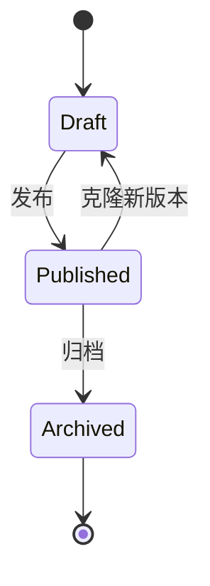

### 21.4 基线选择规则
1. 优先匹配 `tasook_no + satellite_no + test_batch_id`；
2. 未命中时匹配 `tasook_no + satellite_no`；
3. 再未命中时匹配 `tasook_no` 型号级基线；
4. 同时命中多版本时选择有效期覆盖当前窗口且版本最新的基线；
5. 无基线时比对任务返回 `CMP_001`。

### 21.5 基线管理接口
| 方法 | 路径 | 说明 |
|---|---|---|
| GET | `/baselines` | 查询基线列表 |
| POST | `/baselines` | 创建基线草稿 |
| GET | `/baselines/{baselineId}/versions/{version}` | 查询基线版本 |
| POST | `/baselines/{baselineId}/versions/{version}/publish` | 发布基线 |
| POST | `/baselines/{baselineId}/versions/{version}/archive` | 归档基线 |
| POST | `/baselines/resolve` | 根据数据范围解析命中基线 |

---

## 22. 原始 MongoDB 数据读取详细设计

### 22.1 原始数据 Collection 约定
默认原始长表集合名由海量数据接口服务返回，若未返回则默认使用：

```text
raw_param_points
```

### 22.2 原始数据结构
```json
{
  "_id": "ObjectId",
  "tasook_no": "T001",
  "satellite_no": "S001",
  "param_id": "P_TEMP_001",
  "ts": "2026-04-27T00:00:00.000Z",
  "value": 23.5,
  "quality": "NORMAL",
  "source": "test-system-a",
  "received_at": "2026-04-27T00:00:01.000Z"
}
```

### 22.3 索引建议
```javascript
db.raw_param_points.createIndex({ param_id: 1, ts: 1 })
db.raw_param_points.createIndex({ ts: 1 })
db.raw_param_points.createIndex({ received_at: 1 })
```

### 22.4 读取策略
- 按 `param_id in (...) + ts between start/end` 查询；
- 每批读取不超过 50000 条；
- 使用游标分页，禁止一次性加载超大时间窗；
- 晚到数据通过 `received_at` 与任务回补窗口识别；
- 原始值不做插值、不去重，重复点由预处理规则和 ClickHouse 覆盖语义处理。

### 22.5 查询流程
```mermaid
flowchart TD
    A[PreprocessJob] --> B[MongoConnectionPool 获取连接]
    B --> C[按参数列表拆分查询]
    C --> D[按时间窗创建游标]
    D --> E[批量读取 raw points]
    E --> F[送入筛选与离群检测]
    F --> G{游标还有数据?}
    G -- 是 --> E
    G -- 否 --> H[读取完成]
```

---

## 23. 任务补偿、回补与一致性保障设计

### 23.1 补偿目标
保证跨 PostgreSQL、ClickHouse、MinIO、Webhook 的多步骤任务在失败后可定位、可重试、可回补。

### 23.2 PostgreSQL 表设计
```sql
create table task_event (
    event_id uuid primary key,                          -- 任务事件 ID
    run_id uuid not null,                               -- 任务运行实例 ID
    event_type varchar(64) not null,                    -- 事件类型，如 STEP_STARTED、STEP_FAILED
    event_status varchar(32) not null,                  -- 事件状态：SUCCESS、FAILED、PENDING
    payload_json jsonb,                                 -- 事件上下文 JSON
    error_code varchar(64),                             -- 失败错误码
    error_msg text,                                     -- 失败错误描述
    created_at timestamptz not null default now()       -- 创建时间
);

create table task_compensation (
    compensation_id uuid primary key,                   -- 补偿任务 ID
    run_id uuid not null,                               -- 关联任务运行实例 ID
    compensation_type varchar(64) not null,             -- 补偿类型，如 PG_METADATA、OBJECT_INDEX、WEBHOOK
    status varchar(32) not null,                        -- 补偿状态：Pending、Running、Succeeded、Failed
    retry_count int not null default 0,                 -- 已重试次数
    next_retry_at timestamptz,                          -- 下次重试时间
    payload_json jsonb not null,                        -- 补偿执行所需上下文
    last_error text,                                    -- 最近一次失败原因
    created_at timestamptz not null default now(),      -- 创建时间
    updated_at timestamptz not null default now()       -- 最近更新时间
);
```

### 23.3 双写失败处理
| 失败点 | 处理方式 |
|---|---|
| ClickHouse 写入失败 | 当前批次重试，超过次数后任务失败 |
| ClickHouse 成功、PG 元数据失败 | 创建 `task_compensation`，补写 PG 元数据 |
| PG 成功、报告上传失败 | 重试 MinIO 上传 |
| 报告上传成功、索引写入失败 | 根据 MinIO object key 补写 `object_index` |
| Webhook 失败 | 写 `callback_deliveries` 并按退避策略重试 |

### 23.4 回补任务流程
```mermaid
flowchart TD
    A[用户发起回补] --> B[选择 run_id 或时间窗]
    B --> C[生成新 run_id]
    C --> D[复用原模板版本快照]
    D --> E[按指定窗口重新预处理]
    E --> F[ClickHouse ReplacingMergeTree 覆盖旧值]
    F --> G[补写 hq_param_metadata]
    G --> H[可选重新执行算法/比对/报告]
```

---

## 24. 算法仓库与沙箱执行详细设计

### 24.1 表设计
```sql
create table algorithm_package (
    package_id uuid primary key,                        -- 算法包 ID
    algorithm_code varchar(128) not null,               -- 算法编码
    algorithm_name varchar(256) not null,               -- 算法名称
    version varchar(64) not null,                       -- 算法包版本
    runtime varchar(32) not null,                       -- 运行时类型：PYTHON、JS、DOTNET 等
    entrypoint varchar(256) not null,                   -- 执行入口文件或函数
    object_id uuid not null,                            -- 算法包文件在 object_index 中的 ID
    manifest_json jsonb not null,                       -- manifest.json 解析后的元数据
    status varchar(32) not null,                        -- 算法包状态：Uploaded、Approved、Rejected、Archived
    created_by uuid,                                    -- 上传人用户 ID
    created_at timestamptz not null default now(),      -- 上传时间
    approved_by uuid,                                   -- 审核人用户 ID
    approved_at timestamptz                             -- 审核时间
);
```

### 24.2 `manifest.json` 规范
```json
{
  "algorithmCode": "custom_fft",
  "version": "1.0.0",
  "runtime": "PYTHON",
  "entrypoint": "main.py",
  "inputs": [{ "name": "series", "type": "TimeSeries" }],
  "outputs": [{ "name": "spectrum", "type": "Spectrum" }],
  "resources": {
    "cpu": "1",
    "memoryMb": 1024,
    "timeoutSeconds": 600
  }
}
```

### 24.3 沙箱执行流程
```mermaid
sequenceDiagram
    participant Job as AlgorithmJob
    participant Repo as AlgorithmRegistry
    participant MinIO as MinIO
    participant Sandbox as SandboxExecutor
    participant CH as ClickHouse

    Job->>Repo: Resolve algorithm package
    Repo->>MinIO: Download package
    MinIO-->>Repo: package.zip
    Repo->>Sandbox: Start container with resource limits
    Sandbox->>Sandbox: Execute entrypoint
    Sandbox-->>Repo: result.json
    Repo->>CH: Write algo_result
```

### 24.4 安全限制
- 容器禁用特权模式；
- 限制 CPU、内存、运行时长；
- 默认禁止访问内网，仅允许访问挂载输入输出目录；
- 输出必须符合 `outputs` Schema；
- 审核通过后才允许注册为算法节点。

---

## 25. 报告模板渲染详细设计

### 25.1 占位符 Schema
```json
{
  "placeholders": [
    {
      "name": "compare_summary",
      "type": "TEXT",
      "required": true,
      "source": "compare_result.summary"
    },
    {
      "name": "compare_table",
      "type": "TABLE",
      "required": true,
      "source": "compare_result.details"
    },
    {
      "name": "chart_cluster_drift",
      "type": "IMAGE",
      "required": false,
      "source": "charts.cluster_drift"
    }
  ]
}
```

### 25.2 渲染校验
| 校验项 | 失败处理 |
|---|---|
| 必填占位符缺失 | 模板发布失败 |
| 数据源字段不存在 | 报告任务失败 `RPT_001` |
| 图片生成失败 | 使用占位错误图并记录告警 |
| 表格列不匹配 | 报告任务失败 |

### 25.3 报告预览数据
报告模板维护页使用最近一次成功比对结果作为预览数据；无历史结果时使用系统内置 mock 数据。

---

## 26. 数据归档与生命周期设计

### 26.1 ClickHouse 生命周期
| 数据 | 热数据 | 冷数据 | 处理策略 |
|---|---|---|---|
| `hq_param_point` | 近 12 个月 | 12 个月以上 | 冷数据迁移到低成本磁盘或对象存储 |
| `algo_result` | 近 24 个月 | 24 个月以上 | 聚合保留，明细可归档 |
| `compare_result` | 长期 | - | 长期保留 |

### 26.2 MinIO 生命周期
| 对象类型 | 策略 |
|---|---|
| 报告文件 | 长期保留，开启版本控制 |
| 算法包 | 所有已发布版本长期保留 |
| 临时导出 | 默认 30 天过期 |
| 渲染中间图 | 7 天过期 |

### 26.3 操作留痕保留
操作留痕默认长期保留；若容量过大，可按年度归档到冷存储，但查询索引保留在 PostgreSQL。

---

## 27. 机器学习数据集快照扩展设计

### 27.1 表设计
```sql
create table ml_dataset_snapshot (
    dataset_id uuid primary key,                        -- 数据集快照 ID
    dataset_name varchar(256) not null,                 -- 数据集名称
    tasook_no varchar(64),                              -- 型号代号；为空表示跨型号数据集
    satellite_no varchar(64),                           -- 卫星代号；为空表示跨卫星数据集
    run_ids jsonb not null,                             -- 参与构建数据集的任务运行实例 ID 集合
    channel_mapping jsonb not null,                     -- 参数到 ML 通道的映射关系
    window_config jsonb not null,                       -- 样本切窗配置，如窗口长度、步长
    normalization_object_id uuid,                       -- 归一化参数文件对象 ID
    mask_strategy varchar(64) not null default 'PADDING_MASK', -- 缺失值掩码策略
    object_id uuid,                                     -- 数据集文件对象 ID
    status varchar(32) not null,                        -- 快照状态：Building、Ready、Failed、Archived
    created_by uuid,                                    -- 创建人用户 ID
    created_at timestamptz not null default now()       -- 创建时间
);
```

### 27.2 快照生成规则
- 输入来自 ClickHouse 高品质点表；
- 输出样本形态为 `[T, C]`；
- 缺失值不插值，统一通过 mask 表达；
- 归一化参数单独保存到 MinIO；
- 数据集必须记录使用的 `run_id` 集合，确保可复现。

### 27.3 接口
| 方法 | 路径 | 说明 |
|---|---|---|
| POST | `/ml/datasets` | 创建数据集快照任务 |
| GET | `/ml/datasets` | 查询数据集列表 |
| GET | `/ml/datasets/{datasetId}` | 查询数据集详情 |
| GET | `/ml/datasets/{datasetId}/download-url` | 获取下载地址 |

---

## 28. 可观测、告警与运维接口设计

### 28.1 日志字段规范
| 字段 | 说明 |
|---|---|
| `trace_id` | 链路追踪 ID |
| `run_id` | 任务 ID |
| `job_type` | 任务类型 |
| `tasook_no` | 型号代号 |
| `satellite_no` | 卫星代号 |
| `duration_ms` | 耗时 |
| `error_code` | 错误码 |

### 28.2 告警规则
| 告警 | 触发条件 |
|---|---|
| 任务连续失败 | 10 分钟内同类任务失败超过 5 次 |
| 队列积压 | Hangfire 队列长度超过阈值 |
| 外部接口异常 | 连续 3 次调用海量接口或资产接口失败 |
| ClickHouse 写入异常 | 写入失败率超过 1% |
| Webhook 投递异常 | 单客户端连续失败超过 5 次 |

### 28.3 健康检查接口
| 方法 | 路径 | 说明 |
|---|---|---|
| GET | `/health/live` | 进程存活检查 |
| GET | `/health/ready` | 依赖就绪检查 |
| GET | `/ops/metrics` | Prometheus 指标 |
| GET | `/ops/queue-status` | 队列状态 |
| POST | `/ops/cache/refresh-assets` | 手工刷新资产缓存 |

---

## 29. 修订记录
| 版本 | 日期 | 说明 |
|---|---|---|
| V1.0 | 2026-04-27 | 基于概要设计 V2.7 生成详细设计首版，覆盖模块拆分、表结构、接口、流程图、序列图、类图与开发任务拆分 |
| V1.1 | 2026-04-27 | 新增第 15 章《后端 HTTP 接口详细定义》，按前后端分离方式补充各模块 Controller、接口路径、权限、请求体与响应体示例；后续章节顺延 |
| V1.2 | 2026-04-27 | PostgreSQL 表设计补充用户、角色、权限、用户业务范围、登录日志、刷新令牌，以及第三方 API 客户端数据范围表；同步补充用户权限与客户端范围管理接口 |
| V1.3 | 2026-04-27 | 补充 OAuth2.0 Client Credentials 第三方鉴权详细设计：新增 Token 获取流程、Scope 模型、Token 校验顺序、错误响应、Token 留痕表与开放接口鉴权说明；第三方开放接口统一改为 OAuth2.0 Bearer Token |
| V1.4 | 2026-04-27 | 补充概要设计覆盖缺口：将《灰度发布与模板路由详细设计》前移至模板治理后；新增外部接口协议、基线管理、原始 MongoDB 读取、任务补偿与回补、算法仓库与沙箱、报告模板渲染、数据归档、机器学习数据集快照、可观测告警与运维接口等详细设计章节 |
| V1.5 | 2026-04-28 | 基于 V1.4 完整版补充 SQL DDL 字段级注释，覆盖 PostgreSQL 元数据表、用户权限/OAuth/Webhook 表、ClickHouse 明细与结果表、基线/补偿/算法包/机器学习数据集快照等表结构 |
