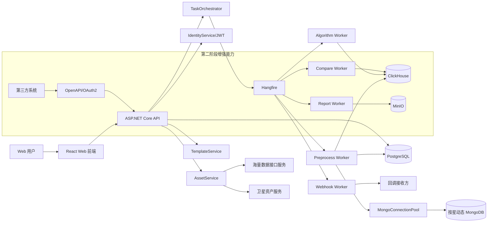
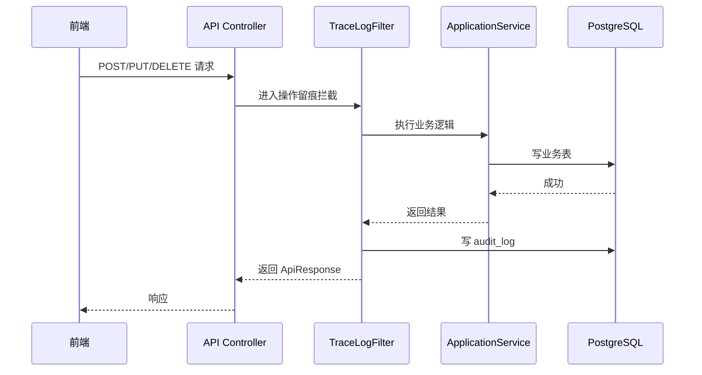
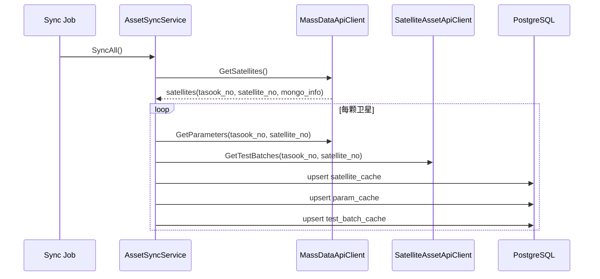
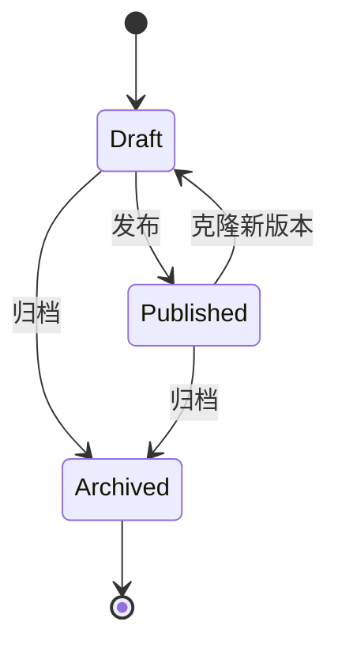
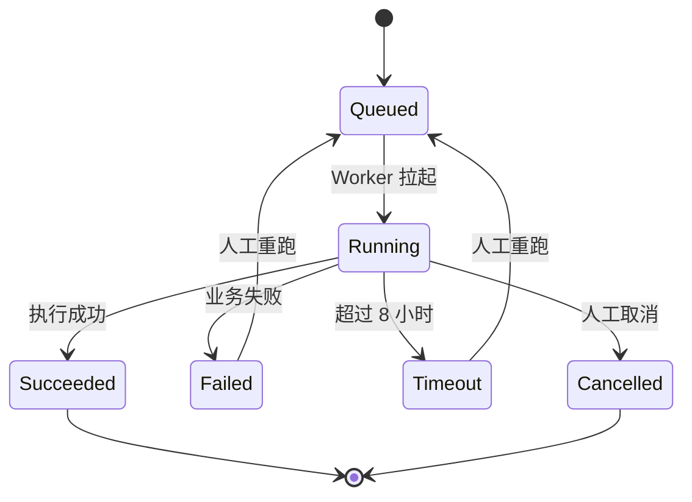
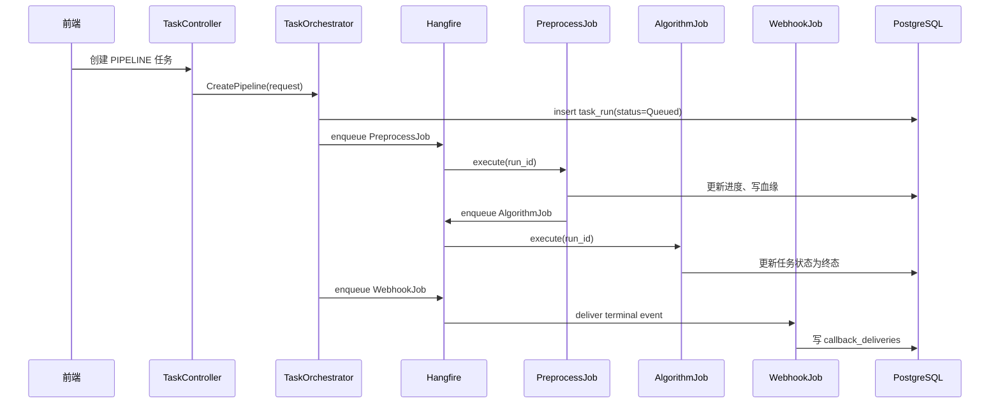
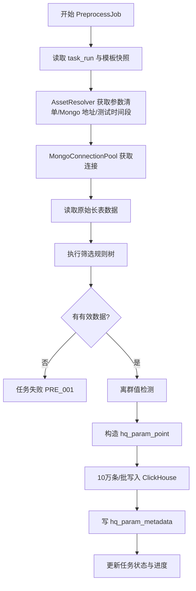
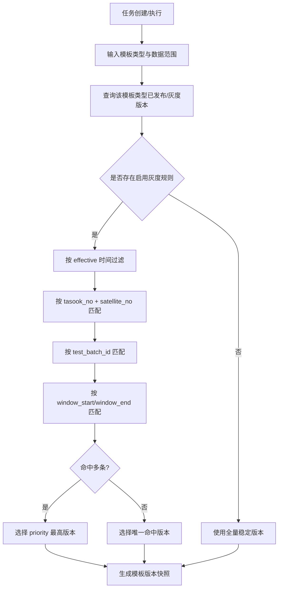
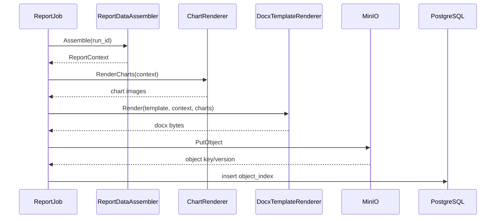
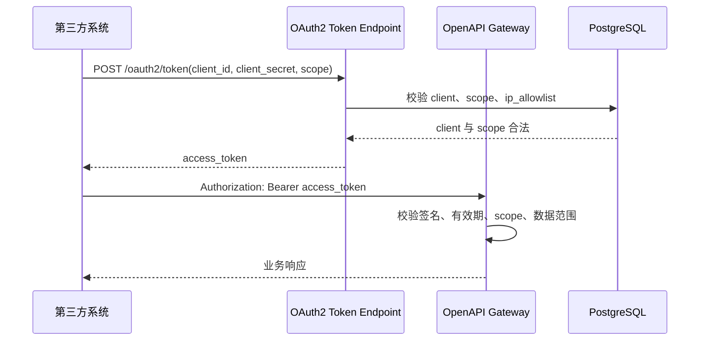

# 卫星测试数据预处理与一致性比对平台
## 详细设计文档（V2.0）

## 1. 文档说明

### 1.1 编写目的
本文档基于《详细设计文档_卫星测试数据预处理与一致性比对平台_V1.0.md》（内容版本 V1.4/V1.5 演进稿）重组形成，作为后端 API、前端页面、任务 Worker、数据表、集成适配器与测试工作的阶段化实施依据。

V2.0 的主要调整：
- 模块设计按实施阶段重新组织，明确第一阶段交付核心闭环，第二阶段交付增强能力；
- 将 Webhook 投递作为第一阶段任务终态通知能力；模板灰度发布、OAuth2 第三方授权、开放 API、一致性比对与报告能力划入第二阶段；
- 将所有 SQL DDL 集中收敛到第 4 章，其他章节只引用第 4 章表结构，不再重复 SQL；
- 保留原文中的关键流程、接口契约、类结构和验收要求，并按阶段明确优先级。

### 1.2 设计边界
本文档覆盖两阶段建设范围。

第一阶段（核心功能）：
- 资产配置中心；
- 三类模板的基础管理（筛选模板、算法模板、报告模板元数据基础能力）；
- 任务编排与调度；
- 预处理引擎；
- 算法引擎基础能力（统计、频域等内置算法与 DAG 校验）；
- Webhook 任务终态投递、签名、重试与投递记录；
- 用户登录、基础 RBAC、操作留痕；
- 高品质数据、算法结果与任务血缘的基础查询。

第二阶段（增强能力）：
- 模板灰度发布与模板路由；
- OAuth2 Client Credentials、第三方开放 API；
- 一致性比对、基线管理；
- 报告引擎、报告模板渲染与 MinIO 归档；
- 用户算法包、沙箱执行；
- 任务补偿、回补增强；
- ML 数据集快照、可观测与运维接口增强。

本文档不覆盖：
- 外部海量数据接口服务本身的实现；
- 外部卫星资产服务本身的实现；
- 外部 ML 平台的训练服务实现；
- 生产环境具体机器规格与采购清单。

### 1.3 关键术语
| 术语 | 说明 |
|---|---|
| `tasook_no` | 型号代号 |
| `satellite_no` | 卫星代号 |
| 数据来源 | `tasook_no + satellite_no`，唯一确定一颗卫星 |
| `test_batch_id` | 测试时间段或测试批次标识，不用于唯一确定卫星 |
| `run_id` | 平台任务运行实例唯一标识 |
| `job_id` | 对外异步任务标识，可与 `run_id` 一一映射 |
| 高品质明细 | 经筛选、质量标记后的参数时序点，存储在 ClickHouse |
| 操作留痕 | 对关键用户操作、系统操作、Webhook 投递等行为的完整记录 |

### 1.4 阶段划分原则
第一阶段优先保证平台能够完成“资产同步 → 模板基础配置 → 预处理入仓 → 内置算法计算 → 任务状态可追溯 → Webhook 终态通知”的核心数据生产闭环。

第二阶段在第一阶段稳定后补齐生产级治理与对外交付能力，包括灰度发布、OAuth2/OpenAPI、比对报告、沙箱算法、补偿与 ML 扩展。

---

## 2. 总体详细架构

### 2.1 分阶段运行视图


### 2.2 后端工程结构
```text
SatelliteData.Platform
├── src
│   ├── SatelliteData.Api
│   │   ├── Controllers
│   │   ├── Filters
│   │   ├── Middlewares
│   │   └── Program.cs
│   ├── SatelliteData.Application
│   │   ├── Assets
│   │   ├── Templates
│   │   ├── Tasks
│   │   ├── Preprocess
│   │   ├── Algorithms
│   │   ├── Compare
│   │   ├── Reports
│   │   ├── Identity
│   │   ├── TraceLogs
│   │   └── Integration
│   ├── SatelliteData.Domain
│   │   ├── Common
│   │   ├── Assets
│   │   ├── Templates
│   │   ├── Tasks
│   │   ├── Quality
│   │   ├── Algorithms
│   │   └── Compare
│   ├── SatelliteData.Infrastructure
│   │   ├── PostgreSql
│   │   ├── ClickHouse
│   │   ├── Mongo
│   │   ├── Minio
│   │   ├── Hangfire
│   │   ├── HttpClients
│   │   └── Security
│   └── SatelliteData.Workers
│       ├── PreprocessJobs
│       ├── AlgorithmJobs
│       ├── CompareJobs
│       ├── ReportJobs
│       └── WebhookJobs
└── tests
    ├── SatelliteData.UnitTests
    ├── SatelliteData.IntegrationTests
    └── SatelliteData.E2ETests
```

### 2.3 统一技术约定
| 类型 | 约定 |
|---|---|
| API 风格 | REST + JSON |
| 后端返回 | 统一 `ApiResponse<T>`，失败返回标准错误码 |
| 时间 | 后端统一 UTC 存储，前端按用户时区显示 |
| 主键 | 业务表使用 `uuid` 或雪花 ID，时序明细使用业务联合主键 |
| 配置 | 环境变量 + PostgreSQL 配置表，敏感值只存密钥引用 |
| 日志 | 结构化日志，包含 `trace_id`、`run_id`、`user_id` |
| 幂等 | 任务类 API 必须支持幂等键 |
| 大批量写入 | ClickHouse 必须批量写入，禁止单条循环 Insert |
| 阶段开关 | 第一阶段 Webhook 与第二阶段增强能力均通过配置开关或功能菜单控制，避免影响核心链路 |

---

## 3. 横切能力详细设计

### 3.1 统一响应模型
```csharp
public sealed class ApiResponse<T>
{
    public bool Success { get; init; }
    public string Code { get; init; } = "OK";
    public string Message { get; init; } = "";
    public T? Data { get; init; }
    public string TraceId { get; init; } = "";
}
```

### 3.2 错误码规范
| 错误码 | HTTP | 阶段 | 说明 |
|---|---:|---|---|
| `AUTH_001` | 401 | 一阶段 | 未登录或 Token 无效 |
| `AUTH_002` | 403 | 一阶段 | 无权限访问 |
| `TPL_001` | 400 | 一阶段 | 模板配置不合法 |
| `TPL_002` | 409 | 一阶段 | 已发布模板不可直接修改 |
| `TPL_003` | 400 | 二阶段 | 灰度回退版本不存在或不可用 |
| `ASSET_001` | 502 | 一阶段 | 海量数据接口不可用 |
| `ASSET_002` | 502 | 一阶段 | 卫星资产服务不可用 |
| `TASK_001` | 409 | 一阶段 | 幂等任务已存在 |
| `TASK_002` | 408 | 一阶段 | 任务超时 |
| `PRE_001` | 422 | 一阶段 | 筛选后无有效数据 |
| `ALG_001` | 400 | 一阶段 | 算法 DAG 校验失败 |
| `CMP_001` | 422 | 二阶段 | 基线缺失 |
| `RPT_001` | 500 | 二阶段 | 报告渲染失败 |
| `OPENAPI_001` | 401 | 二阶段 | 第三方 Token 无效 |
| `WEBHOOK_001` | 502 | 一阶段 | Webhook 投递失败 |

### 3.3 统一操作留痕
所有写操作通过 Action Filter 或应用层 Pipeline 统一写入操作留痕。表结构见第 4 章 `audit_log`。



### 3.4 幂等键生成规则
任务幂等键由任务类型、模板版本、数据来源、测试时间段、时间窗共同决定。

```text
idempotency_key = SHA256(
  job_type + ":" +
  filter_template_id + ":" + filter_template_version + ":" +
  algorithm_template_id + ":" + algorithm_template_version + ":" +
  report_template_id + ":" + report_template_version + ":" +
  tasook_no + ":" + satellite_no + ":" +
  test_batch_id + ":" +
  window_start + ":" + window_end
)
```

### 3.5 阶段能力开关
阶段能力建议通过配置项控制。Webhook 虽然属于第一阶段，但默认可按环境关闭，避免开发与离线环境误投递。

| 配置项 | 默认 | 说明 |
|---|---:|---|
| `Features:WebhookDelivery` | `true` | 是否启用任务终态 Webhook 投递 |
| `Features:TemplateGrayRelease` | `false` | 是否启用模板灰度发布 |
| `Features:OpenApiOAuth2` | `false` | 是否启用第三方 OAuth2 开放接口 |
| `Features:CompareReportPipeline` | `false` | 是否启用比对与报告流水线 |
| `Features:AlgorithmSandbox` | `false` | 是否启用用户上传算法包 |
| `Features:TaskCompensation` | `false` | 是否启用补偿任务自动执行 |

---

## 4. 数据库详细设计

> 本章集中放置所有 SQL DDL。其他章节涉及表结构时只引用本章表名与小节，不再重复 SQL。

### 4.1 PostgreSQL 表设计

#### 4.1.1 外部与内部数据源配置表 `data_source_config`
```sql
create table data_source_config (
    source_id uuid primary key,
    source_type varchar(32) not null,
    source_name varchar(128) not null,
    endpoint_url text not null,
    auth_type varchar(32) not null default 'NONE',
    auth_secret_ref varchar(256),
    timeout_ms int not null default 10000,
    enabled boolean not null default true,
    env varchar(32) not null default 'PROD',
    created_at timestamptz not null default now(),
    updated_at timestamptz not null default now(),
    constraint ck_source_type check (
        source_type in ('MASS_DATA_API', 'SATELLITE_ASSET_API', 'CLICKHOUSE', 'MINIO', 'PG_META')
    )
);
```

#### 4.1.2 卫星缓存表 `satellite_cache`
```sql
create table satellite_cache (
    tasook_no varchar(64) not null,
    satellite_no varchar(64) not null,
    satellite_name varchar(256) not null,
    satellite_type varchar(128),
    mongo_uri text,
    mongo_db_name varchar(256),
    mongo_auth_ref varchar(256),
    source_version varchar(128),
    last_synced_at timestamptz not null,
    raw_json jsonb not null,
    primary key (tasook_no, satellite_no)
);
```

#### 4.1.3 参数缓存表 `param_cache`
```sql
create table param_cache (
    tasook_no varchar(64) not null,
    satellite_no varchar(64) not null,
    param_id varchar(128) not null,
    param_name varchar(256) not null,
    unit varchar(64),
    value_type varchar(32),
    value_min double precision,
    value_max double precision,
    source_version varchar(128),
    last_synced_at timestamptz not null,
    raw_json jsonb not null,
    primary key (tasook_no, satellite_no, param_id)
);
```

#### 4.1.4 测试时间段缓存表 `test_batch_cache`
```sql
create table test_batch_cache (
    tasook_no varchar(64) not null,
    satellite_no varchar(64) not null,
    test_batch_id varchar(128) not null,
    scenario varchar(256),
    start_ts timestamptz not null,
    end_ts timestamptz not null,
    source_version varchar(128),
    last_synced_at timestamptz not null,
    raw_json jsonb not null,
    primary key (tasook_no, satellite_no, test_batch_id)
);
```

#### 4.1.5 筛选模板表 `filter_template`
```sql
create table filter_template (
    template_id uuid not null,
    version int not null,
    template_name varchar(256) not null,
    status varchar(32) not null,
    gray_scope jsonb,
    config_json jsonb not null,
    description text,
    created_by uuid not null,
    created_at timestamptz not null default now(),
    updated_by uuid,
    updated_at timestamptz not null default now(),
    published_at timestamptz,
    primary key (template_id, version)
);
```

#### 4.1.6 算法模板表 `algorithm_template`
```sql
create table algorithm_template (
    template_id uuid not null,
    version int not null,
    template_name varchar(256) not null,
    status varchar(32) not null,
    gray_scope jsonb,
    react_flow_json jsonb not null,
    config_json jsonb not null,
    node_count int not null default 0,
    description text,
    created_by uuid not null,
    created_at timestamptz not null default now(),
    updated_by uuid,
    updated_at timestamptz not null default now(),
    published_at timestamptz,
    primary key (template_id, version)
);
```

#### 4.1.7 报告模板表 `report_template`
```sql
create table report_template (
    template_id uuid not null,
    version int not null,
    template_name varchar(256) not null,
    status varchar(32) not null,
    gray_scope jsonb,
    object_id uuid,
    placeholder_schema jsonb,
    config_json jsonb not null,
    description text,
    created_by uuid not null,
    created_at timestamptz not null default now(),
    updated_by uuid,
    updated_at timestamptz not null default now(),
    published_at timestamptz,
    primary key (template_id, version)
);
```

#### 4.1.8 任务运行表 `task_run`
```sql
create table task_run (
    run_id uuid primary key,
    parent_run_id uuid,
    job_id varchar(128) unique,
    job_type varchar(32) not null,
    trigger_type varchar(32) not null,
    status varchar(32) not null,
    idempotency_key varchar(128) not null,
    tasook_no varchar(64) not null,
    satellite_no varchar(64) not null,
    test_batch_id varchar(128),
    window_start timestamptz,
    window_end timestamptz,
    filter_template_id uuid,
    filter_template_version int,
    algorithm_template_id uuid,
    algorithm_template_version int,
    report_template_id uuid,
    report_template_version int,
    progress_percent numeric(5,2) not null default 0,
    current_step varchar(128),
    start_time timestamptz,
    end_time timestamptz,
    timeout_flag boolean not null default false,
    error_code varchar(64),
    error_msg text,
    created_by uuid,
    created_at timestamptz not null default now(),
    unique (idempotency_key)
);
```

#### 4.1.9 时间窗元数据表 `hq_param_metadata`
```sql
create table hq_param_metadata (
    metadata_id uuid primary key,
    run_id uuid not null,
    tasook_no varchar(64) not null,
    satellite_no varchar(64) not null,
    test_batch_id varchar(128) not null,
    param_id varchar(128) not null,
    window_start timestamptz not null,
    window_end timestamptz not null,
    filter_template_id uuid not null,
    filter_template_version int not null,
    outlier_method varchar(64),
    outlier_reason_pattern text,
    created_at timestamptz not null default now()
);
```

#### 4.1.10 文件索引表 `object_index`
```sql
create table object_index (
    object_id uuid primary key,
    bucket varchar(128) not null,
    object_key text not null,
    object_version varchar(128),
    checksum varchar(128),
    content_type varchar(128),
    file_size bigint,
    ref_run_id uuid,
    created_by uuid,
    created_at timestamptz not null default now()
);
```

#### 4.1.11 用户、角色、权限与登录表
```sql
create table sys_user (
    user_id uuid primary key,
    username varchar(128) not null unique,
    display_name varchar(128) not null,
    password_hash varchar(256) not null,
    password_salt varchar(128),
    email varchar(256),
    mobile varchar(64),
    status varchar(32) not null default 'ENABLED',
    last_login_at timestamptz,
    password_updated_at timestamptz,
    created_at timestamptz not null default now(),
    updated_at timestamptz not null default now(),
    constraint ck_sys_user_status check (status in ('ENABLED', 'DISABLED', 'LOCKED'))
);

create table sys_role (
    role_id uuid primary key,
    role_code varchar(64) not null unique,
    role_name varchar(128) not null,
    description text,
    built_in boolean not null default false,
    enabled boolean not null default true,
    created_at timestamptz not null default now(),
    updated_at timestamptz not null default now()
);

create table sys_permission (
    permission_id uuid primary key,
    permission_code varchar(128) not null unique,
    permission_name varchar(128) not null,
    module_code varchar(64) not null,
    action_code varchar(64) not null,
    description text,
    enabled boolean not null default true,
    created_at timestamptz not null default now()
);

create table sys_user_role (
    user_id uuid not null references sys_user(user_id),
    role_id uuid not null references sys_role(role_id),
    created_at timestamptz not null default now(),
    created_by uuid,
    primary key (user_id, role_id)
);

create table sys_role_permission (
    role_id uuid not null references sys_role(role_id),
    permission_id uuid not null references sys_permission(permission_id),
    created_at timestamptz not null default now(),
    created_by uuid,
    primary key (role_id, permission_id)
);

create table sys_user_scope (
    scope_id uuid primary key,
    user_id uuid not null references sys_user(user_id),
    tasook_no varchar(64) not null,
    satellite_no varchar(64) not null,
    test_batch_id varchar(128),
    scope_level varchar(32) not null default 'SATELLITE',
    enabled boolean not null default true,
    created_at timestamptz not null default now(),
    created_by uuid,
    constraint ck_user_scope_level check (scope_level in ('SATELLITE', 'TEST_BATCH'))
);

create index idx_sys_user_scope_user on sys_user_scope(user_id);
create index idx_sys_user_scope_sat on sys_user_scope(tasook_no, satellite_no);

create table sys_login_log (
    login_id uuid primary key,
    user_id uuid,
    username varchar(128) not null,
    login_result varchar(32) not null,
    failure_reason text,
    ip_address varchar(64),
    user_agent text,
    trace_id varchar(128),
    login_at timestamptz not null default now(),
    constraint ck_login_result check (login_result in ('SUCCESS', 'FAILED'))
);

create table sys_refresh_token (
    token_id uuid primary key,
    user_id uuid not null references sys_user(user_id),
    token_hash varchar(256) not null unique,
    issued_at timestamptz not null default now(),
    expires_at timestamptz not null,
    revoked_at timestamptz,
    revoke_reason text,
    client_ip varchar(64),
    user_agent text
);

create index idx_refresh_token_user on sys_refresh_token(user_id);
create index idx_refresh_token_expires on sys_refresh_token(expires_at);
```

#### 4.1.12 操作留痕表 `audit_log`
```sql
create table audit_log (
    log_id uuid primary key,
    trace_id varchar(128),
    operator_id uuid,
    operator_name varchar(128),
    action varchar(128) not null,
    target_type varchar(128),
    target_id varchar(128),
    before_json jsonb,
    after_json jsonb,
    ip_address varchar(64),
    user_agent text,
    action_time timestamptz not null default now()
);
```

#### 4.1.13 Webhook 与第三方开放集成相关表
```sql
create table api_clients (
    client_id uuid primary key,
    client_name varchar(256) not null,
    app_id varchar(128) not null unique,
    app_secret_hash varchar(256) not null,
    grant_types jsonb not null default '["client_credentials"]'::jsonb,
    token_ttl_seconds int not null default 7200,
    enabled boolean not null default true,
    ip_allowlist jsonb,
    created_at timestamptz not null default now(),
    updated_at timestamptz not null default now()
);

create table api_oauth_scope (
    scope_id uuid primary key,
    scope_code varchar(128) not null unique,
    scope_name varchar(128) not null,
    description text,
    enabled boolean not null default true,
    created_at timestamptz not null default now()
);

create table api_client_oauth_scope (
    client_id uuid not null references api_clients(client_id),
    scope_id uuid not null references api_oauth_scope(scope_id),
    created_at timestamptz not null default now(),
    created_by uuid,
    primary key (client_id, scope_id)
);

create table api_oauth_token_log (
    token_log_id uuid primary key,
    client_id uuid not null references api_clients(client_id),
    grant_type varchar(64) not null,
    requested_scope text,
    granted_scope text,
    token_hash varchar(256),
    issued_at timestamptz not null default now(),
    expires_at timestamptz not null,
    ip_address varchar(64),
    user_agent text,
    result varchar(32) not null,
    error_code varchar(64),
    error_description text,
    constraint ck_oauth_token_result check (result in ('SUCCESS', 'FAILED'))
);

create index idx_api_oauth_token_client on api_oauth_token_log(client_id);
create index idx_api_oauth_token_issued on api_oauth_token_log(issued_at);

create table api_client_scope (
    scope_id uuid primary key,
    client_id uuid not null references api_clients(client_id),
    tasook_no varchar(64) not null,
    satellite_no varchar(64) not null,
    test_batch_id varchar(128),
    scope_level varchar(32) not null default 'SATELLITE',
    enabled boolean not null default true,
    created_at timestamptz not null default now(),
    created_by uuid,
    constraint ck_client_scope_level check (scope_level in ('SATELLITE', 'TEST_BATCH'))
);

create index idx_api_client_scope_client on api_client_scope(client_id);
create index idx_api_client_scope_sat on api_client_scope(tasook_no, satellite_no);

create table client_callbacks (
    callback_id uuid primary key,
    client_id uuid references api_clients(client_id),
    callback_name varchar(256) not null,
    callback_url text not null,
    secret_ref varchar(256) not null,
    event_types jsonb not null default '["job.succeeded","job.failed","job.timeout"]'::jsonb,
    max_retry_count int not null default 5,
    enabled boolean not null default true,
    created_at timestamptz not null default now()
);

create table callback_deliveries (
    delivery_id uuid primary key,
    event_id varchar(128) not null unique,
    callback_id uuid not null references client_callbacks(callback_id),
    run_id uuid,
    event_type varchar(64) not null,
    payload_json jsonb not null,
    status varchar(32) not null,
    retry_count int not null default 0,
    next_retry_at timestamptz,
    response_status int,
    response_body text,
    created_at timestamptz not null default now(),
    updated_at timestamptz not null default now()
);
```

#### 4.1.14 基线管理表
```sql
create table baseline_meta (
    baseline_id uuid not null,
    version int not null,
    baseline_name varchar(256) not null,
    baseline_type varchar(64) not null,
    tasook_no varchar(64) not null,
    satellite_no varchar(64),
    test_batch_id varchar(128),
    effective_start timestamptz,
    effective_end timestamptz,
    status varchar(32) not null,
    description text,
    created_by uuid,
    created_at timestamptz not null default now(),
    published_at timestamptz,
    primary key (baseline_id, version)
);

create table baseline_metric (
    metric_id uuid primary key,
    baseline_id uuid not null,
    baseline_version int not null,
    param_id varchar(128),
    metric_name varchar(128) not null,
    metric_value double precision,
    metric_json jsonb,
    created_at timestamptz not null default now()
);
```

#### 4.1.15 任务事件与补偿表
```sql
create table task_event (
    event_id uuid primary key,
    run_id uuid not null,
    event_type varchar(64) not null,
    event_status varchar(32) not null,
    payload_json jsonb,
    error_code varchar(64),
    error_msg text,
    created_at timestamptz not null default now()
);

create table task_compensation (
    compensation_id uuid primary key,
    run_id uuid not null,
    compensation_type varchar(64) not null,
    status varchar(32) not null,
    retry_count int not null default 0,
    next_retry_at timestamptz,
    payload_json jsonb not null,
    last_error text,
    created_at timestamptz not null default now(),
    updated_at timestamptz not null default now()
);
```

#### 4.1.16 算法包表 `algorithm_package`
```sql
create table algorithm_package (
    package_id uuid primary key,
    algorithm_code varchar(128) not null,
    algorithm_name varchar(256) not null,
    version varchar(64) not null,
    runtime varchar(32) not null,
    entrypoint varchar(256) not null,
    object_id uuid not null,
    manifest_json jsonb not null,
    status varchar(32) not null,
    created_by uuid,
    created_at timestamptz not null default now(),
    approved_by uuid,
    approved_at timestamptz
);
```

#### 4.1.17 ML 数据集快照表 `ml_dataset_snapshot`
```sql
create table ml_dataset_snapshot (
    dataset_id uuid primary key,
    dataset_name varchar(256) not null,
    tasook_no varchar(64),
    satellite_no varchar(64),
    run_ids jsonb not null,
    channel_mapping jsonb not null,
    window_config jsonb not null,
    normalization_object_id uuid,
    mask_strategy varchar(64) not null default 'PADDING_MASK',
    object_id uuid,
    status varchar(32) not null,
    created_by uuid,
    created_at timestamptz not null default now()
);
```

### 4.2 ClickHouse 表设计

#### 4.2.1 高品质明细表 `hq_param_point`
```sql
create table hq_param_point
(
    tasook_no LowCardinality(String),
    satellite_no LowCardinality(String),
    test_batch_id LowCardinality(String),
    param_id LowCardinality(String),
    ts DateTime64(3, 'UTC'),
    raw_value Nullable(Float64),
    processed_value Nullable(Float64),
    is_outlier UInt8,
    version UInt64,
    ingested_at DateTime64(3, 'UTC') default now64(3)
)
engine = ReplacingMergeTree(version)
partition by (toYYYYMM(ts), tasook_no, satellite_no)
order by (tasook_no, satellite_no, test_batch_id, param_id, ts);
```

#### 4.2.2 算法结果表 `algo_result`
```sql
create table algo_result
(
    run_id UUID,
    node_id String,
    algorithm_code LowCardinality(String),
    tasook_no LowCardinality(String),
    satellite_no LowCardinality(String),
    test_batch_id LowCardinality(String),
    window_start DateTime64(3, 'UTC'),
    window_end DateTime64(3, 'UTC'),
    metric_name LowCardinality(String),
    metric_value Float64,
    detail_json String,
    created_at DateTime64(3, 'UTC') default now64(3)
)
engine = MergeTree
partition by toYYYYMM(window_start)
order by (run_id, node_id, metric_name);
```

#### 4.2.3 聚类标签表 `algo_cluster_labels`
```sql
create table algo_cluster_labels
(
    run_id UUID,
    node_id String,
    tasook_no LowCardinality(String),
    satellite_no LowCardinality(String),
    test_batch_id LowCardinality(String),
    ts DateTime64(3, 'UTC'),
    sample_id String,
    cluster_id Int32,
    is_noise UInt8,
    distance_to_center Float64,
    created_at DateTime64(3, 'UTC') default now64(3)
)
engine = MergeTree
partition by (toYYYYMM(ts), tasook_no, satellite_no)
order by (run_id, node_id, cluster_id, ts);
```

#### 4.2.4 比对结果表 `compare_result`
```sql
create table compare_result
(
    compare_run_id UUID,
    source_run_id UUID,
    compare_type LowCardinality(String),
    baseline_ref String,
    tasook_no LowCardinality(String),
    satellite_no LowCardinality(String),
    test_batch_id LowCardinality(String),
    score Float64,
    decision LowCardinality(String),
    detail_json String,
    created_at DateTime64(3, 'UTC') default now64(3)
)
engine = MergeTree
partition by toYYYYMM(created_at)
order by (compare_run_id, compare_type, decision);
```

### 4.3 建议索引与约束说明
| 表 | 建议索引/约束 | 阶段 |
|---|---|---|
| `task_run` | `unique(idempotency_key)`、`(status, created_at)` | 一阶段 |
| `audit_log` | `(target_type, target_id, action_time)` | 一阶段 |
| `client_callbacks` | `(enabled)`、`(client_id)` | 一阶段 |
| `callback_deliveries` | `unique(event_id)`、`(status, next_retry_at)` | 一阶段 |
| `object_index` | `(ref_run_id)`、`(bucket, object_key)` | 二阶段 |
| `baseline_meta` | `(tasook_no, satellite_no, test_batch_id, status)` | 二阶段 |
| `algorithm_package` | `(algorithm_code, version)` | 二阶段 |

---

## 5. 前端详细设计

### 5.1 分阶段前端路由
| 阶段 | 路由 | 页面 | 权限 |
|---|---|---|---|
| 一阶段 | `/assets/sources` | 资产配置中心 | Admin |
| 一阶段 | `/assets/satellites` | 卫星资产缓存 | Admin / Analyst / Readonly |
| 一阶段 | `/templates/filter` | 筛选模板列表 | Admin / Analyst / Readonly |
| 一阶段 | `/templates/filter/:id` | 筛选模板维护 | Admin / Analyst |
| 一阶段 | `/templates/algorithm` | 算法模板列表 | Admin / Analyst / Readonly |
| 一阶段 | `/templates/algorithm/:id` | 算法模板维护 | Admin / Analyst |
| 一阶段 | `/tasks` | 任务列表与监控 | Admin / Analyst / Readonly |
| 一阶段 | `/tasks/:runId` | 任务详情 | Admin / Analyst / Readonly |
| 一阶段 | `/integrations/webhooks` | Webhook 配置与投递记录 | Admin |
| 一阶段 | `/trace-logs` | 操作留痕 | Admin |
| 二阶段 | `/templates/report` | 报告模板列表 | Admin / Analyst / Readonly |
| 二阶段 | `/templates/report/:id` | 报告模板维护 | Admin / Analyst |
| 二阶段 | `/templates/gray-preview` | 灰度命中预览 | Admin |
| 二阶段 | `/compare-results` | 一致性比对结果 | Admin / Analyst / Readonly |
| 二阶段 | `/reports` | 报告中心 | Admin / Analyst / Readonly |
| 二阶段 | `/integrations/clients` | 开放 API 客户端 | Admin |

### 5.2 一阶段页面范围
一阶段页面重点保障核心链路：
- 资产配置中心：维护海量数据接口、卫星资产服务及内部存储配置；
- 资产缓存查询：展示卫星、参数、测试时间段和 Mongo 摘要；
- 筛选模板维护：规则条件树、持续时长、边界缓冲、离群配置；
- 算法模板维护：React Flow 画布、内置算法节点、DAG 合法性校验；
- 任务中心：创建预处理/算法/流水线任务、查看状态、进度、错误；
- Webhook 管理：配置任务终态回调地址、查看投递记录、手工重试；
- 操作留痕：查询核心写操作记录。

### 5.3 二阶段页面范围
二阶段页面补齐治理与对外交付：
- 灰度发布：维护 `gray_scope`，预览模板命中结果；
- 报告模板：上传 `.docx`、扫描占位符、预览报告；
- 比对结果：展示比对结论、得分、异常详情；
- 报告中心：查询、下载、预览报告；
- 开放 API 客户端：管理 OAuth2 客户端、scope、数据范围，并与一阶段 Webhook 回调配置关联。

---

## 6. 第一阶段核心功能模块设计

### 6.1 资产配置中心
#### 6.1.1 子模块拆分
| 子模块 | 类/接口 | 职责 |
|---|---|---|
| 配置管理 | `DataSourceConfigService` | 管理外部服务与内部存储配置 |
| 海量接口适配 | `MassDataApiClient` | 获取卫星、参数、Mongo 地址 |
| 卫星资产适配 | `SatelliteAssetApiClient` | 获取测试时间段 |
| 缓存同步 | `AssetSyncService` | 刷新本地缓存 |
| Mongo 连接池 | `MongoConnectionPool` | 按 `(tasook_no, satellite_no)` 管理 Mongo 连接信息 |

数据表引用：`data_source_config`、`satellite_cache`、`param_cache`、`test_batch_cache` 见第 4 章。

#### 6.1.2 资产同步流程


#### 6.1.3 开发要点
- `data_source_config` 不允许配置 `MONGO` 类型；
- Mongo 地址不落入内部数据源管理页面；
- 缓存中允许保存 `mongo_uri`，但密码等敏感信息必须只保存 `auth_ref`；
- 外部接口失败时，若缓存未过期可降级使用缓存；缓存不可用时任务失败并返回 `ASSET_001` 或 `ASSET_002`。

### 6.2 模板治理基础能力
第一阶段只实现模板的基础生命周期，不实现灰度发布。灰度发布见第 7 章第二阶段。

#### 6.2.1 三类模板独立管理
- 筛选模板负责数据范围、有效段与质量规则；
- 算法模板负责 React Flow DAG 与算法节点参数；
- 报告模板第一阶段只保留元数据占位，可创建和查看，完整上传/渲染能力放到第二阶段；
- 三类模板表之间不建立外键关系，任务创建时按需组合。

报告模板表在第一阶段允许 `object_id` 与 `placeholder_schema` 为空，用于提前打通模板目录、权限与任务快照模型；第二阶段启用报告渲染后，发布态报告模板必须绑定 Word 模板对象与占位符 Schema。

表结构引用：`filter_template`、`algorithm_template`、`report_template` 见第 4 章。

#### 6.2.2 一阶段模板状态机


#### 6.2.3 筛选模板配置结构
```json
{
  "targetParams": ["P001", "P002"],
  "timeWindow": {
    "mode": "TEST_BATCH",
    "bufferBeforeSeconds": 30,
    "bufferAfterSeconds": 30
  },
  "ruleTree": {
    "op": "AND",
    "children": [
      { "paramId": "P001", "operator": ">=", "value": 10 },
      { "paramId": "P002", "operator": "<", "value": 100 }
    ]
  },
  "durationSeconds": 5,
  "outlierRules": [
    { "method": "THRESHOLD", "paramId": "P001", "min": 0, "max": 100 },
    { "method": "SIGMA", "paramId": "P002", "sigma": 3 }
  ]
}
```

#### 6.2.4 算法模板节点协议
```json
{
  "nodeId": "fft_1",
  "nodeType": "FFT",
  "inputs": [{ "name": "series", "type": "TimeSeries" }],
  "outputs": [{ "name": "spectrum", "type": "Spectrum" }],
  "params": {
    "sampleRate": 1000,
    "window": "hann"
  },
  "runtime": "BUILTIN"
}
```

### 6.3 任务编排与调度
#### 6.3.1 一阶段任务类型
| 任务类型 | 说明 | 队列 |
|---|---|---|
| `PREPROCESS` | 数据预处理 | `preprocess` |
| `ALGORITHM` | 算法执行 | `algorithm` |
| `PIPELINE` | 预处理 + 算法基础流水线 | 调度子任务 |
| `WEBHOOK` | 任务终态回调投递 | `webhook` |

第二阶段扩展 `COMPARE`、`REPORT`。

表结构引用：`task_run`、`task_event`、`task_compensation`、`client_callbacks`、`callback_deliveries` 见第 4 章。

#### 6.3.2 任务状态机


#### 6.3.3 一阶段流水线序列


任何子任务将主任务推进到 `Succeeded`、`Failed` 或 `Timeout` 时，均由 `WebhookEventPublisher` 发布终态事件；Webhook 失败不得反向影响已经确定的业务任务状态。

#### 6.3.4 任务进度规则
| 阶段 | 进度范围 |
|---|---:|
| 创建任务 | 0% - 5% |
| 资产解析 | 5% - 10% |
| 预处理 | 10% - 60% |
| 算法执行 | 60% - 90% |
| Webhook 投递与收尾 | 90% - 100% |

### 6.4 预处理引擎
#### 6.4.1 子模块拆分
| 子模块 | 职责 |
|---|---|
| `PreprocessJob` | Hangfire 任务入口 |
| `AssetResolver` | 获取卫星参数、Mongo 地址、测试时间段 |
| `MongoRawDataReader` | 从动态 MongoDB 读取原始数据 |
| `FilterRuleEvaluator` | 计算有效时间段 |
| `OutlierDetector` | 离群值检测 |
| `QualityPointBuilder` | 构造 ClickHouse 入库点 |
| `ClickHouseBatchWriter` | 批量写入高品质明细 |
| `MetadataWriter` | 写 PostgreSQL 时间窗元数据 |

表结构引用：`hq_param_point`、`hq_param_metadata` 见第 4 章。

#### 6.4.2 预处理流程


#### 6.4.3 离群检测策略
| 方法 | 输入 | 输出 |
|---|---|---|
| 阈值法 | 参数序列、上下限 | 超界点 |
| 3σ | 参数序列 | 偏离均值超过 N 倍标准差的点 |
| IQR | 参数序列 | 落在四分位距外的点 |
| MAD | 参数序列 | 中位数绝对偏差异常点 |
| Hampel | 滑动窗口序列 | 局部异常点 |

#### 6.4.4 ClickHouse 写入策略
- 批大小默认 100000；
- 失败后按批重试；
- 每批携带递增 `version`；
- 同一联合主键下由 `ReplacingMergeTree(version)` 保留最新版本；
- 高品质明细不写行级 `run_id`，血缘与模板信息写入 `hq_param_metadata`。

### 6.5 算法引擎基础能力
#### 6.5.1 子模块拆分
| 子模块 | 职责 |
|---|---|
| `DagParser` | 解析 React Flow JSON |
| `DagValidator` | 校验节点、边、入参、出参 |
| `DagScheduler` | 拓扑排序与分层并行 |
| `AlgorithmRegistry` | 注册内置算法 |
| `AlgorithmExecutor` | 调用具体算法 |
| `AlgorithmResultWriter` | 写 `algo_result` 与 `algo_cluster_labels` |

用户上传算法包与沙箱执行放到第二阶段。表结构引用：`algo_result`、`algo_cluster_labels` 见第 4 章。

#### 6.5.2 一阶段内置算法范围
| 阶段内能力 | 算法 | 说明 |
|---|---|---|
| 稳态统计 | Max/Min/Mean/Var/Std/RMS | 支持基础包络与统计结果 |
| 规则判断 | 阈值法、3σ | 支持基础异常指标 |
| 频域基础 | FFT、PSD、主频 | 用于高频信号初步特征提取 |

#### 6.5.3 DAG 校验规则
| 规则 | 说明 |
|---|---|
| 无环 | 不允许形成循环 |
| 类型匹配 | 上游输出类型必须匹配下游输入类型 |
| 必填参数 | 节点参数 Schema 必须通过 |
| 运行时可用 | 一阶段仅允许 `BUILTIN` runtime |
| 资源限制 | 单节点超时、并发数由任务配置控制 |

### 6.6 用户、权限与操作留痕基础能力
第一阶段实现 Web 管理端 JWT 登录、基础 RBAC 和操作留痕。第三方 OAuth2 授权放到第二阶段。

#### 6.6.1 角色权限
| 功能 | Admin | Analyst | Readonly |
|---|---:|---:|---:|
| 资产配置 | 写 | 读 | 无 |
| 模板创建/编辑 | 写 | 写 | 读 |
| 模板发布/归档 | 写 | 无 | 无 |
| 任务创建 | 写 | 写 | 无 |
| 任务查看 | 读 | 读 | 读 |
| 操作留痕查看 | 读 | 无 | 无 |

表结构引用：`sys_user`、`sys_role`、`sys_permission`、`sys_user_scope`、`audit_log` 见第 4 章。

### 6.7 Webhook 终态通知
Webhook 是第一阶段任务闭环的一部分，用于在任务成功、失败、超时后主动通知外部接收方。该能力不依赖第二阶段 OAuth2/OpenAPI，第一阶段由管理员在 Web 管理端配置回调地址；第二阶段再将回调配置扩展为可绑定 `api_clients` 的开放集成能力。

#### 6.7.1 子模块拆分
| 子模块 | 职责 |
|---|---|
| `WebhookConfigService` | 管理回调地址、事件范围、密钥引用与启停状态 |
| `WebhookEventPublisher` | 根据任务终态生成 `job.succeeded` / `job.failed` / `job.timeout` 事件 |
| `WebhookJob` | Hangfire 投递入口，负责 HTTP POST |
| `WebhookSigner` | 生成 HMAC-SHA256 签名 |
| `WebhookDeliveryRepository` | 写入与查询投递记录 |

表结构引用：`client_callbacks`、`callback_deliveries` 见第 4 章。

第一阶段回调配置由管理员维护，`client_callbacks.client_id` 可以为空；第二阶段开放 API 客户端上线后，再通过 `client_id` 将回调地址绑定到具体第三方客户端。

#### 6.7.2 事件类型
| 事件 | 触发时机 | 是否一阶段必须 |
|---|---|---:|
| `job.succeeded` | 任务成功 | 是 |
| `job.failed` | 任务失败 | 是 |
| `job.timeout` | 任务超时 | 是 |
| `report.generated` | 报告生成完成 | 否，第二阶段报告能力启用后支持 |

#### 6.7.3 Webhook 签名
```text
signature = HMAC_SHA256(secret, timestamp + "." + event_id + "." + body)
```

请求头：
```http
X-Event-Id: evt_xxx
X-Timestamp: 2026-04-27T10:00:00Z
X-Signature: sha256=...
```

#### 6.7.4 投递重试
| 第几次 | 延迟 |
|---:|---|
| 1 | 1 分钟 |
| 2 | 5 分钟 |
| 3 | 15 分钟 |
| 4 | 1 小时 |
| 5 | 6 小时 |

投递状态统一为 `Pending`、`Succeeded`、`Failed`。达到最大重试次数仍失败时保持 `Failed`，只能通过管理端手工重试重新进入 `Pending`。

#### 6.7.5 故障隔离
- Webhook 投递失败不回滚业务任务终态；
- 非 2xx 响应写入 `callback_deliveries`，由 `webhook` 队列按退避策略重试；
- 单个回调地址失败不得阻塞其他回调地址；
- 签名密钥仅保存 `secret_ref`，不在数据库保存明文密钥；
- 管理端可手工重试失败投递。

---

## 7. 第二阶段增强功能模块设计

### 7.1 模板灰度发布与模板路由
灰度发布用于控制筛选模板、算法模板、报告模板在指定数据范围内逐步生效。该能力第二阶段实现。

#### 7.1.1 灰度范围 JSON Schema
```json
{
  "enabled": true,
  "priority": 100,
  "effectiveStart": "2026-04-27T00:00:00Z",
  "effectiveEnd": "2026-05-27T00:00:00Z",
  "rules": [
    {
      "tasookNo": "T001",
      "satelliteNo": "S001",
      "testBatchIds": ["B20260427001"],
      "windowStart": "2026-04-27T00:00:00Z",
      "windowEnd": "2026-04-27T08:00:00Z"
    }
  ],
  "fallback": {
    "templateId": "uuid",
    "version": 2
  }
}
```

灰度字段存储在第 4 章三类模板表的 `gray_scope` 字段。

#### 7.1.2 模板路由命中规则


### 7.2 一致性比对
一致性比对第二阶段实现，依赖第一阶段产生的高品质明细与算法结果。

#### 7.2.1 比对类型
| 类型 | 输入 A | 输入 B | 输出 |
|---|---|---|---|
| 同星跨批次 | 当前批次结果 | 历史批次结果 | 差异得分 |
| 实测对基线 | 当前实测结果 | 基线版本 | 是否偏离 |
| 实测对阈值 | 当前指标 | 阈值模板 | 是否超界 |
| 聚类漂移 | 当前簇中心 | 基线簇中心 | 簇中心漂移 |
| 时序形态 | 当前序列 | 参考序列 | DTW 距离 |
| 频域指标 | 当前频域特征 | 参考频域特征 | 主频偏移 |

表结构引用：`compare_result`、`baseline_meta`、`baseline_metric` 见第 4 章。

#### 7.2.2 判定规则
| 判定 | 分数区间 | 说明 |
|---|---:|---|
| 正常 | `score >= 0.85` | 与基线一致性高 |
| 注意 | `0.60 <= score < 0.85` | 存在轻微偏移 |
| 异常 | `score < 0.60` | 显著偏离 |

### 7.3 报告引擎
报告生成第二阶段实现，输出 Word 文档并存入 MinIO。文件索引表见第 4 章 `object_index`。

#### 7.3.1 子模块拆分
| 子模块 | 职责 |
|---|---|
| `ReportJob` | Hangfire 任务入口 |
| `ReportDataAssembler` | 汇总任务、比对、算法、血缘数据 |
| `DocxTemplateRenderer` | 渲染 Word 占位符 |
| `ChartRenderer` | 生成图表图片 |
| `ObjectStorageService` | 上传 MinIO |
| `ObjectIndexService` | 写 `object_index` |

#### 7.3.2 报告生成序列


#### 7.3.3 MinIO 路径规范
```text
reports/{yyyy}/{MM}/{dd}/{run_id}/consistency-report.docx
algorithm-packages/{algorithm_code}/{version}/package.zip
exports/{yyyy}/{MM}/{dd}/{run_id}/{file_name}
```

### 7.4 OAuth2 与第三方开放 API
第三方 OAuth2 授权与开放 API 第二阶段实现。相关表结构见第 4 章 `api_clients`、`api_oauth_scope`、`api_client_oauth_scope`、`api_oauth_token_log`、`api_client_scope`。Webhook 投递本身已在第一阶段实现，第二阶段仅扩展“开放 API 客户端可管理或绑定回调配置”的能力。

#### 7.4.1 OAuth2 授权流程


#### 7.4.2 Scope 定义
| Scope | 说明 | 允许访问 |
|---|---|---|
| `job:create` | 创建任务 | `/openapi/v1/jobs/preprocess`、`/openapi/v1/jobs/pipeline` |
| `job:read` | 查询任务 | `/openapi/v1/jobs/{jobId}`、`/openapi/v1/jobs/{jobId}/result` |
| `data:read` | 查询结果数据 | 高品质明细、算法结果、比对结果查询 |
| `report:download` | 下载报告 | `/openapi/v1/reports/{objectId}/download-url` |
| `callback:manage` | 管理回调配置 | 回调地址登记、测试与启停；投递机制复用第一阶段 Webhook |

### 7.5 用户算法包与沙箱执行
用户上传算法包第二阶段实现。表结构见第 4 章 `algorithm_package`，算法包文件索引见 `object_index`。

#### 7.5.1 `manifest.json` 规范
```json
{
  "algorithmCode": "custom_fft",
  "version": "1.0.0",
  "runtime": "PYTHON",
  "entrypoint": "main.py",
  "inputs": [{ "name": "series", "type": "TimeSeries" }],
  "outputs": [{ "name": "spectrum", "type": "Spectrum" }],
  "resources": {
    "cpu": "1",
    "memoryMb": 1024,
    "timeoutSeconds": 600
  }
}
```

#### 7.5.2 安全限制
- 容器禁用特权模式；
- 限制 CPU、内存、运行时长；
- 默认禁止访问内网，仅允许访问挂载输入输出目录；
- 输出必须符合 `outputs` Schema；
- 审核通过后才允许注册为算法节点。

### 7.6 任务补偿、回补与一致性保障
第二阶段增强跨 PostgreSQL、ClickHouse、MinIO 以及一阶段 Webhook 投递记录的失败补偿能力。表结构见第 4 章 `task_event`、`task_compensation`。

| 失败点 | 处理方式 |
|---|---|
| ClickHouse 写入失败 | 当前批次重试，超过次数后任务失败 |
| ClickHouse 成功、PG 元数据失败 | 创建补偿任务，补写 PG 元数据 |
| PG 成功、报告上传失败 | 重试 MinIO 上传 |
| 报告上传成功、索引写入失败 | 根据 MinIO object key 补写 `object_index` |
| Webhook 失败 | 写 `callback_deliveries` 并按退避策略重试 |

### 7.7 ML 数据集快照扩展
ML 数据集快照第二阶段后置实现，支撑外部 ML 平台训练数据治理。表结构见第 4 章 `ml_dataset_snapshot`。

规则：
- 输入来自 ClickHouse 高品质点表；
- 输出样本形态为 `[T, C]`；
- 缺失值不插值，统一通过 mask 表达；
- 归一化参数单独保存到 MinIO；
- 数据集必须记录使用的 `run_id` 集合，确保可复现。

---

## 8. 后端 HTTP 接口详细定义

### 8.1 接口通用约定
所有前后端分离接口统一使用：

```text
/api/v1
```

第三方开放接口第二阶段使用：

```text
/openapi/v1
```

通用请求头：
| Header | 必填 | 阶段 | 说明 |
|---|---|---|---|
| `Authorization` | 是 | 一阶段 | `Bearer {jwt}` |
| `Authorization` | 是 | 二阶段 | 第三方 `Bearer {access_token}` |
| `X-Trace-Id` | 否 | 一阶段 | 前端传入链路追踪 ID；未传则后端生成 |
| `X-Idempotency-Key` | 部分接口 | 一阶段 | 创建任务、Webhook 重试等幂等接口使用 |
| `Content-Type` | 是 | 一阶段 | `application/json`，文件上传为 `multipart/form-data` |

### 8.2 一阶段接口清单
| 模块 | 方法 | 路径 | 说明 |
|---|---|---|---|
| 身份认证 | POST | `/auth/login` | 用户登录 |
| 身份认证 | GET | `/auth/me` | 获取当前用户 |
| 资产配置 | GET | `/asset/sources` | 查询数据源配置 |
| 资产配置 | POST | `/asset/sources` | 新增配置 |
| 资产配置 | PUT | `/asset/sources/{sourceId}` | 修改配置 |
| 资产配置 | PATCH | `/asset/sources/{sourceId}/status` | 启用/停用配置 |
| 资产配置 | POST | `/asset/sources/{sourceId}/test` | 连通性测试 |
| 资产同步 | POST | `/asset/sync` | 同步所有资产 |
| 资产同步 | POST | `/asset/satellites/{tasookNo}/{satelliteNo}/sync` | 同步单颗卫星 |
| 资产查询 | GET | `/asset/satellites` | 查询卫星缓存 |
| 资产查询 | GET | `/asset/satellites/{tasookNo}/{satelliteNo}/params` | 查询参数缓存 |
| 资产查询 | GET | `/asset/satellites/{tasookNo}/{satelliteNo}/test-batches` | 查询测试时间段 |
| 模板 | GET | `/templates/filters` | 筛选模板列表 |
| 模板 | POST | `/templates/filters` | 创建筛选模板草稿 |
| 模板 | GET | `/templates/algorithms` | 算法模板列表 |
| 模板 | POST | `/templates/algorithms` | 创建算法模板草稿 |
| 任务 | GET | `/tasks` | 任务列表 |
| 任务 | POST | `/tasks/preprocess` | 创建预处理任务 |
| 任务 | POST | `/tasks/algorithm` | 创建算法任务 |
| 任务 | POST | `/tasks/pipeline` | 创建一阶段流水线任务 |
| 任务 | GET | `/tasks/{runId}` | 查询任务详情 |
| 任务 | GET | `/tasks/{runId}/progress` | 查询任务进度 |
| 数据 | GET | `/data/hq-points` | 查询高品质明细 |
| 数据 | GET | `/data/hq-metadata` | 查询时间窗元数据 |
| 算法结果 | GET | `/algorithm-results/{runId}` | 查询算法结果 |
| Webhook | GET | `/integration/callbacks` | 查询回调配置 |
| Webhook | POST | `/integration/callbacks` | 新增回调配置 |
| Webhook | PATCH | `/integration/callbacks/{callbackId}/status` | 启用/停用回调配置 |
| Webhook | POST | `/integration/callbacks/{callbackId}/test` | 测试回调地址 |
| Webhook | GET | `/integration/webhook-deliveries` | 查询投递记录 |
| Webhook | POST | `/integration/webhook-deliveries/{deliveryId}/retry` | 手工重试投递 |
| 操作留痕 | GET | `/trace-logs` | 查询操作留痕 |

### 8.3 二阶段接口清单
| 模块 | 方法 | 路径 | 说明 |
|---|---|---|---|
| 灰度 | POST | `/templates/{type}/{templateId}/versions/{version}/gray-scope` | 保存灰度范围 |
| 灰度 | POST | `/templates/{type}/{templateId}/versions/{version}/gray-preview` | 预览灰度命中 |
| 灰度 | POST | `/templates/{type}/{templateId}/versions/{version}/gray-enable` | 启用灰度 |
| 灰度 | POST | `/templates/{type}/{templateId}/versions/{version}/gray-disable` | 停用灰度 |
| 报告模板 | POST | `/templates/reports` | 创建报告模板草稿 |
| 报告模板 | POST | `/templates/reports/{templateId}/versions/{version}/upload` | 上传 Word 模板 |
| 报告模板 | POST | `/templates/reports/{templateId}/versions/{version}/scan-placeholders` | 扫描占位符 |
| 比对 | POST | `/tasks/compare` | 创建比对任务 |
| 报告 | POST | `/tasks/report` | 创建报告任务 |
| 报告 | GET | `/reports/{objectId}/download` | 下载报告 |
| 集成 | POST | `/oauth2/token` | 第三方获取访问令牌 |
| 集成 | POST | `/openapi/v1/jobs/preprocess` | 第三方创建预处理任务 |
| 集成 | POST | `/openapi/v1/jobs/pipeline` | 第三方创建流水线任务 |
| 集成 | GET | `/openapi/v1/jobs/{jobId}` | 查询任务状态 |
| 集成 | GET | `/openapi/v1/jobs/{jobId}/result` | 查询任务结果 |
| 集成管理 | GET | `/integration/clients` | 查询 API 客户端 |
| 集成管理 | POST | `/integration/clients` | 创建 API 客户端 |
| 集成管理 | PUT | `/integration/clients/{clientId}/callbacks` | 绑定客户端回调配置 |

### 8.4 接口与模块映射
| 后端模块 | Controller | 阶段 | 主要接口前缀 |
|---|---|---|---|
| IdentityService | `AuthController` / `UsersController` | 一阶段 | `/auth`、`/users`、`/roles` |
| AssetService | `AssetController` | 一阶段 | `/asset` |
| FilterTemplateService | `FilterTemplateController` | 一阶段 | `/templates/filters` |
| AlgorithmTemplateService | `AlgorithmTemplateController` | 一阶段 | `/templates/algorithms` |
| TaskOrchestrator | `TaskController` | 一阶段 | `/tasks` |
| PreprocessEngine | `TaskController` / `DataController` | 一阶段 | `/tasks/preprocess`、`/data/hq-points` |
| AlgorithmEngine | `AlgorithmController` / `AlgorithmResultController` | 一阶段 | `/algorithms`、`/algorithm-results` |
| WebhookDeliveryService | `WebhookController` | 一阶段 | `/integration/callbacks`、`/integration/webhook-deliveries` |
| TemplateRouter | `TemplateGrayController` | 二阶段 | `/templates/*/gray-*` |
| CompareEngine | `CompareResultController` | 二阶段 | `/compare-results` |
| ReportEngine | `ReportController` | 二阶段 | `/reports` |
| IntegrationService | `IntegrationController` / `OAuth2Controller` / `OpenApiJobController` | 二阶段 | `/integration/clients`、`/oauth2/token`、`/openapi/v1` |

---

## 9. 外部接口协议详细设计

### 9.1 海量数据接口服务协议
海量数据接口服务是一阶段必须对接的外部权威来源，提供卫星列表、参数列表和按星 MongoDB 地址。

#### 9.1.1 查询卫星列表
```http
GET {mass_data_api}/api/mass-data/satellites
Authorization: Bearer {token}
```

响应字段需能够映射为：
- `tasookNo` / `taskNo`
- `satelliteNo` / `satNo`
- `satelliteName` / `satName`
- `satelliteType`
- `sourceVersion` / `dbStage`

#### 9.1.2 查询参数列表
```http
POST {mass_data_api}/api/mass-data/basic/parameters
Content-Type: application/json
```

请求：
```json
{
  "taskNo": "T001",
  "satNo": "S001",
  "dbStage": "DEV"
}
```

#### 9.1.3 查询 Mongo 配置
```http
POST {mass_data_api}/api/mass-data/satellite/config
Content-Type: application/json
```

返回字段需能够映射为：
- `mongoUri` / `mongoQueryConn`
- `dbName` / `mongoDbName`
- `authRef` / `mongoAuthRef`

### 9.2 卫星资产服务协议
卫星资产服务是一阶段必须对接的测试时间段权威来源。

```http
GET {satellite_asset_api}/api/satellite-assets/satellites/{tasookNo}/{satelliteNo}/test-batches?start=2026-04-01T00:00:00Z&end=2026-04-30T00:00:00Z
```

响应字段需能够映射为：
- `testBatchId`
- `scenario`
- `startTs`
- `endTs`
- `sourceVersion`

### 9.3 外部接口错误处理
| 错误场景 | 平台处理 |
|---|---|
| 连接超时 | 重试 3 次，仍失败则使用未过期缓存 |
| 返回 401/403 | 任务失败，提示外部接口鉴权异常 |
| 返回结构缺字段 | 同步失败并记录原始响应摘要 |
| 版本号变化 | 更新缓存并失效相关 Mongo 连接池 |
| 缓存不存在且接口失败 | 任务失败，错误码 `ASSET_001` / `ASSET_002` |

---

## 10. 部署与任务队列详细设计

### 10.1 Worker 队列
| 阶段 | 队列 | Worker | 并发建议 |
|---|---|---|---:|
| 一阶段 | `preprocess` | 预处理 Worker | 2 - 8 |
| 一阶段 | `algorithm` | 算法 Worker | 1 - 4 |
| 一阶段 | `webhook` | Webhook Worker | 4 - 16 |
| 二阶段 | `compare` | 比对 Worker | 2 - 8 |
| 二阶段 | `report` | 报告 Worker | 1 - 4 |

### 10.2 超时策略
- 单个主任务最长 8 小时；
- 子任务可按时间窗分片；
- Worker 使用 `CancellationToken` 响应取消；
- 超时任务状态置为 `Timeout`，允许人工重跑。

### 10.3 可观测指标
| 指标 | 阶段 | 维度 |
|---|---|---|
| `task_duration_seconds` | 一阶段 | job_type, status |
| `task_queue_length` | 一阶段 | queue |
| `clickhouse_write_rows` | 一阶段 | table |
| `mongo_query_duration_seconds` | 一阶段 | tasook_no, satellite_no |
| `webhook_delivery_count` | 一阶段 | status |
| `report_render_duration_seconds` | 二阶段 | template_id |

---

## 11. 测试设计

### 11.1 一阶段单元测试
| 模块 | 测试重点 |
|---|---|
| DataSourceConfigService | 数据源类型校验、不允许 MONGO |
| AssetSyncService | 缓存 upsert、外部接口异常处理 |
| MongoConnectionPool | 按星缓存、失效重建 |
| FilterTemplateService | 状态机、版本不可变、Schema 校验 |
| FilterRuleEvaluator | AND/OR/NOT、多层嵌套 |
| OutlierDetector | 阈值、3σ、IQR |
| DagValidator | 环检测、类型校验、必填参数 |
| TaskOrchestrator | 幂等键、状态流转、超时状态 |
| WebhookSigner | HMAC 签名、防重放字段 |
| WebhookDeliveryService | 终态事件生成、失败隔离、退避重试 |

### 11.2 二阶段单元测试
| 模块 | 测试重点 |
|---|---|
| TemplateRouter | 灰度命中、默认版本回退、冲突处理 |
| OAuthTokenService | client 校验、scope 校验、token 过期 |
| DataScopeAuthorizer | 第三方数据范围校验 |
| CompareEngine | 三档判定、边界值、基线缺失 |
| ReportRenderer | 占位符校验、表格列校验、图片失败兜底 |
| SandboxExecutor | 资源限制、输出 Schema 校验 |

### 11.3 集成测试
| 阶段 | 场景 | 验证点 |
|---|---|---|
| 一阶段 | 外部资产同步 | 缓存表正确 upsert |
| 一阶段 | Mongo 动态连接 | 不同卫星使用不同 Mongo 地址 |
| 一阶段 | 预处理入仓 | ClickHouse 批量写入与 PG 元数据一致 |
| 一阶段 | 基础流水线 | 预处理 → 算法成功 |
| 一阶段 | Webhook | 签名、幂等、重试 |
| 二阶段 | 全链路任务 | 预处理 → 算法 → 比对 → 报告成功 |

### 11.4 性能测试
| 阶段 | 测试项 | 目标 |
|---|---|---|
| 一阶段 | ClickHouse 写入 | 单批 10 万行稳定写入 |
| 一阶段 | 任务并发 | 多卫星并行任务无连接池冲突 |
| 一阶段 | React Flow 大画布 | 100 节点画布可编辑 |
| 一阶段 | Webhook 投递 | 单客户端失败重试不阻塞业务队列 |
| 二阶段 | 报告生成 | 单份报告 60 秒内生成 |

---

## 12. 开发任务拆分建议

### 12.1 第一阶段后端任务
| 编号 | 任务 |
|---|---|
| BE1-01 | 初始化 .NET 解决方案与分层工程 |
| BE1-02 | PostgreSQL / ClickHouse 基础表结构与 Repository |
| BE1-03 | 资产配置中心 API 与外部 HTTP Client |
| BE1-04 | AssetSyncService 与缓存刷新任务 |
| BE1-05 | MongoConnectionPool |
| BE1-06 | 三类模板基础服务与 API |
| BE1-07 | TaskOrchestrator 与 Hangfire 集成 |
| BE1-08 | PreprocessEngine |
| BE1-09 | AlgorithmEngine 内置算法与 DAG 校验 |
| BE1-10 | Web 管理端 JWT/RBAC |
| BE1-11 | 操作留痕 |
| BE1-12 | Webhook 回调配置、签名、投递与重试 |
| BE1-13 | 一阶段单元测试与集成测试 |

### 12.2 第二阶段后端任务
| 编号 | 任务 |
|---|---|
| BE2-01 | TemplateRouter 灰度路由 |
| BE2-02 | OAuth2 Client Credentials |
| BE2-03 | 第三方开放 API |
| BE2-04 | 开放 API 客户端与 Webhook 配置绑定 |
| BE2-05 | CompareEngine 与基线管理 |
| BE2-06 | ReportEngine 与 MinIO |
| BE2-07 | 用户算法包与沙箱执行 |
| BE2-08 | 任务补偿与回补增强 |
| BE2-09 | ML 数据集快照 |
| BE2-10 | 可观测指标与运维接口 |

### 12.3 第一阶段前端任务
| 编号 | 任务 |
|---|---|
| FE1-01 | 基础布局、路由、权限控制 |
| FE1-02 | 资产配置中心 |
| FE1-03 | 资产缓存查询页面 |
| FE1-04 | 筛选模板列表与维护页 |
| FE1-05 | 算法模板列表与 React Flow 维护页 |
| FE1-06 | 任务中心与任务详情 |
| FE1-07 | Webhook 配置与投递记录页面 |
| FE1-08 | 操作留痕页面 |

### 12.4 第二阶段前端任务
| 编号 | 任务 |
|---|---|
| FE2-01 | 灰度发布与灰度预览页面 |
| FE2-02 | 报告模板列表与维护页 |
| FE2-03 | 比对结果页面 |
| FE2-04 | 报告中心 |
| FE2-05 | API 客户端与 OAuth Scope 页面 |
| FE2-06 | API 客户端回调绑定页面 |
| FE2-07 | 算法包管理页面 |

### 12.5 数据与运维任务
| 编号 | 阶段 | 任务 |
|---|---|---|
| OPS-01 | 一阶段 | PostgreSQL / ClickHouse 基础部署脚本 |
| OPS-02 | 一阶段 | Hangfire Dashboard 权限控制 |
| OPS-03 | 一阶段 | 基础日志与任务指标 |
| OPS-04 | 一阶段 | Webhook 队列、重试与投递告警 |
| OPS-05 | 二阶段 | OpenTelemetry 日志与指标接入 |
| OPS-06 | 二阶段 | 数据备份与生命周期策略 |
| OPS-07 | 二阶段 | 性能压测脚本 |

---

## 13. 验收要点

### 13.1 第一阶段验收
1. 可配置海量数据接口服务与卫星资产服务；
2. 可同步卫星、参数、测试时间段缓存；
3. MongoDB 地址由海量接口按星动态下发，平台不维护 MONGO 数据源类型；
4. 可创建并发布筛选模板，支持逻辑条件、持续时长、边界缓冲；
5. 可创建算法模板并完成 React Flow DAG 校验；
6. 可创建预处理任务并从 MongoDB 抽取数据写入 ClickHouse；
7. 离群值可按多种方法判定，且被标记数据仍入库；
8. 不发生插值和源侧去重；
9. 可运行内置统计/频域基础算法并写入算法结果；
10. 任务状态、进度、错误、模板版本快照可查；
11. Web 用户具备基础 JWT/RBAC；
12. 任务终态支持 Webhook 签名投递、幂等记录、退避重试与手工重试；
13. 关键写操作具备操作留痕。

### 13.2 第二阶段验收
1. 支持按卫星、测试批次、时间窗灰度发布模板；
2. 支持 OAuth2 Client Credentials 第三方授权；
3. 支持 HTTPS REST 异步任务 + 轮询，并可绑定第一阶段 Webhook 回调配置；
4. 支持开放 API 客户端管理、scope 授权、IP 白名单与数据范围控制；
5. 支持同星跨批次、实测对基线/阈值的一致性比对；
6. 支持基线版本管理与基线解析；
7. 支持 Word 报告模板上传、占位符扫描、报告生成与 MinIO 归档；
8. 支持用户算法包审核、存储与沙箱执行；
9. 支持任务补偿与精准窗口回补；
10. 支持 ML 数据集快照与下载；
11. 支持队列、任务、开放 API、报告等运维指标。

---

## 14. 修订记录
| 版本 | 日期 | 说明 |
|---|---|---|
| V2.0 | 2026-04-30 | 基于 V1.0/V1.4 详细设计重组：模块设计按第一阶段/第二阶段划分；Webhook 调整为第一阶段任务终态通知能力；模板灰度发布、OAuth2 授权、开放 API、一致性比对与报告后置到第二阶段；所有 SQL DDL 集中收敛到第 4 章，其他章节改为引用 |
