# 卫星测试数据预处理与数据分析平台
## 详细设计文档（V2.0）

## 1. 文档说明

### 1.1 编写目的
本文档基于《详细设计文档_卫星测试数据预处理与数据分析平台_V1.0.md》（内容版本 V1.4/V1.5 演进稿）重组形成，作为后端 API、前端页面、任务 Worker、数据表、集成适配器与测试工作的阶段化实施依据。

V2.0 的主要调整：
- 模块设计按实施阶段重新组织，明确第一阶段交付核心闭环，第二阶段交付增强能力；
- 将 Webhook 投递作为第一阶段任务终态通知能力；模板灰度发布、OAuth2 第三方授权、开放 API、一致性比对与报告能力划入第二阶段；
- 将所有 SQL DDL 集中收敛到第 4 章，其他章节只引用第 4 章表结构，不再重复 SQL；
- 保留原文中的关键流程、接口契约、类结构和验收要求，并按阶段明确优先级。

### 1.2 设计边界
本文档覆盖两阶段建设范围。

第一阶段（核心功能）：
- 资产配置中心；
- 两类模板的完整管理（筛选模板、算法模板；报告模板整体后置到第二阶段）；
- 任务编排与调度；
- 预处理引擎；
- 算法引擎基础能力（统计、频域等内置算法与 DAG 校验）；
- 算法仓库与沙箱执行（含 6 个数学名内置算法预置、用户上传算法包、沙箱审核与发布）；
- Webhook 任务终态投递、签名、重试与投递记录；
- 用户登录、基础 RBAC、操作留痕；
- 高品质数据、算法结果与任务血缘的基础查询。

第二阶段（增强能力）：
- 模板灰度发布与模板路由；
- OAuth2 Client Credentials、第三方开放 API；
- 一致性比对、基线管理；
- 报告引擎、报告模板渲染与 MinIO 归档；
- 任务补偿、回补增强；
- ML 数据集快照、可观测与运维接口增强。

本文档不覆盖：
- 外部海量数据接口服务本身的实现；
- 外部卫星资产服务本身的实现；
- 外部 ML 平台的训练服务实现；
- 生产环境具体机器规格与采购清单。

### 1.3 关键术语
| 术语 | 说明 |
|---|---|
| `tasook_no` | 型号代号 |
| `satellite_no` | 卫星代号 |
| 数据来源 | `tasook_no + satellite_no`，唯一确定一颗卫星 |
| `test_batch_id` | 测试阶段编号（历史字段名，部分表仍沿用）；与 `test_batch_name`（阶段展示名）成对出现，见 4.1.8 |
| `test_batch_name` | 任务/界面展示用阶段标签（如某测试阶段名、「自定义时间段」「每日定时」）；**非外键**，预处理**不以之反查** `test_batch_cache` 确定时间窗 |
| `run_id` | 平台任务运行实例唯一标识 |
| `job_id` | 对外异步任务标识，可与 `run_id` 一一映射 |
| 高品质明细 | 经筛选、质量标记后的参数时序点，存储在 ClickHouse |
| 操作留痕 | 对关键用户操作、系统操作、Webhook 投递等行为的完整记录 |

### 1.4 阶段划分原则
第一阶段优先保证平台能够完成“资产同步 → 模板基础配置 → 预处理入仓 → 内置算法计算 → 任务状态可追溯 → Webhook 终态通知”的核心数据生产闭环。

第二阶段在第一阶段稳定后补齐生产级治理与对外交付能力，包括灰度发布、OAuth2/OpenAPI、比对报告、补偿与 ML 扩展。

---

## 2. 总体详细架构

### 2.1 分阶段运行视图
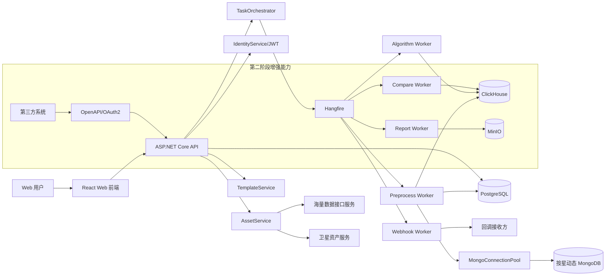

### 2.2 后端工程结构
```text
SatelliteData.Platform
├── src
│   ├── SatelliteData.Api
│   │   ├── Controllers
│   │   ├── Filters
│   │   ├── Middlewares
│   │   └── Program.cs
│   ├── SatelliteData.Application
│   │   ├── Assets
│   │   ├── Templates
│   │   ├── Tasks
│   │   ├── Preprocess
│   │   ├── Algorithms
│   │   ├── Compare
│   │   ├── Reports
│   │   ├── Identity
│   │   ├── TraceLogs
│   │   └── Integration
│   ├── SatelliteData.Domain
│   │   ├── Common
│   │   ├── Assets
│   │   ├── Templates
│   │   ├── Tasks
│   │   ├── Quality
│   │   ├── Algorithms
│   │   └── Compare
│   ├── SatelliteData.Infrastructure
│   │   ├── PostgreSql
│   │   ├── ClickHouse
│   │   ├── Mongo
│   │   ├── Minio
│   │   ├── Hangfire
│   │   ├── HttpClients
│   │   └── Security
│   └── SatelliteData.Workers
│       ├── PreprocessJobs
│       ├── AlgorithmJobs
│       ├── CompareJobs
│       ├── ReportJobs
│       └── WebhookJobs
└── tests
    ├── SatelliteData.UnitTests
    ├── SatelliteData.IntegrationTests
    └── SatelliteData.E2ETests
```

### 2.3 统一技术约定
| 类型 | 约定 |
|---|---|
| API 风格 | REST + JSON |
| 后端返回 | 统一 `ApiResponse<T>`，失败返回标准错误码 |
| 时间 | 后端统一 UTC 存储，前端按用户时区显示 |
| 主键 | 业务表使用 `uuid` 或雪花 ID，时序明细使用业务联合主键 |
| 配置 | 环境变量 + PostgreSQL 配置表，敏感值只存密钥引用 |
| 日志 | 结构化日志，包含 `trace_id`、`run_id`、`user_id` |
| 幂等 | 任务类 API 必须支持幂等键 |
| 大批量写入 | ClickHouse 必须批量写入，禁止单条循环 Insert |
| 阶段开关 | 第一阶段 Webhook 与第二阶段增强能力均通过配置开关或功能菜单控制，避免影响核心链路 |

---

## 3. 横切能力详细设计

### 3.1 统一响应模型
```csharp
public sealed class ApiResponse<T>
{
    public bool Success { get; init; }
    public string Code { get; init; } = "OK";
    public string Message { get; init; } = "";
    public T? Data { get; init; }
    public string TraceId { get; init; } = "";
}
```

### 3.2 错误码规范
| 错误码 | HTTP | 阶段 | 说明 |
|---|---:|---|---|
| `AUTH_001` | 401 | 一阶段 | 未登录或 Token 无效 |
| `AUTH_002` | 403 | 一阶段 | 无权限访问 |
| `TPL_001` | 400 | 一阶段 | 模板配置不合法 |
| `TPL_002` | 409 | 一阶段 | 已发布模板不可直接修改 |
| `TPL_003` | 400 | 二阶段 | 灰度回退版本不存在或不可用 |
| `TPL_004` | 422 | 一阶段 | 筛选模板 `config_json` 结构校验失败（含 `scope` 缺参考星等） |
| `TPL_005` | 422 | 一阶段 | 筛选模板跨星参数语义映射失败（目标星不在模板分组成员闭包，或无法将参考星 `param_id` 映射到目标星） |
| `ASSET_001` | 502 | 一阶段 | 海量数据接口不可用 |
| `ASSET_002` | 502 | 一阶段 | 卫星资产服务不可用 |
| `TASK_001` | 409 | 一阶段 | 幂等任务已存在 |
| `TASK_002` | 408 | 一阶段 | 任务超时 |
| `PRE_001` | 422 | 一阶段 | 筛选后无有效数据 |
| `ALG_001` | 400 | 一阶段 | 算法 DAG 校验失败 |
| `CMP_001` | 422 | 二阶段 | 基线缺失 |
| `RPT_001` | 500 | 二阶段 | 报告渲染失败 |
| `OPENAPI_001` | 401 | 二阶段 | 第三方 Token 无效 |
| `WEBHOOK_001` | 502 | 一阶段 | Webhook 投递失败 |
| `GROUP_001` | 404 | 一阶段 | 卫星分组不存在 |
| `GROUP_002` | 409 | 一阶段 | 分组删除失败（仍有成员、子组或模板归属） |
| `PKG_001` | 409 | 一阶段 | 算法包未发布，禁止在算法模板中引用 |
| `PKG_002` | 409 | 一阶段 | 算法包正在被引用，禁止删除 |
| `SANDBOX_001` | 422 | 一阶段 | 沙箱试运行失败（资源超限 / Schema 不匹配 / 超时） |

### 3.3 统一操作留痕
所有写操作通过 Action Filter 或应用层 Pipeline 统一写入操作留痕。表结构见第 4 章 `audit_log`。

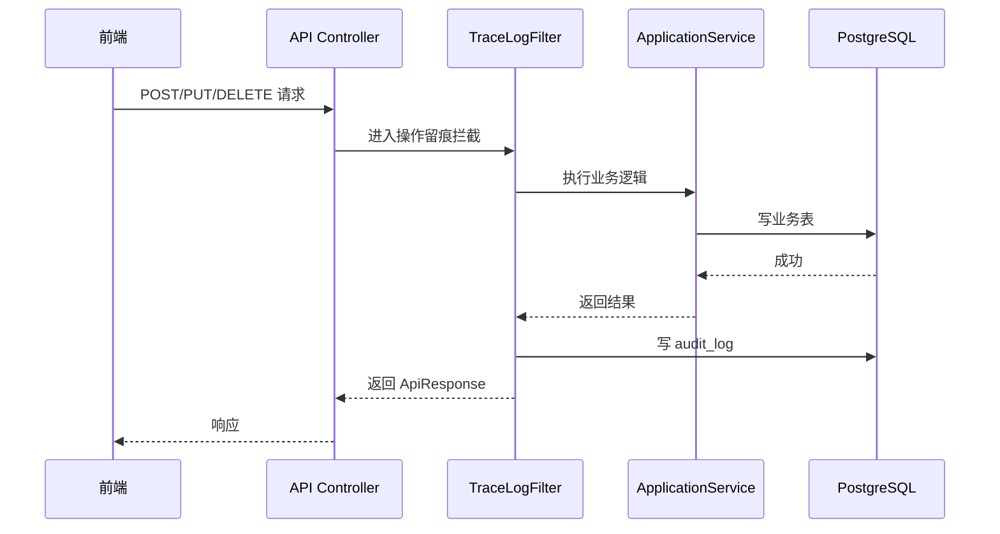

### 3.4 幂等键生成规则
任务幂等键由任务类型、模板版本、数据来源、测试时间段、时间窗共同决定。

```text
idempotency_key = SHA256(
  job_type + ":" +
  filter_template_id + ":" + filter_template_version + ":" +
  algorithm_template_id + ":" + algorithm_template_version + ":" +
  report_template_id + ":" + report_template_version + ":" +
  tasook_no + ":" + satellite_no + ":" +
  test_batch_id + ":" +
  window_start + ":" + window_end
)
```

### 3.5 阶段能力开关
阶段能力建议通过配置项控制。Webhook 虽然属于第一阶段，但默认可按环境关闭，避免开发与离线环境误投递。

| 配置项 | 默认 | 说明 |
|---|---:|---|
| `Features:WebhookDelivery` | `true` | 是否启用任务终态 Webhook 投递 |
| `Features:TemplateGrayRelease` | `false` | 是否启用模板灰度发布 |
| `Features:OpenApiOAuth2` | `false` | 是否启用第三方 OAuth2 开放接口 |
| `Features:CompareReportPipeline` | `false` | 是否启用比对与报告流水线 |
| `Features:AlgorithmSandbox` | `true` | 是否启用算法仓库与沙箱执行（一阶段默认开启；关闭时仅保留 BUILTIN 种子算法可用） |
| `Features:TaskCompensation` | `false` | 是否启用补偿任务自动执行 |

---

## 4. 数据库详细设计

> 本章集中放置所有 SQL DDL。其他章节涉及表结构时只引用本章表名与小节，不再重复 SQL。

### 4.1 PostgreSQL 表设计

#### 4.1.1 外部与内部数据源配置表 `data_source_config`
```sql
create table data_source_config (
    source_id uuid primary key,
    source_type varchar(32) not null,
    source_name varchar(128) not null,
    endpoint_url text not null,
    auth_type varchar(32) not null default 'NONE',
    auth_secret_ref varchar(256),
    timeout_ms int not null default 10000,
    enabled boolean not null default true,
    env varchar(32) not null default 'PROD',
    created_at timestamptz not null default now(),
    updated_at timestamptz not null default now(),
    constraint ck_source_type check (
        source_type in ('MASS_DATA_API', 'SATELLITE_ASSET_API', 'CLICKHOUSE', 'MINIO', 'PG_META')
    )
);
```

#### 4.1.2 卫星缓存表 `satellite_cache`
```sql
create table satellite_cache (
    tasook_no varchar(64) not null,
    satellite_no varchar(64) not null,
    satellite_name varchar(256) not null,
    satellite_type varchar(128),
    db_stage varchar(64),
    mongo_uri text,
    mongo_db_name varchar(256),
    mongo_auth_ref varchar(256),
    source_version varchar(128),
    last_synced_at timestamptz not null,
    cached_parameter_count int not null default 0,
    cached_command_count int not null default 0,
    raw_json jsonb not null,
    primary key (tasook_no, satellite_no)
);
```

- `cached_parameter_count`：最近一次成功从海量 `POST /api/v2/mass-data/basic/parameters` 拉取并写入本行对应 `param_cache` 的条数（与前端「参数同步总量」一致）。
- `cached_command_count`：最近一次成功从海量 `POST /api/v2/mass-data/basic/commands` 拉取并写入本行对应 `command_cache` 的条数（与前端「指令同步总量」一致）。
- `mongo_db_name`：从海量 `mongoQueryConn` 连接串路径段解析或接口显式 `dbName` 字段；须经 **URL 百分号解码** 后落库（避免中文库名以 `%E6%B5%8B...` 形式写入造成「乱码」），详见 6.1.3.4。

实现上资产缓存可落在进程内字典或 PostgreSQL（由配置 `AssetCache:UsePostgreSql` 与 `ConnectionStrings:Postgres` 控制）；表结构与本 DDL 对齐，首次启动或执行迁移脚本时可用 `ALTER TABLE ... ADD COLUMN IF NOT EXISTS` 为存量库补列。

#### 4.1.3 参数缓存表 `param_cache`
```sql
create table param_cache (
    tasook_no varchar(64) not null,
    satellite_no varchar(64) not null,
    param_id varchar(128) not null,
    param_name varchar(256) not null,
    unit varchar(64),
    value_type varchar(32),
    value_min double precision,
    value_max double precision,
    source_version varchar(128),
    last_synced_at timestamptz not null,
    raw_json jsonb not null,
    primary key (tasook_no, satellite_no, param_id)
);
```

#### 4.1.3a 指令缓存表 `command_cache`
> 与参数缓存对称，承载海量基础库「指令」元数据，供后续判读、模板与任务编排引用（一阶段以同步与展示为主）。

```sql
create table command_cache (
    tasook_no varchar(64) not null,
    satellite_no varchar(64) not null,
    command_id varchar(128) not null,
    command_name varchar(256) not null,
    source_version varchar(128),
    last_synced_at timestamptz not null,
    raw_json jsonb not null,
    primary key (tasook_no, satellite_no, command_id)
);
```

入站接口：`POST /api/v2/mass-data/basic/commands`，请求体同参数接口（`taskNo` / `satNo` / `dbStage` 三元组）。同步时按星先清空该星在 `command_cache` 中的旧行再写入本次响应全量（与参数 upsert 策略可分别演进，当前实现以「删后插」保证与接口快照一致）。

#### 4.1.4 测试阶段缓存表 `test_batch_cache`
> 表名 `test_batch_cache` 沿用以保证向后兼容；语义自 V2.0.1 起统一改述为「测试阶段」。`test_batch_id` 即阶段编号，`scenario` 即阶段名（如「单机测试」「整星综测」「在轨」），详见 6.1.3.3。

```sql
create table test_batch_cache (
    tasook_no varchar(64) not null,
    satellite_no varchar(64) not null,
    test_batch_id varchar(128) not null,
    scenario varchar(256),
    start_ts timestamptz not null,
    end_ts timestamptz not null,
    source_version varchar(128),
    last_synced_at timestamptz not null,
    raw_json jsonb not null,
    primary key (tasook_no, satellite_no, test_batch_id)
);
```

#### 4.1.5 筛选模板表 `filter_template`
```sql
create table filter_template (
    template_id uuid not null,
    version int not null,
    template_name varchar(256) not null,
    status varchar(32) not null,
    group_id uuid not null,
    gray_scope jsonb,
    config_json jsonb not null,
    description text,
    created_by uuid not null,
    created_at timestamptz not null default now(),
    updated_by uuid,
    updated_at timestamptz not null default now(),
    published_at timestamptz,
    primary key (template_id, version),
    constraint fk_filter_template_group foreign key (group_id) references satellite_group(group_id)
);

create index idx_filter_template_group on filter_template(group_id);
create index idx_filter_template_status on filter_template(status);
```

`group_id` 指向 4.1.5a 的卫星分组节点；模板对该分组及其所有后代分组下的卫星可用（详见 6.2.3.2）。`config_json.scope` 内还须冗余存放 `referenceTasookNo` / `referenceSatelliteNo`，以锁定参数元数据视图（详见 6.2.3.3 / 6.2.3.4）。

#### 4.1.5a 卫星分组与归属表 `satellite_group` / `satellite_group_member`
```sql
create table satellite_group (
    group_id uuid primary key,
    parent_group_id uuid references satellite_group(group_id),
    group_name varchar(256) not null,
    group_path varchar(1024) not null,
    sort_order int not null default 0,
    description text,
    created_by uuid,
    created_at timestamptz not null default now(),
    updated_by uuid,
    updated_at timestamptz not null default now(),
    constraint uk_satellite_group_path unique (group_path),
    constraint uk_satellite_group_sibling_name unique (parent_group_id, group_name)
);

create index idx_satellite_group_parent on satellite_group(parent_group_id);
create index idx_satellite_group_path_prefix on satellite_group(group_path varchar_pattern_ops);

create table satellite_group_member (
    tasook_no varchar(64) not null,
    satellite_no varchar(64) not null,
    group_id uuid not null references satellite_group(group_id),
    created_at timestamptz not null default now(),
    created_by uuid,
    primary key (tasook_no, satellite_no)
);

create index idx_satellite_group_member_group on satellite_group_member(group_id);
```

说明：
- `satellite_group` 是多级树，`group_path` 为物化路径（如 `/root/platform-A/A_remote/`），用于按前缀匹配快速查询某分组的祖先链/后代链；
- `satellite_group_member` PK 为 `(tasook_no, satellite_no)`，强约束**一颗卫星只归属一个分组**；
- 系统初始化时插入根分组（`group_path='/root/'`），未显式归组的卫星挂在根分组下；
- 删除分组时要求该分组无直接成员卫星、无子分组、无模板归属，否则 409。

#### 4.1.6 算法模板表 `algorithm_template`
```sql
create table algorithm_template (
    template_id uuid not null,
    version int not null,
    template_name varchar(256) not null,
    status varchar(32) not null,
    gray_scope jsonb,
    react_flow_json jsonb not null,
    config_json jsonb not null,
    node_count int not null default 0,
    description text,
    created_by uuid not null,
    created_at timestamptz not null default now(),
    updated_by uuid,
    updated_at timestamptz not null default now(),
    published_at timestamptz,
    primary key (template_id, version)
);
```

#### 4.1.7 报告模板表 `report_template`
```sql
create table report_template (
    template_id uuid not null,
    version int not null,
    template_name varchar(256) not null,
    status varchar(32) not null,
    gray_scope jsonb,
    object_id uuid,
    placeholder_schema jsonb,
    config_json jsonb not null,
    description text,
    created_by uuid not null,
    created_at timestamptz not null default now(),
    updated_by uuid,
    updated_at timestamptz not null default now(),
    published_at timestamptz,
    primary key (template_id, version)
);
```

#### 4.1.8 任务运行表 `task_run`
```sql
create table task_run (
    run_id uuid primary key,
    parent_run_id uuid,
    job_id varchar(128) unique,
    job_type varchar(32) not null,
    trigger_type varchar(32) not null,
    status varchar(32) not null,
    idempotency_key varchar(128) not null,
    tasook_no varchar(64) not null,
    satellite_no varchar(64) not null,
    test_batch_id varchar(128),
    -- 展示用阶段名（可为 test_batch_cache.test_batch_name 或「自定义时间段」「每日定时」）；非外键
    test_batch_name varchar(256),
    -- 预处理历史数据拉取与 conditionConfig/ruleTree 评估的数据时间范围（创建任务时确定，执行期只读）
    window_start timestamptz,
    window_end timestamptz,
    filter_template_id uuid,
    filter_template_version int,
    algorithm_template_id uuid,
    algorithm_template_version int,
    report_template_id uuid,
    report_template_version int,
    progress_percent numeric(5,2) not null default 0,
    current_step varchar(128),
    start_time timestamptz,
    end_time timestamptz,
    timeout_flag boolean not null default false,
    error_code varchar(64),
    error_msg text,
    created_by uuid,
    created_at timestamptz not null default now(),
    outlier_review_status varchar(32),
    outlier_auto_count int not null default 0,
    outlier_pending_count int not null default 0,
    outlier_confirmed_count int not null default 0,
    outlier_jitter_count int not null default 0,
    unique (idempotency_key)
);
```

#### 4.1.8a 离群点复核表 `preprocess_outlier_point_review`
```sql
create table preprocess_outlier_point_review (
    review_id uuid primary key,
    run_id uuid not null,
    tasook_no varchar(64) not null,
    satellite_no varchar(64) not null,
    param_id varchar(64) not null,
    ts timestamptz not null,
    auto_value float8,
    auto_outlier_method varchar(32),
    review_status varchar(32) not null default 'PENDING',
    reviewed_at timestamptz,
    reviewed_by varchar(128),
    remark varchar(512),
    created_at timestamptz not null default now(),
    unique (run_id, param_id, ts)
);
```

#### 4.1.8b 离群时间段表 `preprocess_outlier_segment`（增补 `segment_kind`）
```sql
-- segment_kind: AUTO=算法自动合并段；CONFIRMED=人工复核完成后按已确认点重算
alter table preprocess_outlier_segment add column if not exists segment_kind varchar(16) not null default 'AUTO';
```

#### 4.1.9 时间窗元数据表 `hq_param_metadata`
```sql
create table hq_param_metadata (
    metadata_id uuid primary key,
    run_id uuid not null,
    tasook_no varchar(64) not null,
    satellite_no varchar(64) not null,
    test_batch_id varchar(128) not null,
    param_id varchar(128) not null,
    window_start timestamptz not null,
    window_end timestamptz not null,
    filter_template_id uuid not null,
    filter_template_version int not null,
    outlier_method varchar(64),
    outlier_reason_pattern text,
    created_at timestamptz not null default now()
);
```

#### 4.1.10 文件索引表 `object_index`
```sql
create table object_index (
    object_id uuid primary key,
    bucket varchar(128) not null,
    object_key text not null,
    object_version varchar(128),
    checksum varchar(128),
    content_type varchar(128),
    file_size bigint,
    ref_run_id uuid,
    created_by uuid,
    created_at timestamptz not null default now()
);
```

#### 4.1.11 用户、角色、权限与登录表
```sql
create table sys_user (
    user_id uuid primary key,
    username varchar(128) not null unique,
    display_name varchar(128) not null,
    password_hash varchar(256) not null,
    password_salt varchar(128),
    email varchar(256),
    mobile varchar(64),
    status varchar(32) not null default 'ENABLED',
    last_login_at timestamptz,
    password_updated_at timestamptz,
    created_at timestamptz not null default now(),
    updated_at timestamptz not null default now(),
    constraint ck_sys_user_status check (status in ('ENABLED', 'DISABLED', 'LOCKED'))
);

create table sys_role (
    role_id uuid primary key,
    role_code varchar(64) not null unique,
    role_name varchar(128) not null,
    description text,
    built_in boolean not null default false,
    enabled boolean not null default true,
    created_at timestamptz not null default now(),
    updated_at timestamptz not null default now()
);

create table sys_permission (
    permission_id uuid primary key,
    permission_code varchar(128) not null unique,
    permission_name varchar(128) not null,
    module_code varchar(64) not null,
    action_code varchar(64) not null,
    description text,
    enabled boolean not null default true,
    created_at timestamptz not null default now()
);

create table sys_user_role (
    user_id uuid not null references sys_user(user_id),
    role_id uuid not null references sys_role(role_id),
    created_at timestamptz not null default now(),
    created_by uuid,
    primary key (user_id, role_id)
);

create table sys_role_permission (
    role_id uuid not null references sys_role(role_id),
    permission_id uuid not null references sys_permission(permission_id),
    created_at timestamptz not null default now(),
    created_by uuid,
    primary key (role_id, permission_id)
);

create table sys_user_scope (
    scope_id uuid primary key,
    user_id uuid not null references sys_user(user_id),
    tasook_no varchar(64) not null,
    satellite_no varchar(64) not null,
    test_batch_id varchar(128),
    scope_level varchar(32) not null default 'SATELLITE',
    enabled boolean not null default true,
    created_at timestamptz not null default now(),
    created_by uuid,
    constraint ck_user_scope_level check (scope_level in ('SATELLITE', 'TEST_BATCH'))
);

create index idx_sys_user_scope_user on sys_user_scope(user_id);
create index idx_sys_user_scope_sat on sys_user_scope(tasook_no, satellite_no);

create table sys_login_log (
    login_id uuid primary key,
    user_id uuid,
    username varchar(128) not null,
    login_result varchar(32) not null,
    failure_reason text,
    ip_address varchar(64),
    user_agent text,
    trace_id varchar(128),
    login_at timestamptz not null default now(),
    constraint ck_login_result check (login_result in ('SUCCESS', 'FAILED'))
);

create table sys_refresh_token (
    token_id uuid primary key,
    user_id uuid not null references sys_user(user_id),
    token_hash varchar(256) not null unique,
    issued_at timestamptz not null default now(),
    expires_at timestamptz not null,
    revoked_at timestamptz,
    revoke_reason text,
    client_ip varchar(64),
    user_agent text
);

create index idx_refresh_token_user on sys_refresh_token(user_id);
create index idx_refresh_token_expires on sys_refresh_token(expires_at);
```

#### 4.1.12 操作留痕表 `audit_log`
```sql
create table audit_log (
    log_id uuid primary key,
    trace_id varchar(128),
    operator_id uuid,
    operator_name varchar(128),
    action varchar(128) not null,
    target_type varchar(128),
    target_id varchar(128),
    before_json jsonb,
    after_json jsonb,
    ip_address varchar(64),
    user_agent text,
    action_time timestamptz not null default now()
);
```

#### 4.1.13 Webhook 与第三方开放集成相关表
```sql
create table api_clients (
    client_id uuid primary key,
    client_name varchar(256) not null,
    app_id varchar(128) not null unique,
    app_secret_hash varchar(256) not null,
    grant_types jsonb not null default '["client_credentials"]'::jsonb,
    token_ttl_seconds int not null default 7200,
    enabled boolean not null default true,
    ip_allowlist jsonb,
    created_at timestamptz not null default now(),
    updated_at timestamptz not null default now()
);

create table api_oauth_scope (
    scope_id uuid primary key,
    scope_code varchar(128) not null unique,
    scope_name varchar(128) not null,
    description text,
    enabled boolean not null default true,
    created_at timestamptz not null default now()
);

create table api_client_oauth_scope (
    client_id uuid not null references api_clients(client_id),
    scope_id uuid not null references api_oauth_scope(scope_id),
    created_at timestamptz not null default now(),
    created_by uuid,
    primary key (client_id, scope_id)
);

create table api_oauth_token_log (
    token_log_id uuid primary key,
    client_id uuid not null references api_clients(client_id),
    grant_type varchar(64) not null,
    requested_scope text,
    granted_scope text,
    token_hash varchar(256),
    issued_at timestamptz not null default now(),
    expires_at timestamptz not null,
    ip_address varchar(64),
    user_agent text,
    result varchar(32) not null,
    error_code varchar(64),
    error_description text,
    constraint ck_oauth_token_result check (result in ('SUCCESS', 'FAILED'))
);

create index idx_api_oauth_token_client on api_oauth_token_log(client_id);
create index idx_api_oauth_token_issued on api_oauth_token_log(issued_at);

create table api_client_scope (
    scope_id uuid primary key,
    client_id uuid not null references api_clients(client_id),
    tasook_no varchar(64) not null,
    satellite_no varchar(64) not null,
    test_batch_id varchar(128),
    scope_level varchar(32) not null default 'SATELLITE',
    enabled boolean not null default true,
    created_at timestamptz not null default now(),
    created_by uuid,
    constraint ck_client_scope_level check (scope_level in ('SATELLITE', 'TEST_BATCH'))
);

create index idx_api_client_scope_client on api_client_scope(client_id);
create index idx_api_client_scope_sat on api_client_scope(tasook_no, satellite_no);

create table client_callbacks (
    callback_id uuid primary key,
    client_id uuid references api_clients(client_id),
    callback_name varchar(256) not null,
    callback_url text not null,
    secret_ref varchar(256) not null,
    event_types jsonb not null default '["job.succeeded","job.failed","job.timeout"]'::jsonb,
    max_retry_count int not null default 5,
    enabled boolean not null default true,
    created_at timestamptz not null default now()
);

create table callback_deliveries (
    delivery_id uuid primary key,
    event_id varchar(128) not null unique,
    callback_id uuid not null references client_callbacks(callback_id),
    run_id uuid,
    event_type varchar(64) not null,
    payload_json jsonb not null,
    status varchar(32) not null,
    retry_count int not null default 0,
    next_retry_at timestamptz,
    response_status int,
    response_body text,
    created_at timestamptz not null default now(),
    updated_at timestamptz not null default now()
);
```

#### 4.1.14 基线管理表
```sql
create table baseline_meta (
    baseline_id uuid not null,
    version int not null,
    baseline_name varchar(256) not null,
    baseline_type varchar(64) not null,
    tasook_no varchar(64) not null,
    satellite_no varchar(64),
    test_batch_id varchar(128),
    effective_start timestamptz,
    effective_end timestamptz,
    status varchar(32) not null,
    description text,
    created_by uuid,
    created_at timestamptz not null default now(),
    published_at timestamptz,
    primary key (baseline_id, version)
);

create table baseline_metric (
    metric_id uuid primary key,
    baseline_id uuid not null,
    baseline_version int not null,
    param_id varchar(128),
    metric_name varchar(128) not null,
    metric_value double precision,
    metric_json jsonb,
    created_at timestamptz not null default now()
);
```

#### 4.1.15 任务事件与补偿表
```sql
create table task_event (
    event_id uuid primary key,
    run_id uuid not null,
    event_type varchar(64) not null,
    event_status varchar(32) not null,
    payload_json jsonb,
    error_code varchar(64),
    error_msg text,
    created_at timestamptz not null default now()
);

create table task_compensation (
    compensation_id uuid primary key,
    run_id uuid not null,
    compensation_type varchar(64) not null,
    status varchar(32) not null,
    retry_count int not null default 0,
    next_retry_at timestamptz,
    payload_json jsonb not null,
    last_error text,
    created_at timestamptz not null default now(),
    updated_at timestamptz not null default now()
);
```

#### 4.1.16 算法包表 `algorithm_package`
```sql
create table algorithm_package (
    package_id uuid primary key,
    algorithm_code varchar(128) not null,
    algorithm_name varchar(256) not null,
    algorithm_category varchar(32) not null,
    version varchar(64) not null,
    runtime varchar(32) not null,
    entrypoint varchar(256) not null,
    object_id uuid not null,
    manifest_json jsonb not null,
    inputs_schema_json jsonb not null,
    outputs_schema_json jsonb not null,
    params_schema_json jsonb,
    resources_json jsonb not null,
    status varchar(32) not null,
    last_error text,
    created_by uuid,
    created_at timestamptz not null default now(),
    updated_by uuid,
    updated_at timestamptz not null default now(),
    approved_by uuid,
    approved_at timestamptz,
    published_at timestamptz,
    constraint uk_algorithm_package_code_version unique (algorithm_code, version),
    constraint ck_algorithm_package_status check (status in ('Draft','SandboxValidating','Published','Rejected','Archived')),
    constraint ck_algorithm_package_runtime check (runtime in ('BUILTIN','PYTHON','JS')),
    constraint ck_algorithm_package_category check (algorithm_category in ('source','stats','spectrum','align','cluster','compare','output'))
);

create index idx_algorithm_package_code on algorithm_package(algorithm_code);
create index idx_algorithm_package_status on algorithm_package(status);
create index idx_algorithm_package_category on algorithm_package(algorithm_category);
```

#### 4.1.17 ML 数据集快照表 `ml_dataset_snapshot`
```sql
create table ml_dataset_snapshot (
    dataset_id uuid primary key,
    dataset_name varchar(256) not null,
    tasook_no varchar(64),
    satellite_no varchar(64),
    run_ids jsonb not null,
    channel_mapping jsonb not null,
    window_config jsonb not null,
    normalization_object_id uuid,
    mask_strategy varchar(64) not null default 'PADDING_MASK',
    object_id uuid,
    status varchar(32) not null,
    created_by uuid,
    created_at timestamptz not null default now()
);
```

### 4.2 ClickHouse 表设计

#### 4.2.1 高品质明细表 `hq_param_point`
```sql
create table hq_param_point
(
    tasook_no LowCardinality(String),
    satellite_no LowCardinality(String),
    test_batch_id LowCardinality(String),
    param_id LowCardinality(String),
    ts DateTime64(3, 'UTC'),
    raw_value Nullable(Float64),
    processed_value Nullable(Float64),
    is_outlier UInt8,
    is_confirmed_outlier UInt8 default 0,
    version UInt64,
    ingested_at DateTime64(3, 'UTC') default now64(3)
)
engine = ReplacingMergeTree(version)
partition by (toYYYYMM(ts), tasook_no, satellite_no)
order by (tasook_no, satellite_no, test_batch_id, param_id, ts);
```

#### 4.2.2 算法结果表 `algo_result`
```sql
create table algo_result
(
    run_id UUID,
    node_id String,
    algorithm_code LowCardinality(String),
    tasook_no LowCardinality(String),
    satellite_no LowCardinality(String),
    test_batch_id LowCardinality(String),
    window_start DateTime64(3, 'UTC'),
    window_end DateTime64(3, 'UTC'),
    metric_name LowCardinality(String),
    metric_value Float64,
    detail_json String,
    created_at DateTime64(3, 'UTC') default now64(3)
)
engine = MergeTree
partition by toYYYYMM(window_start)
order by (run_id, node_id, metric_name);
```

#### 4.2.3 聚类标签表 `algo_cluster_labels`
```sql
create table algo_cluster_labels
(
    run_id UUID,
    node_id String,
    tasook_no LowCardinality(String),
    satellite_no LowCardinality(String),
    test_batch_id LowCardinality(String),
    ts DateTime64(3, 'UTC'),
    sample_id String,
    cluster_id Int32,
    is_noise UInt8,
    distance_to_center Float64,
    created_at DateTime64(3, 'UTC') default now64(3)
)
engine = MergeTree
partition by (toYYYYMM(ts), tasook_no, satellite_no)
order by (run_id, node_id, cluster_id, ts);
```

#### 4.2.4 比对结果表 `compare_result`
```sql
create table compare_result
(
    compare_run_id UUID,
    source_run_id UUID,
    compare_type LowCardinality(String),
    baseline_ref String,
    tasook_no LowCardinality(String),
    satellite_no LowCardinality(String),
    test_batch_id LowCardinality(String),
    score Float64,
    decision LowCardinality(String),
    detail_json String,
    created_at DateTime64(3, 'UTC') default now64(3)
)
engine = MergeTree
partition by toYYYYMM(created_at)
order by (compare_run_id, compare_type, decision);
```

### 4.3 建议索引与约束说明
| 表 | 建议索引/约束 | 阶段 |
|---|---|---|
| `task_run` | `unique(idempotency_key)`、`(status, created_at)` | 一阶段 |
| `audit_log` | `(target_type, target_id, action_time)` | 一阶段 |
| `filter_template` | `(group_id)`、`(status)` | 一阶段 |
| `satellite_group` | 物化路径前缀查询、`(parent_group_id, group_name)` 唯一 | 一阶段 |
| `satellite_group_member` | `(group_id)` | 一阶段 |
| `client_callbacks` | `(enabled)`、`(client_id)` | 一阶段 |
| `callback_deliveries` | `unique(event_id)`、`(status, next_retry_at)` | 一阶段 |
| `object_index` | `(ref_run_id)`、`(bucket, object_key)` | 二阶段 |
| `baseline_meta` | `(tasook_no, satellite_no, test_batch_id, status)` | 二阶段 |
| `algorithm_package` | `unique(algorithm_code, version)`、`(status)`、`(algorithm_category)` | 一阶段 |

---

## 5. 前端详细设计

### 5.1 分阶段前端路由
| 阶段 | 路由 | 页面 | 权限 |
|---|---|---|---|
| 一阶段 | `/assets/sources` | 资产配置中心 | Admin |
| 一阶段 | `/assets/satellites` | 卫星资产缓存 | Admin / Analyst / Readonly |
| 一阶段 | `/templates/filter` | 筛选模板列表 | Admin / Analyst / Readonly |
| 一阶段 | `/templates/filter/:id` | 筛选模板维护 | Admin / Analyst |
| 一阶段 | `/templates/algorithm` | 算法模板列表 | Admin / Analyst / Readonly |
| 一阶段 | `/templates/algorithm/:id` | 算法模板维护 | Admin / Analyst |
| 一阶段 | `/tasks` | 任务列表与监控 | Admin / Analyst / Readonly |
| 一阶段 | `/tasks/:runId` | 任务详情 | Admin / Analyst / Readonly |
| 一阶段 | `/algorithms/repository` | 算法仓库（上传/沙箱审核/发布/归档） | Admin / Analyst（写） / Readonly（读） |
| 一阶段 | `/integrations/webhooks` | Webhook 配置与投递记录 | Admin |
| 一阶段 | `/trace-logs` | 操作留痕 | Admin |
| 二阶段 | `/templates/report` | 报告模板列表 | Admin / Analyst / Readonly |
| 二阶段 | `/templates/report/:id` | 报告模板维护 | Admin / Analyst |
| 二阶段 | `/templates/gray-preview` | 灰度命中预览 | Admin |
| 二阶段 | `/compare-results` | 一致性比对结果 | Admin / Analyst / Readonly |
| 二阶段 | `/reports` | 报告中心 | Admin / Analyst / Readonly |
| 二阶段 | `/integrations/clients` | 开放 API 客户端 | Admin |

### 5.2 一阶段页面范围
一阶段页面重点保障核心链路：
- 资产配置中心：维护海量数据接口、卫星资产服务及内部存储配置；
- 资产缓存查询：展示卫星、参数、测试时间段和 Mongo 摘要；
- 筛选模板维护：规则条件树、持续时长、边界缓冲、离群配置；
- 算法模板维护：React Flow 画布、内置算法节点、DAG 合法性校验；
- 任务中心：创建预处理/算法/流水线任务、查看状态、进度、错误；**数据明细** Drawer（全部数据矩阵四色、离群复核、离群时间段）；
- 卫星分组管理：维护多级分组树、卫星归属、模板归属预览；
- 算法仓库：上传/沙箱审核/发布/归档算法包，列表、详情、源码查看；
- Webhook 管理：配置任务终态回调地址、查看投递记录、手工重试；
- 操作留痕：查询核心写操作记录。

### 5.3 二阶段页面范围
二阶段页面补齐治理与对外交付：
- 灰度发布：维护 `gray_scope`，预览模板命中结果；
- 报告模板：上传 `.docx`、扫描占位符、预览报告；
- 比对结果：展示比对结论、得分、异常详情；
- 报告中心：查询、下载、预览报告；
- 开放 API 客户端：管理 OAuth2 客户端、scope、数据范围，并与一阶段 Webhook 回调配置关联。

---

## 6. 第一阶段核心功能模块设计

### 6.1 资产配置中心

资产配置中心是第一阶段的根基模块，负责将外部权威系统（海量数据接口服务、卫星资产服务）下发的卫星、参数、测试阶段、Mongo 连接配置同步到本地缓存，为预处理、算法、任务编排提供稳定的元数据入口。本节按「子模块 → 同步流程 → 接口字段映射 → 同步策略」四个层次细化。

#### 6.1.1 子模块拆分
| 子模块 | 类/接口 | 对接接口 / 数据 | 职责 |
|---|---|---|---|
| 配置管理 | `DataSourceConfigService` | `data_source_config` | 维护外部服务（海量数据接口、卫星资产）与内部存储（ClickHouse、MinIO、PG_META）配置；显式禁止录入 `MONGO` 类型 |
| 海量接口适配 | `MassDataApiClient` | `GET /api/v2/mass-data/satellites`、`POST /api/v2/mass-data/basic/parameters`、`POST /api/v2/mass-data/basic/commands`、`POST /api/v2/mass-data/satellite/config` | 封装 Web API 调用、超时与重试、错误码映射 |
| 卫星资产适配 | `SatelliteAssetApiClient` | 卫星资产服务「测试阶段」接口 | 获取每颗星的测试阶段清单（编号、阶段名、起止时间） |
| 资产同步编排 | `AssetSyncService` | 上述两个 Client + 资产缓存实现（内存或 PostgreSQL，见 `AssetCache:UsePostgreSql`） | 按「全量卫星 → 每星参数 → 每星指令 → 每星测试阶段 → 每星 Mongo 配置」编排同步；单星子步骤失败隔离；回写 `satellite_cache.cached_parameter_count` / `cached_command_count` |
| Mongo 连接池 | `MongoConnectionPool` | `satellite_cache.mongo_uri` / `mongo_db_name` / `mongo_auth_ref` | 以 `(tasook_no, satellite_no)` 为 key 缓存 `IMongoClient` / `IMongoDatabase`；当 `source_version` 或 `mongo_uri` 变化时主动失效 |

数据表引用：`data_source_config`、`satellite_cache`、`param_cache`、`command_cache`、`test_batch_cache` 见第 4 章。`test_batch_cache` 在本阶段承载「测试阶段」语义，`test_batch_id` 即为阶段编号。

#### 6.1.2 资产同步流程

同步流程严格按以下顺序执行：先通过海量接口拿全量卫星列表确定 `(taskNo, satNo, dbStage)` 三元组；再以三元组为入参分别拉取每颗星的**参数元数据**、**指令元数据**、**测试阶段**；最后补取 Mongo 连接配置完成 `satellite_cache` 字段闭环，并维护 `cached_parameter_count` / `cached_command_count` 计数列。

> 与早期文档字面的「三步骤」相比，实现上已将「指令」独立为 Step 2b，并在 `satellite_cache` 上持久化两类元数据的同步条数，便于资产中心列表展示与对账。资产缓存物理库可为内存字典或 PostgreSQL（与 `ConnectionStrings:Postgres` 同库或独立库由部署决定），由应用配置切换。

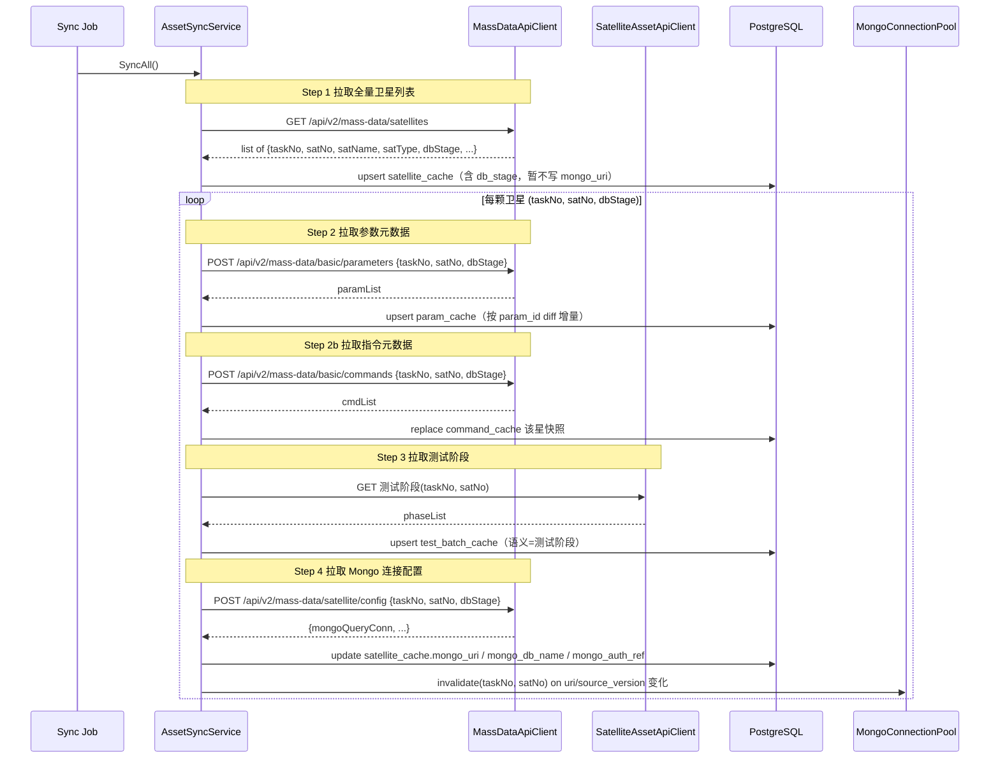

任一星在 Step 2/3/4 中失败均不影响其他星；全量列表（Step 1）失败则整体终止并返回 `ASSET_001`，详见 6.1.4。

#### 6.1.3 接口契约与字段映射

##### 6.1.3.1 卫星列表 → `satellite_cache`
入站接口：`GET /api/v2/mass-data/satellites`，无入参。

| 海量接口字段 | 落库字段 | 说明 |
|---|---|---|
| `taskNo` | `tasook_no` | 主键之一；三元组组成 |
| `satNo` | `satellite_no` | 主键之一；三元组组成 |
| `dbStage` | `db_stage` | 三元组之一，作为 Step 2/4 入参（新增列，详见 4.1.2 决策） |
| `satName` | `satellite_name` | 显示名 |
| `satType` | `satellite_type` | 卫星型号/类型 |
| `dbStage`（或专门版本字段） | `source_version` | 用于变更检测，触发缓存与连接池失效 |
| 整条响应 | `raw_json` | 留存原始报文以便溯源 |

##### 6.1.3.2 参数元数据 → `param_cache`
入站接口：`POST /api/v2/mass-data/basic/parameters`，请求体使用 `SatelliteLookupRequest`：

```json
{ "taskNo": "T001", "satNo": "S001", "dbStage": "DEV" }
```

| 海量接口字段 | 落库字段 | 说明 |
|---|---|---|
| `pid` 或 `paramCode` | `param_id` | 与 `(tasook_no, satellite_no)` 共同构成 PK |
| `paramName` | `param_name` |  |
| `unit` | `unit` |  |
| `valueType` | `value_type` | 例如 `DOUBLE` / `ENUM` / `BOOL` |
| `valueMin` / `valueMax` | `value_min` / `value_max` | 仅数值型有效 |
| 接口版本号 | `source_version` | 与卫星侧版本号联动 |
| 整条 | `raw_json` |  |

upsert 规则：按 `(tasook_no, satellite_no, param_id)` 主键合并；本次响应中缺失的 `param_id` 仅刷新 `last_synced_at` 不删除（未来可扩 `deleted_at` 列实现软删）。

##### 6.1.3.2a 指令元数据 → `command_cache`
入站接口：`POST /api/v2/mass-data/basic/commands`，请求体同 6.1.3.2（`SatelliteLookupRequest` 三元组）。

| 海量接口字段（示例） | 落库字段 | 说明 |
|---|---|---|
| `commandId` / `cmdId` / `id` / `code` 等 | `command_id` | 与 `(tasook_no, satellite_no)` 共同构成 PK |
| `commandName` / `name` / `cmdName` 等 | `command_name` |  |
| 接口版本号 | `source_version` |  |
| 整条 | `raw_json` |  |

同步策略：按星写入前删除该星既有 `command_cache` 行，再插入本次接口返回全量，保证与海量侧快照一致；成功后更新 `satellite_cache.cached_command_count`。

##### 6.1.3.3 测试阶段 → `test_batch_cache`
入站接口：卫星资产服务「测试阶段」端点（参见 9.2）。

| 资产接口字段 | 落库字段 | 说明 |
|---|---|---|
| `phaseId` | `test_batch_id` | 阶段编号（PK 之一） |
| `phaseName` | `scenario` | 阶段名（如「单机测试」「分系统」「整星综测」「环境试验」「出厂」「在轨」） |
| `startTs` / `endTs` | `start_ts` / `end_ts` | 阶段起止 UTC |
| `version` | `source_version` |  |
| 整条 | `raw_json` |  |

> 备注：原 V2.0 文档将 `test_batch_cache` 表述为「测试时间段」；本阶段统一改述为「测试阶段」。表名与字段保持不变，仅业务语义对齐。

##### 6.1.3.4 Mongo 连接配置 → `satellite_cache`（更新）
入站接口：`POST /api/v2/mass-data/satellite/config`，请求体为 `SatelliteLookupRequest`。

| 海量接口字段 | 落库字段 | 说明 |
|---|---|---|
| `mongoQueryConn` | `mongo_uri` | 写入时去除嵌入的密码；密码以引用形式入 `mongo_auth_ref` |
| `dbName`（解析自 URI 或额外字段） | `mongo_db_name` | 见下方解析规则 |
| 密钥引用键 | `mongo_auth_ref` | 指向密钥管理服务，不存明文 |

**`mongo_db_name` 解析与编码（实现：`MongoUriSanitizer` + `MassDataApiClient.GetMongoInfoAsync`）**：

1. 优先使用响应体显式字段：`dbName` / `mongoDbName` / `database` / `mongoDatabase`（UTF-8 JSON 字符串）。
2. 否则从 `mongoQueryConn`（剥离凭据后）的路径段解析库名；**禁止**直接落库 `Uri.AbsolutePath` 的原始百分号编码串。
3. 对路径段执行 `Uri.UnescapeDataString`，将 `%E6%B5%8B...` 还原为可读中文库名；必要时对 Latin-1 误读 UTF-8 的存量乱码做修复（`NormalizeDbName`）。
4. HTTP 响应按 **UTF-8** 读取 JSON（与海量接口文档 2.4 一致）。
5. 已写入乱码的历史行需 **重新执行资产同步 Step 4**（单星或全量）后覆盖。

`basicConn` / `judgeConn` / `signalRUrl` 等本阶段不入缓存，由预处理或后续模块按需直连。

#### 6.1.4 同步策略与故障隔离

##### 触发方式
| 触发 | 端点 / 调度 | 说明 |
|---|---|---|
| 定时全量 | Hangfire RecurringJob，默认 5 分钟 | 调用 `AssetSyncService.SyncAll()` |
| 手动全量 | `POST /asset/sync` | 返回 `runId`，异步执行 |
| 单星刷新 | `POST /asset/satellites/{tasookNo}/{satelliteNo}/sync` | 仅对目标星执行 Step 2/3/4 |

##### 幂等与增量
- `satellite_cache` / `param_cache` / `test_batch_cache` 全部 upsert，不删除历史记录；
- `param_cache` 按 `param_id` diff，仅写入新增/变更项，本次缺失项刷新 `last_synced_at`；
- 每次同步对每颗星生成一份「同步摘要」（拉取条数、变更条数、耗时）写入 `audit_log`。

##### 失败隔离
- Step 1（全量列表）失败 → 整体退出，返回 `ASSET_001`；本次同步不更新任何缓存；
- Step 2/3/4 单星失败 → 仅记录该星的失败原因，继续处理后续星；
- 单次同步失败星数比例 ≥ 50% 才将整体同步标记为 `Failed` 并触发告警，否则标记 `PartialSucceeded`；
- 同一颗星在 Step 4 失败时，Step 2/3 的结果保留，下次同步重试 Step 4。

##### 降级
- 外部接口超时（默认 10s）、5xx → 客户端层重试 3 次（指数退避：1s/3s/9s）；
- 401/403 → 不重试，立即返回 `ASSET_001` / `ASSET_002`，由管理员处理凭据；
- 在线查询接口（如任务运行时取连接信息）若同步失败但缓存 `last_synced_at` 在 TTL（默认 30 分钟）内 → 降级使用缓存；超 TTL 才返回 `ASSET_001` / `ASSET_002`。

##### 连接池失效
当 Step 4 检测到以下任一情况，立即调用 `MongoConnectionPool.Invalidate(taskNo, satNo)` 并丢弃旧 `IMongoClient`：
- 新返回的 `mongoQueryConn` 与已缓存值不一致；
- 卫星记录的 `source_version` 发生变化；
- `mongo_auth_ref` 指向的密钥版本变化。

##### 安全要求
- `data_source_config` 不允许配置 `MONGO` 类型；Mongo 地址只能由海量接口下发；
- Mongo URI 落库前必须剥离密码，密码仅保存为 `auth_ref` 引用；
- `raw_json` 落库前对潜在密钥字段做脱敏；
- 同步操作（含失败星列表）走统一 `audit_log`，便于审计与排查。

### 6.2 模板治理基础能力
第一阶段实现 **筛选模板** 与 **算法模板** 两类模板的完整生命周期。报告模板因依赖 Word 渲染、占位符扫描与 MinIO 归档，整体迁移至第二阶段（见 7.3）；本阶段不再保留报告模板的元数据占位入口与列表页面。第一阶段不实现灰度发布，灰度发布与模板路由见 7.1。

#### 6.2.1 第一阶段两类模板范围
| 模板类型 | 第一阶段职责 | 主要载体 | 表结构 |
|---|---|---|---|
| 筛选模板 | 卫星分组归属、有效时间段提取规则、目标参数与离群质量规则 | `config_json` + 关联分组 | `filter_template`（详见 6.2.3） |
| 算法模板 | React Flow DAG、内置算法节点参数 | `react_flow_json` + `config_json` | `algorithm_template`（详见 6.2.4） |

两类模板表之间不建立外键关系，任务创建时按需组合并生成不可变快照。

#### 6.2.2 模板生命周期状态机（共用）
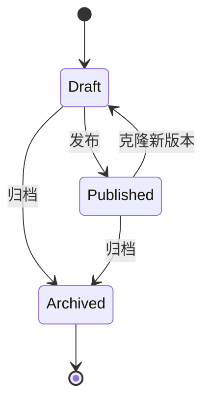

通用规则：
- 同一 `template_id` 下多版本共存，`(template_id, version)` 为主键；
- 进入 `Published` 后该版本不可修改，只能克隆新版本进入 `Draft`；
- 任务执行时按发布时间最新的 `Published` 版本生成快照；
- 状态变更全部走 `audit_log`。

#### 6.2.3 筛选模板设计

筛选模板用于在预处理阶段约束**数据范围**、**有效时间段**与**目标参数质量**。设计上分为三层：模板列表与生命周期、卫星分组归属（决定模板对哪些卫星可见与可用）、单模板配置编辑。

##### 6.2.3.1 列表与生命周期管理
管理端 `/templates/filter` 页面提供：

| 能力 | 说明 |
|---|---|
| 查看 | 分页列出所有模板的最新版本，含名称、归属分组、状态、版本号、创建人/时间、最近更新人/时间；支持按名称、归属分组、状态筛选 |
| 编辑 | `Draft` 状态可直接修改并保存当前版本；`Published` 状态点击「编辑」自动克隆为新版本 `Draft` |
| 删除 | 仅 `Draft` 且**未被任何任务引用**的版本可删除；已发布版本只能改为 `Archived`，记录 `audit_log` |
| 发布 | `Draft` → `Published`，写 `published_at`、`updated_by` |
| 归档 | `Draft` / `Published` → `Archived`，归档版本不出现在任务创建可选列表 |
| 版本切换 | 模板详情页可切换查看任意历史版本（只读） |
| 复制 | 任意状态版本均可一键复制为新模板（新 `template_id` + version=1 + Draft） |

操作均按 3.3 操作留痕规范写入 `audit_log`，`target_type='filter_template'`，`target_id='{template_id}:{version}'`。

##### 6.2.3.2 卫星分组与模板归属

卫星分组是**多级树**，用于在不依赖灰度的前提下控制筛选模板的适用范围：

- 每个分组可包含若干卫星，也可包含子分组；
- 每颗卫星归属于**唯一**一个分组（叶子或中间节点均可）；
- 每个筛选模板归属于**唯一**一个分组；
- **可见性继承**：模板对该分组及其**所有后代分组**下的卫星可用；换言之，子分组的卫星可以使用父分组（含祖先链）下任何模板，反之不允许。

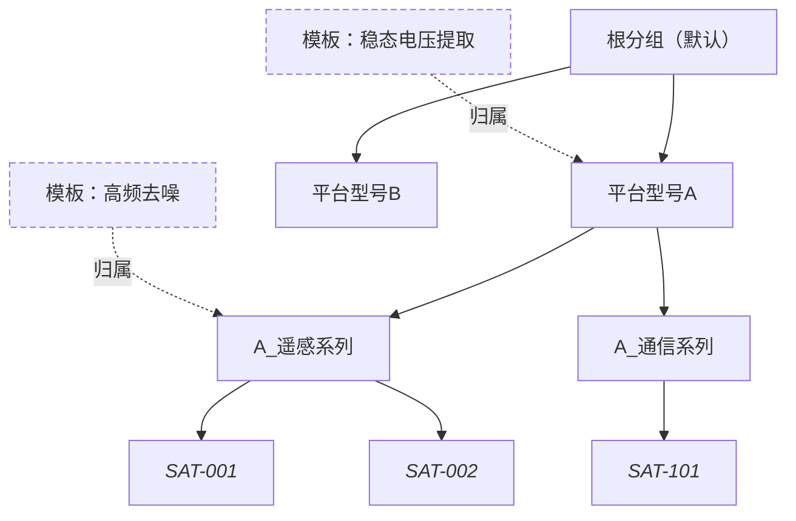

> 例：上图中 `Tpl1` 归属于「平台型号A」，则 `SAT-001`、`SAT-002`、`SAT-101` 均可使用；`Tpl2` 归属于「A_遥感系列」，仅 `SAT-001`、`SAT-002` 可用。

分组与卫星的对应关系由管理员在「资产 → 卫星分组」页面维护，不影响 `satellite_cache` 自身的同步流程。表结构详见 4.1.x（新增 `satellite_group`、`satellite_group_member`）。

模板可用性查询逻辑（伪 SQL）：

```sql
-- 给定卫星 (taskNo, satNo)，列出所有可用的已发布筛选模板
with sat_group as (
    select group_id from satellite_group_member
    where tasook_no = :taskNo and satellite_no = :satNo
),
ancestor as (
    -- 递归向上展开祖先链
    select g.group_id, g.parent_group_id from satellite_group g
    join sat_group s on s.group_id = g.group_id
    union all
    select p.group_id, p.parent_group_id from satellite_group p
    join ancestor a on a.parent_group_id = p.group_id
)
select t.* from filter_template t
join ancestor a on a.group_id = t.group_id
where t.status = 'Published';
```

实现上为减少递归代价，`satellite_group` 维护物化路径列 `group_path`（如 `/root/A/A_remote/`），命中查询用 `t.group_path is prefix of sat_group.group_path` 即可。

##### 6.2.3.3 单模板编辑界面

单模板编辑页（参考 [演示原型_V2.html](演示原型_V2.html) 中 `#filter` 视图）由四块组成：

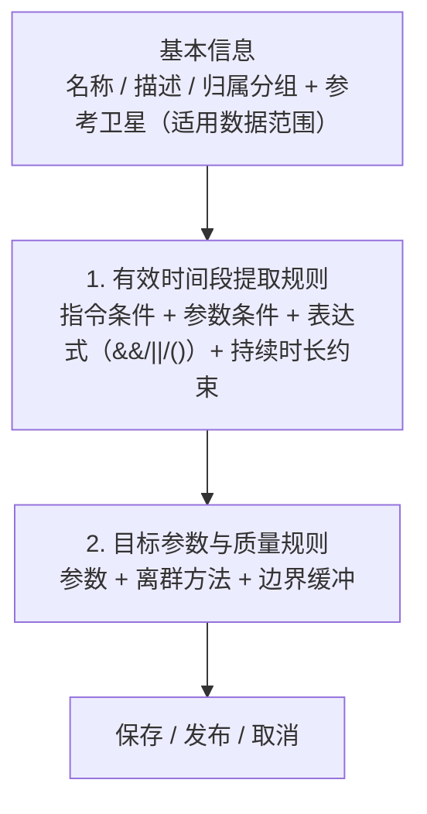

**基本信息块**：

| 字段 | 控件 | 说明 |
|---|---|---|
| 模板名称 | 文本框 | 必填，同分组下唯一 |
| 描述 | 多行文本 | 可选 |
| 归属卫星分组 | **分组树** `<TreeSelect>` | 必选；决定模板归属与「哪些星可选用该模板」（祖先链命中规则不变，见 6.2.3.2） |
| 参考卫星（适用数据范围） | **下拉单选**（选项 = 当前分组及其子分组下的成员星） | 必选；决定 `conditionConfig.parameters` 与 `targetParams` 中 `param_id` 所绑定的 `param_cache` 来源星（`tasook_no`+`satellite_no`）。切换分组时若原参考星不在新分组成员内则清空重选 |

**分组与参考星的职责划分**：

- **分组**：把在某一参考星上编制好的筛选模板「抬升」为组级资产，使同组（含子分组）内其它星在业务上可复用同一套规则意图；模板行仍通过 `filter_template.group_id` 与 `config_json.scope.groupId` 冗余存储分组。
- **参考星**：保证编辑期所有参数条件与目标参数均与**一颗具体卫星**的 `param_cache` 一致，避免「只有分组、无星」导致的参数主键悬空；保存/发布时后端须校验参考星属于该模板归属分组的成员闭包（含子分组）。

**有效时间段提取规则块**（对齐 RuleTp 形态）：

- 指令条件：分「起始指令」与「结束指令」两组；每组可配置多条 `conditionId + commandId + channelId`，组内关系 `AND/OR` 可切换；
- 参数条件：多行配置 `conditionId + 参数（来自参考星 param_cache） + 比较符 + 阈值`；
- 参数比较符固定：`>` / `>=` / `<` / `<=` / `=` / `!=` / `between`；
- 表达式：通过 `&&` / `||` / `(` / `)` 组合**参数条件 ID**（如 `(P1 && P2) || P3`），运行时按表达式优先级求值；
- 持续时长约束：表达式求值后的时间段须连续满足 ≥ `durationSeconds` 秒才保留（见 6.4.2.3）；
- 时间窗模式：默认按测试阶段（`mode=TEST_BATCH`），可配前后边界缓冲秒数（`bufferBeforeSeconds` / `bufferAfterSeconds`）；缓冲作用在**任务 `window_start/end`** 上，而非按任务时间去匹配 `test_batch_cache`；
- **无条件项**：`conditionConfig.parameters` 与指令条件均为空时，目标参数有效窗 = 任务数据时间窗（`task_run.window_start` ~ `window_end`）。

**运行时求值算法（实现：`ConditionRangeEvaluator` + 兼容 `RuleTreeSegmentEvaluator`）** 见 6.4.2.3：先分别计算参数条件段与指令条件段，再按表达式/组内关系做区间交并，最终与持续时长约束叠加。对存量模板保留 `ruleTree` 兼容读取。

**目标参数与质量规则块**：表格形式，每行一个参数：

| 列 | 说明 |
|---|---|
| 提取目标参数 | 从**参考星**的 `param_cache` 选择，显示 `param_id` + `param_name` + 单位 |
| 离群判定方法 | 下拉：`THRESHOLD`（阈值）/ `SIGMA`（3σ）/ `IQR` / `MAD` / `HAMPEL`，方法不同弹出对应参数面板（min/max、sigma 倍数、窗口大小等） |
| 边界缓冲 | 前 N 秒 / 后 N 秒，扩展有效段后再做参数提取 |
| 操作 | 编辑规则、删除 |

约束：
- 至少 1 个目标参数才允许保存；
- 同一 `param_id` 在表格中不可重复；
- 离群被打标的数据不剔除、不插值，仅写 `is_outlier=1`，与 6.4.4 一致。

##### 6.2.3.4 配置 JSON 结构（落 `filter_template.config_json`）

```json
{
  "scope": {
    "groupId": "f1d2c3b4-...-...-...",
    "groupPath": "/root/platform-A/A_remote/",
    "referenceTasookNo": "TASK-A100",
    "referenceSatelliteNo": "SAT-001"
  },
  "timeWindow": {
    "mode": "TEST_BATCH",
    "bufferBeforeSeconds": 5,
    "bufferAfterSeconds": 5
  },
  "conditionConfig": {
    "instructions": {
      "startRelation": "OR",
      "endRelation": "OR",
      "startCommands": [
        { "conditionId": "S1", "commandId": "1001", "channelId": 0 }
      ],
      "endCommands": [
        { "conditionId": "E1", "commandId": "1002", "channelId": 0 }
      ]
    },
    "parameters": [
      { "conditionId": "P1", "paramId": "A100_CURR_23", "operator": ">", "value": 5.0 },
      { "conditionId": "P2", "paramId": "A100_TEMP_PACK1", "operator": "<", "value": 80 }
    ],
    "expression": "P1 && P2"
  },
  "durationSeconds": 10,
  "targetParams": [
    {
      "paramId": "A100_VOLT_01",
      "paramName": "关键节点稳态电压",
      "outlier": { "method": "SIGMA", "sigma": 3 },
      "boundaryBufferBeforeSec": 5,
      "boundaryBufferAfterSec": 5
    },
    {
      "paramId": "A100_VOLT_02",
      "paramName": "备份节点稳态电压",
      "outlier": { "method": "THRESHOLD", "min": 20.0, "max": 30.0 },
      "boundaryBufferBeforeSec": 0,
      "boundaryBufferAfterSec": 0
    }
  ]
}
```

> 与 V2.0 旧版差异：新增顶层 `scope.groupId`（与 `filter_template.group_id` 列冗余存放，便于任务快照后单独消费）；移除原顶层 `targetParams`（字符串数组）字段，改为对象数组以承载离群方法与边界缓冲。

**`scope.referenceTasookNo` / `scope.referenceSatelliteNo`（必选）**：

- 与海量/资产侧 `tasook_no`、`satellite_no` 一致，用于唯一确定「参数元数据视图」来源星。
- 静态校验（`FilterTemplateValidator`）要求二者非空；保存/发布前服务层须再次校验该星出现在 `satellite_group_member` 中、且其归属分组落在模板 `group_id` 的子树内（与 `SatelliteGroupService.IsSatelliteInGroupSubtreeAsync` 语义一致）。

##### 6.2.3.4.1 跨星消费时的参数语义映射

当**成员星 B** 选用已在**参考星 A** 上编制好的组级筛选模板时，`conditionConfig.parameters` 与 `targetParams` 中落库的 `param_id` 仍为 A 侧主键。若 B 与 A 为「同组内、参数含义一致但编码不同」的典型情况，任务编排或运行时在落库任务快照**之前**应调用解析接口，将配置中的 `param_id` 重写为 B 在 `param_cache` 中的主键，避免同名/同描述不同码导致的错配。

| 步骤 | 说明 |
|---|---|
| 1 | 读取模板 `config_json` 中的 `scope.referenceTasookNo` / `referenceSatelliteNo` 作为参考星 A |
| 2 | 若目标星即为 A，直接消费原 `config_json`，无需映射 |
| 3 | 否则拉取 A、B 两侧 `param_cache`；对配置中出现的每个 `param_id`：若 B 上已存在同 ID 则沿用；否则按 **参数名称**（去首尾空白、忽略大小写）唯一匹配；再否则按 `raw_json` 中常见描述类字段（如 `description` / `desc` / `paramDesc` / `remark` / `memo`）做忽略大小写匹配 |
| 4 | 多条同名或同描述命中时，取确定性第一条并产出 **警告** 文案，提示人工核对 |
| 5 | 无法映射时拒绝解析（HTTP 422，`TPL_005`），避免静默写错参数 |

**接口**：`GET /api/v1/templates/filters/{templateId}/versions/{version}/resolved-config?taskNo={目标}&satNo={目标}`，响应体包含映射后的 `configJson` 与 `resolutionWarnings` 数组。目标星须落在模板 `group_id` 子树的成员范围内，否则同样返回 422。

映射算法实现位置：`FilterTemplateConfigMapper` + `FilterTemplateService.ResolveForSatelliteAsync`；映射后可为 `targetParams[].paramName` 回填 B 侧显示名。

##### 6.2.3.5 接口
| 方法 | 路径 | 说明 |
|---|---|---|
| GET | `/api/v1/asset/groups` | 查询卫星分组树（树状返回） |
| POST | `/api/v1/asset/groups` | 新增分组 |
| PUT | `/api/v1/asset/groups/{groupId}` | 改名/移动 |
| DELETE | `/api/v1/asset/groups/{groupId}` | 删除（叶子且无成员、无模板归属时） |
| POST | `/api/v1/asset/groups/{groupId}/members` | 批量加入/移出卫星 |
| GET | `/api/v1/templates/filters` | 列表（支持按 `groupId` 过滤） |
| GET | `/api/v1/templates/filters/{templateId}/versions` | 列出版本 |
| GET | `/api/v1/templates/filters/{templateId}/versions/{version}` | 查看 |
| GET | `/api/v1/templates/filters/{templateId}/versions/{version}/resolved-config?taskNo=&satNo=` | 将模板内参数 ID 从参考星语义映射到指定目标星，返回新 `configJson` + `resolutionWarnings`（见 6.2.3.4.1） |
| POST | `/api/v1/templates/filters` | 新建（默认 `Draft`） |
| PUT | `/api/v1/templates/filters/{templateId}/versions/{version}` | 编辑（仅 `Draft`） |
| POST | `/api/v1/templates/filters/{templateId}/versions/{version}/publish` | 发布 |
| POST | `/api/v1/templates/filters/{templateId}/clone` | 基于任意版本克隆为新版本 |
| DELETE | `/api/v1/templates/filters/{templateId}/versions/{version}` | 删除（仅 `Draft` 且未被引用） |
| POST | `/api/v1/templates/filters/{templateId}/versions/{version}/archive` | 归档 |
| GET | `/api/v1/templates/filters/applicable?taskNo=&satNo=` | 给定卫星可用的发布态模板列表 |

接口归并到 8.2 一阶段接口清单（下次合并时再统一刷新表格）。

##### 6.2.3.6 表结构变更点（指向第 4 章）
- `filter_template` 增列 `group_id uuid not null`（详见 4.1.5 修订）；
- 新增 `satellite_group`、`satellite_group_member`（详见 4.1.x 新增）。

#### 6.2.4 算法模板设计

算法模板用于定义在预处理之后对高品质明细执行的算法 DAG。设计上分为：模板列表与生命周期、三栏编辑器（组件库 / 画布 / 节点属性，参照原型）、内置组件分类、数据输入节点的执行期约束、编辑期 DAG 静态校验、配置载体、测试运行与接口。算法引擎运行时（DAG 调度、内置算法实现）见 6.5。

##### 6.2.4.1 列表与生命周期管理

`/templates/algorithm` 页面提供与筛选模板对称的能力（共用 6.2.2 状态机）：

| 能力 | 说明 |
|---|---|
| 查看 | 列表列：名称、状态、版本号、节点数（`algorithm_template.node_count`）、创建/更新人、更新时间；按名称、状态过滤；详情页可切换查看任意历史版本（只读画布） |
| 编辑 | `Draft` 直接编辑当前版本；`Published` 点击「编辑」自动克隆为新版本 `Draft` |
| 删除 | 仅 `Draft` 且未被任何任务（`task_run.algorithm_template_id/version`）引用时允许；已发布版本只能改为 `Archived` |
| 发布 | `Draft → Published`，发布前后端再做一次 DAG 静态校验（详见 6.2.4.5） |
| 归档 | `Draft / Published → Archived`，归档版本不出现在任务创建可选列表 |
| 复制 | 任意状态版本均可一键复制为新模板（新 `template_id` + version=1 + Draft） |

可见性：算法模板**不绑定卫星分组**，全局可见可用。任务创建时与筛选模板组合后，由筛选模板的 `group_id` 决定本任务是否可在某颗卫星上执行；算法模板自身不做范围限制。

操作均按 3.3 写入 `audit_log`，`target_type='algorithm_template'`，`target_id='{template_id}:{version}'`。

##### 6.2.4.2 编辑器三栏布局

参照原型 [演示原型_V2.html](演示原型_V2.html) 的 `#workflow` 视图，编辑器分为左侧组件库、中部 DAG 画布、右侧节点属性配置：

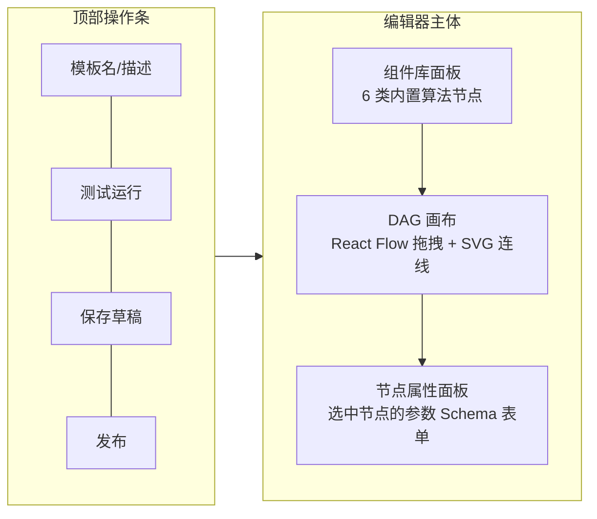

- **拖拽**：左侧组件项拖入画布生成节点；点击节点弹出右侧属性面板；连线表示数据流；
- **画布操作**：缩放/平移/对齐/复制粘贴节点/撤销重做；保存时序列化为 `react_flow_json`；
- **底部固定提示**：`DAG 校验：必须单入口、无环、节点入参出参类型匹配；发布时保存 react_flow_json 与 config_json`（与原型一致）。

##### 6.2.4.3 内置组件分类（与 6.5.2 对齐）

| 分组 | 分类标识 | 节点（一阶段 BUILTIN runtime） | 输入 → 输出 |
|---|---|---|---|
| 1. 数据输入 | `source` | ClickHouse 时序输入 | (任务上下文) → `TimeSeries[]` |
| 2. 基础统计 | `stats` | Max / Min / Mean / Var / Std / RMS、阈值包络线 | `TimeSeries` → `Scalar` / `Series` |
| 3. 频域处理 | `spectrum` | FFT、PSD、主频提取 | `TimeSeries` → `Spectrum` |
| 4. 时序对齐 | `align` | DTW（占位，二阶段扩） | `TimeSeries × TimeSeries` → `Distance` |
| 5. 聚类分析 | `cluster` | K-Means、DBSCAN | `Features` → `ClusterLabels` |
| 6. 输出与比对 | `compare` / `output` | 阈值法判定、3σ 判定、写 `algo_result` | `Series` / `Scalar` → `algo_result` / `algo_cluster_labels` |

第 4 类「时序对齐」与「报告渲染节点」一阶段不开放，从组件库隐藏或灰显；用户上传算法包（`PYTHON` / `JS` runtime）已纳入第一阶段，详见 6.5.4。

> **组件库内容来源**：上表分类是固定的「容器」，但每个分类下的具体节点项**不再硬编码**，而是由 6.5.4 `AlgorithmRegistry` 在运行时按 `algorithm_package.status='Published'` 动态拉取（`GET /api/v1/algorithms/registry`）。前端按 `algorithm_category` 落入对应分类。系统通过种子数据保证 6 个数学名（`max` / `min` / `mean` / `variance` / `stddev` / `envelope`）默认存在。

节点协议沿用 V2.0 单节点格式：

```json
{
  "nodeId": "kmeans_1",
  "nodeType": "KMEANS",
  "category": "cluster",
  "inputs": [{ "name": "features", "type": "Features" }],
  "outputs": [{ "name": "labels", "type": "ClusterLabels" }],
  "params": { "k": 4, "normalization": "MIN_MAX" },
  "runtime": "BUILTIN"
}
```

组件库面板按上表 6 个分组展示节点项；前端通过 `GET /api/v1/algorithms/registry` 拉取该注册表。

##### 6.2.4.4 数据输入节点设计（关键约束）

> **核心规则：算法模板编辑期、保存、发布、DAG 校验全过程不查询 ClickHouse**；只有当模板被任务引用并执行时（`AlgorithmJob` 拉起，含「测试运行」），数据输入节点才会按 `task_run` 上下文构造 ClickHouse 查询。

数据输入节点的配置项（写入画布节点 `data` 字段以及 `config_json.dataInputs[]`）：

| 字段 | 编辑期来源 | 说明 |
|---|---|---|
| `sourceTable` | 下拉枚举 | 默认 `hq_param_point`；可选 `algo_result`（链式引用上游算法结果） |
| `paramIds` | 从 `param_cache` 选择（PG 查询，**不触 CH**） | 模板期保存的物理参数 ID 清单；运行时按此从 CH 拉数据 |
| `valueField` | 枚举 | `processed_value` / `raw_value`，默认 `processed_value` |
| `includeOutliers` | 布尔 | 是否包含 `is_outlier=1` 的点，默认 `false` |
| `outputName` | 文本 | 节点输出在画布内的引用变量名 |

**运行时上下文**（在模板里**不存**，由任务执行时注入）：
- `tasook_no` / `satellite_no`：来自 `task_run`；
- `test_batch_id`（ClickHouse 列名，语义同展示标签）：来自 `task_run.test_batch_name`（为空时落库默认标签如「自定义时间段」），**仅作查询维度与界面展示**，执行期不按之匹配 `test_batch_cache`；
- `window_start` / `window_end`：来自 `task_run.window_start/end`（任务创建/调度时写入，执行期只读）。

执行时序：

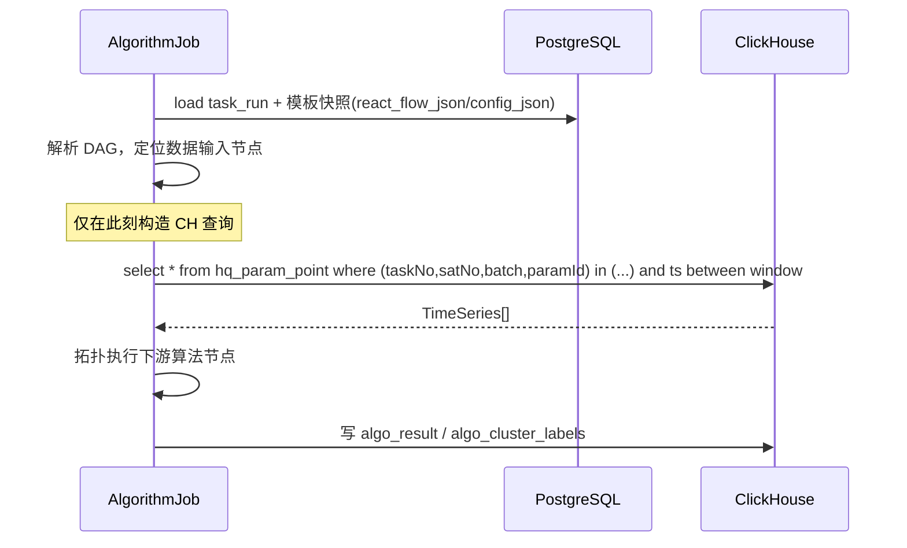

校验侧：
- 编辑期校验只检查 `paramIds` 在 `param_cache` 中是否存在（PG 查询），不触 CH；
- 校验不强制要求该参数对当前用户范围内的卫星都存在，留到任务执行时再做并降级（缺失参数标记为空 series）；
- 模板里**不存**任何卫星号、阶段号或时间窗。

##### 6.2.4.5 编辑期 DAG 静态校验

引用 6.5.3 校验规则；编辑器在「保存草稿」与「发布」前都要执行：

| 规则 | 说明 |
|---|---|
| 节点至少 1 个 | 空模板不可保存为 Draft 之外状态 |
| 至少 1 个数据输入节点 | `category='source'` 节点 ≥ 1 |
| 至少 1 个输出节点 | `category∈{compare, output}` 节点 ≥ 1 |
| 无环 | 拓扑排序检测 |
| 类型匹配 | 上游 `outputs[i].type` 必须匹配下游 `inputs[j].type` |
| 节点参数 Schema | `params` 必须通过对应节点 Schema 校验 |
| 运行时白名单 | `runtime ∈ {BUILTIN, PYTHON, JS}`，且对应 `(algorithm_code, version)` 必须命中一条 `algorithm_package.status='Published'`；未发布或归档算法直接拒绝 |

校验通过后再持久化 `react_flow_json` 与 `config_json`，并刷新 `algorithm_template.node_count`。`/validate` 接口可在不保存的情况下单独校验。

##### 6.2.4.6 配置载体（落 `algorithm_template`）

`react_flow_json`（前端原样回显画布，含坐标）：

```json
{
  "nodes": [
    { "id": "src_1", "type": "source", "position": { "x": 50, "y": 100 }, "data": { "nodeRef": "in_1" } },
    { "id": "alg_1", "type": "cluster", "position": { "x": 350, "y": 60 }, "data": { "nodeRef": "kmeans_1" } },
    { "id": "out_1", "type": "compare", "position": { "x": 650, "y": 120 }, "data": { "nodeRef": "score_1" } }
  ],
  "edges": [
    { "id": "e1", "source": "src_1", "target": "alg_1" },
    { "id": "e2", "source": "alg_1", "target": "out_1" }
  ]
}
```

`config_json`（执行用，节点参数与数据输入定义）：

```json
{
  "dataInputs": [
    {
      "nodeRef": "in_1",
      "sourceTable": "hq_param_point",
      "paramIds": ["A100_VOLT_01", "A100_CURR_23", "A100_TEMP_PACK1"],
      "valueField": "processed_value",
      "includeOutliers": false,
      "outputName": "series_1"
    }
  ],
  "nodes": [
    {
      "nodeRef": "kmeans_1",
      "nodeType": "KMEANS",
      "params": { "k": 4, "normalization": "MIN_MAX", "outputVar": "cluster_labels" }
    },
    {
      "nodeRef": "score_1",
      "nodeType": "BASELINE_SCORE",
      "params": { "metric": "centroid_drift", "writeTable": "algo_result" }
    }
  ]
}
```

> 与旧稿差异：旧稿仅展示单节点协议；新稿在模板顶层引入 `dataInputs[]` 与 `nodes[]` 数组，明确数据输入节点配置与算法节点配置分离，避免在画布节点 data 中混入大对象。`react_flow_json.nodes[].data.nodeRef` 与 `config_json.dataInputs[].nodeRef` / `config_json.nodes[].nodeRef` 通过相同的 `nodeRef` 关联。

##### 6.2.4.7 测试运行（保留）

编辑器顶部的「测试运行」按钮在第一阶段保留；其本质是**创建一个临时 ALGORITHM 任务**而非旁路执行：

- 弹窗要求选定数据范围三元组 `(taskNo, satNo, dbStage)`、测试阶段（`test_batch_id`）或自定义时间窗，可选限制处理时长；
- 后端调用 `TaskOrchestrator.CreateAlgorithm(...)`，传入当前草稿/发布版本的快照；
- 任务标记 `trigger_type='TRIAL'`，模板状态保持原状（不会因为测试运行进入 Published）；
- `algo_result.detail_json` 注入 `{ "trial": true, "templateId": "...", "version": N }`，便于清理；
- 走全套执行链路（包括「执行时才查 ClickHouse」）；用户在任务详情页查看结果；
- 不计入正式血缘统计，但仍写 `audit_log`。

由此「测试运行」与「执行时才查 CH」的约束完全一致：编辑、保存、发布期不触 CH；测试运行已属于执行期。

##### 6.2.4.8 接口

| 方法 | 路径 | 说明 |
|---|---|---|
| GET | `/api/v1/templates/algorithms` | 列表（按状态过滤） |
| GET | `/api/v1/templates/algorithms/{templateId}/versions` | 列出版本 |
| GET | `/api/v1/templates/algorithms/{templateId}/versions/{version}` | 查看 |
| POST | `/api/v1/templates/algorithms` | 新建（默认 Draft） |
| PUT | `/api/v1/templates/algorithms/{templateId}/versions/{version}` | 编辑（仅 Draft），保存前执行 DAG 校验 |
| POST | `/api/v1/templates/algorithms/{templateId}/versions/{version}/validate` | 仅校验不保存 |
| POST | `/api/v1/templates/algorithms/{templateId}/versions/{version}/publish` | 发布（再校验一次） |
| POST | `/api/v1/templates/algorithms/{templateId}/clone` | 基于任意版本克隆为新模板 |
| DELETE | `/api/v1/templates/algorithms/{templateId}/versions/{version}` | 删除（仅 Draft 且未被引用） |
| POST | `/api/v1/templates/algorithms/{templateId}/versions/{version}/archive` | 归档 |
| POST | `/api/v1/templates/algorithms/{templateId}/versions/{version}/trial-run` | 测试运行（创建 trial 任务） |
| GET | `/api/v1/algorithms/registry` | 内置算法节点注册表（供组件库面板拉取） |

接口下次合并到 8.2 一阶段接口清单时再统一刷新表格，与 6.2.3.5 同步处理。

#### 6.2.5 报告模板（移至第二阶段）
原 V2.0 在第一阶段保留的报告模板「元数据占位」入口取消，整体迁移至 7.3。第一阶段的任务创建流程不再要求选择报告模板，前端 `/templates/report` 路由相应在二阶段才上线，详见 5.1。

### 6.3 任务编排与调度
#### 6.3.1 一阶段任务类型
| 任务类型 | 说明 | 队列 |
|---|---|---|
| `PREPROCESS` | 数据预处理 | `preprocess` |
| `ALGORITHM` | 算法执行 | `algorithm` |
| `PIPELINE` | 预处理 + 算法基础流水线 | 调度子任务 |
| `WEBHOOK` | 任务终态回调投递 | `webhook` |

第二阶段扩展 `COMPARE`、`REPORT`。

表结构引用：`task_run`、`task_event`、`task_compensation`、`client_callbacks`、`callback_deliveries` 见第 4 章。

#### 6.3.2 任务状态机
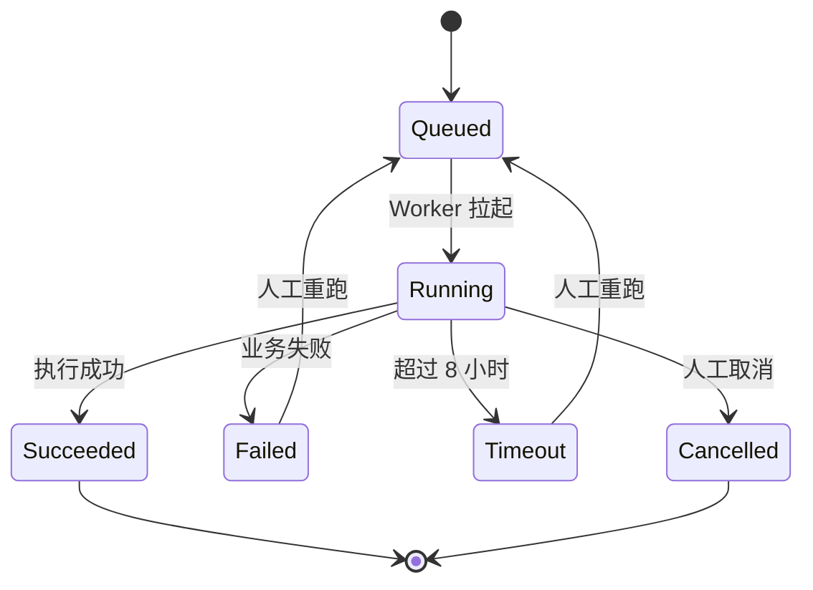

#### 6.3.3 一阶段流水线序列
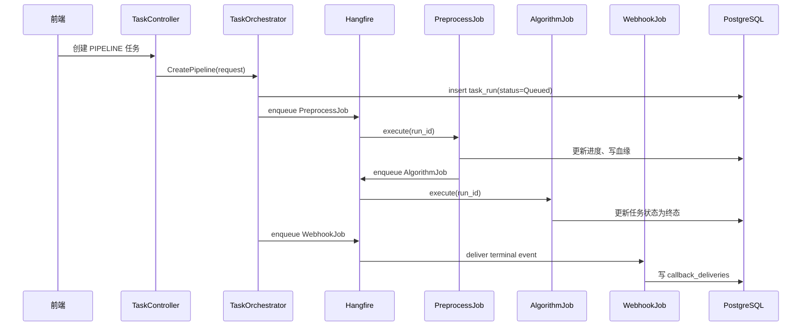

任何子任务将主任务推进到 `Succeeded`、`Failed` 或 `Timeout` 时，均由 `WebhookEventPublisher` 发布终态事件；Webhook 失败不得反向影响已经确定的业务任务状态。

#### 6.3.4 任务进度规则
| 阶段 | 进度范围 |
|---|---:|
| 创建任务 | 0% - 5% |
| 资产解析 | 5% - 10% |
| 预处理 | 10% - 60% |
| 算法执行 | 60% - 90% |
| Webhook 投递与收尾 | 90% - 100% |

### 6.4 预处理引擎
#### 6.4.1 子模块拆分
| 子模块 | 职责 |
|---|---|
| `PreprocessJob` / `PreprocessPipeline` | Hangfire 任务入口与预处理主编排 |
| `AssetResolver` / `MongoConnectionPool` | 从 `satellite_cache` / `param_cache` 解析 Mongo 连接与参数元数据 |
| `FilterRuleEvaluator` | 由模板 `timeWindow` + 任务 `window_start/end` 计算 **Mongo 拉取有效窗**（含前后缓冲）；预处理流水线**传入 `testBatchId=null`**，不按 `test_batch_cache` 反查 |
| `ConditionRangeEvaluator` | 由 `conditionConfig`（参数条件 + 指令条件 + 表达式）计算 **目标参数有效时间段**（区间交/并，见 6.4.2.3） |
| `RuleTreeSegmentEvaluator` | 存量模板兼容：当配置仍为 `ruleTree` 时按旧逻辑计算有效段 |
| `IConditionHistoryProvider` / `MongoConditionHistoryProvider` | 运行期从**参考星** Mongo 读取条件历史：参数经 `MongoPkgSeriesReader`、指令经 `MongoInstructionSeriesReader` |
| `MongoPkgSeriesReader` | 按 `prm_sys_id` 读取 Mongo `pkg{sysId}` 集合（`id`/`dt`/`pv`） |
| `MongoInstructionSeriesReader` | 读取 Mongo `IndicatorCollection`（`ci`/`et`）；集合名可由 `Pipeline:MongoInstructionCollection` 配置 |
| `OutlierDetector` | 离群值检测 |
| `ClickHouseBatchWriter` | 批量写入 `hq_param_point` |
| `MetadataWriter` | 写 `hq_param_metadata`、`preprocess_outlier_segment`（`AUTO`）、`preprocess_outlier_point_review`（种子） |
| `OutlierReviewService` | 离群复核 PG/CH 同步、完成复核后 `CONFIRMED` 段重算 |

表结构引用：`hq_param_point`、`hq_param_metadata`、`preprocess_outlier_segment` 见第 4 章。

#### 6.4.2 预处理流程
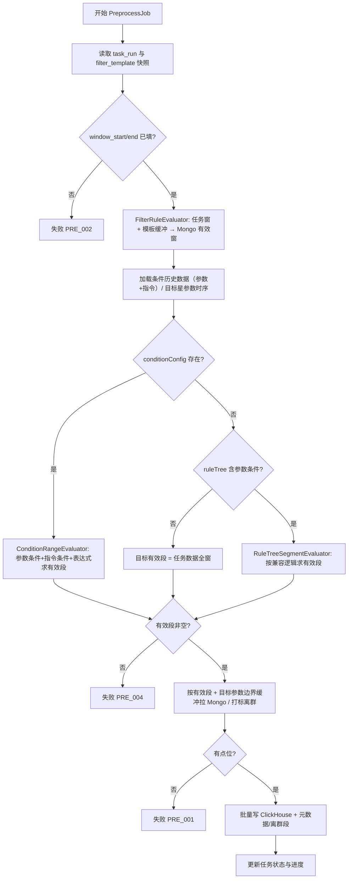

#### 6.4.2.1 任务时间窗与 `test_batch_name`（展示标签）

| 字段 | 含义 | 预处理中的用法 |
|---|---|---|
| `window_start` / `window_end` | 任务**数据时间范围**（创建/调度时确定） | **唯一**用于历史数据拉取范围、`conditionConfig`（或兼容 `ruleTree`）评估范围、`FilterRuleEvaluator` 输入；立即任务 = 用户所选时段；每天定时 = 前一日同刻 ~ 当日计划执行同刻（写入 `task_run`） |
| `test_batch_name` | 界面与 ClickHouse `test_batch_id` 维度的**展示标签** | 写入 `hq_param_point.test_batch_id`、`hq_param_metadata.test_batch_id`；可为测试阶段名、「自定义时间段」、「每日定时」等；**非外键** |
| `test_batch_cache` | 资产同步得到的测试阶段列表 | 供任务创建时下拉选择阶段名与时间；**执行期 `PreprocessPipeline` 不再**根据 `window_start/end` 与缓存阶段做时间重叠匹配 |

> **与旧稿差异**：旧稿允许按 `test_batch_cache` 反推任务时间窗或 Mongo 阶段名；现统一为「任务窗驱动处理、展示名原样落库」。

#### 6.4.2.2 Mongo 拉取有效窗（`FilterRuleEvaluator`）

- `timeWindow.mode=TEST_BATCH`：在 `task_run.window_start/end` 上叠加模板 `bufferBeforeSeconds` / `bufferAfterSeconds`；**不**再传入 `test_batch_name` 查询 `test_batch_cache`。
- `timeWindow.mode=CUSTOM`：直接使用任务 `window_start/end`（无缓冲，除非模板另有约定）。
- 输出 `EffectiveWindow` 供条件参数与目标参数读取历史数据时的**外边界**；目标参数若在 `conditionConfig`（或兼容 `ruleTree`）下还有更窄的有效段，由 6.4.2.3 在此外边界内再裁剪。

#### 6.4.2.3 目标参数有效时间段（`ConditionRangeEvaluator`，兼容 `RuleTreeSegmentEvaluator`）

在 **任务数据时间窗** `[window_start, window_end]` 内，对 `conditionConfig` 求值，得到一或多个 `{Tmin, Tmax}`，供目标参数提取与边界缓冲（`targetParams.boundaryBufferBeforeSec/AfterSec`）使用。若模板为存量 `ruleTree` 结构，则走兼容路径。

**步骤（与实现对齐）**：

1. **按参数条件筛段（`conditionConfig.parameters[]`）**  
   每条参数条件 `{conditionId, paramId, operator, value}` 独立计算时间段；比较符为 `>` / `>=` / `<` / `<=` / `=` / `!=` / `between`。首采样点之前无数据，视为不满足。

2. **按表达式求值（参数条件）**  
   使用 `conditionConfig.expression`（`&&` / `||` / `(` / `)`）对步骤 1 结果做区间交并；括号优先级高于逻辑运算符。表达式为空时，默认将所有参数条件按 `AND` 求交。

3. **按指令条件筛段（可选）**  
   `conditionConfig.instructions.startCommands[]` 与 `endCommands[]` 分别形成候选起止时刻；组内关系按 `startRelation` / `endRelation`（`AND` / `OR`）计算后配对成时间段。

4. **参数段与指令段合并**  
   将步骤 2（参数段）与步骤 3（指令段）做交集，得到最终有效段。

5. **持续时长过滤**  
   若 `durationSeconds > 0`，丢弃时长 `< durationSeconds` 的段；无满足段时任务失败 `PRE_004`（不回退为全任务窗）。

6. **无条件项**  
   当参数条件与指令条件均为空时，有效段 = `[window_start, window_end]` 单段。

**条件历史数据来源**（运行期，参考星 Mongo）：
- 参数条件：`MongoPkgSeriesReader` → 集合 `pkg{prm_sys_id}`，字段 `id`（paraId）、`dt`、`pv`；
- 指令条件：`MongoInstructionSeriesReader` → 集合 `IndicatorCollection`（默认），字段 `ci`（cmdId）、`et`（执行时刻），按 `ci` 与时间窗过滤；
- 配置期候选来源仍为缓存：参数取 `param_cache`、指令取 `command_cache`。

#### 6.4.3 离群检测策略
| 方法 | 输入 | 输出 |
|---|---|---|
| 阈值法 | 参数序列、上下限 | 超界点 |
| 3σ | 参数序列 | 偏离均值超过 N 倍标准差的点 |
| IQR | 参数序列 | 落在四分位距外的点 |
| MAD | 参数序列 | 中位数绝对偏差异常点 |
| Hampel | 滑动窗口序列 | 局部异常点 |

> **与算法引擎判读节点的边界**：本节方法在**预处理阶段**对 `hq_param_point.is_outlier` 仅做**算法候选打标**，不剔除、不输出独立结果，相关元数据写入 `hq_param_metadata`。**最终离群结论**须经 6.4.5 人工复核后写入 `is_confirmed_outlier` 与 `segment_kind=CONFIRMED` 段。算法引擎中的 `threshold_judge` / `three_sigma_judge`（见 6.5.2.2）则在**算法阶段**对已打标的高品质数据产出**判读结果**，写入 `algo_result`。两者底层数学实现可复用，但触发位置、写入表与语义不同，可同时存在不冲突。

#### 6.4.5 离群点人工复核（一阶段）

**业务语义**：预处理算法检出的离群点仅为**候选**；须由用户在「离群复核」中逐点判定。**确认离群**计入最终离群；**标为抖动**表示该点**不是离群点**（噪声/抖动），与算法候选划清界限。

| 层级 | 字段/表 | 含义 |
|---|---|---|
| 算法候选 | `hq_param_point.is_outlier=1`（复核前） | 预处理自动检出，保留审计；`is_confirmed_outlier=0` |
| 人工状态（权威） | `preprocess_outlier_point_review.review_status` | `PENDING` / `CONFIRMED` / `JITTER` |
| 最终离群 | CH：`is_outlier=1` 且 `is_confirmed_outlier=1` | 用户「确认离群」后写入 |
| 否定离群（抖动） | CH：`is_outlier=0` 且 `is_confirmed_outlier=0` | 用户「标为抖动」后写入；**不再视为离群** |
| 时间段 | `preprocess_outlier_segment.segment_kind` | 复核完成前展示 `AUTO`；`complete` 后按已确认点重算 `CONFIRMED` |

**`task_run` 复核字段**（4.1.8）：`outlier_review_status`（`NOT_REQUIRED` / `PENDING` / `COMPLETED`）、`outlier_auto_count`、`outlier_pending_count`、`outlier_confirmed_count`、`outlier_jitter_count`。无离群候选时 `NOT_REQUIRED`。

**端到端流程**：

```mermaid
sequenceDiagram
  participant Pre as PreprocessPipeline
  participant PG as PostgreSQL
  participant U as 用户
  participant API as TasksController
  participant CH as ClickHouse

  Pre->>PG: 种子 PENDING 至 preprocess_outlier_point_review
  Pre->>CH: is_outlier 按算法; is_confirmed_outlier=0
  U->>API: PATCH outlier-reviews
  API->>PG: 更新 review_status
  API->>CH: INSERT 更高 version 更新 is_outlier/is_confirmed_outlier
  U->>API: POST outlier-reviews/complete
  API->>PG: 重算 CONFIRMED 段; task_run COMPLETED
```

- 预处理成功：`PreprocessPipeline` 对每个 `flags[i]=1` 写入复核种子；`outlier_review_status=PENDING`（或 `NOT_REQUIRED`）。
- 重复执行：同一 `run_id` 先 `DELETE` 复核表与离群段，再重算，避免脏数据。
- **单次提交复核**（`PATCH`）：同步更新 PG，并对该点 `QueryLatestPoint` 后 **INSERT CH 新版本**（`ReplacingMergeTree` + 递增 `version`）。
- **完成复核**（`POST complete`）：要求 `pending_count=0`；删除该 run 下既有 `CONFIRMED` 段，按已确认点在全时间窗序列上重算连续段并写入；**不再批量写 CH**（CH 已在 PATCH 时更新）。

**复核后 ClickHouse 写入规则**（`OutlierReviewService.SubmitReviewsAsync`）：

| 用户操作 | `is_outlier` | `is_confirmed_outlier` |
|---|---:|---:|
| 确认离群 `CONFIRMED` | 1 | 1 |
| 标为抖动 `JITTER` | 0 | 0 |
| 待复核（预处理） | 1 | 0 |

**接口**（`TasksController`，权限同「数据明细」：预处理 `Succeeded`）：

| 方法 | 路径 | 说明 |
|---|---|---|
| GET | `/api/v1/tasks/{runId}/outlier-reviews/summary` | 各状态计数与 `outlier_review_status` |
| GET | `/api/v1/tasks/{runId}/outlier-reviews` | 分页清单；`status`=`PENDING`/`CONFIRMED`/`JITTER`/`ALL` |
| PATCH | `/api/v1/tasks/{runId}/outlier-reviews` | 批量提交复核；body `{ items: [{ paramId, ts, status, remark? }] }` |
| POST | `/api/v1/tasks/{runId}/outlier-reviews/complete` | 完成复核；`pending_count` 须为 0 |
| GET | `/api/v1/tasks/{runId}/outlier-points` | 离群点清单（数据源 PG 复核表，含 `review_status`） |
| GET | `/api/v1/tasks/{runId}/outlier-segments` | 未完成复核返回 `AUTO` 段；`COMPLETED` 后返回 `CONFIRMED` 段 |
| GET | `/api/v1/tasks/{runId}/processed-data` | 矩阵分页；cell 含 `review_status`（见 6.4.6） |

实现类：`OutlierReviewService`、`TaskRunProcessedDataService`、`IPreprocessOutlierPointReviewRepository`（PG / InMemory）。

#### 6.4.6 任务数据明细与矩阵配色（一阶段）

**入口**：任务列表 `/tasks` →「数据明细」；`outlier_pending_count>0` 时按钮旁 Badge 提示待复核数。

**Drawer 三 Tab**（`TasksListPage`）：

| Tab | 数据源 | 说明 |
|---|---|---|
| 全部数据（矩阵） | CH `hq_param_point` + PG `review_status` 合并 | 按时间点分页；见下表配色 |
| 离群复核 | PG `preprocess_outlier_point_review` | 进度条、状态筛选、行内/批量确认与抖动、「完成复核」 |
| 离群时间段 | PG `preprocess_outlier_segment` | 待复核时展示 `AUTO` 段并提示；完成后展示 `CONFIRMED` 段 |

**矩阵单元格字段**（`GET .../processed-data` 响应 `cells[param_id]`）：

| 字段 | 类型 | 说明 |
|---|---|---|
| `value` | number \| null | `processed_value` |
| `is_outlier` | boolean | CH 最新版本 |
| `is_confirmed_outlier` | boolean | CH 最新版本 |
| `review_status` | string \| null | 来自 PG；无记录表示从未进入候选 |

**前端配色约定**（全部数据 Tab）：

| 显示 | 颜色 | 判定（优先 `review_status`） |
|---|---|---|
| 待复核离群 | 橙色 `#d46b08` | `PENDING`，或 `is_outlier` 且无 `JITTER` |
| 已确认离群 | 红色 `#cf1322` | `CONFIRMED` 或 `is_confirmed_outlier` |
| 已确认非离群（抖动） | 绿色 `#389e0d` | `JITTER` |
| 正常值 | 黑色 `rgba(0,0,0,0.88)` | 无复核记录且非离群候选 |

#### 6.4.4 ClickHouse 写入策略
- 批大小默认 100000；
- 失败后按批重试；
- 每批携带递增 `version`；
- 同一联合主键下由 `ReplacingMergeTree(version)` 保留最新版本；
- 高品质明细不写行级 `run_id`，血缘与模板信息写入 `hq_param_metadata`。

### 6.5 算法引擎基础能力
#### 6.5.1 子模块拆分
| 子模块 | 职责 |
|---|---|
| `DagParser` | 解析 React Flow JSON |
| `DagValidator` | 校验节点、边、入参、出参 |
| `DagScheduler` | 拓扑排序与分层并行 |
| `AlgorithmRegistry` | 从 `algorithm_package(status=Published)` 动态产出可用算法注册表，供算法模板编排消费 |
| `AlgorithmExecutor` | 调用具体算法（`BUILTIN` 直接调用进程内实现；`PYTHON` / `JS` 走沙箱） |
| `AlgorithmResultWriter` | 写 `algo_result` 与 `algo_cluster_labels` |
| `AlgorithmPackageService` | 算法仓库 CRUD、版本管理、命名约定校验（详见 6.5.4） |
| `ManifestParser` | `manifest.json` 解析与 Schema 校验 |
| `SandboxRunner` | 一次性沙箱试运行（资源限制 + 样例 IO Schema 校验） |

表结构引用：`algo_result`、`algo_cluster_labels`、`algorithm_package` 见第 4 章。

#### 6.5.2 BUILTIN 算法实现规约

> 一阶段必须预置的算法清单见 6.5.4.5；本节规定每个 `runtime='BUILTIN'` 算法在 .NET 进程内的实现契约、参数 / 复杂度 / 边界、与预处理离群检测的边界，以及代码工程位置。

##### 6.5.2.1 BUILTIN 算法节点接口
所有 `runtime='BUILTIN'` 的算法在 .NET 中实现 `IBuiltinAlgorithm`，由 `AlgorithmExecutor` 通过 DI 容器按 `algorithm_code` 路由：

```csharp
public interface IBuiltinAlgorithm
{
    string AlgorithmCode { get; }
    AlgorithmCategory Category { get; }
    AlgorithmOutput Execute(AlgorithmInput input, AlgorithmContext ctx);
}

public record AlgorithmInput(
    IReadOnlyDictionary<string, object> Series,
    IReadOnlyDictionary<string, object> Params);

public record AlgorithmOutput(
    IReadOnlyDictionary<string, object> Outputs);

public record AlgorithmContext(
    Guid RunId,
    string TaskNo,
    string SatNo,
    string TestBatchId,
    DateTime WindowStart,
    DateTime WindowEnd,
    ILogger Logger);
```

`AlgorithmExecutor` 仅负责调用；输入/输出 Schema 校验与类型匹配由 6.2.4.5 / 6.5.3 在编辑期 + 任务启动前完成。

##### 6.5.2.2 一阶段 BUILTIN 算法实现要点

| `algorithm_code` | 实现要点 | 参数 | 复杂度 | 边界处理 |
|---|---|---|---|---|
| `max` | 单遍扫描求最大 `processed_value` | 无 | O(n) | 空序列 → null + warn |
| `min` | 单遍扫描求最小 | 无 | O(n) | 空序列 → null + warn |
| `mean` | 单遍累加除以个数 | 无 | O(n) | 空序列 → null + warn |
| `variance` | Welford 在线方差，避免数值不稳定 | `ddof: int=1` | O(n) | n<2 → null |
| `stddev` | sqrt(variance) | `ddof: int=1` | O(n) | n<2 → null |
| `envelope` | 滑动窗口 max/min 包络（Hilbert 备选） | `windowSeconds: int`，`mode: 'minmax' \| 'hilbert'` | O(n·w) | 窗口大于序列长度 → 全局 max/min |
| `rms` | sqrt(mean(x²)) | 无 | O(n) | 空序列 → null |
| `fft` | 调用 MathNet.Numerics 离散 FT；要求等间距采样 | `sampleRate: int`，`window: 'hann' \| 'hamming' \| 'rect'` | O(n log n) | 非 2 的幂自动 zero-pad |
| `psd` | Welch 法功率谱密度 | `nperseg: int`，`overlap: float=0.5` | O(n log n) | n<nperseg → 单段处理 |
| `dominant_freq` | 输入 Spectrum，取幅值最大的频率 | `topK: int=1` | O(m) | 全零谱 → null |
| `threshold_judge` | 对每个值应用 `[min, max]` 判定，写 `algo_result.detail_json` | `min: double?`，`max: double?` | O(n) | 缺界 → 仅判一侧 |
| `three_sigma_judge` | 计算窗口内 mean/std，超过 `k·σ` 标记异常 | `k: double=3.0` | O(n) | n<2 → 全部判正常 |

##### 6.5.2.3 与预处理离群检测的边界
- 6.4.3 离群检测在**预处理阶段**对 `hq_param_point.is_outlier` 仅做**打标**，不剔除、不输出独立结果；
- 本节 `threshold_judge` / `three_sigma_judge` 在**算法阶段**对已打标的高品质数据做**判读输出**，结果写入 `algo_result`；
- 两者底层数学实现可复用，但触发位置、写入表与语义不同，可同时存在不冲突。

##### 6.5.2.4 实现工程位置
```
SatelliteData.Workers
└── AlgorithmJobs
    └── Builtin
        ├── Stats     (max, min, mean, variance, stddev, envelope, rms)
        ├── Spectrum  (fft, psd, dominant_freq)
        └── Output    (threshold_judge, three_sigma_judge)
```

所有 BUILTIN 实现要求附带单元测试，覆盖以下四类边界：空序列、单点、`NaN` / `Inf`、极值（接近 `double.MaxValue`）。

#### 6.5.3 DAG 校验规则
| 规则 | 说明 |
|---|---|
| 无环 | 不允许形成循环 |
| 类型匹配 | 上游输出类型必须匹配下游输入类型 |
| 必填参数 | 节点参数 Schema 必须通过 |
| 运行时可用 | 允许 `runtime ∈ {BUILTIN, PYTHON, JS}`，且对应 `(algorithm_code, version)` 必须在 `algorithm_package` 中处于 `Published` 状态 |
| 资源限制 | 单节点超时、并发数由任务配置控制 |

#### 6.5.4 算法仓库与沙箱执行

> 本小节由原 7.5「用户算法包与沙箱执行」整体提前到一阶段。算法仓库是一阶段算法能力的载体，所有算法（含内置数学算法）统一以「算法包」形式存放在 `algorithm_package` 表中，并通过 MinIO 持久化脚本文件。算法编排页（6.2.4.3）的组件库内容由本节的注册表动态产出。

##### 6.5.4.1 命名约定与职责边界（关键）
- 算法包名称（`algorithm_name`）**仅使用数学名**，禁止包含业务语义。允许示例：`最大值` / `最小值` / `平均值` / `方差` / `标准差` / `包络线` / `FFT` / `PSD` / `DBSCAN`；禁止示例：`定制_动量轮高频去噪`、`电池寿命预测`。
- 业务语义（如「稳态电压提取」「整星综测异常发现」）由 6.2.4 算法模板通过节点编排承载，不在算法仓库中表达。
- `algorithm_code` 使用 `lower_snake_case` 数学缩写：`max` / `min` / `mean` / `variance` / `stddev` / `envelope` / `rms` / `fft` / `psd` / `dominant_freq` / `kmeans` / `dbscan` / `threshold_judge` / `three_sigma_judge`。
- 上传时 `AlgorithmPackageService` 拒绝命中业务语义关键字的名称（黑名单 + 长度策略），命中拒绝事件写 `audit_log`。

##### 6.5.4.2 子模块拆分
| 子模块 | 职责 |
|---|---|
| `AlgorithmPackageService` | 仓库 CRUD、版本管理、命名约定校验 |
| `ManifestParser` | 解析与校验 `manifest.json`（含命名/类别/IO/参数 Schema） |
| `SandboxRunner` | 一次性沙箱试运行（资源限制 + Schema 校验 + 样例输入） |
| `AlgorithmRegistry` | DB 驱动的注册表，按 `status='Published'` 暴露给算法编排组件库 |
| `ObjectStorageService` | 算法包文件存入 MinIO，索引写 `object_index` |

##### 6.5.4.3 状态机
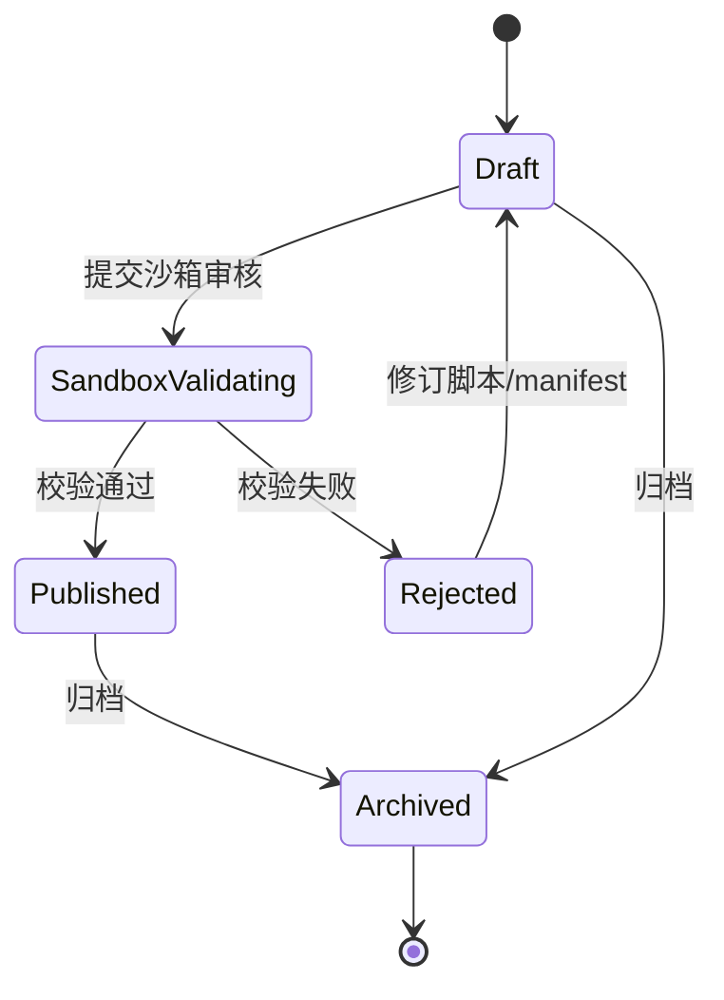

- `Published` 后版本不可修改，须基于该版本克隆新版本进入 `Draft`；
- `algorithm_package.status` 取值：`Draft / SandboxValidating / Published / Rejected / Archived`；
- 已发布版本被算法模板（已发布/草稿）引用时，归档不影响已生成的任务版本快照。

##### 6.5.4.4 仓库列表与单包管理（参照原型 `#repo`）
列表列：算法名称（数学名）、`algorithm_code`、运行时、版本号、入口与资源限制、上传者、状态、更新时间、操作。

| 操作 | 适用状态 | 说明 |
|---|---|---|
| 上传 | - | 拖拽 / 浏览 `.py` / `.js` / `.zip`（≤50 MB），必须含 `manifest.json` |
| 修改 manifest | `Draft` / `Rejected` | 直接保存当前版本 |
| 替换脚本 | `Draft` / `Rejected` | 重新上传文件 |
| 提交沙箱审核 | `Draft` | 进入 `SandboxValidating` |
| 发布 | `SandboxValidating` 通过后自动 / 手动确认 | 进入 `Published`，刷新 `AlgorithmRegistry` 缓存 |
| 归档 | `Draft` / `Published` | 进入 `Archived`，组件库不再展示 |
| 删除 | 仅 `Draft` 且未被任何任务/模板引用 | 硬删除并连带删除 MinIO 中的文件 |
| 查看源码 | 任意状态 | 只读 |
| 撤销上传 | `SandboxValidating` | 回到 `Draft` |
| 克隆新版本 | `Published` | 创建同 `algorithm_code` 下新 `version` 的 `Draft` |

##### 6.5.4.5 必须预置的内置算法清单
平台首次启动时通过种子数据写入 `algorithm_package`，状态直接为 `Published`，`runtime='BUILTIN'`，`created_by='SYSTEM'`，不计入用户上传配额。

| 分类 | `algorithm_code` | 算法名称（数学名） | 输入 → 输出 | 必须 |
|---|---|---|---|---:|
| stats | `max` | 最大值 | `TimeSeries` → `Scalar` | 是 |
| stats | `min` | 最小值 | `TimeSeries` → `Scalar` | 是 |
| stats | `mean` | 平均值 | `TimeSeries` → `Scalar` | 是 |
| stats | `variance` | 方差 | `TimeSeries` → `Scalar` | 是 |
| stats | `stddev` | 标准差 | `TimeSeries` → `Scalar` | 是 |
| stats | `envelope` | 包络线 | `TimeSeries` → `Series` | 是 |
| stats | `rms` | RMS | `TimeSeries` → `Scalar` | 预置 |
| spectrum | `fft` | FFT | `TimeSeries` → `Spectrum` | 预置 |
| spectrum | `psd` | PSD | `TimeSeries` → `Spectrum` | 预置 |
| spectrum | `dominant_freq` | 主频 | `Spectrum` → `Scalar` | 预置 |
| output | `threshold_judge` | 阈值判定 | `Series`/`Scalar` → `algo_result` | 预置 |
| output | `three_sigma_judge` | 3σ判定 | `Series` → `algo_result` | 预置 |

##### 6.5.4.6 manifest.json 规范（增强）
```json
{
  "algorithmCode": "envelope",
  "algorithmName": "包络线",
  "category": "stats",
  "version": "1.0.0",
  "runtime": "BUILTIN",
  "entrypoint": "envelope.py",
  "inputs": [{ "name": "series", "type": "TimeSeries" }],
  "outputs": [{ "name": "envelope", "type": "Series" }],
  "params": [
    { "name": "windowSeconds", "type": "int", "required": true, "default": 5 }
  ],
  "resources": { "cpu": "1", "memoryMb": 512, "timeoutSeconds": 300 }
}
```

新增字段：`algorithmName`（数学名校验）、`category`（与 6.2.4.3 分类标识对齐）、`params`（节点参数 Schema，供算法模板编辑器右侧属性面板渲染）。

##### 6.5.4.7 上传与沙箱审核流程
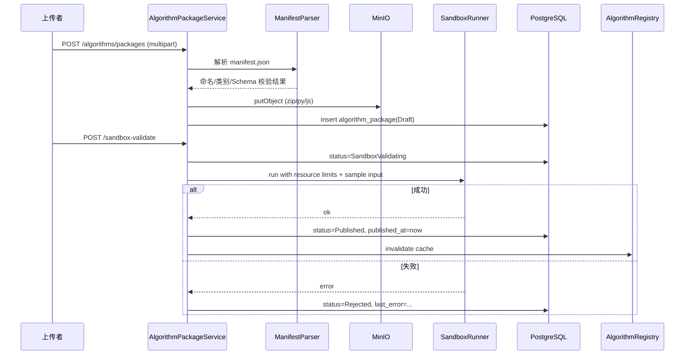

##### 6.5.4.8 与算法编排页的可见性绑定
- `GET /api/v1/algorithms/registry` 仅返回 `status='Published'` 的算法包；
- 算法编排页（6.2.4.3）组件库面板按 `category` 分组渲染该接口结果；
- `Draft` / `SandboxValidating` / `Rejected` / `Archived` 算法包**不出现在画布组件库**，无法被新建或编辑中的算法模板引用；
- 已发布版本若在被现有算法模板引用时执行 `Archived`，已发布模板继续可用（任务侧已生成版本快照），但不可被新模板引用；
- 6.2.4.5 DAG 校验在保存与发布时校验「所有非数据输入节点的 `nodeType` 必须命中一条 `Published` 的 `(algorithm_code, version)`」。

##### 6.5.4.9 安全限制
- 容器禁用特权模式；
- 限制 CPU、内存、运行时长（默认上限：`cpu=2 / memoryMb=4096 / timeoutSeconds=1800`，由 `manifest.resources` 在 `Features:AlgorithmSandbox` 上限内取值）；
- 默认禁止访问内网，仅允许访问挂载的输入输出目录；
- 输出必须符合 `outputs` Schema；
- 所有上传/审核/发布/归档/删除走 `audit_log`。

##### 6.5.4.10 接口清单
| 方法 | 路径 | 说明 |
|---|---|---|
| GET | `/api/v1/algorithms/packages` | 列表（按 status / runtime / category 过滤） |
| GET | `/api/v1/algorithms/packages/{packageId}` | 详情（含源码下载链接） |
| POST | `/api/v1/algorithms/packages` | 上传（multipart：脚本文件 + manifest） |
| PUT | `/api/v1/algorithms/packages/{packageId}` | 修改 manifest（仅 Draft / Rejected） |
| POST | `/api/v1/algorithms/packages/{packageId}/script` | 替换脚本 |
| POST | `/api/v1/algorithms/packages/{packageId}/sandbox-validate` | 提交沙箱审核 |
| POST | `/api/v1/algorithms/packages/{packageId}/publish` | 发布 |
| POST | `/api/v1/algorithms/packages/{packageId}/archive` | 归档 |
| DELETE | `/api/v1/algorithms/packages/{packageId}` | 删除（Draft 且未引用） |
| POST | `/api/v1/algorithms/packages/{packageId}/clone` | 基于已发布版本克隆新版本 |
| GET | `/api/v1/algorithms/registry` | 已发布算法注册表（供编排组件库） |

### 6.6 用户、权限与操作留痕基础能力
第一阶段实现 Web 管理端 JWT 登录、基础 RBAC 和操作留痕。第三方 OAuth2 授权放到第二阶段。

#### 6.6.1 角色权限
| 功能 | Admin | Analyst | Readonly |
|---|---:|---:|---:|
| 资产配置 | 写 | 读 | 无 |
| 模板创建/编辑 | 写 | 写 | 读 |
| 模板发布/归档 | 写 | 无 | 无 |
| 任务创建 | 写 | 写 | 无 |
| 任务查看 | 读 | 读 | 读 |
| 操作留痕查看 | 读 | 无 | 无 |

表结构引用：`sys_user`、`sys_role`、`sys_permission`、`sys_user_scope`、`audit_log` 见第 4 章。

### 6.7 Webhook 终态通知
Webhook 是第一阶段任务闭环的一部分，用于在任务成功、失败、超时后主动通知外部接收方。该能力不依赖第二阶段 OAuth2/OpenAPI，第一阶段由管理员在 Web 管理端配置回调地址；第二阶段再将回调配置扩展为可绑定 `api_clients` 的开放集成能力。

#### 6.7.1 子模块拆分
| 子模块 | 职责 |
|---|---|
| `WebhookConfigService` | 管理回调地址、事件范围、密钥引用与启停状态 |
| `WebhookEventPublisher` | 根据任务终态生成 `job.succeeded` / `job.failed` / `job.timeout` 事件 |
| `WebhookJob` | Hangfire 投递入口，负责 HTTP POST |
| `WebhookSigner` | 生成 HMAC-SHA256 签名 |
| `WebhookDeliveryRepository` | 写入与查询投递记录 |

表结构引用：`client_callbacks`、`callback_deliveries` 见第 4 章。

第一阶段回调配置由管理员维护，`client_callbacks.client_id` 可以为空；第二阶段开放 API 客户端上线后，再通过 `client_id` 将回调地址绑定到具体第三方客户端。

#### 6.7.2 事件类型
| 事件 | 触发时机 | 是否一阶段必须 |
|---|---|---:|
| `job.succeeded` | 任务成功 | 是 |
| `job.failed` | 任务失败 | 是 |
| `job.timeout` | 任务超时 | 是 |
| `report.generated` | 报告生成完成 | 否，第二阶段报告能力启用后支持 |

#### 6.7.3 Webhook 签名
```text
signature = HMAC_SHA256(secret, timestamp + "." + event_id + "." + body)
```

请求头：
```http
X-Event-Id: evt_xxx
X-Timestamp: 2026-04-27T10:00:00Z
X-Signature: sha256=...
```

#### 6.7.4 投递重试
| 第几次 | 延迟 |
|---:|---|
| 1 | 1 分钟 |
| 2 | 5 分钟 |
| 3 | 15 分钟 |
| 4 | 1 小时 |
| 5 | 6 小时 |

投递状态统一为 `Pending`、`Succeeded`、`Failed`。达到最大重试次数仍失败时保持 `Failed`，只能通过管理端手工重试重新进入 `Pending`。

#### 6.7.5 故障隔离
- Webhook 投递失败不回滚业务任务终态；
- 非 2xx 响应写入 `callback_deliveries`，由 `webhook` 队列按退避策略重试；
- 单个回调地址失败不得阻塞其他回调地址；
- 签名密钥仅保存 `secret_ref`，不在数据库保存明文密钥；
- 管理端可手工重试失败投递。

---

## 7. 第二阶段增强功能模块设计

### 7.1 模板灰度发布与模板路由
灰度发布用于控制筛选模板、算法模板、报告模板在指定数据范围内逐步生效。该能力第二阶段实现。

#### 7.1.1 灰度范围 JSON Schema
```json
{
  "enabled": true,
  "priority": 100,
  "effectiveStart": "2026-04-27T00:00:00Z",
  "effectiveEnd": "2026-05-27T00:00:00Z",
  "rules": [
    {
      "tasookNo": "T001",
      "satelliteNo": "S001",
      "testBatchIds": ["B20260427001"],
      "windowStart": "2026-04-27T00:00:00Z",
      "windowEnd": "2026-04-27T08:00:00Z"
    }
  ],
  "fallback": {
    "templateId": "uuid",
    "version": 2
  }
}
```

灰度字段存储在第 4 章三类模板表的 `gray_scope` 字段。

#### 7.1.2 模板路由命中规则
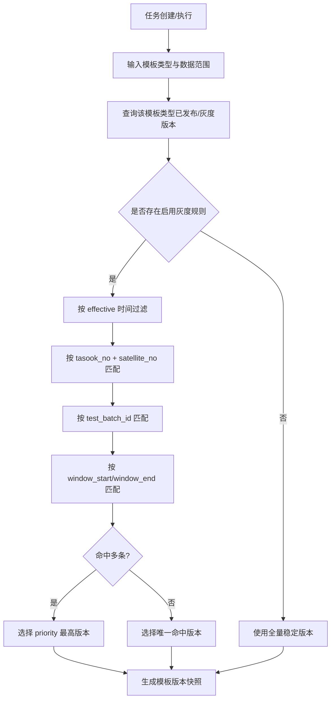

### 7.2 一致性比对
一致性比对第二阶段实现，依赖第一阶段产生的高品质明细与算法结果。

#### 7.2.1 比对类型
| 类型 | 输入 A | 输入 B | 输出 |
|---|---|---|---|
| 同星跨批次 | 当前批次结果 | 历史批次结果 | 差异得分 |
| 实测对基线 | 当前实测结果 | 基线版本 | 是否偏离 |
| 实测对阈值 | 当前指标 | 阈值模板 | 是否超界 |
| 聚类漂移 | 当前簇中心 | 基线簇中心 | 簇中心漂移 |
| 时序形态 | 当前序列 | 参考序列 | DTW 距离 |
| 频域指标 | 当前频域特征 | 参考频域特征 | 主频偏移 |

表结构引用：`compare_result`、`baseline_meta`、`baseline_metric` 见第 4 章。

#### 7.2.2 判定规则
| 判定 | 分数区间 | 说明 |
|---|---:|---|
| 正常 | `score >= 0.85` | 与基线一致性高 |
| 注意 | `0.60 <= score < 0.85` | 存在轻微偏移 |
| 异常 | `score < 0.60` | 显著偏离 |

### 7.3 报告引擎与报告模板
报告引擎与**报告模板**整体在第二阶段实现，输出 Word 文档并存入 MinIO。文件索引表见第 4 章 `object_index`，报告模板表见 4.1.7 `report_template`。

> 与 V2.0 旧稿差异：旧稿在第一阶段保留报告模板「元数据占位」入口；本次细化已将其完全移到第二阶段，第一阶段不出现 `/templates/report` 路由、不允许创建报告模板，任务创建流程不再要求选择报告模板。`report_template` 表本身仍随第 4 章 DDL 一次性建表，仅在第二阶段启用其管理与渲染流程。

#### 7.3.1 子模块拆分
| 子模块 | 职责 |
|---|---|
| `ReportJob` | Hangfire 任务入口 |
| `ReportDataAssembler` | 汇总任务、比对、算法、血缘数据 |
| `DocxTemplateRenderer` | 渲染 Word 占位符 |
| `ChartRenderer` | 生成图表图片 |
| `ObjectStorageService` | 上传 MinIO |
| `ObjectIndexService` | 写 `object_index` |

#### 7.3.2 报告生成序列
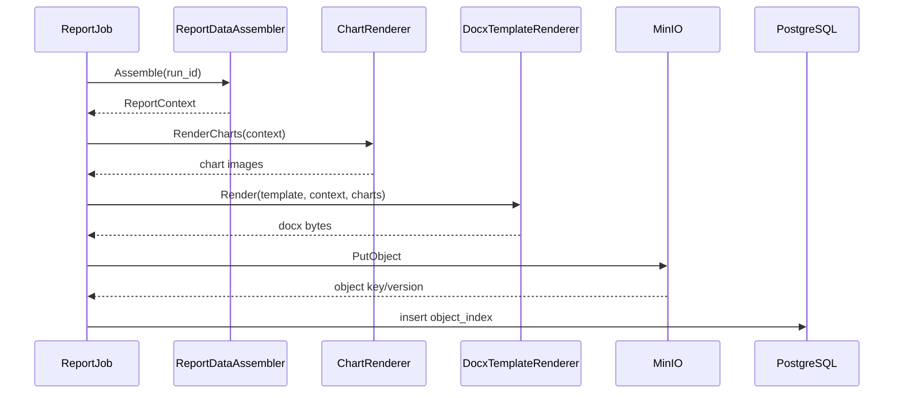

#### 7.3.3 MinIO 路径规范
```text
reports/{yyyy}/{MM}/{dd}/{run_id}/consistency-report.docx
algorithm-packages/{algorithm_code}/{version}/package.zip
exports/{yyyy}/{MM}/{dd}/{run_id}/{file_name}
```

### 7.4 OAuth2 与第三方开放 API
第三方 OAuth2 授权与开放 API 第二阶段实现。相关表结构见第 4 章 `api_clients`、`api_oauth_scope`、`api_client_oauth_scope`、`api_oauth_token_log`、`api_client_scope`。Webhook 投递本身已在第一阶段实现，第二阶段仅扩展“开放 API 客户端可管理或绑定回调配置”的能力。

#### 7.4.1 OAuth2 授权流程
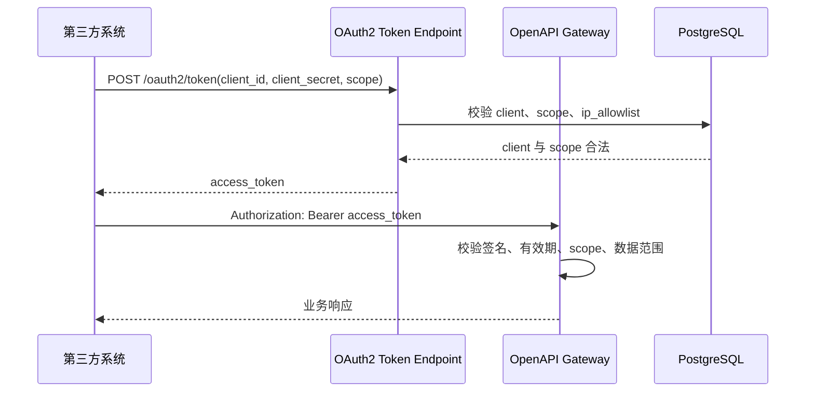

#### 7.4.2 Scope 定义
| Scope | 说明 | 允许访问 |
|---|---|---|
| `job:create` | 创建任务 | `/openapi/v1/jobs/preprocess`、`/openapi/v1/jobs/pipeline` |
| `job:read` | 查询任务 | `/openapi/v1/jobs/{jobId}`、`/openapi/v1/jobs/{jobId}/result` |
| `data:read` | 查询结果数据 | 高品质明细、算法结果、比对结果查询 |
| `report:download` | 下载报告 | `/openapi/v1/reports/{objectId}/download-url` |
| `callback:manage` | 管理回调配置 | 回调地址登记、测试与启停；投递机制复用第一阶段 Webhook |

### 7.5 用户算法包与沙箱执行（已迁移）
> 该能力已整体迁移至 **6.5.4 算法仓库与沙箱执行**，作为第一阶段交付内容。本节保留以兼容历史引用，无新增内容。详见 6.5.4 中的命名约定、生命周期、必须预置算法清单、`manifest.json` 规范、上传与沙箱审核流程、与算法编排页的可见性绑定、安全限制与接口清单。

### 7.6 任务补偿、回补与一致性保障
第二阶段增强跨 PostgreSQL、ClickHouse、MinIO 以及一阶段 Webhook 投递记录的失败补偿能力。表结构见第 4 章 `task_event`、`task_compensation`。

| 失败点 | 处理方式 |
|---|---|
| ClickHouse 写入失败 | 当前批次重试，超过次数后任务失败 |
| ClickHouse 成功、PG 元数据失败 | 创建补偿任务，补写 PG 元数据 |
| PG 成功、报告上传失败 | 重试 MinIO 上传 |
| 报告上传成功、索引写入失败 | 根据 MinIO object key 补写 `object_index` |
| Webhook 失败 | 写 `callback_deliveries` 并按退避策略重试 |

### 7.7 ML 数据集快照扩展
ML 数据集快照第二阶段后置实现，支撑外部 ML 平台训练数据治理。表结构见第 4 章 `ml_dataset_snapshot`。

规则：
- 输入来自 ClickHouse 高品质点表；
- 输出样本形态为 `[T, C]`；
- 缺失值不插值，统一通过 mask 表达；
- 归一化参数单独保存到 MinIO；
- 数据集必须记录使用的 `run_id` 集合，确保可复现。

---

## 8. 后端 HTTP 接口详细定义

### 8.1 接口通用约定
所有前后端分离接口统一使用：

```text
/api/v1
```

第三方开放接口第二阶段使用：

```text
/openapi/v1
```

通用请求头：
| Header | 必填 | 阶段 | 说明 |
|---|---|---|---|
| `Authorization` | 是 | 一阶段 | `Bearer {jwt}` |
| `Authorization` | 是 | 二阶段 | 第三方 `Bearer {access_token}` |
| `X-Trace-Id` | 否 | 一阶段 | 前端传入链路追踪 ID；未传则后端生成 |
| `X-Idempotency-Key` | 部分接口 | 一阶段 | 创建任务、Webhook 重试等幂等接口使用 |
| `Content-Type` | 是 | 一阶段 | `application/json`，文件上传为 `multipart/form-data` |

### 8.2 一阶段接口清单

> 本表是一阶段所有 `/api/v1/*` 接口的全量索引，按模块分组。各模块详细参数与字段映射在 6.x 节的接口子表中给出（6.1 资产 / 6.2.3 筛选模板 / 6.2.4 算法模板 / 6.5.4 算法仓库 / 6.7 Webhook 等），两者保持同步。

| 模块 | 方法 | 路径 | 说明 |
|---|---|---|---|
| 身份认证 | POST | `/auth/login` | 用户登录 |
| 身份认证 | POST | `/auth/logout` | 登出 |
| 身份认证 | POST | `/auth/refresh` | 刷新 Token |
| 身份认证 | GET | `/auth/me` | 获取当前用户 |
| 资产配置 | GET | `/asset/sources` | 查询数据源配置 |
| 资产配置 | GET | `/asset/sources/{sourceId}` | 单条数据源详情 |
| 资产配置 | POST | `/asset/sources` | 新增配置 |
| 资产配置 | PUT | `/asset/sources/{sourceId}` | 修改配置 |
| 资产配置 | PATCH | `/asset/sources/{sourceId}/status` | 启用/停用配置 |
| 资产配置 | POST | `/asset/sources/{sourceId}/test` | 连通性测试 |
| 资产同步 | POST | `/asset/sync` | 同步所有资产 |
| 资产同步 | POST | `/asset/satellites/{tasookNo}/{satelliteNo}/sync` | 同步单颗卫星（Step 2/3/4） |
| 资产查询 | GET | `/asset/satellites` | 查询卫星缓存（支持按分组过滤） |
| 资产查询 | GET | `/asset/satellites/{tasookNo}/{satelliteNo}/params` | 查询参数缓存 |
| 资产查询 | GET | `/asset/satellites/{tasookNo}/{satelliteNo}/test-phases` | 查询测试阶段（替代旧 test-batches） |
| 卫星分组 | GET | `/asset/groups` | 分组树（树状返回） |
| 卫星分组 | POST | `/asset/groups` | 新增分组 |
| 卫星分组 | PUT | `/asset/groups/{groupId}` | 改名/移动 |
| 卫星分组 | DELETE | `/asset/groups/{groupId}` | 删除（无成员/子组/模板归属时） |
| 卫星分组 | POST | `/asset/groups/{groupId}/members` | 批量加入卫星 |
| 卫星分组 | DELETE | `/asset/groups/{groupId}/members/{tasookNo}/{satelliteNo}` | 移出卫星 |
| 筛选模板 | GET | `/templates/filters` | 列表（支持按 groupId 过滤） |
| 筛选模板 | GET | `/templates/filters/{templateId}/versions` | 列出版本 |
| 筛选模板 | GET | `/templates/filters/{templateId}/versions/{version}` | 查看 |
| 筛选模板 | POST | `/templates/filters` | 创建草稿 |
| 筛选模板 | PUT | `/templates/filters/{templateId}/versions/{version}` | 编辑（仅 Draft） |
| 筛选模板 | POST | `/templates/filters/{templateId}/versions/{version}/publish` | 发布 |
| 筛选模板 | POST | `/templates/filters/{templateId}/versions/{version}/archive` | 归档 |
| 筛选模板 | POST | `/templates/filters/{templateId}/clone` | 克隆为新版本 |
| 筛选模板 | DELETE | `/templates/filters/{templateId}/versions/{version}` | 删除（Draft 且未引用） |
| 筛选模板 | GET | `/templates/filters/applicable` | 给定卫星可用的发布态模板 |
| 算法模板 | GET | `/templates/algorithms` | 列表 |
| 算法模板 | GET | `/templates/algorithms/{templateId}/versions` | 列出版本 |
| 算法模板 | GET | `/templates/algorithms/{templateId}/versions/{version}` | 查看 |
| 算法模板 | POST | `/templates/algorithms` | 创建草稿 |
| 算法模板 | PUT | `/templates/algorithms/{templateId}/versions/{version}` | 编辑（仅 Draft） |
| 算法模板 | POST | `/templates/algorithms/{templateId}/versions/{version}/validate` | 仅校验不保存 |
| 算法模板 | POST | `/templates/algorithms/{templateId}/versions/{version}/publish` | 发布 |
| 算法模板 | POST | `/templates/algorithms/{templateId}/versions/{version}/archive` | 归档 |
| 算法模板 | POST | `/templates/algorithms/{templateId}/clone` | 克隆为新版本 |
| 算法模板 | DELETE | `/templates/algorithms/{templateId}/versions/{version}` | 删除（Draft 且未引用） |
| 算法模板 | POST | `/templates/algorithms/{templateId}/versions/{version}/trial-run` | 测试运行（创建 trial 任务） |
| 算法仓库 | GET | `/algorithms/packages` | 列表（按 status / runtime / category） |
| 算法仓库 | GET | `/algorithms/packages/{packageId}` | 详情（含源码下载链接） |
| 算法仓库 | POST | `/algorithms/packages` | 上传（multipart） |
| 算法仓库 | PUT | `/algorithms/packages/{packageId}` | 修改 manifest（Draft / Rejected） |
| 算法仓库 | POST | `/algorithms/packages/{packageId}/script` | 替换脚本 |
| 算法仓库 | POST | `/algorithms/packages/{packageId}/sandbox-validate` | 提交沙箱审核 |
| 算法仓库 | POST | `/algorithms/packages/{packageId}/publish` | 发布 |
| 算法仓库 | POST | `/algorithms/packages/{packageId}/archive` | 归档 |
| 算法仓库 | DELETE | `/algorithms/packages/{packageId}` | 删除（Draft 且未引用） |
| 算法仓库 | POST | `/algorithms/packages/{packageId}/clone` | 克隆新版本 |
| 算法仓库 | GET | `/algorithms/registry` | 已发布算法注册表（供编排组件库） |
| 任务 | GET | `/tasks` | 任务列表（含 `outlier_pending_count`、`outlier_review_status`） |
| 任务 | POST | `/tasks/preprocess` | 创建预处理任务 |
| 任务 | POST | `/tasks/algorithm` | 创建算法任务 |
| 任务 | POST | `/tasks/pipeline` | 创建一阶段流水线任务 |
| 任务 | GET | `/tasks/{runId}` | 查询任务详情 |
| 任务 | GET | `/tasks/{runId}/progress` | 查询任务进度 |
| 任务 | POST | `/tasks/{runId}/cancel` | 取消任务 |
| 任务 | GET | `/tasks/{runId}/processed-data` | 预处理矩阵明细（含 `review_status`） |
| 任务 | GET | `/tasks/{runId}/outlier-points` | 离群点清单（PG 复核表） |
| 任务 | GET | `/tasks/{runId}/outlier-segments` | 离群时间段（`AUTO` / `CONFIRMED`） |
| 任务 | GET | `/tasks/{runId}/outlier-reviews/summary` | 离群复核汇总 |
| 任务 | GET | `/tasks/{runId}/outlier-reviews` | 离群复核分页列表 |
| 任务 | PATCH | `/tasks/{runId}/outlier-reviews` | 提交复核（同步 CH） |
| 任务 | POST | `/tasks/{runId}/outlier-reviews/complete` | 完成复核 |
| 数据 | GET | `/data/hq-points` | 查询高品质明细 |
| 数据 | GET | `/data/hq-metadata` | 查询时间窗元数据 |
| 算法结果 | GET | `/algorithm-results/{runId}` | 查询算法结果 |
| Webhook | GET | `/integration/callbacks` | 查询回调配置 |
| Webhook | POST | `/integration/callbacks` | 新增回调配置 |
| Webhook | PATCH | `/integration/callbacks/{callbackId}/status` | 启用/停用回调配置 |
| Webhook | POST | `/integration/callbacks/{callbackId}/test` | 测试回调地址 |
| Webhook | GET | `/integration/webhook-deliveries` | 查询投递记录 |
| Webhook | POST | `/integration/webhook-deliveries/{deliveryId}/retry` | 手工重试投递 |
| 操作留痕 | GET | `/trace-logs` | 查询操作留痕 |

### 8.3 二阶段接口清单
| 模块 | 方法 | 路径 | 说明 |
|---|---|---|---|
| 灰度 | POST | `/templates/{type}/{templateId}/versions/{version}/gray-scope` | 保存灰度范围 |
| 灰度 | POST | `/templates/{type}/{templateId}/versions/{version}/gray-preview` | 预览灰度命中 |
| 灰度 | POST | `/templates/{type}/{templateId}/versions/{version}/gray-enable` | 启用灰度 |
| 灰度 | POST | `/templates/{type}/{templateId}/versions/{version}/gray-disable` | 停用灰度 |
| 报告模板 | POST | `/templates/reports` | 创建报告模板草稿 |
| 报告模板 | POST | `/templates/reports/{templateId}/versions/{version}/upload` | 上传 Word 模板 |
| 报告模板 | POST | `/templates/reports/{templateId}/versions/{version}/scan-placeholders` | 扫描占位符 |
| 比对 | POST | `/tasks/compare` | 创建比对任务 |
| 报告 | POST | `/tasks/report` | 创建报告任务 |
| 报告 | GET | `/reports/{objectId}/download` | 下载报告 |
| 集成 | POST | `/oauth2/token` | 第三方获取访问令牌 |
| 集成 | POST | `/openapi/v1/jobs/preprocess` | 第三方创建预处理任务 |
| 集成 | POST | `/openapi/v1/jobs/pipeline` | 第三方创建流水线任务 |
| 集成 | GET | `/openapi/v1/jobs/{jobId}` | 查询任务状态 |
| 集成 | GET | `/openapi/v1/jobs/{jobId}/result` | 查询任务结果 |
| 集成管理 | GET | `/integration/clients` | 查询 API 客户端 |
| 集成管理 | POST | `/integration/clients` | 创建 API 客户端 |
| 集成管理 | PUT | `/integration/clients/{clientId}/callbacks` | 绑定客户端回调配置 |

### 8.4 接口与模块映射
| 后端模块 | Controller | 阶段 | 主要接口前缀 |
|---|---|---|---|
| IdentityService | `AuthController` / `UsersController` | 一阶段 | `/auth`、`/users`、`/roles` |
| AssetService | `AssetController` | 一阶段 | `/asset/sources`、`/asset/sync`、`/asset/satellites` |
| SatelliteGroupService | `SatelliteGroupController` | 一阶段 | `/asset/groups` |
| FilterTemplateService | `FilterTemplateController` | 一阶段 | `/templates/filters` |
| AlgorithmTemplateService | `AlgorithmTemplateController` | 一阶段 | `/templates/algorithms` |
| AlgorithmPackageService | `AlgorithmPackageController` | 一阶段 | `/algorithms/packages`、`/algorithms/registry` |
| TaskOrchestrator | `TaskController` | 一阶段 | `/tasks` |
| PreprocessEngine | `TaskController` / `DataController` | 一阶段 | `/tasks/preprocess`、`/data/hq-points` |
| AlgorithmEngine | `AlgorithmResultController` | 一阶段 | `/algorithm-results` |
| WebhookDeliveryService | `WebhookController` | 一阶段 | `/integration/callbacks`、`/integration/webhook-deliveries` |
| TemplateRouter | `TemplateGrayController` | 二阶段 | `/templates/*/gray-*` |
| CompareEngine | `CompareResultController` | 二阶段 | `/compare-results` |
| ReportEngine | `ReportController` | 二阶段 | `/reports` |
| IntegrationService | `IntegrationController` / `OAuth2Controller` / `OpenApiJobController` | 二阶段 | `/integration/clients`、`/oauth2/token`、`/openapi/v1` |

---

## 9. 外部接口协议详细设计

### 9.1 海量数据接口服务协议
海量数据接口服务是一阶段必须对接的外部权威来源，提供卫星列表、参数元数据和按星 MongoDB 连接配置。资产同步严格按 `9.1.1 → 9.1.2 → 9.1.3` 顺序调用，三元组 `(taskNo, satNo, dbStage)` 由 `9.1.1` 返回，作为 `9.1.2` / `9.1.3` 的入参；详细字段映射见 `6.1.3`。

#### 9.1.1 查询卫星列表
```http
GET {mass_data_api}/api/v2/mass-data/satellites
Authorization: Bearer {token}
```

响应字段需能够映射为：
- `tasookNo` / `taskNo`
- `satelliteNo` / `satNo`
- `satelliteName` / `satName`
- `satelliteType`
- `dbStage`（落库为 `satellite_cache.db_stage`，并参与 `source_version` 变更检测）

#### 9.1.2 查询参数元数据
```http
POST {mass_data_api}/api/v2/mass-data/basic/parameters
Content-Type: application/json
```

请求（三元组来自 9.1.1 返回值）：
```json
{
  "taskNo": "T001",
  "satNo": "S001",
  "dbStage": "DEV"
}
```

响应为参数定义清单（`pid` / `paramName` / `unit` / `valueType` / `valueMin` / `valueMax`），按 `(tasook_no, satellite_no, param_id)` upsert 到 `param_cache`。

> 说明：`POST /api/v2/mass-data/query/parameters` 与 `POST /api/v2/mass-data/query/instructions` 为海量服务自身提供的历史查询能力；**本平台运行期条件求值已改为 Mongo 直读**（见 6.4.2.3），上述 query 接口不参与预处理流水线。

#### 9.1.3 查询 Mongo 配置
```http
POST {mass_data_api}/api/v2/mass-data/satellite/config
Content-Type: application/json
```

请求体同 9.1.2 三元组。返回字段需能够映射为：
- `mongoQueryConn` → `satellite_cache.mongo_uri`（去除内嵌密码后落库）
- `dbName` / 连接串路径段 → `satellite_cache.mongo_db_name`（须 URL 解码，见 6.1.3.4）
- 密钥引用 → `satellite_cache.mongo_auth_ref`（不落明文密码）

### 9.2 卫星资产服务协议
卫星资产服务是一阶段必须对接的「测试阶段」权威来源（V2.0 之前称作「测试时间段」，现统一改述为「测试阶段」，落库表沿用 `test_batch_cache`）。

```http
GET {satellite_asset_api}/api/satellite-assets/satellites/{tasookNo}/{satelliteNo}/test-phases
```

响应字段需能够映射为：
- `phaseId` → `test_batch_cache.test_batch_id`
- `phaseName` → `test_batch_cache.scenario`（如「单机测试」「分系统」「整星综测」「环境试验」「出厂」「在轨」）
- `startTs` / `endTs` → `test_batch_cache.start_ts` / `end_ts`
- `version` → `test_batch_cache.source_version`

### 9.3 外部接口错误处理
| 错误场景 | 平台处理 |
|---|---|
| 连接超时 | 重试 3 次，仍失败则使用未过期缓存 |
| 返回 401/403 | 任务失败，提示外部接口鉴权异常 |
| 返回结构缺字段 | 同步失败并记录原始响应摘要 |
| 版本号变化 | 更新缓存并失效相关 Mongo 连接池 |
| 缓存不存在且接口失败 | 任务失败，错误码 `ASSET_001` / `ASSET_002` |

---

## 10. 部署与任务队列详细设计

### 10.1 Worker 队列
| 阶段 | 队列 | Worker | 并发建议 |
|---|---|---|---:|
| 一阶段 | `preprocess` | 预处理 Worker | 2 - 8 |
| 一阶段 | `algorithm` | 算法 Worker | 1 - 4 |
| 一阶段 | `webhook` | Webhook Worker | 4 - 16 |
| 二阶段 | `compare` | 比对 Worker | 2 - 8 |
| 二阶段 | `report` | 报告 Worker | 1 - 4 |

### 10.2 超时策略
- 单个主任务最长 8 小时；
- 子任务可按时间窗分片；
- Worker 使用 `CancellationToken` 响应取消；
- 超时任务状态置为 `Timeout`，允许人工重跑。

### 10.3 可观测指标
| 指标 | 阶段 | 维度 |
|---|---|---|
| `task_duration_seconds` | 一阶段 | job_type, status |
| `task_queue_length` | 一阶段 | queue |
| `clickhouse_write_rows` | 一阶段 | table |
| `mongo_query_duration_seconds` | 一阶段 | tasook_no, satellite_no |
| `webhook_delivery_count` | 一阶段 | status |
| `algorithm_sandbox_run_count` | 一阶段 | result（success / failed） |
| `algorithm_sandbox_run_duration_seconds` | 一阶段 | algorithm_code |
| `algorithm_package_published_total` | 一阶段 | runtime |
| `template_validation_failed_count` | 一阶段 | template_type, reason_code |
| `report_render_duration_seconds` | 二阶段 | template_id |

---

## 11. 测试设计

### 11.1 一阶段单元测试
| 模块 | 测试重点 |
|---|---|
| DataSourceConfigService | 数据源类型校验、不允许 MONGO |
| AssetSyncService | 缓存 upsert、外部接口异常处理 |
| MongoConnectionPool | 按星缓存、失效重建 |
| FilterTemplateService | 状态机、版本不可变、Schema 校验 |
| FilterRuleEvaluator | 任务窗 + TEST_BATCH 缓冲、CUSTOM 窗 |
| RuleTreeSegmentEvaluator | 按参数筛段、区间交/并/补、`durationSeconds` |
| MongoUriSanitizer | Mongo 库名 URL 解码与规范化 |
| OutlierDetector | 阈值、3σ、IQR |
| OutlierReviewService | 复核计数同步、`complete` 在 pending>0 时拒绝、CONFIRMED 段重算 |
| DagValidator | 环检测、类型校验、必填参数 |
| TaskOrchestrator | 幂等键、状态流转、超时状态 |
| WebhookSigner | HMAC 签名、防重放字段 |
| WebhookDeliveryService | 终态事件生成、失败隔离、退避重试 |

### 11.2 二阶段单元测试
| 模块 | 测试重点 |
|---|---|
| TemplateRouter | 灰度命中、默认版本回退、冲突处理 |
| OAuthTokenService | client 校验、scope 校验、token 过期 |
| DataScopeAuthorizer | 第三方数据范围校验 |
| CompareEngine | 三档判定、边界值、基线缺失 |
| ReportRenderer | 占位符校验、表格列校验、图片失败兜底 |
| SandboxExecutor | 资源限制、输出 Schema 校验 |

### 11.3 集成测试
| 阶段 | 场景 | 验证点 |
|---|---|---|
| 一阶段 | 外部资产同步 | 缓存表正确 upsert |
| 一阶段 | Mongo 动态连接 | 不同卫星使用不同 Mongo 地址 |
| 一阶段 | 预处理入仓 | ClickHouse 批量写入与 PG 元数据一致 |
| 一阶段 | 基础流水线 | 预处理 → 算法成功 |
| 一阶段 | Webhook | 签名、幂等、重试 |
| 二阶段 | 全链路任务 | 预处理 → 算法 → 比对 → 报告成功 |

### 11.4 性能测试
| 阶段 | 测试项 | 目标 |
|---|---|---|
| 一阶段 | ClickHouse 写入 | 单批 10 万行稳定写入 |
| 一阶段 | 任务并发 | 多卫星并行任务无连接池冲突 |
| 一阶段 | React Flow 大画布 | 100 节点画布可编辑 |
| 一阶段 | Webhook 投递 | 单客户端失败重试不阻塞业务队列 |
| 二阶段 | 报告生成 | 单份报告 60 秒内生成 |

---

## 12. 开发任务拆分建议

### 12.1 第一阶段后端任务
| 编号 | 任务 |
|---|---|
| BE1-01 | 初始化 .NET 解决方案与分层工程 |
| BE1-02 | PostgreSQL / ClickHouse 基础表结构与 Repository |
| BE1-03 | 资产配置中心 API 与外部 HTTP Client |
| BE1-04 | AssetSyncService 与缓存刷新任务 |
| BE1-05 | MongoConnectionPool |
| BE1-06 | 三类模板基础服务与 API |
| BE1-07 | TaskOrchestrator 与 Hangfire 集成 |
| BE1-08 | PreprocessEngine |
| BE1-09 | AlgorithmEngine 内置算法与 DAG 校验 |
| BE1-10 | Web 管理端 JWT/RBAC |
| BE1-11 | 操作留痕 |
| BE1-12 | Webhook 回调配置、签名、投递与重试 |
| BE1-14 | 算法仓库、沙箱执行（上传/审核/发布/归档）与 6 个数学名内置算法种子数据 |
| BE1-13 | 一阶段单元测试与集成测试 |

### 12.2 第二阶段后端任务
| 编号 | 任务 |
|---|---|
| BE2-01 | TemplateRouter 灰度路由 |
| BE2-02 | OAuth2 Client Credentials |
| BE2-03 | 第三方开放 API |
| BE2-04 | 开放 API 客户端与 Webhook 配置绑定 |
| BE2-05 | CompareEngine 与基线管理 |
| BE2-06 | ReportEngine 与 MinIO |
| BE2-07 | 用户算法包与沙箱执行（已迁移至 BE1-14，不再使用） |
| BE2-08 | 任务补偿与回补增强 |
| BE2-09 | ML 数据集快照 |
| BE2-10 | 可观测指标与运维接口 |

### 12.3 第一阶段前端任务
| 编号 | 任务 |
|---|---|
| FE1-01 | 基础布局、路由、权限控制 |
| FE1-02 | 资产配置中心 |
| FE1-03 | 资产缓存查询页面 |
| FE1-04 | 筛选模板列表与维护页 |
| FE1-05 | 算法模板列表与 React Flow 维护页 |
| FE1-06 | 任务中心与任务详情 |
| FE1-07 | Webhook 配置与投递记录页面 |
| FE1-08 | 操作留痕页面 |
| FE1-09 | 算法仓库页面（上传/列表/编辑/删除/沙箱审核状态） |

### 12.4 第二阶段前端任务
| 编号 | 任务 |
|---|---|
| FE2-01 | 灰度发布与灰度预览页面 |
| FE2-02 | 报告模板列表与维护页 |
| FE2-03 | 比对结果页面 |
| FE2-04 | 报告中心 |
| FE2-05 | API 客户端与 OAuth Scope 页面 |
| FE2-06 | API 客户端回调绑定页面 |
| FE2-07 | 算法包管理页面（已迁移至 FE1-09，不再使用） |

### 12.5 数据与运维任务
| 编号 | 阶段 | 任务 |
|---|---|---|
| OPS-01 | 一阶段 | PostgreSQL / ClickHouse 基础部署脚本 |
| OPS-02 | 一阶段 | Hangfire Dashboard 权限控制 |
| OPS-03 | 一阶段 | 基础日志与任务指标 |
| OPS-04 | 一阶段 | Webhook 队列、重试与投递告警 |
| OPS-08 | 一阶段 | 算法仓库种子数据脚本（6 个数学名 + RMS / FFT / PSD / 主频 / 阈值判定 / 3σ判定 共 12 个 BUILTIN 算法 seed 到 `algorithm_package`，状态直接为 Published） |
| OPS-09 | 一阶段 | 默认根分组 `satellite_group` seed（`group_path='/root/'`，未显式归组的卫星挂在根分组下） |
| OPS-05 | 二阶段 | OpenTelemetry 日志与指标接入 |
| OPS-06 | 二阶段 | 数据备份与生命周期策略 |
| OPS-07 | 二阶段 | 性能压测脚本 |

---

## 13. 验收要点

### 13.1 第一阶段验收
1. 可配置海量数据接口服务与卫星资产服务；
2. 可同步卫星、参数、测试时间段缓存；
3. MongoDB 地址由海量接口按星动态下发，平台不维护 MONGO 数据源类型；
4. 可创建并发布筛选模板，支持逻辑条件、持续时长、边界缓冲；
5. 可创建算法模板并完成 React Flow DAG 校验；
6. 可创建预处理任务并从 MongoDB 抽取数据写入 ClickHouse；
7. 离群值可按多种方法判定，且被标记数据仍入库；
8. 不发生插值和源侧去重；
9. 可运行内置统计/频域基础算法并写入算法结果；
10. 任务状态、进度、错误、模板版本快照可查；
11. Web 用户具备基础 JWT/RBAC；
12. 任务终态支持 Webhook 签名投递、幂等记录、退避重试与手工重试；
13. 关键写操作具备操作留痕；
14. 算法仓库支持上传、修改、删除、沙箱审核与发布；只有 `Published` 算法包出现在算法编排页组件库；
15. 6 个数学名内置算法（最大值、最小值、平均值、方差、标准差、包络线）默认存在，并以 `BUILTIN` 运行时直接可用。

### 13.2 第二阶段验收
1. 支持按卫星、测试批次、时间窗灰度发布模板；
2. 支持 OAuth2 Client Credentials 第三方授权；
3. 支持 HTTPS REST 异步任务 + 轮询，并可绑定第一阶段 Webhook 回调配置；
4. 支持开放 API 客户端管理、scope 授权、IP 白名单与数据范围控制；
5. 支持同星跨批次、实测对基线/阈值的一致性比对；
6. 支持基线版本管理与基线解析；
7. 支持 Word 报告模板上传、占位符扫描、报告生成与 MinIO 归档；
8. 支持任务补偿与精准窗口回补；
9. 支持 ML 数据集快照与下载；
10. 支持队列、任务、开放 API、报告等运维指标。

---

## 14. 修订记录
| 版本 | 日期 | 说明 |
|---|---|---|
| V2.0 | 2026-04-30 | 基于 V1.0/V1.4 详细设计重组：模块设计按第一阶段/第二阶段划分；Webhook 调整为第一阶段任务终态通知能力；模板灰度发布、OAuth2 授权、开放 API、一致性比对与报告后置到第二阶段；所有 SQL DDL 集中收敛到第 4 章，其他章节改为引用 |
| V2.0.1 | 2026-05-08 | 细化 6.1 资产配置中心：明确「卫星列表 → 每星参数元数据 → 每星测试阶段 → Mongo 连接配置」四步骤同步流程；新增 6.1.3 接口契约与字段映射、6.1.4 同步策略与故障隔离；`satellite_cache` 增加 `db_stage` 列以承载三元组；同步更新 9.1 / 9.2 表述，「测试时间段」统一改述为「测试阶段」 |
| V2.0.2 | 2026-05-08 | 拆分 6.2 模板治理：第一阶段两类模板（筛选+算法），报告模板整体移至第二阶段（7.3）；新增 6.2.3 筛选模板设计（列表/分组归属/单模板编辑/配置 JSON/接口/表结构）；引入卫星分组多级树（6.2.3.2），子分组卫星可继承父分组模板；第 4 章新增 `satellite_group` / `satellite_group_member`，`filter_template` 增加 `group_id` 列 |
| V2.0.3 | 2026-05-08 | 细化 6.2.4 算法模板设计：列表与生命周期、参照原型的三栏编辑器（组件库/DAG 画布/节点属性）、内置组件六大分类、数据输入节点的「执行时才查 ClickHouse」核心约束、编辑期 DAG 静态校验、`react_flow_json` + `config_json` 配置载体、「测试运行」改为创建临时 ALGORITHM 任务、接口清单；算法模板全局可见不绑定卫星分组 |
| V2.0.4 | 2026-05-08 | 将原 7.5「用户算法包与沙箱执行」整体提前为一阶段 6.5.4「算法仓库与沙箱执行」：定义命名约定（仅数学名）、状态机、6 个必须预置算法（最大值/最小值/平均值/方差/标准差/包络线）、`manifest.json` 增强、上传与沙箱审核流程、与算法编排页的可见性绑定（仅 `Published` 出现在组件库）、安全限制与接口；`algorithm_package` 表新增 `algorithm_category` / IO Schema / 资源 / 状态 / 命名等列与约束；同步调整 1.2 / 3.5 / 5.1 / 6.2.4.3 / 6.2.4.5 / 6.5.1 / 6.5.3 / 7.5 / 12 / 13；4.3 索引建议 `algorithm_package` 调为一阶段 |
| V2.0.5 | 2026-05-08 | 集中刷新接口与模块映射：8.2 完整重写（按 12 模块组织、新增分组 / 算法包仓库 / 版本管理 / trial-run / registry / 适用模板查询等接口，从 32 条扩展到 ~70 条）；8.4 补 `SatelliteGroupService`、`AlgorithmPackageService`，`AlgorithmEngine` 前缀修正为 `/algorithm-results`；6.5.2 重定位为 BUILTIN 实现规约（`IBuiltinAlgorithm` 接口、12 个算法的实现要点 / 复杂度 / 边界、工程位置、单元测试要求）；6.4.3 与 6.5.2 边界澄清；5.2 补「算法仓库」「卫星分组」入口；3.2 新增 `GROUP_001/002`、`PKG_001/002`、`SANDBOX_001` 错误码；10.3 补算法沙箱 / 仓库 / 模板校验四类指标；4.1.4 标题改述为「测试阶段缓存表」；12.5 追加 OPS-08 / OPS-09 种子数据任务；`test-batches` 路径统一改为 `test-phases` |
| V2.0.6 | 2026-05-10 | 资产缓存：4.1.2 增补 `cached_parameter_count` / `cached_command_count`；新增 4.1.3a `command_cache` 与 6.1.3.2a 指令同步说明；6.1.1/6.1.2 与序列图对齐「参数 + 指令 + 测试阶段 + Mongo」及可选 PostgreSQL 落库。筛选模板：6.2.3.3 明确「归属分组 + 参考卫星」双必选及分组语义；6.2.3.4 样例 JSON 增补 `scope.referenceTasookNo`/`referenceSatelliteNo`；新增 6.2.3.4.1 跨星参数语义映射与 `resolved-config` 接口；6.2.3.5 接口表补一行。错误码补充 `TPL_005`（解析失败） |
| V2.0.7 | 2026-05-19 | **预处理时间语义**：4.1.8 增补 `test_batch_name`；明确 `window_start/end` 为唯一数据时间范围、`test_batch_name` 仅展示/CH 维度（6.4.2.1）；`PreprocessPipeline` 不再按任务窗匹配 `test_batch_cache`（6.4.2.2）。**资产同步**：6.1.3.4 / 4.1.2 补充 `mongo_db_name` URL 解码与 UTF-8 落库规则，修复中文库名百分号乱码。**有效时间段**：6.2.3 / 6.4.2.3 明确 `RuleTreeSegmentEvaluator`「先按参数筛段、再区间 AND/OR/NOT、`durationSeconds` 过滤」；6.4.1/6.4.2 流程图与子模块表对齐实现；6.2.4.4 算法输入上下文与 `test_batch_name` 一致；11.1 增补对应单测项 |
| V2.0.8 | 2026-05-19 | **离群点人工复核（初版）**：新增 `preprocess_outlier_point_review`、`task_run.outlier_*`、`segment_kind`；CH `is_confirmed_outlier`；`OutlierReviewService` 与复核 API；前端「离群复核」Tab |
| V2.0.9 | 2026-05-19 | **离群复核细化（当日讨论定稿）**：明确「抖动=非离群」— PATCH 时 CH 写 `is_outlier=0,is_confirmed_outlier=0`；确认离群写 `1/1`；复核在 PATCH 时同步 CH、`complete` 仅重算 PG 段。新增 **6.4.6** 数据明细三 Tab 与矩阵四色（橙待复核/红已确认离群/绿抖动/黑正常）；`processed-data` cell 增加 `review_status`；8.2 补任务数据/复核接口；5.2 补数据明细说明 |
| V2.0.10 | 2026-06-16 | **筛选模板规则升级 + 海量接口 v2 统一**：6.2.3 从 `ruleTree` 主模型升级为 `conditionConfig`（指令条件 + 参数条件 + 表达式 `&&/||/()`），参数比较符统一为 `> >= < <= = != between`；配置期候选来源明确为 `command_cache` / `param_cache`；6.4.1/6.4.2.3 新增 `ConditionRangeEvaluator` 与 `IConditionHistoryProvider`；文档内海量接口前缀统一为 `/api/v2/mass-data` |
| V2.0.11 | 2026-06-17 | **条件历史回退 Mongo 直读**：6.4.1/6.4.2.3 将运行期条件参数/指令历史从海量 `query/parameters`、`query/instructions` 改回参考星 Mongo（`pkg{prm_sys_id}` + `IndicatorCollection`）；新增 `MongoConditionHistoryProvider`、`MongoInstructionSeriesReader` 与 `Pipeline:MongoInstructionCollection`；9.1 明确 query 接口不参与本平台预处理；资产同步仍使用 v2 `basic/*` + `satellite/config` |
