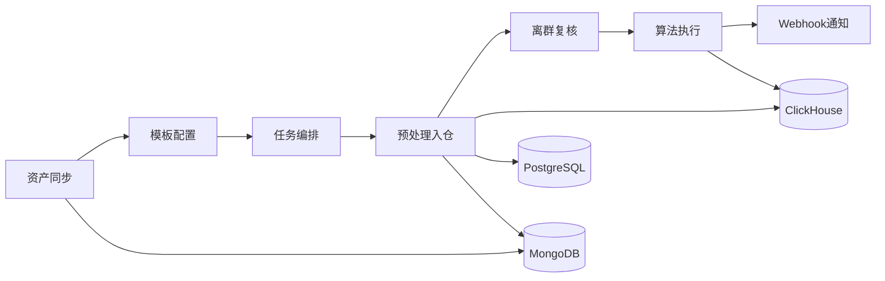
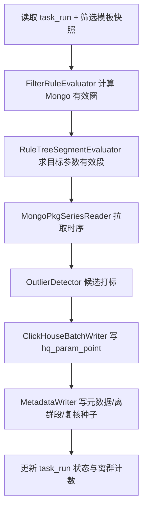

# 卫星测试数据预处理与数据分析平台 — 功能总结

> 本文档基于代码库与 [详细设计文档 V2.0](详细设计文档_卫星测试数据预处理与数据分析平台_V2.0.md) 提炼，用于快速了解平台已实现能力与数据闭环。

---

## 1. 项目定位

**SatelliteDataAnalytics** 面向卫星在轨/地面测试场景，解决「原始 Mongo 时序 → 按规则筛选与质检 → 高品质数据入仓 → 算法分析 → 结果可追溯」的数据生产问题。

核心闭环（第一阶段）：

---

## 2. 技术架构

| 层级 | 技术 | 职责 |
|------|------|------|
| 前端 | React + Ant Design + React Flow | 资产配置、模板编辑、任务管理、数据明细与离群复核 |
| API | ASP.NET Core 8 | REST 接口、JWT/OAuth、任务编排入口 |
| Worker | Hangfire | 异步执行预处理、算法、Webhook |
| 元数据 | PostgreSQL | 任务、模板、离群复核、审计 |
| 时序仓 | ClickHouse | `hq_param_point` 高品质参数点（ReplacingMergeTree 版本化） |
| 原始数据 | MongoDB（按星动态连接） | 外部同步的 `pkg{sysId}` 原始包序列 |

工程分层：`SatelliteData.Api` → `Application` → `Domain` / `Infrastructure` / `Workers`

---

## 3. 功能模块（按前端菜单）

### 3.1 数据源配置中心

路由见 `frontend/src/router.tsx` 与 `frontend/src/layouts/AppLayout.tsx`。

- **数据源配置** (`/assets/sources`)：配置海量数据接口、卫星资产服务等外部连接
- **数据同步** (`/assets/satellites`)：从外部 API 同步型号/卫星/参数元数据、测试阶段（`test_batch_cache`）、Mongo 连接信息到本地缓存表
- **卫星分组管理** (`/assets/groups`)：按业务维度组织卫星，供任务创建时批量选择

后端：`AssetSourcesController`、`AssetSyncController`、`AssetSatellitesController`、`SatelliteGroupsController`

### 3.2 模板治理

#### 筛选模板 (`/templates/filters`)

定义「哪些参数、在什么时间条件下、如何打标离群」的预处理规则：

- **时间窗**：测试阶段模式（带前后缓冲）或自定义区间
- **规则树 (ruleTree)**：参考星条件参数 + AND/OR/NOT 逻辑，计算目标参数有效时间段
- **目标参数**：选定本星参数及边界缓冲
- **离群策略**：阈值、3σ、IQR、MAD、Hampel 等（按参数配置）
- 版本生命周期：Draft → Publish → Archive；支持克隆

#### 算法模板 (`/templates/algorithms`)

React Flow 可视化 DAG 编排：

- **数据输入节点**：绑定 `(taskNo, satNo, dbStage)`、测试阶段或时间窗
- **算法节点**：引用内置注册表或用户上传算法包
- **连线与校验**：保存/发布前 DAG 拓扑与参数校验
- **测试运行**：创建 `trigger_type=TRIAL` 的临时 ALGORITHM 任务，走完整执行链路

### 3.3 算法仓库

- **内置算法注册表** (`/algorithms/registry`)：平台预置统计/频域/判读等节点元数据
- **算法包列表** (`/algorithms/packages`)：用户上传 Python 等算法包，经沙箱审核后发布，供算法模板引用

后端：`AlgorithmRegistryController` + 算法包相关 Application 服务

### 3.4 任务编排

| 入口 | 任务类型 | 说明 |
|------|----------|------|
| 新建预处理入仓 | `PREPROCESS` | 仅执行筛选 + 入 ClickHouse + 离群检测 |
| 新建 PIPELINE | `PIPELINE` | 预处理成功后自动链式触发算法子任务 |
| 任务列表 | 全部类型 | 查看状态、进度、Webhook、数据明细 |

**任务类型**（一阶段）：

- `PREPROCESS` — 预处理队列 `preprocess`
- `ALGORITHM` — 算法队列 `algorithm`
- `PIPELINE` — 编排预处理 + 算法
- `WEBHOOK` — 终态回调投递队列 `webhook`

**调度特性**：立即执行 / 定时（如每日定时窗口）；`window_start/end` 驱动 Mongo 拉取；`test_batch_name` 仅作展示标签写入 CH。

**任务列表核心能力**（`frontend/src/pages/tasks/TasksListPage.tsx`）：

- 任务筛选、详情、重试、取消
- **数据明细抽屉**：参数矩阵（时间 × 参数）、离群点列表、离群时间段
- **离群复核 Tab**：逐点确认离群 / 标为抖动、批量操作、完成复核

后端：`TasksController` — 任务 CRUD、processed-data 查询、outlier-reviews 四端点

---

## 4. 核心数据流

### 4.1 预处理流水线

实现：`src/SatelliteData.Application/Pipeline/PreprocessPipeline.cs`

**写入 ClickHouse 的关键字段**：

- `is_outlier` — 算法候选（预处理自动）
- `is_confirmed_outlier` — 人工确认后才有最终结论
- `version` — ReplacingMergeTree 版本，复核 PATCH 时递增

### 4.2 离群点人工复核

业务语义（V2.0.9）：

| 状态 | 含义 | CH 结果 |
|------|------|---------|
| PENDING | 待人工判定 | `is_outlier=1`, `is_confirmed_outlier=0` |
| CONFIRMED | 确认离群 | 两者均为 1 |
| JITTER（标为抖动） | **不是离群点** | 两者均为 0 |

- PATCH 复核时同步 PG + INSERT CH 新版本
- POST complete 时重算 `CONFIRMED` 离群段，不再批量写 CH
- 矩阵四色：橙=待复核、红=确认离群、绿=确认非离群、黑=正常

服务：`src/SatelliteData.Application/Tasks/OutlierReviewService.cs`

### 4.3 算法执行

实现：`src/SatelliteData.Application/Pipeline/AlgorithmExecutionPipeline.cs`

- 执行期才查询 ClickHouse（编辑/保存模板不触 CH）
- 按 DAG 拓扑依次执行节点：读输入 → 内置/沙箱算法 → 写 `algo_result`
- 判读类节点（如 `three_sigma_judge`）产出算法阶段结论，与预处理离群打标语义分离

### 4.4 Webhook 终态通知

- 任务进入终态（成功/失败/取消）后投递 HTTP 回调
- 支持签名、重试与投递记录（`audit_log`）

---

## 5. 存储与表职责（摘要）

| 存储 | 典型表/集合 | 用途 |
|------|-------------|------|
| PostgreSQL | `task_run`, `filter_template`, `algorithm_template` | 任务与模板元数据 |
| PostgreSQL | `preprocess_outlier_point_review`, `preprocess_outlier_segment` | 离群复核与时间段 |
| PostgreSQL | `satellite_cache`, `param_cache`, `test_batch_cache` | 资产同步缓存 |
| ClickHouse | `hq_param_point`, `hq_param_metadata` | 高品质时序与参数元数据 |
| MongoDB | `pkg{prm_sys_id}` | 原始测试包数据 |

DDL 集中：`db/task_pipeline_schema.sql`

---

## 6. 安全与治理（一阶段）

- JWT 用户登录 + 基础 RBAC（任务/模板操作权限）
- OAuth2 Client Credentials 相关代码已存在，完整开放 API 属第二阶段
- 操作留痕（`audit_log`）

---

## 7. 已实现 vs 规划

**已实现（代码 + 前端路由可验证）**：

- 资产配置中心全三页
- 筛选/算法模板 CRUD + 编辑器
- 算法注册表与算法包
- PREPROCESS / ALGORITHM / PIPELINE 任务 + 任务列表 + 数据明细
- 离群人工复核全栈（PG + CH + 前端 Tab + 矩阵着色）
- Webhook Worker 链路

**规划在第二阶段**：

- 报告模板与报告引擎
- 一致性比对 (COMPARE)
- 模板灰度发布
- OAuth2 开放 API 对外交付
- ML 数据集快照、MinIO 归档等

---

## 8. 一句话总结

该平台是**卫星测试数据的 ETL + 质检 + 分析编排系统**：把分散在各星 Mongo 里的原始参数时序，按可配置的筛选与离群规则清洗入 ClickHouse，经人工复核确认质量后，再通过可视化算法 DAG 做统计分析，并以任务血缘和 Webhook 保证全流程可追溯、可集成。
